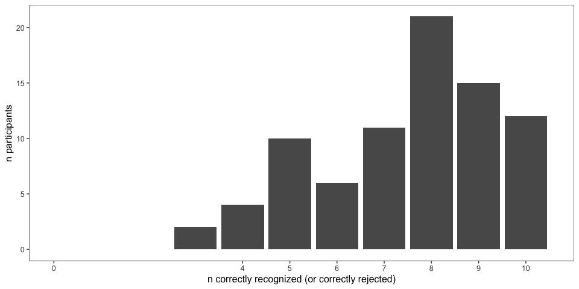
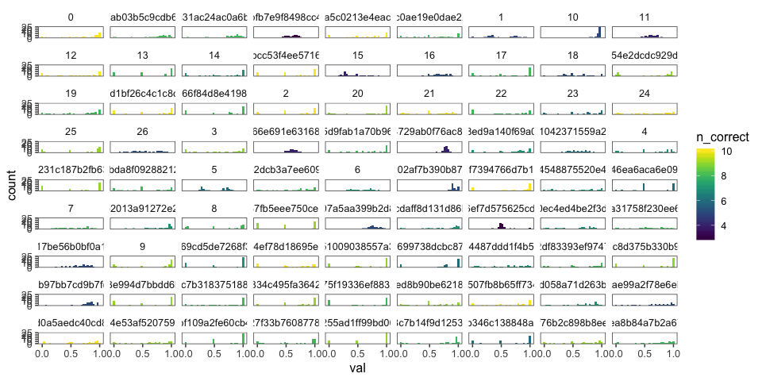
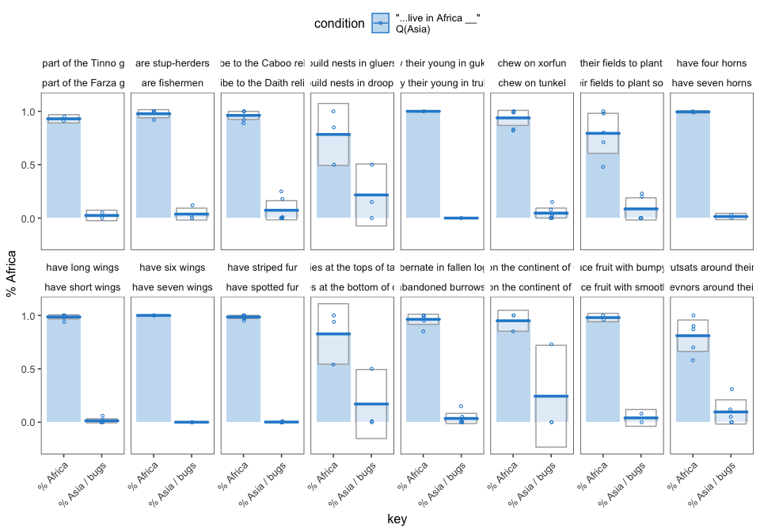
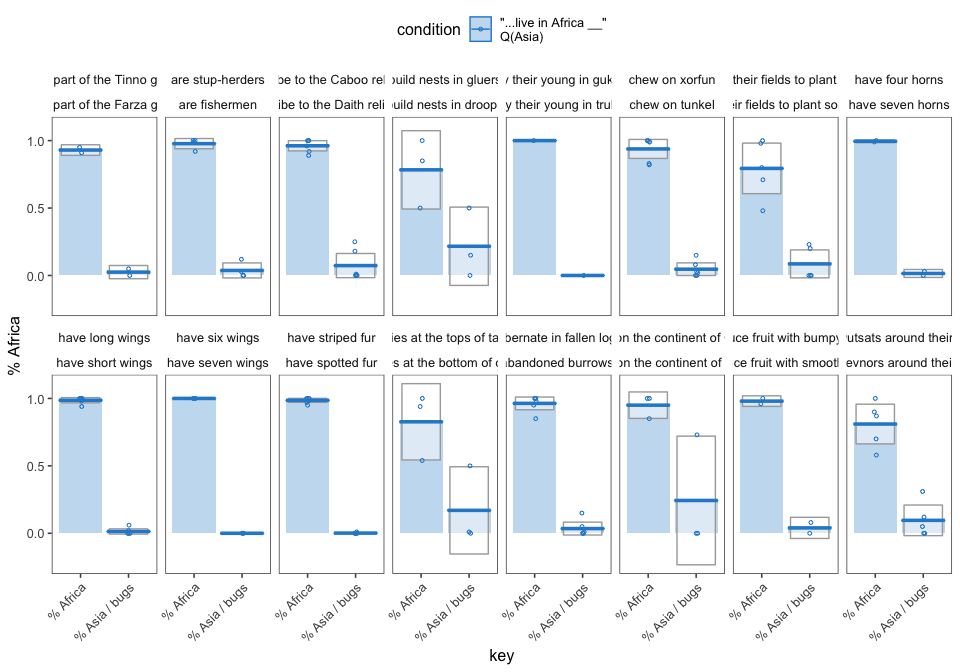
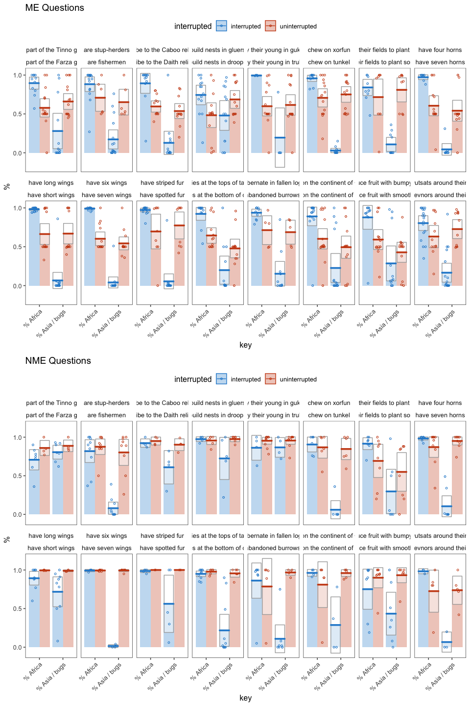

elephants-1-cogsci2019
================
MH Tessler
1/17/2019

[Link to experiment](http://www.mit.edu/~tessler/projects/elephants/experiments/elephants-3.html)

Experiment 1 for CogSci 2019 (Elephants-3)
------------------------------------------

### Changes from Pilot 2

-   ask about both properties
-   enrich chapter to provide more context for the mutual exclusivity
-   add items
-   change "ticks carry lyme disease" to get "cats get cancer", add "lions lay eggs"
-   memory check to test actually tested properties

Subject Information
-------------------

|  workerid| language | enjoyment | age | gender | problems                                                                                                                                                         | comments                                                                                                                                                                                                                                                                                                                                             |
|---------:|:---------|:----------|:----|:-------|:-----------------------------------------------------------------------------------------------------------------------------------------------------------------|:-----------------------------------------------------------------------------------------------------------------------------------------------------------------------------------------------------------------------------------------------------------------------------------------------------------------------------------------------------|
|         0| English  | 0         | 22  | Female |                                                                                                                                                                  |                                                                                                                                                                                                                                                                                                                                                      |
|         1| English  | 0         | 27  | Female | On an early question (question 4, maybe?) there was one property that said  during the question instead of a property to consider. I marked % for this question. | I don&quotechart know if it was intentional, or part of the experiment, but reading the stories in segments as they were presented, with such large letters, made them kind of difficult to parse? Having the whole story on one page would have helped my memory of the facts better, I think. But again: maybe that was part of the experiment. :) |
|         2| english  | -1        | 31  | Male   |                                                                                                                                                                  |                                                                                                                                                                                                                                                                                                                                                      |
|         3| English  | 0         | 26  | Male   | no                                                                                                                                                               |                                                                                                                                                                                                                                                                                                                                                      |
|         4|          | 0         | 25  | Female |                                                                                                                                                                  |                                                                                                                                                                                                                                                                                                                                                      |
|         5| English  | 1         | 29  | Male   | No                                                                                                                                                               |                                                                                                                                                                                                                                                                                                                                                      |
|         6| english  | 0         | 39  | Male   | no                                                                                                                                                               |                                                                                                                                                                                                                                                                                                                                                      |
|         7| english  | 1         | 31  | Female | no                                                                                                                                                               |                                                                                                                                                                                                                                                                                                                                                      |
|         8| English  | 0         | 37  | Female | None                                                                                                                                                             |                                                                                                                                                                                                                                                                                                                                                      |
|         9| English  | 1         | 27  | Female | No problems                                                                                                                                                      | Very nice                                                                                                                                                                                                                                                                                                                                            |
|        10| english  | 1         | 61  | Female |                                                                                                                                                                  |                                                                                                                                                                                                                                                                                                                                                      |
|        11| English  | 0         | 43  | Female | No                                                                                                                                                               |                                                                                                                                                                                                                                                                                                                                                      |
|        12| english  | 1         | 53  | Male   | no                                                                                                                                                               | none                                                                                                                                                                                                                                                                                                                                                 |
|        13| English  | 1         | 25  | Male   | Nothing                                                                                                                                                          | This study is some learning for me                                                                                                                                                                                                                                                                                                                   |
|        14| English  | 0         | 21  | Male   |                                                                                                                                                                  |                                                                                                                                                                                                                                                                                                                                                      |
|        15| English  | 0         | 38  | Female | no                                                                                                                                                               | Thank you.                                                                                                                                                                                                                                                                                                                                           |
|        16| english  | 0         | 38  | Female | no                                                                                                                                                               |                                                                                                                                                                                                                                                                                                                                                      |
|        17| English  | 0         | 45  | Male   | no                                                                                                                                                               | too long for the pay                                                                                                                                                                                                                                                                                                                                 |
|        18| English  | 1         | 20  | Female | No                                                                                                                                                               |                                                                                                                                                                                                                                                                                                                                                      |
|        19| English  | 1         | 37  | Male   | There was a misspelling, but I don&quotechart remember what word now. It could have been confusing to someone else.                                              |                                                                                                                                                                                                                                                                                                                                                      |
|        20| English  | 0         | 36  | Female | No.                                                                                                                                                              | This was challenging until I started reading the passages out loud - that seemed to help me retain the information better.                                                                                                                                                                                                                           |
|        21| English  | 0         | 58  | Female | no                                                                                                                                                               | none                                                                                                                                                                                                                                                                                                                                                 |
|        22| english  | 1         | 24  | Male   | no                                                                                                                                                               | good study                                                                                                                                                                                                                                                                                                                                           |
|        23| English  | 1         | 42  | Male   | Misspelling of domesticated -- &quotecharquasi-domensticated&quotechar                                                                                           | Wish it had pictures!                                                                                                                                                                                                                                                                                                                                |
|        24| English  | 1         | 48  | Female |                                                                                                                                                                  |                                                                                                                                                                                                                                                                                                                                                      |
|        25| English  | 0         | 30  | Male   | no                                                                                                                                                               | Great Study, hope to do more in the future.                                                                                                                                                                                                                                                                                                          |
|        26| English  | 0         | 32  | Male   | No.                                                                                                                                                              |                                                                                                                                                                                                                                                                                                                                                      |

Attention Checks
----------------

### Slider Practice

Before the experiment, participants practice using the sliders to rate 3 category-property pairs:

-   dogs bark (coded as correct if x &gt; 0.5)
-   birds are male (coded as correct if 0.25 &lt; x &lt; 0.75)
-   cats get cancer (coded as correct if x &lt; 0.75) \[being generous with this one\]
-   lions lay eggs (coded as correct if x &lt; 0.10)

| property        |  sum(correct)|
|:----------------|-------------:|
| birds are male  |            26|
| cats get cancer |            25|
| dogs bark       |            27|
| lions lay eggs  |            24|

|  n\_correct|    n|
|-----------:|----:|
|           1|    1|
|           2|    1|
|           3|    1|
|           4|   24|

### Memory check

After the story, participants select statements they recall learning from a list of 10 generic statements about novel animals (5 true, 5 distractor). They are also asked to explain what they did in the experiment.

### Slider Practice and Memory Check

### Explanations of Task

After the story, participants are also asked to explain generally what they did in the experiment.

|  workerid| explanation                                                                                                                                                                                                                                                                                                                                                                        |
|---------:|:-----------------------------------------------------------------------------------------------------------------------------------------------------------------------------------------------------------------------------------------------------------------------------------------------------------------------------------------------------------------------------------|
|         0| I tried to give the percentage of things that do something (i.e. the percent of vimble queens that hibernate in fallen logs).                                                                                                                                                                                                                                                      |
|         1| Read short stories about an alien planet and the creatures and people that live there, and answered estimations based on how likely I thought certain statements about the beings and places were.                                                                                                                                                                                 |
|         2| Tried to mark percents based on text paragraphs                                                                                                                                                                                                                                                                                                                                    |
|         3| Read the story and provided estimates. It would not have been so hard if the damn words were in english! Also this only takes about 10 minutes not 20.                                                                                                                                                                                                                             |
|         4| I tried to remember the facts that were stated in order to remember them for the questions being asked.                                                                                                                                                                                                                                                                            |
|         5| Read and answer questions about different species.                                                                                                                                                                                                                                                                                                                                 |
|         6| Deciding the probability of something happening or being true.                                                                                                                                                                                                                                                                                                                     |
|         7| read short snippets of a story about an alien planet and answered questions about each section                                                                                                                                                                                                                                                                                     |
|         8| Read a story book and answered slider questions about aliens.                                                                                                                                                                                                                                                                                                                      |
|         9| the springtime flood their fields to plant experiment very nice.                                                                                                                                                                                                                                                                                                                   |
|        10| Read chapters from an alien story and answered questions                                                                                                                                                                                                                                                                                                                           |
|        11| I read short chapters using alien words and then answered questions after each chapter about what I read.                                                                                                                                                                                                                                                                          |
|        12| Say what I learned is a trait of multiple species on a planet.                                                                                                                                                                                                                                                                                                                     |
|        13| This study is good for learning and full focus on my mind                                                                                                                                                                                                                                                                                                                          |
|        14| Described different animals on an alien planet with weird names.                                                                                                                                                                                                                                                                                                                   |
|        15| I read chapters in a short story about alien life, then answered questions using percentages about the story.                                                                                                                                                                                                                                                                      |
|        16| I read a chapter about aliens and then answered several questions about it.                                                                                                                                                                                                                                                                                                        |
|        17| I read a story and answered questions at the end of each chapter.                                                                                                                                                                                                                                                                                                                  |
|        18| I answered questions about what percentages of an alien population do certain things based on a storybook.                                                                                                                                                                                                                                                                         |
|        19| I just read the descriptions and tried to remember what it said when asked.                                                                                                                                                                                                                                                                                                        |
|        20| I read 17 or 18 different chapters of a book of various creatures and aliens and the different places they live.                                                                                                                                                                                                                                                                   |
|        21| Read several chapters of a story and answer questions about the contents                                                                                                                                                                                                                                                                                                           |
|        22| am learned lot of information                                                                                                                                                                                                                                                                                                                                                      |
|        23| Learned various things about this alien world, including some bits of culture and a lot of things about the wildlife.                                                                                                                                                                                                                                                              |
|        24| When thorough and alien book and read about their planet                                                                                                                                                                                                                                                                                                                           |
|        25| I selected my percentage to certain events happening in the chapters that related to the story.                                                                                                                                                                                                                                                                                    |
|        26| I am not a person who does well learning mundane facts that have little meaning or future use. Never have in school and even now i&quotecharve forgotten everything. Its hard to relate to thing that don&quotechart have an image and simply stating something has wings or something, it doesn&quotechart really associate the names to anything that sits in my working memory. |

Participants
------------

### Included/Excluded Subject Numbers

Removing participants who got fewer than 7 correct on memory check and didn't get all 4 sliders. (Participants with bad explanations usually fell into one of these other groups.)

| memory\_fail | slider\_fail |    n|
|:-------------|:-------------|----:|
| FALSE        | FALSE        |   19|
| FALSE        | TRUE         |    2|
| TRUE         | FALSE        |    5|
| TRUE         | TRUE         |    1|

### Prevalence Estimates by Participant

Histogram of all of a single participant's prevalence estimates, collapsed across trials and color coded for the number of correct responses on the memory check. \* fill = number of correct responses on the memory check (out of 10) \* facet = participants

Filler Trials
-------------

These used quantifiers (and thus we have strong idea about literal meaning).

Critical Trials (collapsed across item)
---------------------------------------

### Mutual Exclusivity

### Bootstrapped 95% Confidence Intervals (collapsed across item)

Modeling
--------

By-item Analyses
----------------

### Items

Items can be categorized by the continuation type and the coordination type.

-   continuation type: the interrupted sentence containing the questioned properties varies according to how real the subject matter is.
    -   real: Sentence and properties are completely real.
    -   fakeNames: The properties concern real items (like religion), but the name is made-up (Daith).
    -   fakeDefs: The properties concern completely made-up items.
-   coordination type: the "and" conjoins different syntactic categories

| coordination | continuationType |    n|
|:-------------|:-----------------|----:|
| np           | fakeDefs         |    2|
| np           | fakeNames        |    2|
| np           | real             |    5|
| pp           | fakeDefs         |    3|
| pp           | fakeNames        |    1|
| pp           | real             |    2|
| vp           | fakeDefs         |    1|

### Number of Responses by Item and Condition

| predicate\_1                                   | predicate\_2                                        |  "..live in Africa and eat bugs"|  "..live in Africa and Asia"| continuationType | coordination |
|:-----------------------------------------------|:----------------------------------------------------|--------------------------------:|----------------------------:|:-----------------|:-------------|
| are part of the Tinno guild                    | are part of the Farza guild                         |                               12|                           14| fakeNames        | np           |
| are stup-herders                               | are fishermen                                       |                               22|                           10| fakeDefs         | np           |
| ascribe to the Caboo religion                  | ascribe to the Daith religion                       |                               14|                           16| fakeNames        | np           |
| build nests in gluers                          | build nests in droops                               |                               16|                           12| fakeDefs         | pp           |
| carry their young in guklags                   | carry their young in trullets                       |                               22|                           10| fakeDefs         | pp           |
| chew on xorfun                                 | chew on tunkel                                      |                               18|                           14| fakeDefs         | pp           |
| flood their fields to plant fujusi             | burn their fields to plant soroneeks                |                               18|                           16| fakeDefs         | vp           |
| have four horns                                | have seven horns                                    |                               14|                           14| real             | np           |
| have long wings                                | have short wings                                    |                                6|                           24| real             | np           |
| have six wings                                 | have seven wings                                    |                               10|                           12| real             | np           |
| have striped fur                               | have spotted fur                                    |                                6|                           14| real             | np           |
| have territories at the tops of tall mountains | have territories at the bottom of deep canyons      |                                6|                           18| real             | pp           |
| hibernate in fallen logs                       | hibernate in the abandoned burrows of other animals |                               16|                           12| real             | pp           |
| live on the continent of Caro                  | live on the continent of Este                       |                               16|                           12| fakeNames        | pp           |
| produce fruit with bumpy skin                  | produce fruit with smooth skin                      |                               14|                           16| real             | np           |
| wear wutsats around their heads                | wear krevnors around their heads                    |                               18|                           14| fakeDefs         | np           |

### Pirate Plots (by item)

### Pirate Plots (by Coordination)

### Pirate Plots (by Realness)

First Trial
-----------

Reaction Times
--------------

*how much time do participants spend on the question slide?*

### Density Graph of Reaction Times by Condition

### Modeling of Response Times

    ##  Family: gaussian 
    ##   Links: mu = identity; sigma = identity 
    ## Formula: logrt ~ condition 
    ##    Data: df.query.critical %>% filter(key == "% live in Afr (Number of observations: 228) 
    ## Samples: 3 chains, each with iter = 2000; warmup = 1000; thin = 1;
    ##          total post-warmup samples = 3000
    ## 
    ## Population-Level Effects: 
    ##                                Estimate Est.Error l-95% CI u-95% CI
    ## Intercept                          2.36      0.06     2.24     2.48
    ## condition..liveinAfricaandAsia    -0.08      0.09    -0.26     0.08
    ##                                Eff.Sample Rhat
    ## Intercept                            2755 1.00
    ## condition..liveinAfricaandAsia       2929 1.00
    ## 
    ## Family Specific Parameters: 
    ##       Estimate Est.Error l-95% CI u-95% CI Eff.Sample Rhat
    ## sigma     0.64      0.03     0.59     0.70       3129 1.00
    ## 
    ## Samples were drawn using sampling(NUTS). For each parameter, Eff.Sample 
    ## is a crude measure of effective sample size, and Rhat is the potential 
    ## scale reduction factor on split chains (at convergence, Rhat = 1).
