elephants-1-cogsci2019
================
MH Tessler
1/17/2019

[Link to experiment](http://www.mit.edu/~tessler/projects/elephants/experiments/elephants-3.html)

Experiment 1 for CogSci 2019 (Elephants-3i)
-------------------------------------------

### Changes from Pilot 3

-   interrupted version of experiment 3 (some trials ask questions mid-chapter)
-   added trials where we ask about non-mutually exclusive properties (NME)
-   randomize order of trials with constraint that no 2 criticals back-to-back

Subject Information
-------------------

| workerid                         | language      | enjoyment | age | gender | problems                                                                                                                                                                                                                                                                                                                                                                                                 | comments                                                                                                                                        |
|:---------------------------------|:--------------|:----------|:----|:-------|:---------------------------------------------------------------------------------------------------------------------------------------------------------------------------------------------------------------------------------------------------------------------------------------------------------------------------------------------------------------------------------------------------------|:------------------------------------------------------------------------------------------------------------------------------------------------|
| e0895eff194e53af520759f1e46fe956 | English       | 0         | 24  | Male   | none                                                                                                                                                                                                                                                                                                                                                                                                     |                                                                                                                                                 |
| fbddb360beb346c138848a896c78748d | English       | 0         | 35  | Female | No                                                                                                                                                                                                                                                                                                                                                                                                       | No.                                                                                                                                             |
| 649427444a02af7b390b87bac33ca643 | english       | -1        | 27  | Male   | no                                                                                                                                                                                                                                                                                                                                                                                                       | absurd amount of reading for the pay                                                                                                            |
| 8a2a11595cdaff8d131d86b8d85236f5 | English       | 0         | 33  | Male   | no                                                                                                                                                                                                                                                                                                                                                                                                       |                                                                                                                                                 |
| e8a4ea83327f33b7608778e3f113e632 | english       | 0         | 28  | Female | no                                                                                                                                                                                                                                                                                                                                                                                                       |                                                                                                                                                 |
| 6c3e9f323646ea6aca6e092b77601dfa | English       | 0         | 27  | Female |                                                                                                                                                                                                                                                                                                                                                                                                          |                                                                                                                                                 |
| 031eca38b7ab03b5c9cdb6490824a1fa | English       | 1         | 43  | Female | no                                                                                                                                                                                                                                                                                                                                                                                                       |                                                                                                                                                 |
| 1470ae987bcc53f4ee5716882171fbfa | English       | -1        | 29  | Male   | None.                                                                                                                                                                                                                                                                                                                                                                                                    |                                                                                                                                                 |
| 977c9770b24ef78d18695e96e31cd198 | english       | 0         | 36  | Male   | no                                                                                                                                                                                                                                                                                                                                                                                                       |                                                                                                                                                 |
| d3d71a5145d058a71d263ba5db05557d | English       | 1         | 50  | Male   | No Problems                                                                                                                                                                                                                                                                                                                                                                                              | Thanks good luck with your work                                                                                                                 |
| 19a2317f5dd1bf26c4c1c8dcd3214734 | English       | 1         | 43  | Male   | No problems                                                                                                                                                                                                                                                                                                                                                                                              | a bit long but had fun reading about an alien planet                                                                                            |
| dbae45814cae99a2f78e6ebb3b46d213 | English       | 1         | 29  | Female | NA                                                                                                                                                                                                                                                                                                                                                                                                       |                                                                                                                                                 |
| aaa6a1d0e2df83393ef9747a3db41393 | English       | 0         | 34  | Male   | no                                                                                                                                                                                                                                                                                                                                                                                                       |                                                                                                                                                 |
| aa03dd24104487ddd1f4b55d91dd5bcb | English       | 1         | 52  | Male   | For some of the passages, the last page of the passage appeared after the questions page.                                                                                                                                                                                                                                                                                                                |                                                                                                                                                 |
| 32bd01b8bb66e691e63168b3a955b407 | english       | -1        | 28  | Male   | na                                                                                                                                                                                                                                                                                                                                                                                                       | good                                                                                                                                            |
| 3b50968cb91042371559a291528297d0 | ENGLISH       | 1         | 35  | Male   | no                                                                                                                                                                                                                                                                                                                                                                                                       | good                                                                                                                                            |
| 8ba79a12b6ef7d575625cdc6f955d09e | english       | -1        | 32  | Male   | no                                                                                                                                                                                                                                                                                                                                                                                                       |                                                                                                                                                 |
| d0ba0aaf52ed8b90be62185d73e48fb6 | English       | 1         | 35  | Male   | Yes, there were many times the questions appeared before the last page of a chapter. Might want to fix that.                                                                                                                                                                                                                                                                                             |                                                                                                                                                 |
| bfcac7cad48e994d7bbdd6b1a0ca42c5 | English       | 1         | 46  | Female | No.                                                                                                                                                                                                                                                                                                                                                                                                      |                                                                                                                                                 |
| c1200558b9c7b3183751886ca08cb2d9 | English       | 0         | 31  | Male   | No.                                                                                                                                                                                                                                                                                                                                                                                                      | Thank you for giving me the opportunity to participate in this study.                                                                           |
| 06df6a3ebc31ac24ac0a6bfaa5f947c1 | English       | 0         | 52  | Male   | some pages asked the question before the segment was over so pages overlapped.                                                                                                                                                                                                                                                                                                                           | Thanks.                                                                                                                                         |
| fc1543eb0ff76b2c898b8ee709877cd1 | English       | 1         | 56  | Male   | no                                                                                                                                                                                                                                                                                                                                                                                                       |                                                                                                                                                 |
| d082cc37275f19336ef88324c3fdb5b9 | English       | 0         | 55  | Female | no                                                                                                                                                                                                                                                                                                                                                                                                       |                                                                                                                                                 |
| bedcc2096ab97bb7cd9b7fdc9db564b7 | United States | 1         | 32  |        | no                                                                                                                                                                                                                                                                                                                                                                                                       |                                                                                                                                                 |
| cbb140de1834c495fa3642f1e32e142f | English       | 0         | 25  | Male   |                                                                                                                                                                                                                                                                                                                                                                                                          |                                                                                                                                                 |
| e5b81925fbf109a2fe60cb4c5f645453 | English       | 0         | 44  | Male   | no                                                                                                                                                                                                                                                                                                                                                                                                       | thanks                                                                                                                                          |
| bb65c0b5a0c8d375b330b90df15c80d3 | English       | 1         | 26  | Female | No                                                                                                                                                                                                                                                                                                                                                                                                       |                                                                                                                                                 |
| 8fe054bf9417be56b0bf0a1bba2e4caa | english       | 0         | 28  | Female | no                                                                                                                                                                                                                                                                                                                                                                                                       | good                                                                                                                                            |
| 3b14d29948ed9a140f69a04c998fef41 | English       | 1         | 20  | Male   | NA                                                                                                                                                                                                                                                                                                                                                                                                       | Thanks                                                                                                                                          |
| 65af3e7eadf7394766d7b189a04823cf | English       | 1         | 34  | Female |                                                                                                                                                                                                                                                                                                                                                                                                          |                                                                                                                                                 |
| fda5253bacea8b84a7b2a6718b1d9571 | English       | 1         | 40  | Male   | NO                                                                                                                                                                                                                                                                                                                                                                                                       |                                                                                                                                                 |
| 75a3ae3d9b2013a91272e2e3ac1ee94f | English       | 0         | 44  | Female | no                                                                                                                                                                                                                                                                                                                                                                                                       |                                                                                                                                                 |
| 1d31a1c80e66f84d8e41986b7c74c417 | English       | 0         | 32  | Female | Had to complete 2 times.                                                                                                                                                                                                                                                                                                                                                                                 |                                                                                                                                                 |
| d25b7d0a7507fb8b65ff734cf1095ea0 | english       | 0         | 32  | Female |                                                                                                                                                                                                                                                                                                                                                                                                          |                                                                                                                                                 |
| 18a9d3871b54e2dcdc929d3e86aaa07b | English       | 1         | 41  | Female | no                                                                                                                                                                                                                                                                                                                                                                                                       |                                                                                                                                                 |
| 0bf13d3412c0ae19e0dae2294a90bcd5 | English       | 0         | 36  | Male   |                                                                                                                                                                                                                                                                                                                                                                                                          | A little bit difficult to wrap my head around the stories because of the weird names used.                                                      |
| ed100b1d4255ad1ff99bd002c5c9e514 | English       | 1         | 36  | Female | no                                                                                                                                                                                                                                                                                                                                                                                                       |                                                                                                                                                 |
| 387eacbc14729ab0f76ac8e14f7e30a4 | english       | 1         | 30  | Male   | no                                                                                                                                                                                                                                                                                                                                                                                                       | I like this experiment                                                                                                                          |
| 96af15bc4569cd5de7268f3446d1c87b | English       | 1         | 34  | Male   | The question about he 4 claws vs sever claws was confusing to me. It stated that they had 4 and 7 claws then I had to use a slider to tell what percentage had 4 and what percentage had seven. To me, by the sound of having 4 and seven claws, it didn't sound like either or but that the creatures had 4 claws and 7 claws (perhaps at different parts of their bodies). That was my only confusion. |                                                                                                                                                 |
| 43c0ac8518231c187b2fb634e78a86e9 | English       | 1         | 20  | Male   | No                                                                                                                                                                                                                                                                                                                                                                                                       |                                                                                                                                                 |
| 8c4cc7f7b9a31758f230ee6b9bb8b388 | english       | 0         | 40  | Male   | no                                                                                                                                                                                                                                                                                                                                                                                                       |                                                                                                                                                 |
| df10f45100d0a5aedc40cd8e943c6851 | English       | 0         | 39  | Female | No                                                                                                                                                                                                                                                                                                                                                                                                       |                                                                                                                                                 |
| 0933cc8e9ea5c0213e4eac52d01ca021 | english       | 1         | 29  | Female |                                                                                                                                                                                                                                                                                                                                                                                                          |                                                                                                                                                 |
| 5ce1d969ab2dcb3a7ee60903c7bf9387 | English       | 0         | 26  | Female | No                                                                                                                                                                                                                                                                                                                                                                                                       |                                                                                                                                                 |
| 8769d619207a5aa399b2d8f8c01f06a4 | english       | 1         | 30  | Male   | no                                                                                                                                                                                                                                                                                                                                                                                                       | good                                                                                                                                            |
| 08c9cf806bfb7e9f8498cc400e641cef | english       | 1         | 32  | Male   | no                                                                                                                                                                                                                                                                                                                                                                                                       | goodone                                                                                                                                         |
| 8bf6de1610ec4ed4be2f3dc8fcf66e45 | English       | 0         | 66  | Female | NO                                                                                                                                                                                                                                                                                                                                                                                                       |                                                                                                                                                 |
| 9946dfd0f151009038557a38176aed6e | English       | 1         | 41  | Male   | no                                                                                                                                                                                                                                                                                                                                                                                                       | I do not pretend to understand the nature of studies. I just do my best, try to be honest, and hope for bonuses. Thank you kindly for the work. |
| 9e9ce9a069699738dcbc87473fe74bae | english       | 1         | 33  | Female | No                                                                                                                                                                                                                                                                                                                                                                                                       |                                                                                                                                                 |
| 84661402667fb5eee750ce3c17857a95 | English       | 0         | 23  | Male   | no problems                                                                                                                                                                                                                                                                                                                                                                                              |                                                                                                                                                 |
| 6aea089c284548875520e460a0debde4 | English       | 1         | 29  | Male   | no                                                                                                                                                                                                                                                                                                                                                                                                       |                                                                                                                                                 |
| 4fa97e0e73bda8f09288212b455762dd | English       | 1         | 25  | Female | No.                                                                                                                                                                                                                                                                                                                                                                                                      | None.                                                                                                                                           |
| ef88ea37c3c7b14f9d12535f24cafe1e | English       | 0         | 37  | Female | No                                                                                                                                                                                                                                                                                                                                                                                                       |                                                                                                                                                 |
| 354ffc66775d9fab1a70b9666a911b06 | English       | 1         | 25  | Male   |                                                                                                                                                                                                                                                                                                                                                                                                          | Was fun, didn't realize how difficult it was to keep imaginary words in my head.                                                                |
| 0                                | english       | 0         | 29  | Female |                                                                                                                                                                                                                                                                                                                                                                                                          |                                                                                                                                                 |
| 1                                | english       | 0         | 25  | Male   | no                                                                                                                                                                                                                                                                                                                                                                                                       |                                                                                                                                                 |
| 2                                | English       | 0         | 28  | Female | nothing that i could tell                                                                                                                                                                                                                                                                                                                                                                                |                                                                                                                                                 |
| 3                                | English       | 0         | 22  | Male   | None                                                                                                                                                                                                                                                                                                                                                                                                     |                                                                                                                                                 |
| 4                                | English       | 1         | 35  | Male   | no                                                                                                                                                                                                                                                                                                                                                                                                       |                                                                                                                                                 |
| 5                                | english       | 1         | 28  | Male   | no problems                                                                                                                                                                                                                                                                                                                                                                                              | good                                                                                                                                            |
| 6                                | English       | 1         | 27  | Female | none                                                                                                                                                                                                                                                                                                                                                                                                     | nice survey                                                                                                                                     |
| 7                                | english       | 0         | 25  | Male   | no                                                                                                                                                                                                                                                                                                                                                                                                       | ty                                                                                                                                              |
| 8                                | english       | 1         | 33  | Female | No probelms.                                                                                                                                                                                                                                                                                                                                                                                             | It was fun, thank you!                                                                                                                          |
| 9                                | english       | 0         | 35  | Male   | no                                                                                                                                                                                                                                                                                                                                                                                                       |                                                                                                                                                 |
| 10                               | english       | 1         | 26  | Female | no problem                                                                                                                                                                                                                                                                                                                                                                                               | nice                                                                                                                                            |
| 11                               | english       | 0         | 28  | Female | no                                                                                                                                                                                                                                                                                                                                                                                                       | nice                                                                                                                                            |
| 12                               | English       | 0         | 27  | Male   | no                                                                                                                                                                                                                                                                                                                                                                                                       |                                                                                                                                                 |
| 13                               | English       | 0         | 55  | Female | no                                                                                                                                                                                                                                                                                                                                                                                                       |                                                                                                                                                 |
| 14                               | English       | 0         | 30  | Female | no                                                                                                                                                                                                                                                                                                                                                                                                       |                                                                                                                                                 |
| 15                               | English       | 0         | 25  | Male   | no                                                                                                                                                                                                                                                                                                                                                                                                       | none                                                                                                                                            |
| 16                               | English       | 0         | 32  | Male   | No general in the experiment                                                                                                                                                                                                                                                                                                                                                                             | this is very good survey.                                                                                                                       |
| 17                               | English       | 1         | 32  | Female | no                                                                                                                                                                                                                                                                                                                                                                                                       |                                                                                                                                                 |
| 18                               | English       | 0         | 26  | Male   |                                                                                                                                                                                                                                                                                                                                                                                                          |                                                                                                                                                 |
| 19                               | english       | 0         | 38  | Male   |                                                                                                                                                                                                                                                                                                                                                                                                          |                                                                                                                                                 |
| 20                               | English       | 1         | 34  | Male   | No.                                                                                                                                                                                                                                                                                                                                                                                                      |                                                                                                                                                 |
| 21                               | English       | -1        | 27  | Male   |                                                                                                                                                                                                                                                                                                                                                                                                          |                                                                                                                                                 |
| 22                               | English       | 1         | 44  | Female | I&quotecharm not positive, but I think a page didn&quotechart display near the beginning. The story talked about how the alien world also had seven continents. The story listed the continents on Earth and it seemed like the alternate continents were then going to be listed, but the story skipped ahead to something else, if I&quotecharm remembering correctly.                                 | No comments                                                                                                                                     |
| 23                               | English       | 0         | 41  | Female | sometimes the story ended after the questions                                                                                                                                                                                                                                                                                                                                                            |                                                                                                                                                 |
| 24                               | english       | 0         | 28  | Male   | none                                                                                                                                                                                                                                                                                                                                                                                                     | none                                                                                                                                            |
| 25                               | english       | 1         | 44  | Male   | no                                                                                                                                                                                                                                                                                                                                                                                                       |                                                                                                                                                 |
| 26                               | english       | 0         | 28  | Female | no                                                                                                                                                                                                                                                                                                                                                                                                       | nice experiment and kindly please accept my hit                                                                                                 |

Attention Checks
----------------

### Slider Practice

Before the experiment, participants practice using the sliders to rate 3 category-property pairs:

-   dogs bark (coded as correct if x &gt; 0.5)
-   birds are male (coded as correct if 0.25 &lt; x &lt; 0.75)
-   cats get cancer (coded as correct if x &lt; 0.75) \[being generous with this one\]
-   lions lay eggs (coded as correct if x &lt; 0.10)

|  n\_correct|    n|
|-----------:|----:|
|           1|    2|
|           2|    4|
|           3|   11|
|           4|   64|

| property        |  n\_correct|
|:----------------|-----------:|
| birds are male  |          75|
| cats get cancer |          79|
| dogs bark       |          75|
| lions lay eggs  |          70|

### Memory Check

After the story, participants select statements they recall learning from a list of 10 generic statements about novel animals (5 true, 5 distractor). They are also asked to explain what they did in the experiment. 

### Slider Practice and Memory Check

### Explanations of Task

After the story, participants are also asked to explain generally what they did in the experiment.

| workerid                         |  n\_slider\_correct|  n\_memory\_correct| explanation                                                                                                                                                                                                                                                                                                             |
|:---------------------------------|-------------------:|-------------------:|:------------------------------------------------------------------------------------------------------------------------------------------------------------------------------------------------------------------------------------------------------------------------------------------------------------------------|
| e0895eff194e53af520759f1e46fe956 |                   4|                   9| I pretty much clicked through a power point learning all about what enhabits this new planet.                                                                                                                                                                                                                           |
| fbddb360beb346c138848a896c78748d |                   4|                   6| Read very short chapters about aliens on seven different continents, then answered questions after each chapter.                                                                                                                                                                                                        |
| 649427444a02af7b390b87bac33ca643 |                   4|                   5| read facts about creature and questions about chances they do certain things                                                                                                                                                                                                                                            |
| 8a2a11595cdaff8d131d86b8d85236f5 |                   4|                   7| I read a story and then was asked about some of the facts that were presented, specifically what percentage of a creature had that trait. There were so many new terms that by the end I was losing track of even what I had just read.                                                                                 |
| e8a4ea83327f33b7608778e3f113e632 |                   4|                   8| Read a story, answered questions                                                                                                                                                                                                                                                                                        |
| 6c3e9f323646ea6aca6e092b77601dfa |                   4|                   6| I used reading comprehensive skills                                                                                                                                                                                                                                                                                     |
| 031eca38b7ab03b5c9cdb6490824a1fa |                   4|                   8| I read the book and answered the questions to the best of my ability                                                                                                                                                                                                                                                    |
| 1470ae987bcc53f4ee5716882171fbfa |                   4|                  10| I just tried to remember the habits of the creatures and how often they did things.                                                                                                                                                                                                                                     |
| 977c9770b24ef78d18695e96e31cd198 |                   4|                  10| I just tried to remember what I could                                                                                                                                                                                                                                                                                   |
| d3d71a5145d058a71d263ba5db05557d |                   4|                   7| Read a story and then rate in percentage the answers to questions about the story                                                                                                                                                                                                                                       |
| 19a2317f5dd1bf26c4c1c8dcd3214734 |                   4|                  10| Read short information about different living beings on an alien planet and answered questions about them.                                                                                                                                                                                                              |
| dbae45814cae99a2f78e6ebb3b46d213 |                   4|                   5| I read a story about a planet that is kind of like planet earth, with 7 continents and read about the different species living on this planet (such as their habits, traditions, eating habits, etc.). After the end of each chapter I had to evaluate questions from what I have read.                                 |
| aaa6a1d0e2df83393ef9747a3db41393 |                   4|                   8| Read passages in a book and chose what percentage of things based on the reading.                                                                                                                                                                                                                                       |
| aa03dd24104487ddd1f4b55d91dd5bcb |                   4|                   7| I read facts about an alien planet's inhabitants then answered questions to give my impression in percentage about how absolute the facts were.                                                                                                                                                                         |
| 32bd01b8bb66e691e63168b3a955b407 |                   3|                   4| i will leaning some books                                                                                                                                                                                                                                                                                               |
| 3b50968cb91042371559a291528297d0 |                   3|                   6| none                                                                                                                                                                                                                                                                                                                    |
| 8ba79a12b6ef7d575625cdc6f955d09e |                   4|                   3| allocate percentage to certain probabilities                                                                                                                                                                                                                                                                            |
| d0ba0aaf52ed8b90be62185d73e48fb6 |                   4|                   9| I read a book about life on an alien planet and answered some questions about the people, plants, and animals described in it.                                                                                                                                                                                          |
| bfcac7cad48e994d7bbdd6b1a0ca42c5 |                   4|                   9| Read a 21 chapter book about the aliens, plants, and animals of a planet called Dax.                                                                                                                                                                                                                                    |
| c1200558b9c7b3183751886ca08cb2d9 |                   4|                   8| I read a short book about an alien world and was asked probabilities of statements relating to the book for each chapter.                                                                                                                                                                                               |
| 06df6a3ebc31ac24ac0a6bfaa5f947c1 |                   4|                   8| read about aliens and animals similar to that of Earth and its' inhabitants. questions follow after each segment.                                                                                                                                                                                                       |
| fc1543eb0ff76b2c898b8ee709877cd1 |                   4|                   9| I rated the percentage I felt the creatures had characteristics or habits.                                                                                                                                                                                                                                              |
| d082cc37275f19336ef88324c3fdb5b9 |                   4|                   8| read stories about animals and aliens and answered questions about what percentages of those animals/aliens did a particular thing                                                                                                                                                                                      |
| bedcc2096ab97bb7cd9b7fdc9db564b7 |                   4|                   5| i tried to go on the info provided and base my views off of that and give a best guest type anwser                                                                                                                                                                                                                      |
| cbb140de1834c495fa3642f1e32e142f |                   4|                   9| I tried to assign quantity to words like most, all, many, and.                                                                                                                                                                                                                                                          |
| e5b81925fbf109a2fe60cb4c5f645453 |                   4|                   8| read a story and answered questions on it                                                                                                                                                                                                                                                                               |
| bb65c0b5a0c8d375b330b90df15c80d3 |                   4|                   9| Read a story about aliens and answered questions about the likelihood of certain factors based on the story.                                                                                                                                                                                                            |
| 8fe054bf9417be56b0bf0a1bba2e4caa |                   4|                   5| i would learn alien language                                                                                                                                                                                                                                                                                            |
| 3b14d29948ed9a140f69a04c998fef41 |                   4|                   7| Assign probabilities to unfamiliar terms                                                                                                                                                                                                                                                                                |
| 65af3e7eadf7394766d7b189a04823cf |                   4|                  10| I tried to learn facts about aliens and creatures on their planet.                                                                                                                                                                                                                                                      |
| fda5253bacea8b84a7b2a6718b1d9571 |                   4|                   8| Read short stories about an alien planet and it's species then answered questions about what percentage of various portions of the story applied.                                                                                                                                                                       |
| 75a3ae3d9b2013a91272e2e3ac1ee94f |                   4|                   7| read about fictional animals and their character                                                                                                                                                                                                                                                                        |
| 1d31a1c80e66f84d8e41986b7c74c417 |                   4|                   8| I read about aliens and answered questions using a sliding scale.                                                                                                                                                                                                                                                       |
| d25b7d0a7507fb8b65ff734cf1095ea0 |                   3|                  10| Read stories and then adjusted sliders for probability                                                                                                                                                                                                                                                                  |
| 18a9d3871b54e2dcdc929d3e86aaa07b |                   4|                   9| I read stories and picked an answer to two questions on how much I believed the percent of the population did something.                                                                                                                                                                                                |
| 0bf13d3412c0ae19e0dae2294a90bcd5 |                   2|                   8| Answer questions about an alien planet that's like earth.                                                                                                                                                                                                                                                               |
| ed100b1d4255ad1ff99bd002c5c9e514 |                   4|                   9| i read a short passage and answered questions about what i just read                                                                                                                                                                                                                                                    |
| 387eacbc14729ab0f76ac8e14f7e30a4 |                   4|                   4| it was a experiment of chapter wise story,to red the story and then give the percentage of the answers.                                                                                                                                                                                                                 |
| 96af15bc4569cd5de7268f3446d1c87b |                   4|                   7| Learned about different plants and animals and tried to remember complex names and descriptions of the plants/animals and their habits.                                                                                                                                                                                 |
| 43c0ac8518231c187b2fb634e78a86e9 |                  NA|                   9| I read short passages and answered questions regarding them.                                                                                                                                                                                                                                                            |
| 8c4cc7f7b9a31758f230ee6b9bb8b388 |                   4|                   8| answered percentage questions based on excerpts i read                                                                                                                                                                                                                                                                  |
| df10f45100d0a5aedc40cd8e943c6851 |                   4|                  10| I answered questions about the text                                                                                                                                                                                                                                                                                     |
| 0933cc8e9ea5c0213e4eac52d01ca021 |                   3|                  10| Read paragraphs about aliens and then decided how many have a certain quality                                                                                                                                                                                                                                           |
| 5ce1d969ab2dcb3a7ee60903c7bf9387 |                   4|                   8| Answered questions about facts from the land of Dax.                                                                                                                                                                                                                                                                    |
| 8769d619207a5aa399b2d8f8c01f06a4 |                   1|                   5| You know they've got to be right to attract the audience you want. ... What can you do to engage your readers so they lean into your content, stay on your .... I've recently taken to writing super-short (but complete) posts as an experiment. ... I'll try to save my long complicated lessons for my paid products |
| 08c9cf806bfb7e9f8498cc400e641cef |                   3|                   3| based on the animal explanation                                                                                                                                                                                                                                                                                         |
| 8bf6de1610ec4ed4be2f3dc8fcf66e45 |                   3|                   7| READ A CHAPTER AND ANSWER THE TWO QUESTION                                                                                                                                                                                                                                                                              |
| 9946dfd0f151009038557a38176aed6e |                   4|                   9| Just read the odd story and tried to keep up with the descriptions and names.                                                                                                                                                                                                                                           |
| 9e9ce9a069699738dcbc87473fe74bae |                   4|                   6| read a story and then gave a percentage of true facts read from the story.                                                                                                                                                                                                                                              |
| 84661402667fb5eee750ce3c17857a95 |                   3|                   9| I read a story and answered questions about what I read using a percentage slider.                                                                                                                                                                                                                                      |
| 6aea089c284548875520e460a0debde4 |                   4|                   7| Tried to remember about a story with a bunch of made up words. I think I would have done better if I associated more. This was a planet similar to earth with Aga, Benli, Caro, Dodi, Ente, Fale, and Gomi as their continents. I just got confused about all the other jargon.                                         |
| 4fa97e0e73bda8f09288212b455762dd |                   2|                   8| I read chapters about different plants, animals, and aliens on an alien planet, and after/during chapters would have to estimate the percent of those entities that performed a certain task or were a certain way.                                                                                                     |
| ef88ea37c3c7b14f9d12535f24cafe1e |                   4|                   8| I read stories about different aliens and plants and answered questions about them                                                                                                                                                                                                                                      |
| 354ffc66775d9fab1a70b9666a911b06 |                   4|                   8| I read various chapters about an alien planet and the creatures on them and what they do                                                                                                                                                                                                                                |
| 0                                |                   4|                  10| Made judgements about statements based on information                                                                                                                                                                                                                                                                   |
| 1                                |                   4|                   5| percentage of alien events                                                                                                                                                                                                                                                                                              |
| 2                                |                   4|                  10| story retention with unusual words                                                                                                                                                                                                                                                                                      |
| 3                                |                   4|                   9| I read chapters from a story and used the information to infer using sliders the proportion of subjects from the chapter who partake in a certain activity.                                                                                                                                                             |
| 4                                |                   4|                   7| read a story and tried to remember certain details                                                                                                                                                                                                                                                                      |
| 5                                |                   4|                   6| asking percentage of a common living and general things                                                                                                                                                                                                                                                                 |
| 6                                |                   3|                   7| this is about the understanding survey                                                                                                                                                                                                                                                                                  |
| 7                                |                   4|                   8| idk                                                                                                                                                                                                                                                                                                                     |
| 8                                |                   4|                   8| I tried to pay attention to key words like and                                                                                                                                                                                                                                                                         |
| 9                                |                   4|                   9| read 21 facts about a planet very similar to earth. and were asked question about the facts after having read them.                                                                                                                                                                                                     |
| 10                               |                   1|                   5| the general terms very experiment                                                                                                                                                                                                                                                                                       |
| 11                               |                   3|                   4| good provide                                                                                                                                                                                                                                                                                                            |
| 12                               |                   4|                  10| I read chapters and answered assorted questions based upon what I read about animals/plants on different places.                                                                                                                                                                                                        |
| 13                               |                   4|                   8| I just read slowly and tried to remember the story.                                                                                                                                                                                                                                                                     |
| 14                               |                   4|                   7| I tried to remember facts about the story.                                                                                                                                                                                                                                                                              |
| 15                               |                   4|                   4| read a story about different entities having different traits                                                                                                                                                                                                                                                           |
| 16                               |                   2|                   5| this is good experiment general and very useful.                                                                                                                                                                                                                                                                        |
| 17                               |                   4|                   8| I read different chapters and then I had to answer two questions with a percentage slider on what I read                                                                                                                                                                                                                |
| 18                               |                   4|                   5| Tried to remember the details of short passages.                                                                                                                                                                                                                                                                        |
| 19                               |                   4|                   8| Interpretation of given facts to percentages on sliders                                                                                                                                                                                                                                                                 |
| 20                               |                   4|                   9| I read a story and answered questions about it.                                                                                                                                                                                                                                                                         |
| 21                               |                   4|                  10| Read about an alien planet and its inhabitants                                                                                                                                                                                                                                                                          |
| 22                               |                   4|                   8| I read a chapter book that described an alien world full of plants and creatures and answered questions regarding the percentages of certain characteristics and events.                                                                                                                                                |
| 23                               |                   4|                   6| I read stories of the plants and animals on the planet Dax and answered questions about those stories.                                                                                                                                                                                                                  |
| 24                               |                   3|                  10| read stories about aliens and answer questions of the likelihood of certain actions.                                                                                                                                                                                                                                    |
| 25                               |                   4|                   9| answered questions about the aliens and their habitats that I read about                                                                                                                                                                                                                                                |
| 26                               |                   2|                   5| judge and learning about the book.                                                                                                                                                                                                                                                                                      |

### Exclusions

Subject 12 rated 66% cats get cancer, otherwise seems proficient. In other subjects, attention check mechanisms seem correlated.

Participants
------------

### Included/Excluded Subject Numbers

Removing participants who got fewer than 7 correct on memory check and didn't get all 4 sliders. (Participants with bad explanations usually fell into one of these other groups.)

| memory\_fail | slider\_fail |    n|
|:-------------|:-------------|----:|
| FALSE        | FALSE        |   51|
| FALSE        | TRUE         |    8|
| TRUE         | FALSE        |   14|
| TRUE         | TRUE         |    8|

### Prevalence Estimates by Participant

Histogram of all of a single participant's prevalence estimates, collapsed across trials and color coded for the number of correct responses on the memory check. \* fill = number of correct responses on the memory check (out of 10) \* facet = participants

Filler Trials
-------------

These used quantifiers (and thus we have strong idea about literal meaning).

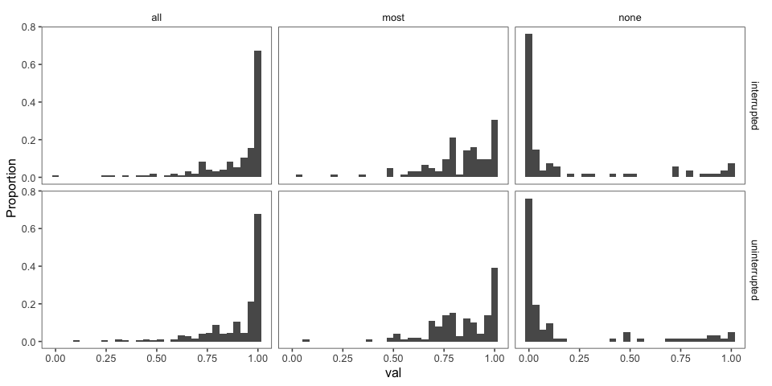

Critical Trials (collapsed across item)
---------------------------------------

Histograms of Prevalence Estimates by Condition (collapsed across item)
-----------------------------------------------------------------------

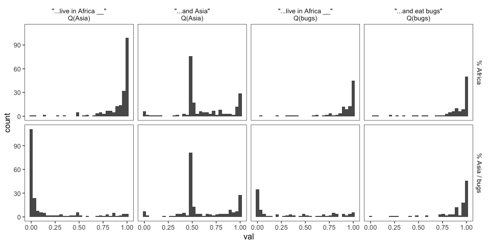

### Mutual Exclusivity

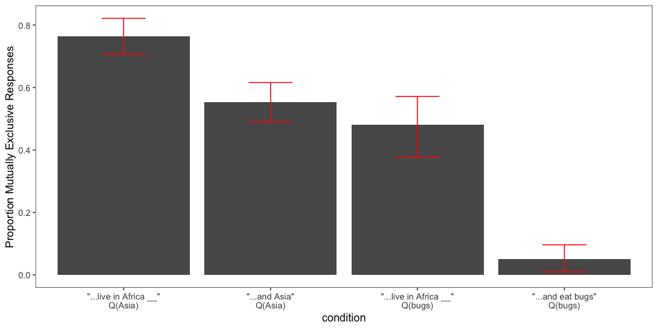

### Bootstrapped 95% Confidence Intervals (collapsed across item)

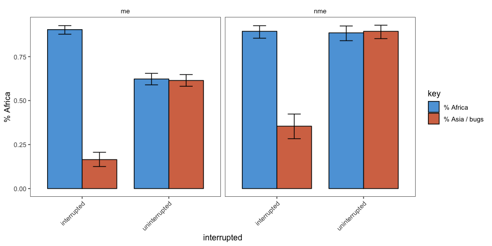

### Pirate Plots (collapsed across item)

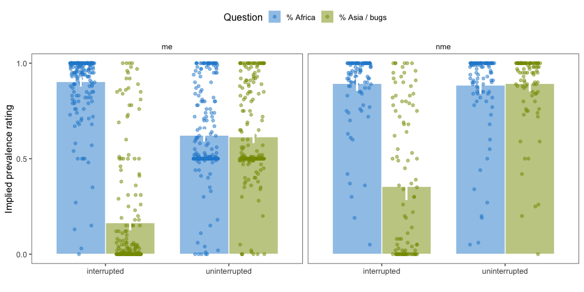

### ME vs. NME Questions

By-item Analyses
----------------

### Items

Items can be categorized by the continuation type and the coordination type.

-   continuation type: the interrupted sentence containing the questioned properties varies according to how real the subject matter is.
    -   real: Sentence and properties are completely real.
    -   fakeNames: The properties concern real items (like religion), but the name is made-up (Daith).
    -   fakeDefs: The properties concern completely made-up items.
-   coordination type: the "and" conjoins different syntactic categories

| coordination | continuationType |    n|
|:-------------|:-----------------|----:|
| np           | fakeDefs         |    2|
| np           | fakeNames        |    2|
| np           | real             |    5|
| pp           | fakeDefs         |    3|
| pp           | fakeNames        |    1|
| pp           | real             |    2|
| vp           | fakeDefs         |    1|

### Number of participants by Item and Condition

| predicate\_1                                   | predicate\_2                                        |  interrupted|  nme\_interrupted|  nme\_uninterrupted|  uninterrupted|
|:-----------------------------------------------|:----------------------------------------------------|------------:|-----------------:|-------------------:|--------------:|
| are part of the Tinno guild                    | are part of the Farza guild                         |           24|                14|                   8|             32|
| are stup-herders                               | are fishermen                                       |           32|                20|                  18|             12|
| ascribe to the Caboo religion                  | ascribe to the Daith religion                       |           26|                 8|                   8|             26|
| build nests in gluers                          | build nests in droops                               |           28|                10|                  12|             28|
| carry their young in guklags                   | carry their young in trullets                       |            8|                 8|                  22|             32|
| chew on xorfun                                 | chew on tunkel                                      |           22|                12|                  12|             32|
| flood their fields to plant fujusi             | burn their fields to plant soroneeks                |           20|                14|                  16|             18|
| have four horns                                | have seven horns                                    |           16|                16|                  20|             30|
| have long wings                                | have short wings                                    |           32|                18|                   8|             28|
| have six wings                                 | have seven wings                                    |           28|                 8|                  16|             28|
| have striped fur                               | have spotted fur                                    |           34|                10|                   4|             18|
| have territories at the tops of tall mountains | have territories at the bottom of deep canyons      |           24|                22|                  12|             28|
| hibernate in fallen logs                       | hibernate in the abandoned burrows of other animals |           22|                16|                  10|             10|
| live on the continent of Caro                  | live on the continent of Este                       |           32|                 8|                  12|             34|
| produce fruit with bumpy skin                  | produce fruit with smooth skin                      |           24|                14|                  16|             28|
| wear wutsats around their heads                | wear krevnors around their heads                    |           36|                 6|                  10|             24|

### Pirate Plots (by item)

### Mutual Exclusivity (by item)

Mutual Exclusivity Comparison (Expt1 and Elephants-10)
------------------------------------------------------

### ME

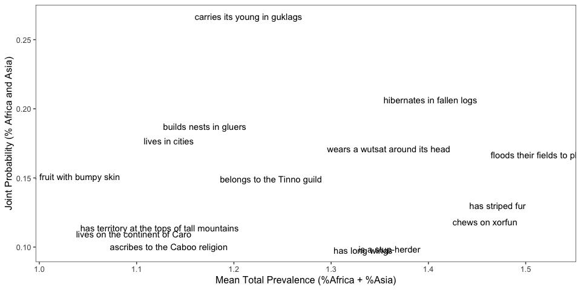

### NME

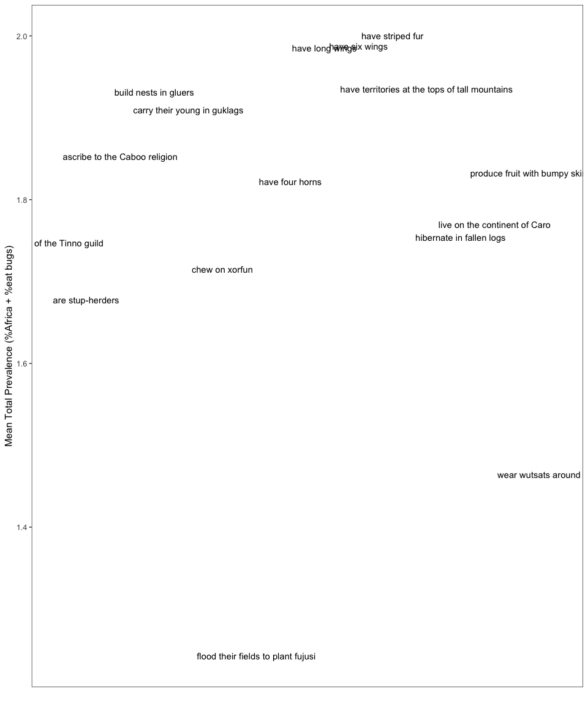

### Pirate Plots (by Coordination)

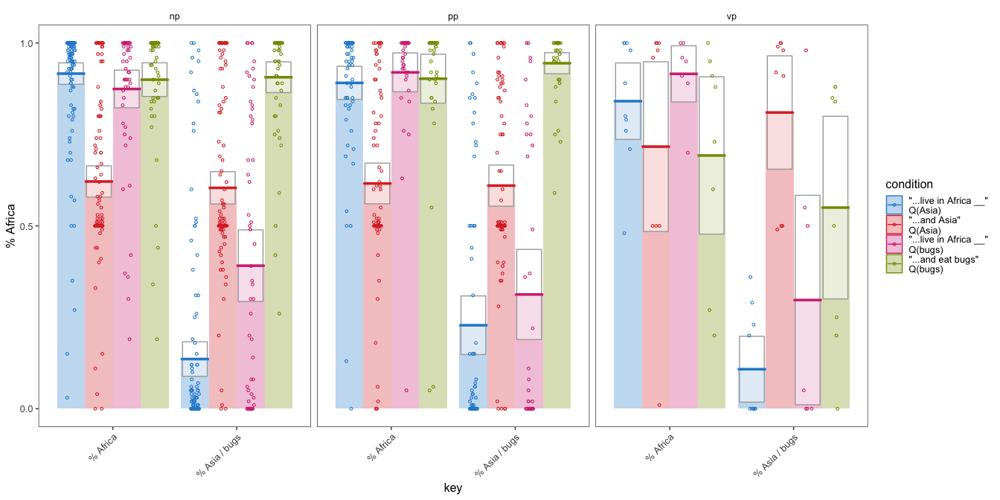

### Pirate Plots (by Realness)

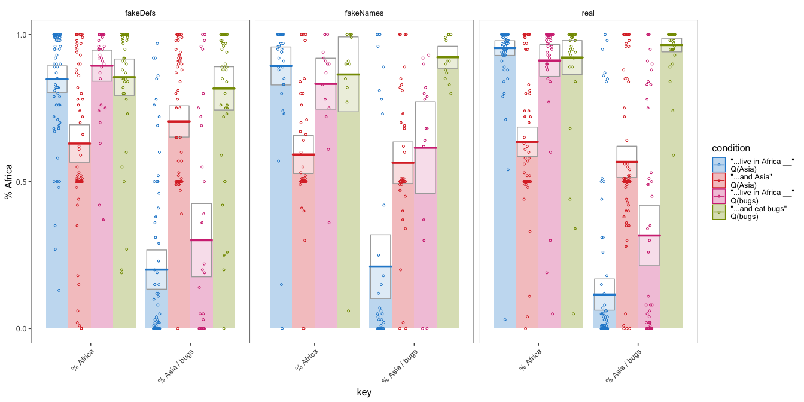

Order Effects
-------------

First vs. Second Half
---------------------

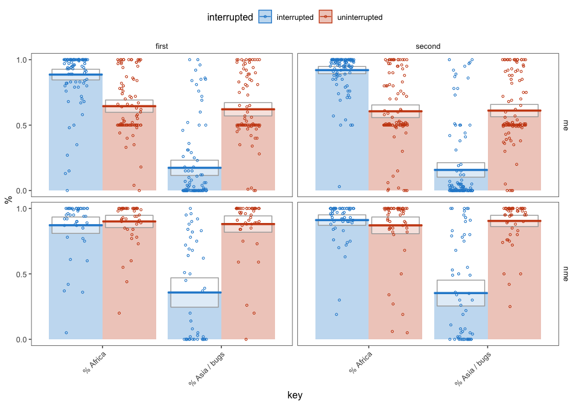

### First Trial

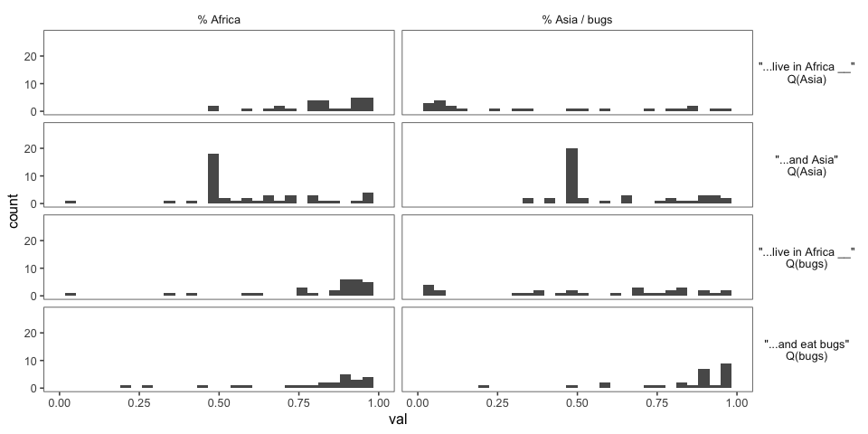

Reaction Times
--------------

*how much time do participants spend on the question slide?*

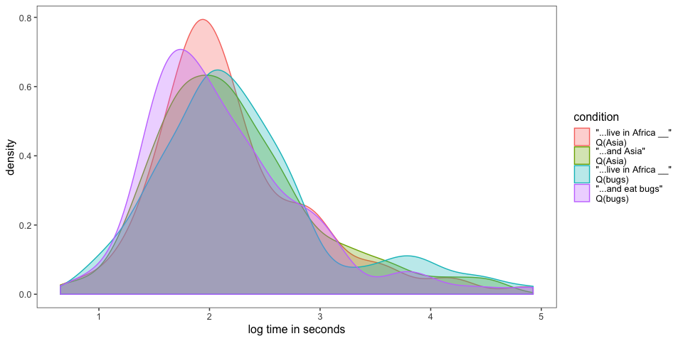
