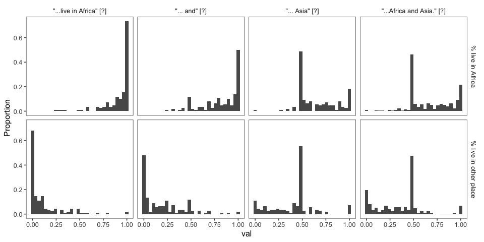
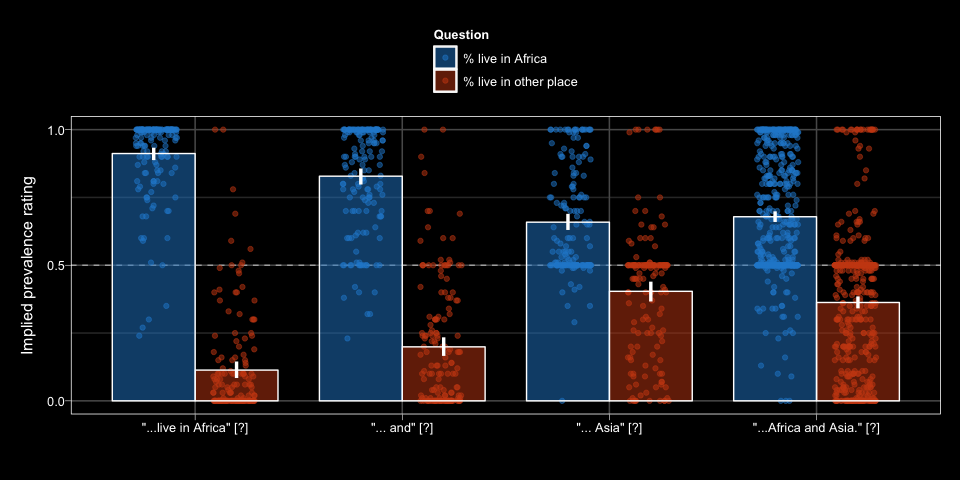
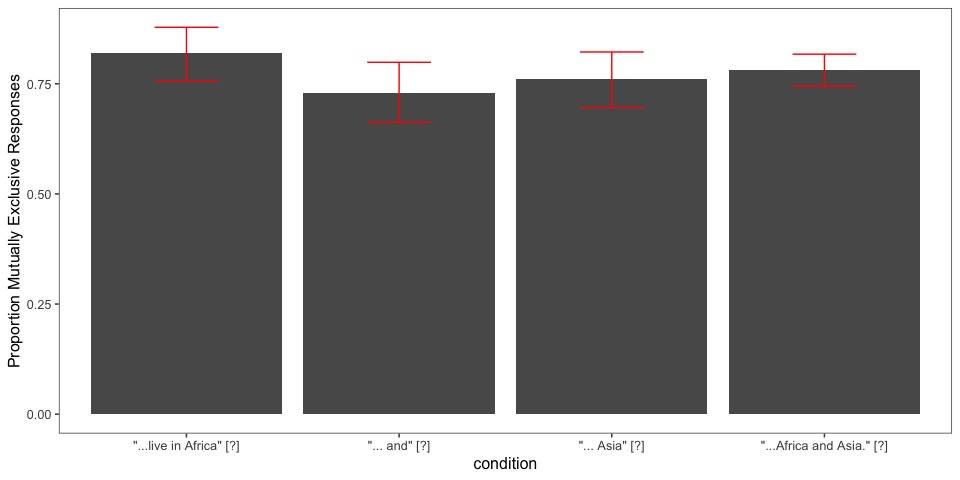
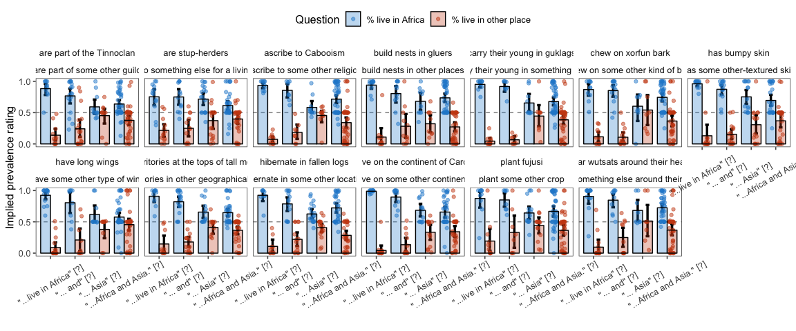

elephants-2-cogsci2019
================
MH Tessler
1/28/2019

[Link to experiment](http://www.mit.edu/~tessler/projects/elephants/experiments/elephants-7.html)

Experiment 2 for CogSci 2019 (Elephants-7)
------------------------------------------

-   revert to stims that don't mention both properties
-   ask about % in some other group (e.g. What % of elephants live on some other continent?)

All questions interrupting.

-   int1: (Africa) -- Q(Af, As) -- (and eat bugs in the wild)
-   int2: (Africa and) -- Q(Af, As) -- (eat bugs in the wild)
-   int4: (Africa and Asia) -- Q(Af, As) -- (which is warm)

Subject Information
-------------------

|  workerid| language      | enjoyment | age | gender | problems                                                                                       | comments                                                      |
|---------:|:--------------|:----------|:----|:-------|:-----------------------------------------------------------------------------------------------|:--------------------------------------------------------------|
|         0| United States | 0         | 22  | Male   | no                                                                                             |                                                               |
|         1| English       | 0         | 26  | Male   | No.                                                                                            |                                                               |
|         2| English       | 0         | 38  | Male   | no                                                                                             |                                                               |
|         3| English       | 1         | 55  | Male   | no                                                                                             |                                                               |
|         4| English       | 0         | 59  | Male   | no                                                                                             |                                                               |
|         5| English       | 0         | 26  | Male   | no                                                                                             |                                                               |
|         6| english       | 0         | 31  | Female | no                                                                                             |                                                               |
|         7| English       | 0         | 31  | Male   | Sometimes I saw information after the questions were asked but this may have been intentional. | Thank you for paying fairly.                                  |
|         8| english       | 0         | 29  | Female | no                                                                                             | none                                                          |
|         9| English       | 1         | 27  | Male   |                                                                                                |                                                               |
|        10| English       | 1         | 27  | Male   | No                                                                                             |                                                               |
|        11| English       | 1         | 30  | Male   | no                                                                                             | nice surveys                                                  |
|        12| English       | 1         | 57  | Male   | No problems.                                                                                   | n/a                                                           |
|        13| English       | 1         | 34  | Male   | No                                                                                             |                                                               |
|        14| English       | 0         | 54  | Female | no                                                                                             |                                                               |
|        15| English       | 1         | 34  | Male   | No problems. All was clear and worked as it should.                                            | Thanks for the opportunity. Have a wonderful rest of the day. |
|        16| United States | 0         | 29  | Male   |                                                                                                |                                                               |
|        17| english       | 1         | 32  | Male   | NO                                                                                             |                                                               |
|        18| english       | -1        | 35  | Male   | no                                                                                             |                                                               |
|        19| English       | 0         | 57  | Male   | no                                                                                             |                                                               |
|        20| English       | 0         | 38  | Female | No issues                                                                                      | n/a                                                           |
|        21| English       | 1         | 24  | Male   | no                                                                                             | none                                                          |
|        22| English       | 1         | 45  | Male   | no                                                                                             | none                                                          |
|        23| English       | 1         | 43  | Male   | no                                                                                             |                                                               |
|        24| English       | 0         | 27  | Female | no                                                                                             |                                                               |
|        25| french        | 1         | 32  | Female |                                                                                                |                                                               |
|        26| nglishe       | 0         | 39  | Female | none                                                                                           |                                                               |

Attention Checks
----------------

### Slider Practice

Before the experiment, participants practice using the sliders to rate 3 category-property pairs:

-   dogs bark (coded as correct if x &gt; 0.5)
-   birds are male (coded as correct if 0.25 &lt; x &lt; 0.75)
-   cats get cancer (coded as correct if x &lt; 0.75) \[being generous with this one\]
-   lions lay eggs (coded as correct if x &lt; 0.10)

|  n\_correct|    n|
|-----------:|----:|
|           1|    1|
|           2|    2|
|           3|    2|
|           4|   22|

| property        |  n\_correct|
|:----------------|-----------:|
| birds are male  |          25|
| cats get cancer |          25|
| dogs bark       |          27|
| lions lay eggs  |          22|

### Memory Check

After the story, participants select statements they recall learning from a list of 10 generic statements about novel animals (5 true, 5 distractor). They are also asked to explain what they did in the experiment.

### Explanations of Task

After the story, participants are also asked to explain generally what they did in the experiment.

|  workerid|  n\_slider\_correct|  n\_memory\_correct| explanation                                                                                                                                                                                                                                                                                                                          |
|---------:|-------------------:|-------------------:|:-------------------------------------------------------------------------------------------------------------------------------------------------------------------------------------------------------------------------------------------------------------------------------------------------------------------------------------|
|         0|                   3|                   8| it was about basic facts                                                                                                                                                                                                                                                                                                             |
|         1|                   4|                   9| I read chapters from a story about biology of an alien planet and answered questions about the chapters I&quotecharve read.                                                                                                                                                                                                          |
|         2|                   4|                   7| I read a short story about an alien planet the species that live there.                                                                                                                                                                                                                                                              |
|         3|                   4|                  10| I read a story about another planet and beings and made predictions.                                                                                                                                                                                                                                                                 |
|         4|                   4|                   8| I tried to estimate the percentage of characters that exhibited a particular quality.                                                                                                                                                                                                                                                |
|         5|                   4|                   9| Read the alien learning book and answered questions.                                                                                                                                                                                                                                                                                 |
|         6|                   4|                   9| I read the chapters and after each I used a slider scale to answer the questions that were given to me about the planet Dax                                                                                                                                                                                                          |
|         7|                   4|                  10| I read through a storybook about different alien species and their habits. I then answered two questions each about them.                                                                                                                                                                                                            |
|         8|                   4|                   7| good                                                                                                                                                                                                                                                                                                                                 |
|         9|                   3|                   9| Read through a book with different species of aliens.                                                                                                                                                                                                                                                                                |
|        10|                   4|                  10| I answered questions pertaining to an alien planet and the different organisms found on it as well as their cultures.                                                                                                                                                                                                                |
|        11|                   2|                   4| this is aliens story related                                                                                                                                                                                                                                                                                                         |
|        12|                   4|                   9| I read chapters about aliens and answered questions about what I read.                                                                                                                                                                                                                                                               |
|        13|                   4|                   9| I read chapters and answered related questions to the materials within those chapters.                                                                                                                                                                                                                                               |
|        14|                   4|                   9| read chapters in a book about different types of aliens and their parents and made predictions on questions asked                                                                                                                                                                                                                    |
|        15|                   4|                  10| I read some chapters of a book about an alien world and some of the life that inhabits it.                                                                                                                                                                                                                                           |
|        16|                   4|                   6| I chose something regarding aliens.                                                                                                                                                                                                                                                                                                  |
|        17|                   4|                   5| I read about an alien raced and their traits while giving my opinions                                                                                                                                                                                                                                                                |
|        18|                   2|                   4| none                                                                                                                                                                                                                                                                                                                                 |
|        19|                   4|                   9| read chapters and made estimates as to behaviors                                                                                                                                                                                                                                                                                     |
|        20|                   4|                  10| Read about an plant with aliens and animals, and answered comprehension questions in each chapter.                                                                                                                                                                                                                                   |
|        21|                   4|                   9| I read a story about an alien planet similar to earth and the life that inhabits it.                                                                                                                                                                                                                                                 |
|        22|                   4|                   8| I tried to identify with several terms that I had no prior knowledge of.                                                                                                                                                                                                                                                             |
|        23|                   4|                  10| I was supposed to read through each chapter then estimate the amounts of whatever questions were asked of me about the alien creatures. Since the words are unfamiliar it seemed a little harder to recall whether the words like SOME, ALL, NONE, etc. applied to the specific words (like xorfun or kewps) were being asked about. |
|        24|                   4|                   8| I read chapters of a story about aliens and answered questions about the percentages of aliens that did different things.                                                                                                                                                                                                            |
|        25|                   4|                   7| I read a story and answered questions relating to the story                                                                                                                                                                                                                                                                          |
|        26|                   1|                   4| none                                                                                                                                                                                                                                                                                                                                 |

Participants
------------

### Included/Excluded Subject Numbers

Removing participants who got fewer than 7 correct on memory check and didn't get all 4 sliders. (Participants with bad explanations usually fell into one of these other groups.)

| memory\_fail | slider\_fail |    n|
|:-------------|:-------------|----:|
| FALSE        | FALSE        |   20|
| FALSE        | TRUE         |    2|
| TRUE         | FALSE        |    2|
| TRUE         | TRUE         |    3|

### Prevalence Estimates by Participant

Histogram of all of a single participant's prevalence estimates, collapsed across trials and color coded for the number of correct responses on the memory check.
\* fill = number of correct responses on the memory check (out of 10)
\* facet = participants

Filler Trials
-------------

These used quantifiers (and thus we have strong idea about literal meaning).

Critical Trials (collapsed across item)
---------------------------------------

*Conditions*

1.  AF: "Elephants live in Africa" -- Q(Africa, Asia) -- "and breathe oxygen"
2.  AF&: "Elephants live in Africa and" -- Q(Africa, Asia) -- "breathe oxygen"
3.  AF&AS: "Elephants live in Africa and Asia" -- Q(Africa, Asia) -- "while alive"

### Number of Participants by Condition

| condition                         |    n|
|:----------------------------------|----:|
| "...live in Africa \_\_"          |   40|
| "...live in Africa and \_\_"      |   40|
| "...live in Africa and Asia \_\_" |   40|
| "...live in Africa and Asia."     |  120|

### Histograms of Prevalence Estimates by Condition (collapsed across item)

### Bootstrapped 95% Confidence Intervals (collapsed across item)

*Property 2* = "% live in Asia" for ME trials and "% eat bugs" for NME trials

### Bootstrapped 95% Confidence Intervals for Relationships Between Prevalence Estimates (collapsed across items)

The relationships between prevalence estimates of the mentioned property (property 1) and the other property (property 2) could be: - mutually exclusive: both properties cannot occur at the same time, so the sum of prevalence estimates cannot exceed 1
- prevalence for property 1 is greater than property 2
- property 1 is interpreted as a universal
- property 2 is interpreted as a universal
\* These conditions are not mutually exclusive; a participant can fall into one or more of the categories for a given trial.

### Pirate Plots (collapsed across item)

Modeling
--------

    ##                                 1 3 4
    ## "...live in Africa __"          1 0 0
    ## "...live in Africa and __"      0 0 0
    ## "...live in Africa and Asia __" 0 1 0
    ## "...live in Africa and Asia."   0 0 1

    ##  Family: gaussian 
    ##   Links: mu = identity; sigma = identity 
    ## Formula: val ~ condition + (1 + condition | workerid) + (1 + condition | predicate_1) 
    ##    Data: df.query.critical %>% filter(key == "% live in Afr (Number of observations: 240) 
    ## Samples: 3 chains, each with iter = 2000; warmup = 1000; thin = 1;
    ##          total post-warmup samples = 3000
    ## 
    ## Group-Level Effects: 
    ## ~predicate_1 (Number of levels: 13) 
    ##                            Estimate Est.Error l-95% CI u-95% CI Eff.Sample
    ## sd(Intercept)                  0.03      0.02     0.00     0.08       1304
    ## sd(condition1)                 0.04      0.03     0.00     0.12       2110
    ## sd(condition3)                 0.05      0.04     0.00     0.15       1589
    ## sd(condition4)                 0.03      0.02     0.00     0.07       2429
    ## cor(Intercept,condition1)     -0.09      0.45    -0.85     0.77       3715
    ## cor(Intercept,condition3)      0.03      0.45    -0.80     0.83       3138
    ## cor(condition1,condition3)     0.04      0.45    -0.78     0.84       2702
    ## cor(Intercept,condition4)     -0.13      0.45    -0.85     0.77       4179
    ## cor(condition1,condition4)     0.01      0.45    -0.79     0.83       2771
    ## cor(condition3,condition4)     0.05      0.46    -0.79     0.84       2271
    ##                            Rhat
    ## sd(Intercept)              1.00
    ## sd(condition1)             1.00
    ## sd(condition3)             1.00
    ## sd(condition4)             1.00
    ## cor(Intercept,condition1)  1.00
    ## cor(Intercept,condition3)  1.00
    ## cor(condition1,condition3) 1.00
    ## cor(Intercept,condition4)  1.00
    ## cor(condition1,condition4) 1.00
    ## cor(condition3,condition4) 1.00
    ## 
    ## ~workerid (Number of levels: 20) 
    ##                            Estimate Est.Error l-95% CI u-95% CI Eff.Sample
    ## sd(Intercept)                  0.09      0.03     0.02     0.15        866
    ## sd(condition1)                 0.07      0.04     0.00     0.17       1107
    ## sd(condition3)                 0.10      0.06     0.01     0.22        651
    ## sd(condition4)                 0.07      0.04     0.01     0.16        493
    ## cor(Intercept,condition1)     -0.44      0.41    -0.94     0.58       1529
    ## cor(Intercept,condition3)      0.13      0.39    -0.62     0.82       2214
    ## cor(condition1,condition3)    -0.16      0.43    -0.86     0.72       1352
    ## cor(Intercept,condition4)      0.21      0.38    -0.55     0.87       2258
    ## cor(condition1,condition4)    -0.12      0.43    -0.85     0.74       1155
    ## cor(condition3,condition4)     0.18      0.41    -0.68     0.85       1116
    ##                            Rhat
    ## sd(Intercept)              1.00
    ## sd(condition1)             1.00
    ## sd(condition3)             1.00
    ## sd(condition4)             1.01
    ## cor(Intercept,condition1)  1.00
    ## cor(Intercept,condition3)  1.00
    ## cor(condition1,condition3) 1.00
    ## cor(Intercept,condition4)  1.00
    ## cor(condition1,condition4) 1.00
    ## cor(condition3,condition4) 1.00
    ## 
    ## Population-Level Effects: 
    ##            Estimate Est.Error l-95% CI u-95% CI Eff.Sample Rhat
    ## Intercept      0.85      0.03     0.79     0.92       2690 1.00
    ## condition1     0.09      0.05    -0.00     0.18       2793 1.00
    ## condition3    -0.23      0.05    -0.33    -0.12       2769 1.00
    ## condition4    -0.23      0.04    -0.30    -0.16       2575 1.00
    ## 
    ## Family Specific Parameters: 
    ##       Estimate Est.Error l-95% CI u-95% CI Eff.Sample Rhat
    ## sigma     0.18      0.01     0.16     0.20       1974 1.00
    ## 
    ## Samples were drawn using sampling(NUTS). For each parameter, Eff.Sample 
    ## is a crude measure of effective sample size, and Rhat is the potential 
    ## scale reduction factor on split chains (at convergence, Rhat = 1).

By-item Analyses
----------------

### Number of Participants by Item and Condition

| predicate\_1                                   | predicate\_2                                     |  "...live in Africa \_\_"|  "...live in Africa and \_\_"|  "...live in Africa and Asia \_\_"|  "...live in Africa and Asia."|
|:-----------------------------------------------|:-------------------------------------------------|-------------------------:|-----------------------------:|----------------------------------:|------------------------------:|
| are part of the Tinnoclan                      | are part of some other guild                     |                         6|                             4|                                  4|                             22|
| are stup-herders                               | do something else for a living                   |                        10|                             6|                                  4|                             16|
| ascribe to Cabooism                            | ascribe to some other religion                   |                         8|                             6|                                  8|                             16|
| build nests in gluers                          | build nests in other places                      |                         8|                             8|                                  4|                             16|
| carry their young in guklags                   | carry their young in something else              |                         6|                            10|                                  6|                             18|
| chew on xorfun bark                            | chew on some other kind of bark                  |                        10|                             0|                                  2|                             22|
| has bumpy skin                                 | has some other-textured skin                     |                         4|                            10|                                  4|                             20|
| have long wings                                | have some other type of wing                     |                         4|                             2|                                 12|                             20|
| have territories at the tops of tall mountains | have territories in other geographical locations |                         0|                            12|                                  8|                             14|
| hibernate in fallen logs                       | hibernate in some other location                 |                        14|                             8|                                  4|                             12|
| live on the continent of Caro                  | live on some other continent                     |                         2|                             8|                                  2|                             24|
| plant fujusi                                   | plant some other crop                            |                         0|                             4|                                 16|                             16|
| wear wutsats around their heads                | wear something else around their heads           |                         8|                             2|                                  6|                             24|

### Pirate Plots (by item)

First vs. Other Trials (for each condition)
-------------------------------------------

Reaction Times
--------------

*how much time do participants spend on the question slide?*

Looking only at

-   AF: "Elephants live in Africa"
-   AF&: "Elephants live in Africa and"
-   AF&AS: "Elephants live in Africa and Asia"

