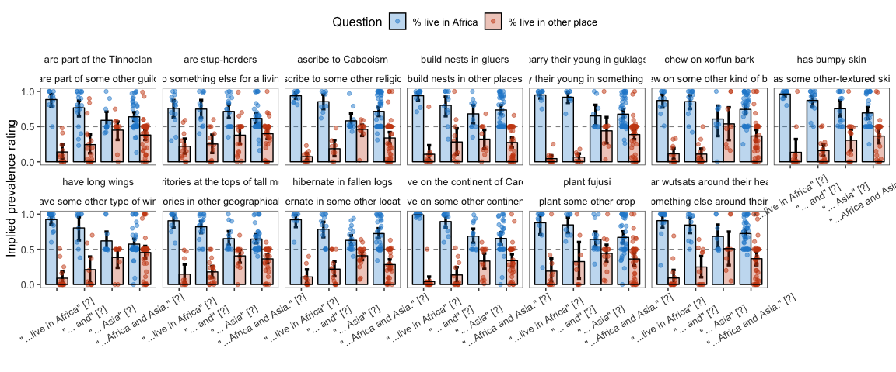
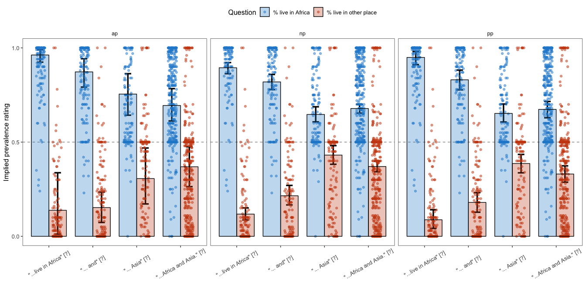

elephants-2-cogsci2019
================
MH Tessler
1/28/2019

[Link to experiment](http://www.mit.edu/~tessler/projects/elephants/experiments/elephants-7.html)

Experiment 2 for CogSci 2019 (Elephants-7)
------------------------------------------

-   revert to stims that don't mention both properties
-   ask about % in some other group (e.g. What % of elephants live on some other continent?)

All questions interrupting.

-   int1: (Africa) -- Q(Af, As) -- (and eat bugs in the wild)
-   int2: (Africa and) -- Q(Af, As) -- (eat bugs in the wild)
-   int4: (Africa and Asia) -- Q(Af, As) -- (which is warm)

Subject Information
-------------------

|  workerid| language | enjoyment | age | gender | problems                                                                                         | comments                                              |
|---------:|:---------|:----------|:----|:-------|:-------------------------------------------------------------------------------------------------|:------------------------------------------------------|
|         0| eng      | -1        | 34  | Male   |                                                                                                  | drivel                                                |
|         1| english  | 1         | 22  | Male   |                                                                                                  |                                                       |
|         2| English  | 0         | 33  | Female | no                                                                                               |                                                       |
|         3| English  | 1         | 37  | Male   | no                                                                                               |                                                       |
|         4| English  | 0         | 31  | Male   | No                                                                                               |                                                       |
|         5| English  | 0         | 31  | Male   | Nope                                                                                             |                                                       |
|         6| English  | 1         | 32  | Female | no, there is nothing problem.                                                                    | none                                                  |
|         7| english  | 1         | 28  | Male   | no                                                                                               |                                                       |
|         8| English  | 1         | 51  | Female | No.                                                                                              |                                                       |
|         9| english  | 0         | 36  | Male   | none                                                                                             |                                                       |
|        10| English  | 1         | 38  | Female | Everything worked great!                                                                         | Thank you!                                            |
|        11| English  | 0         | 33  | Male   | No problems or bugs.                                                                             |                                                       |
|        12| English  | 1         | 26  | Female | No                                                                                               |                                                       |
|        13| English  | 0         | 30  | Female | No problems                                                                                      |                                                       |
|        14| English  | 1         | 25  | Female | No                                                                                               |                                                       |
|        15| English  | 1         | 24  | Male   | There was non observed                                                                           | non for now. I wouldn&quotechart hesitate to mail you |
|        16| English  | 1         | 22  | Female | Nothing                                                                                          | Really nice and Interesting.                          |
|        17| english  | 1         | 46  | Male   | no                                                                                               |                                                       |
|        18| english  | 0         | 43  | Male   | no                                                                                               |                                                       |
|        19| english  | 1         | 66  | Male   | no                                                                                               | none                                                  |
|        20| English  | 0         | 56  | Female | no                                                                                               |                                                       |
|        21| English  | 0         | 32  | Male   | no                                                                                               | thanks                                                |
|        22| ENGLISH  | 1         | 25  | Male   | NO                                                                                               | GOOD                                                  |
|        23| English  | 1         | 30  | Female | Nothing                                                                                          | I like this survey                                    |
|        24| English  | 0         | 21  | Female | No                                                                                               |                                                       |
|        25| English  | 1         | 48  | Male   | No, everything worked as expected.                                                               |                                                       |
|        26| English  | 1         | 28  | Female | no                                                                                               | nothing                                               |
|        27| english  | 0         | 40  | Female |                                                                                                  |                                                       |
|        28| english  | 1         | 57  | Female | no                                                                                               | no                                                    |
|        29| english  | 1         | 41  | Male   | no                                                                                               |                                                       |
|        30| English  | 0         | 28  | Male   | None                                                                                             | Thanks                                                |
|        31| English  | 0         | 29  | Male   | No problems or issues.                                                                           | At at this time.                                      |
|        32| English  | 0         | 26  | Male   | no                                                                                               |                                                       |
|        33| english  | 1         | 54  | Female | no everything was fine                                                                           | thank you so much                                     |
|        34|          | 99        |     |        |                                                                                                  |                                                       |
|        35| English  | 1         | 39  | Male   |                                                                                                  |                                                       |
|        36| English  | 0         | 35  | Female | no                                                                                               | this was interesting                                  |
|        37| american | 1         | 36  | Male   | no                                                                                               |                                                       |
|        38| English  | 0         | 33  | Female |                                                                                                  |                                                       |
|        39| English  | 0         | 35  | Male   | no                                                                                               |                                                       |
|        40| English  | 0         | 31  | Female | No                                                                                               |                                                       |
|        41| English  | -1        | 35  | Male   | no                                                                                               | it took me 25 minutes for the HIT                     |
|        42| English  | 1         | 29  | Male   | No                                                                                               | Good study                                            |
|        43| English  | 0         | 30  | Female | No                                                                                               | Thank you for this opportunity.                       |
|        44| English  | 1         | 27  | Female | No                                                                                               |                                                       |
|        45| English  | 0         | 26  | Female | No.                                                                                              |                                                       |
|        46| English  | 0         | 39  | Male   | no                                                                                               |                                                       |
|        47| English  | -1        | 59  | Female | none                                                                                             |                                                       |
|        48| English  | 1         | 34  | Female | No                                                                                               | Very Nice.                                            |
|        49| english  | 0         | 29  | Female | no                                                                                               |                                                       |
|        50| english  | -1        | 36  | Male   | no                                                                                               |                                                       |
|        51| English  | 1         | 24  | Female | no                                                                                               |                                                       |
|        52| English  | 0         | 54  | Male   | no                                                                                               |                                                       |
|        53| English  | 0         | 22  | Male   | No.                                                                                              |                                                       |
|        54| English  | 0         | 23  | Female |                                                                                                  |                                                       |
|        55| English  | 0         | 20  | Female |                                                                                                  |                                                       |
|        56| English  | 0         | 39  | Female | No.                                                                                              |                                                       |
|        57| english  | 1         | 28  | Female | no                                                                                               | thank you for the study!                              |
|        58| English  | 1         | 48  | Female | no                                                                                               |                                                       |
|        59| English  | 1         | 30  | Male   | no                                                                                               | Nothing                                               |
|        60| English  | 1         | 29  | Female | No.                                                                                              |                                                       |
|        61| English  | 1         | 40  | Female | It didn&quotechart leave an mTurk window open to ender the code in. My mTurk ID is ARGQ00LVKTVW1 |                                                       |
|        62| english  | 0         | 32  | Male   |                                                                                                  |                                                       |
|        63| English  | 1         | 41  | Male   |                                                                                                  |                                                       |
|        64| english  | 1         | 45  | Female | no                                                                                               |                                                       |
|        65| English  | 1         | 37  | Female | NO                                                                                               | its very interesting to do.                           |
|        66| english  | 0         | 30  | Male   | none                                                                                             | nice                                                  |
|        67| english  | 0         | 42  | Female |                                                                                                  |                                                       |
|        68| English  | 0         | 28  | Female | none                                                                                             | thank you!                                            |
|        69| English  | 1         | 25  | Male   | No                                                                                               |                                                       |
|        70| ENGLISH  | 0         | 32  | Male   | NO                                                                                               |                                                       |
|        71| English  | 0         | 37  | Male   | no                                                                                               | ty                                                    |
|        72| English  | 1         | 28  | Male   |                                                                                                  |                                                       |
|        73| English  | 0         | 31  | Male   |                                                                                                  |                                                       |
|        74| English  | 0         | 34  | Male   | no                                                                                               | no                                                    |
|        75| English  | 0         | 25  | Female | No                                                                                               |                                                       |
|        76| english  | 1         | 33  | Female | No                                                                                               |                                                       |
|        77| English  | 0         | 39  | Male   | None                                                                                             |                                                       |
|        78| English  | 0         | 38  | Female | none                                                                                             | n/a                                                   |
|        79| english  | 1         | 30  | Female | no                                                                                               |                                                       |
|        80| English  | 1         | 33  | Male   |                                                                                                  |                                                       |
|        81| English  | 0         | 21  | Male   |                                                                                                  |                                                       |
|        82| english  | 0         | 38  | Female | no                                                                                               |                                                       |
|        83| english  | 1         | 32  | Female | no                                                                                               |                                                       |
|        84| English  | 1         | 25  | Male   |                                                                                                  |                                                       |
|        85| English  | 0         | 21  | Male   | no                                                                                               |                                                       |
|        86| english  | 1         | 52  | Female | no                                                                                               | it was interesting, thank you                         |
|        87| English  | 1         | 47  | Male   | no                                                                                               |                                                       |
|        88| english  | 0         | 34  | Male   | no                                                                                               | thank you for letting me be apart of this research    |
|        89| English  | 1         | 31  | Male   | No                                                                                               |                                                       |
|        90| english  | 1         | 26  | Male   | na                                                                                               |                                                       |
|        91| English  | 0         | 49  | Male   | none                                                                                             | Thank You.                                            |
|        92| english  | 1         | 38  | Female | no                                                                                               |                                                       |
|        93| English  | 1         | 45  | Female | No                                                                                               | None at this time. Thank you.                         |
|        94| english  | 1         | 30  | Female | no problems                                                                                      | it was fun and interesting thanks so much             |
|        95| English  | 0         | 42  | Male   | None                                                                                             | None                                                  |
|        96| english  | 1         | 29  | Female | no                                                                                               |                                                       |
|        97| english  | -1        | 42  | Male   |                                                                                                  | too short of timer!!                                  |
|        98| english  | 1         | 56  | Female | no                                                                                               |                                                       |
|        99| english  | 0         | 22  | Male   |                                                                                                  |                                                       |
|       100| english  | 1         | 33  | Female | no                                                                                               |                                                       |
|       101| English  | 1         | 47  | Female | no                                                                                               |                                                       |
|       102| English  | -1        | 50  | Male   | Intenionally, no.                                                                                | Just awful.                                           |
|       103| English  | 0         | 33  | Male   | none                                                                                             | none                                                  |
|       104| English  | 0         | 54  | Male   | none                                                                                             | none                                                  |
|       105| English  | 1         | 27  | Male   | No                                                                                               | No further comments. Thank you!                       |
|       106| English  | 1         | 34  | Female | No.                                                                                              | No additional comments.                               |
|       107| English  | 0         | 33  | Female | No issues                                                                                        |                                                       |

Attention Checks
----------------

### Slider Practice

Before the experiment, participants practice using the sliders to rate 3 category-property pairs:

-   dogs bark (coded as correct if x &gt; 0.5)
-   birds are male (coded as correct if 0.25 &lt; x &lt; 0.75)
-   cats get cancer (coded as correct if x &lt; 0.75) \[being generous with this one\]
-   lions lay eggs (coded as correct if x &lt; 0.10)

|  n\_correct|    n|
|-----------:|----:|
|           1|    1|
|           2|    6|
|           3|   12|
|           4|   89|

| property        |  n\_correct|
|:----------------|-----------:|
| birds are male  |         102|
| cats get cancer |         105|
| dogs bark       |         103|
| lions lay eggs  |          95|

### Memory Check

After the story, participants select statements they recall learning from a list of 10 generic statements about novel animals (5 true, 5 distractor). They are also asked to explain what they did in the experiment.

### Slider Practice and Memory Check

### Explanations of Task

After the story, participants are also asked to explain generally what they did in the experiment.

|  workerid|  n\_slider\_correct|  n\_memory\_correct| explanation                                                                                                                                                                                                                                                                                                             |
|---------:|-------------------:|-------------------:|:------------------------------------------------------------------------------------------------------------------------------------------------------------------------------------------------------------------------------------------------------------------------------------------------------------------------|
|         0|                   4|                   6| i tried to learn some stupid bullshit you buttholes made up for no good reason at all.                                                                                                                                                                                                                                  |
|         1|                   3|                  10| I read a story about an alien colony and answers questions as it went along. The questions would ask what % of \_\_\_\_\_ do something.                                                                                                                                                                                 |
|         2|                   4|                   9| I read texts about an alien planet. Then I answered questions.                                                                                                                                                                                                                                                          |
|         3|                   4|                   6| tried to predict what percentage of which species exhibited which behaviors or attributes                                                                                                                                                                                                                               |
|         4|                   4|                   8| I made judgement decisions based on a story.                                                                                                                                                                                                                                                                            |
|         5|                   4|                   9| Read a story about aliens and trying to remember facts about them that were told throughout.                                                                                                                                                                                                                            |
|         6|                   3|                   6| learning interesting facts about some creatures.                                                                                                                                                                                                                                                                        |
|         7|                   4|                   9| I read the story and was asked questions about facts within the story.                                                                                                                                                                                                                                                  |
|         8|                   4|                  10| I read a story about strange creatures and then answered if I had remembered the above facts as coming from the story.                                                                                                                                                                                                  |
|         9|                   3|                   3| I read a story about a bunch of Alien creatures and tried my best to remember things i learned about them from the .                                                                                                                                                                                                    |
|        10|                   4|                   8| I answered questions about what I read.                                                                                                                                                                                                                                                                                 |
|        11|                   4|                  10| I read stories about different aliens and creatures on a alien planet that was similar to ours in ways and was then asked questions about the specific parts of each of the stories.                                                                                                                                    |
|        12|                   4|                   8| I answered probability questions after reading about the different animals of Dax                                                                                                                                                                                                                                       |
|        13|                   3|                   8| Determined how many of something prescribe to a certain behavior.                                                                                                                                                                                                                                                       |
|        14|                   4|                  10| I read facts about alien animals and answered questions about them                                                                                                                                                                                                                                                      |
|        15|                   4|                   8| I answered questions from a story of several chapters. It was based on aliens.                                                                                                                                                                                                                                          |
|        16|                   4|                   5| To measure the people are paying interest reading towards alien based chapters.                                                                                                                                                                                                                                         |
|        17|                   4|                   9| I read short stories about aliens and then tried to answer the probability of two questions.                                                                                                                                                                                                                            |
|        18|                   4|                   8| I read a story about a foreign world and then made estimates                                                                                                                                                                                                                                                            |
|        19|                   4|                   7| tried to decide the level at which the questions were right or wrong                                                                                                                                                                                                                                                    |
|        20|                   4|                  10| read a story and answered questions about the story using sliders                                                                                                                                                                                                                                                       |
|        21|                   4|                   9| I read a story about creatures on another planet and answered questions about them                                                                                                                                                                                                                                      |
|        22|                   4|                   4| GOOD                                                                                                                                                                                                                                                                                                                    |
|        23|                   3|                   4| its make the thinking of the reading and remember the the topic                                                                                                                                                                                                                                                         |
|        24|                   4|                  10| Learning about aliens.                                                                                                                                                                                                                                                                                                  |
|        25|                   4|                   9| I read chapters of a story about an alien planet and it&quotechars inhabitants and I tried to remember, at certain points, details about the story.                                                                                                                                                                     |
|        26|                   4|                   5| i read all chapters based on that i answered to the question                                                                                                                                                                                                                                                            |
|        27|                   4|                   7| I paid attention to the nouns in the story and noted when some things did one thing and some did another.                                                                                                                                                                                                               |
|        28|                   4|                   9| I tried to learn about the inhabitants of a planet similar to earth with many similar living beings but with different words for just about everything.                                                                                                                                                                 |
|        29|                   4|                   8| I basically read the paragraphs and then made a judement based on 2 questions on alien species                                                                                                                                                                                                                          |
|        30|                   4|                  10| We estimated what percentages of aliens did certain things, how they lived.                                                                                                                                                                                                                                             |
|        31|                   4|                  10| We read through many chapters and than answered questions at the end at each individual chapter.                                                                                                                                                                                                                        |
|        32|                   3|                   6| I just read through the book and had to choose the percentage of creatures living in a certain area.                                                                                                                                                                                                                    |
|        33|                   4|                   8| I read several chapters about a alien planet similar to ours with 7 continents, each chapter was not related to the one before or after it. I answered questions about each chapter between chapters.It involved learning about animals ans plants.                                                                     |
|        34|                   3|                   9| Estimate in percent the probability that creatures/Animals would do X AND Y.                                                                                                                                                                                                                                            |
|        35|                   3|                   7| Read chapters that all differed from the other and interpreted it.                                                                                                                                                                                                                                                      |
|        36|                   4|                   4| I read a story and then answered the question to what percent of what kind of thing did something. It was part of a story with several chapters. It described all kinds of different alien creatures.                                                                                                                   |
|        37|                   2|                   9| i have readed a story-book about animals and aliens on a far-away planet                                                                                                                                                                                                                                                |
|        38|                   4|                   9| I thought about what I read in the story and what I believed could be the correct answer.                                                                                                                                                                                                                               |
|        39|                   4|                   9| Tried to estimate what it asked me after each chapter in the story.                                                                                                                                                                                                                                                     |
|        40|                   4|                   9| I read each passage outloud to myself and then answered questions as I went through the chapters.                                                                                                                                                                                                                       |
|        41|                   4|                   8| i read about a planet similar to earth and its various beings                                                                                                                                                                                                                                                           |
|        42|                   2|                   4| It was a good story to read                                                                                                                                                                                                                                                                                             |
|        43|                   4|                   9| I read a story and tried to remember and combine information as I read. It was difficult to remember some things, but I did my best.                                                                                                                                                                                    |
|        44|                   4|                  10| I read different chapters describing alien creatures and answered questions about what I read.                                                                                                                                                                                                                          |
|        45|                   3|                   5| a variety of questions about study                                                                                                                                                                                                                                                                                      |
|        46|                   4|                  10| I was reading this book about aliens that lived on other planets and there was a lot of information about them and questions to answer along the way. It was pretty difficult to remember all of the names and facts                                                                                                    |
|        47|                   4|                   8| Read about an alien planet that is a lot like earth, but has odd sounding creatures and places.                                                                                                                                                                                                                         |
|        48|                   1|                   5| are called Aga, Benli, Caro, Dodi, Ente, Fale, and Gomi. Its climate is a lot like Earth&quotechars, too.                                                                                                                                                                                                               |
|        49|                   4|                   8| I read chapters and answered questions based on the reading.                                                                                                                                                                                                                                                            |
|        50|                   4|                   9| read about aliens decide what percent of them do what                                                                                                                                                                                                                                                                   |
|        51|                   4|                  10| We read different chapters of a book about different aliens and had to answer percentage questions about what we read.                                                                                                                                                                                                  |
|        52|                   4|                  10| I indicated what percentage of something did x based on the information I&quotechard been reading in the book                                                                                                                                                                                                           |
|        53|                   4|                   9| I think it&quotechars about prejudges. To examine how we picture people and things with limited information.                                                                                                                                                                                                            |
|        54|                   3|                   3| read and answer questions                                                                                                                                                                                                                                                                                               |
|        55|                   4|                   6| I was asked to read a story about aliens and some activities they do then select what percentage of the aliens do that activity.                                                                                                                                                                                        |
|        56|                   3|                   5| Very bizarre, as much as I tried I instantly forgot what I read since none of the terms were familiar to me.                                                                                                                                                                                                            |
|        57|                   4|                   8| i read a story about aliens and their habits and lifestyle and answered questions on what percentage of aliens i believed participated in that behavior                                                                                                                                                                 |
|        58|                   4|                   7| Read a book and answered questions related to percentages about what I read.                                                                                                                                                                                                                                            |
|        59|                   4|                  10| I just read it to myself like any other story.                                                                                                                                                                                                                                                                          |
|        60|                   4|                  10| i read chapters about an alien planet and tried to answer the questions accordingly.                                                                                                                                                                                                                                    |
|        61|                   4|                   9| Read a story about aliens on seven continents and answered questions about the content.                                                                                                                                                                                                                                 |
|        62|                   4|                   7| I read about aliens and about the planet.                                                                                                                                                                                                                                                                               |
|        63|                   4|                  10| It was about reading comprehension.                                                                                                                                                                                                                                                                                     |
|        64|                   4|                  10| I read chapters of a book about alien planet and answered questions about them.                                                                                                                                                                                                                                         |
|        65|                   4|                   8| i read a short story that happened on different planet. based on that story there were some hypothetical there and and gave my answer to my at most ability.                                                                                                                                                            |
|        66|                   2|                   5| good                                                                                                                                                                                                                                                                                                                    |
|        67|                   4|                   7| Read a book in a very stunted and stilted fashion.                                                                                                                                                                                                                                                                      |
|        68|                   4|                  10| I tried to estimate what percentage of a certain alien group followed a certain norm or not.                                                                                                                                                                                                                            |
|        69|                   4|                   7| Read the stories and answer the questions in a percentage format                                                                                                                                                                                                                                                        |
|        70|                   2|                   5| NIOCE                                                                                                                                                                                                                                                                                                                   |
|        71|                   4|                   9| Based on a short story, I estimated how many... aliens/animals/plants did/had or did not have... some characteristics or did something... hard to narrow it down like that in a simple explanation...                                                                                                                   |
|        72|                   4|                   5| Read a story and occasionally is stopped to ask me questions about my beliefs.                                                                                                                                                                                                                                          |
|        73|                   4|                   9| I read a story and answered questions about the content of the story, Specifically about creatures and behaviors of those creatures.                                                                                                                                                                                    |
|        74|                   4|                   7| After reading a passage (or part of a passage) I was asked to rate the likelihood what those subjects in the passage do                                                                                                                                                                                                 |
|        75|                   4|                  10| Answer questions about what percentage of different aliens have a certain trait                                                                                                                                                                                                                                         |
|        76|                   4|                  10| Read about animals and aliens and answered questions about them.                                                                                                                                                                                                                                                        |
|        77|                   4|                  10| I read a story of an alien world, and answered questions during or after each chapter, based on the material that I had just read.                                                                                                                                                                                      |
|        78|                   4|                   9| I read short excerpts and attempted to utilize information to make predictions                                                                                                                                                                                                                                          |
|        79|                   4|                   8| i read different chapters and was asked to answer questions based on a sliding scale percentage                                                                                                                                                                                                                         |
|        80|                   4|                   9| answered questions about the percentages of certain characteristics or happenings.                                                                                                                                                                                                                                      |
|        81|                   4|                   9| We looked at a story about different aliens species and made predictions about them on the slider.                                                                                                                                                                                                                      |
|        82|                   4|                   8| I just read and tried to remember                                                                                                                                                                                                                                                                                       |
|        83|                   4|                   8| read the story and answered questions throughout                                                                                                                                                                                                                                                                        |
|        84|                   4|                   8| Read a short alien story and answer a question regarding it                                                                                                                                                                                                                                                             |
|        85|                   2|                   7| I read the book and answered some questions about each chapter.                                                                                                                                                                                                                                                         |
|        86|                   4|                  10| read several short stories about an alien society. Answered some brief slider questions about the stories.                                                                                                                                                                                                              |
|        87|                   4|                   8| Read chapters and then answered questions about what I read.                                                                                                                                                                                                                                                            |
|        88|                   4|                   7| i tried to remember key words for the questions. I did not understand the story at all.                                                                                                                                                                                                                                 |
|        89|                   4|                   8| Answered questions related to snippets of stories about aliens on a foreign planet.                                                                                                                                                                                                                                     |
|        90|                   2|                   5| Learned new things                                                                                                                                                                                                                                                                                                      |
|        91|                   4|                   7| Tried to answer questions about the probability of actions.                                                                                                                                                                                                                                                             |
|        92|                   4|                   9| read stories answered questions                                                                                                                                                                                                                                                                                         |
|        93|                   4|                  10| I read an 18-chapter story about a planet called Dax. Each chapter was a lesson about the planet, its life forms and their habits.                                                                                                                                                                                      |
|        94|                   4|                   9| We read chapters of an alien story and answered comprehension questions throughout it.                                                                                                                                                                                                                                  |
|        95|                   4|                   9| I found it rather long for the amount of pay.                                                                                                                                                                                                                                                                           |
|        96|                   4|                   9| I paid attention, reading and rereading the story.                                                                                                                                                                                                                                                                      |
|        97|                   4|                  10| Read about creatures from another planet.                                                                                                                                                                                                                                                                               |
|        98|                   4|                   9| remember what you have read in the chapter about the aliens and the animals and answer questions with slider percentages                                                                                                                                                                                                |
|        99|                   4|                   4| guessed percentages                                                                                                                                                                                                                                                                                                     |
|       100|                   4|                   8| Read the chapters and answer the questions to the best of my ability                                                                                                                                                                                                                                                    |
|       101|                   4|                  10| Answered questions about what I had just read about life on an alien planet.                                                                                                                                                                                                                                            |
|       102|                   3|                   6| I was trying to make sense of what I was reading, but it was difficult. Also it seemed that the questions preceded the data, which made answering the questions rather difficult.                                                                                                                                       |
|       103|                   4|                   9| I made sure I read out loud the stories to make them stick in my head.                                                                                                                                                                                                                                                  |
|       104|                   4|                  10| Read chapters about a strange alien world while trying to remember the content for later questions.                                                                                                                                                                                                                     |
|       105|                   4|                   8| I read chapters of a short story and tried to answer questions using reading comprehension.                                                                                                                                                                                                                             |
|       106|                   4|                  10| Read chapters of a book and in the midst of this, usually before ending the chapter, I would answer 2 questions which were always based on the chapter I was reading.                                                                                                                                                   |
|       107|                   4|                   9| I read 18 chapters of aliens of Dax and then had to answer the questions based on a percentage of what I thought of the aliens did or didn&quotechart do (or had), for instance, whether they had long wings, or not, or if they were in a guild, etc. I had to determine what percentage I thought they were apart of. |

Participants
------------

### Included/Excluded Subject Numbers

Removing participants who got fewer than 7 correct on memory check and didn't get all 4 sliders. (Participants with bad explanations usually fell into one of these other groups.)

| memory\_fail | slider\_fail |    n|
|:-------------|:-------------|----:|
| FALSE        | FALSE        |   80|
| FALSE        | TRUE         |    6|
| TRUE         | FALSE        |    9|
| TRUE         | TRUE         |   13|

### Prevalence Estimates by Participant

Histogram of all of a single participant's prevalence estimates, collapsed across trials and color coded for the number of correct responses on the memory check.
\* fill = number of correct responses on the memory check (out of 10)
\* facet = participants

Filler Trials
-------------

These used quantifiers (and thus we have strong idea about literal meaning).

Critical Trials (collapsed across item)
---------------------------------------

*Conditions*

1.  AF: "Elephants live in Africa" -- Q(Africa, Asia) -- "and breathe oxygen"
2.  AF&: "Elephants live in Africa and" -- Q(Africa, Asia) -- "breathe oxygen"
3.  AF&AS: "Elephants live in Africa and Asia" -- Q(Africa, Asia) -- "while alive"

### Number of Participants by Condition

| condition                   |    n|
|:----------------------------|----:|
| "...live in Africa" \[?\]   |  160|
| "... and" \[?\]             |  160|
| "... Asia" \[?\]            |  160|
| "...Africa and Asia." \[?\] |  480|

### Histograms of Prevalence Estimates by Condition (collapsed across item)

### Bootstrapped 95% Confidence Intervals (collapsed across item)

*Property 2* = "% live in Asia" for ME trials and "% eat bugs" for NME trials

### Mutual Exclusivity

### Bootstrapped 95% Confidence Intervals for Relationships Between Prevalence Estimates (collapsed across items)

The relationships between prevalence estimates of the mentioned property (property 1) and the other property (property 2) could be: - mutually exclusive: both properties cannot occur at the same time, so the sum of prevalence estimates cannot exceed 1
- prevalence for property 1 is greater than property 2
- property 1 is interpreted as a universal
- property 2 is interpreted as a universal
\* These conditions are not mutually exclusive; a participant can fall into one or more of the categories for a given trial.

### Pirate Plots (collapsed across item)

Modeling
--------

    ##                           1 3 4
    ## "...live in Africa" [?]   1 0 0
    ## "... and" [?]             0 0 0
    ## "... Asia" [?]            0 1 0
    ## "...Africa and Asia." [?] 0 0 1

    ##  Family: gaussian 
    ##   Links: mu = identity; sigma = identity 
    ## Formula: val ~ condition + (1 + condition | workerid) + (1 + condition | predicate_1) 
    ##    Data: df.query.critical %>% filter(key == "% live in Afr (Number of observations: 960) 
    ## Samples: 3 chains, each with iter = 2000; warmup = 1000; thin = 1;
    ##          total post-warmup samples = 3000
    ## 
    ## Group-Level Effects: 
    ## ~predicate_1 (Number of levels: 13) 
    ##                            Estimate Est.Error l-95% CI u-95% CI Eff.Sample
    ## sd(Intercept)                  0.03      0.01     0.00     0.06        764
    ## sd(condition1)                 0.02      0.02     0.00     0.07       1325
    ## sd(condition3)                 0.03      0.02     0.00     0.08       1393
    ## sd(condition4)                 0.03      0.02     0.00     0.07        829
    ## cor(Intercept,condition1)     -0.04      0.43    -0.80     0.80       2901
    ## cor(Intercept,condition3)     -0.11      0.44    -0.85     0.74       2142
    ## cor(condition1,condition3)    -0.01      0.44    -0.81     0.78       2301
    ## cor(Intercept,condition4)      0.02      0.43    -0.75     0.82       1502
    ## cor(condition1,condition4)     0.03      0.43    -0.78     0.81       1277
    ## cor(condition3,condition4)     0.01      0.45    -0.80     0.83       1467
    ##                            Rhat
    ## sd(Intercept)              1.00
    ## sd(condition1)             1.00
    ## sd(condition3)             1.00
    ## sd(condition4)             1.00
    ## cor(Intercept,condition1)  1.00
    ## cor(Intercept,condition3)  1.00
    ## cor(condition1,condition3) 1.00
    ## cor(Intercept,condition4)  1.00
    ## cor(condition1,condition4) 1.00
    ## cor(condition3,condition4) 1.00
    ## 
    ## ~workerid (Number of levels: 80) 
    ##                            Estimate Est.Error l-95% CI u-95% CI Eff.Sample
    ## sd(Intercept)                  0.07      0.02     0.04     0.10        545
    ## sd(condition1)                 0.02      0.02     0.00     0.06       1337
    ## sd(condition3)                 0.12      0.03     0.07     0.17        425
    ## sd(condition4)                 0.11      0.02     0.07     0.15        373
    ## cor(Intercept,condition1)     -0.19      0.45    -0.90     0.72       1581
    ## cor(Intercept,condition3)     -0.36      0.26    -0.73     0.26        312
    ## cor(condition1,condition3)     0.10      0.46    -0.80     0.84        115
    ## cor(Intercept,condition4)     -0.23      0.26    -0.61     0.40        267
    ## cor(condition1,condition4)     0.03      0.44    -0.81     0.80         83
    ## cor(condition3,condition4)     0.69      0.16     0.33     0.93        408
    ##                            Rhat
    ## sd(Intercept)              1.00
    ## sd(condition1)             1.00
    ## sd(condition3)             1.01
    ## sd(condition4)             1.01
    ## cor(Intercept,condition1)  1.00
    ## cor(Intercept,condition3)  1.01
    ## cor(condition1,condition3) 1.04
    ## cor(Intercept,condition4)  1.01
    ## cor(condition1,condition4) 1.04
    ## cor(condition3,condition4) 1.01
    ## 
    ## Population-Level Effects: 
    ##            Estimate Est.Error l-95% CI u-95% CI Eff.Sample Rhat
    ## Intercept      0.83      0.02     0.79     0.86       1567 1.00
    ## condition1     0.08      0.02     0.04     0.13       1996 1.00
    ## condition3    -0.17      0.03    -0.22    -0.12       1560 1.00
    ## condition4    -0.15      0.02    -0.19    -0.11       1459 1.00
    ## 
    ## Family Specific Parameters: 
    ##       Estimate Est.Error l-95% CI u-95% CI Eff.Sample Rhat
    ## sigma     0.18      0.00     0.17     0.19       1160 1.00
    ## 
    ## Samples were drawn using sampling(NUTS). For each parameter, Eff.Sample 
    ## is a crude measure of effective sample size, and Rhat is the potential 
    ## scale reduction factor on split chains (at convergence, Rhat = 1).

By-item Analyses
----------------

### Items

Items can be categorized by the continuation type and the coordination type.

-   continuation type: the interrupted sentence containing the questioned properties varies according to how real the subject matter is.
    -   real: Sentence and properties are completely real.
    -   fakeNames: The properties concern real items (like religion), but the name is made-up (Daith).
    -   fakeDefs: The properties concern completely made-up items.
-   coordination type: the "and" conjoins different syntactic categories

| coordination | continuationType |    n|
|:-------------|:-----------------|----:|
| ap           | real             |    1|
| np           | fakeDefs         |    8|
| np           | real             |    1|
| pp           | fakeNames        |    1|
| pp           | real             |    2|

### Number of Responses by Item and Condition

| predicate\_1                                   | predicate\_2                                     |  "...live in Africa" \[?\]|  "... and" \[?\]|  "... Asia" \[?\]|  "...Africa and Asia." \[?\]| continuationType | coordination |
|:-----------------------------------------------|:-------------------------------------------------|--------------------------:|----------------:|-----------------:|----------------------------:|:-----------------|:-------------|
| are part of the Tinnoclan                      | are part of some other guild                     |                         22|               36|                22|                           78| fakeDefs         | np           |
| are stup-herders                               | do something else for a living                   |                         26|               24|                36|                           66| fakeDefs         | np           |
| ascribe to Cabooism                            | ascribe to some other religion                   |                         22|               16|                22|                           92| fakeDefs         | np           |
| build nests in gluers                          | build nests in other places                      |                         24|               22|                20|                           74| fakeDefs         | np           |
| carry their young in guklags                   | carry their young in something else              |                         24|               16|                18|                           92| fakeDefs         | np           |
| chew on xorfun bark                            | chew on some other kind of bark                  |                         22|               30|                16|                           78| fakeDefs         | np           |
| has bumpy skin                                 | has some other-textured skin                     |                         26|               32|                30|                           56| real             | ap           |
| have long wings                                | have some other type of wing                     |                         32|               18|                20|                           82| real             | np           |
| have territories at the tops of tall mountains | have territories in other geographical locations |                         20|               36|                26|                           66| real             | pp           |
| hibernate in fallen logs                       | hibernate in some other location                 |                         18|               28|                38|                           60| real             | pp           |
| live on the continent of Caro                  | live on some other continent                     |                         32|               24|                26|                           62| fakeNames        | pp           |
| plant fujusi                                   | plant some other crop                            |                         22|               16|                30|                           76| fakeDefs         | np           |
| wear wutsats around their heads                | wear something else around their heads           |                         30|               22|                16|                           78| fakeDefs         | np           |

### Pirate Plots (by item)

### Pirate Plots (by Coordination)

### Pirate Plots (by Realness)

First vs. Other Trials (for each condition)
-------------------------------------------

Reaction Times
--------------

*how much time do participants spend on the question slide?*

Looking only at

-   AF: "Elephants live in Africa"
-   AF&: "Elephants live in Africa and"
-   AF&AS: "Elephants live in Africa and Asia"

