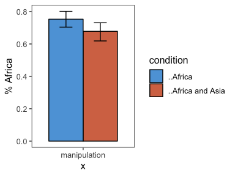

elephants-1-pilot
================
MH Tessler
1/14/2019

### Subject information

| workerid | language      | enjoyment | age | gender | problems                                            | comments                                                                              |
| -------: | :------------ | :-------- | :-- | :----- | :-------------------------------------------------- | :------------------------------------------------------------------------------------ |
|        0 | English       | 0         | 37  | Female | None.                                               |                                                                                       |
|        1 | English       | 0         | 32  | Male   | no                                                  | thanks                                                                                |
|        2 | English       | 0         | 38  | Male   | no                                                  |                                                                                       |
|        3 | English       | 0         | 41  | Male   | no                                                  |                                                                                       |
|        4 | English       | 0         | 34  | Female | no                                                  |                                                                                       |
|        5 | english       | 0         | 55  | Female | no but y memory isn\&quotechart the best anymore :( | I tried my best, please remember all of us have different memory capacities on mturk. |
|        6 | English       | 1         | 59  | Female | no                                                  |                                                                                       |
|        7 | English       | 1         | 34  | Female | No                                                  |                                                                                       |
|        8 | English       | 1         | 24  | Female | No.                                                 |                                                                                       |
|        9 | English       | 0         | 27  | Male   | no                                                  |                                                                                       |
|       10 | English       | 0         | 29  | Male   |                                                     |                                                                                       |
|       11 | English       | 1         | 28  | Male   | None                                                |                                                                                       |
|       12 | English       | 0         | 25  |        |                                                     |                                                                                       |
|       13 | English       | 0         | 50  | Male   | no                                                  | Thanks                                                                                |
|       14 | English       | 1         | 28  | Female | none                                                |                                                                                       |
|       15 | English       | 0         | 29  | Female |                                                     |                                                                                       |
|       16 | United States | 0         | 27  | Male   | No                                                  |                                                                                       |
|       17 | English       | 0         | 27  | Male   |                                                     |                                                                                       |
|       18 | English       | 1         | 28  | Female | None.                                               | None, thanks\!                                                                        |
|       19 | english       | 0         | 28  | Male   | none                                                | none                                                                                  |
|       20 | English       | 0         | 35  | Male   |                                                     |                                                                                       |
|       21 | english       | 0         | 27  | Male   | no issues                                           | no issues                                                                             |
|       22 |               | 99        |     |        |                                                     |                                                                                       |
|       23 | english       | 0         | 24  | Male   |                                                     |                                                                                       |
|       24 | English       | 0         | 30  | Female | no                                                  |                                                                                       |
|       25 | English       | 0         | 44  | Female |                                                     |                                                                                       |

## Attention check

After the story, participants select statements they recall learning
from a list of 10 generic statements about novel animals (5 true, 5
distractor). They are also asked to explain what they did in the
experiment.

### Memory check

<!-- -->

| workerid | correct\_rejections | hits | n\_correct |
| -------: | ------------------: | ---: | ---------: |
|        0 |                   5 |    4 |          9 |
|        1 |                   4 |    4 |          8 |
|        2 |                   4 |    3 |          7 |
|        3 |                   5 |    3 |          8 |
|        4 |                   4 |    3 |          7 |
|        5 |                   5 |    3 |          8 |
|        6 |                   5 |    4 |          9 |
|        7 |                   5 |    2 |          7 |
|        8 |                   5 |    4 |          9 |
|        9 |                   5 |    4 |          9 |
|       10 |                   4 |    3 |          7 |
|       11 |                   5 |    4 |          9 |
|       12 |                   2 |    2 |          4 |
|       13 |                   3 |    2 |          5 |
|       14 |                   5 |    4 |          9 |
|       15 |                   3 |    2 |          5 |
|       16 |                   5 |    3 |          8 |
|       17 |                   5 |    4 |          9 |
|       18 |                   3 |    4 |          7 |
|       19 |                   5 |    5 |         10 |
|       20 |                   5 |    5 |         10 |
|       21 |                   5 |    4 |          9 |
|       22 |                   5 |    3 |          8 |
|       23 |                   3 |    3 |          6 |
|       24 |                   5 |    4 |          9 |
|       25 |                   4 |    4 |          8 |

### Explanations of task

| workerid | explanation                                                                                                                                                                                                                                 |
| -------: | :------------------------------------------------------------------------------------------------------------------------------------------------------------------------------------------------------------------------------------------ |
|        0 |                                                                                                                                                                                                                                             |
|        1 | I read a story about an alien planet and answered questions about it                                                                                                                                                                        |
|        2 |                                                                                                                                                                                                                                             |
|        3 | read page after page hoping to remember details that made no sense                                                                                                                                                                          |
|        4 | I answered questions about what certain amount of percentage enjoys doing a certain activity.                                                                                                                                               |
|        5 | Read a story with alien-like language and answered questions about it.                                                                                                                                                                      |
|        6 | I read a story about a planet and its denizens and answered questions about these creatures and their habits.                                                                                                                               |
|        7 | I read a story and answered questions based on it.                                                                                                                                                                                          |
|        8 | I read a story book about aliens and answers questions about what percentage of a certain species did a certain action.                                                                                                                     |
|        9 | I read facts about certain species and was then asked a question regarding the percentage about something such as what percentage do I suppose of species x do y?                                                                           |
|       10 |                                                                                                                                                                                                                                             |
|       11 | Read a story and answered questions periodically throughout.                                                                                                                                                                                |
|       12 |                                                                                                                                                                                                                                             |
|       13 | Raring certain aspects of a story on how we feel about it                                                                                                                                                                                   |
|       14 | read a story and rate the likelihood of certain things                                                                                                                                                                                      |
|       15 |                                                                                                                                                                                                                                             |
|       16 | I remembered facts about fictional races with fictional names, and tried to figure out what % of each race did what                                                                                                                         |
|       17 | I read a story about another planet and answered questions about life on it                                                                                                                                                                 |
|       18 | I read a story about a planet that is somewhat similar to Earth and answered some questions about what I read along the way.                                                                                                                |
|       19 | read a story about another planet and the life that lives there while answering questions                                                                                                                                                   |
|       20 |                                                                                                                                                                                                                                             |
|       21 |                                                                                                                                                                                                                                             |
|       22 | I learned about a population of people that live on a world similar to that of earth, but with different names and creature types; I was asked how likely it was that a certain group of people in the story participated in a said action. |
|       23 |                                                                                                                                                                                                                                             |
|       24 | I made guesses on percentages before I had more information.                                                                                                                                                                                |
|       25 | I read a story book about aliens and answered questions.                                                                                                                                                                                    |

## Trial data

Removing participants who got fewer than 7 correct on memory check.

## participant responses

collapsed across trials

  - fill = number of correct responses on the memory check (out of 10)
  - facet = particiapnts

<!-- -->

## filler trials

two of these used quantifiers (and thus we have strong idea about
literal meaning) - “all aliens love Zorxon” - “no storms (or few) on Dax
result in permanent damage…”

other two are generics about singular properties

<!-- -->

## critical trials (collapsed across item)

<!-- -->

<!-- -->

### By-item averages

<!-- -->
