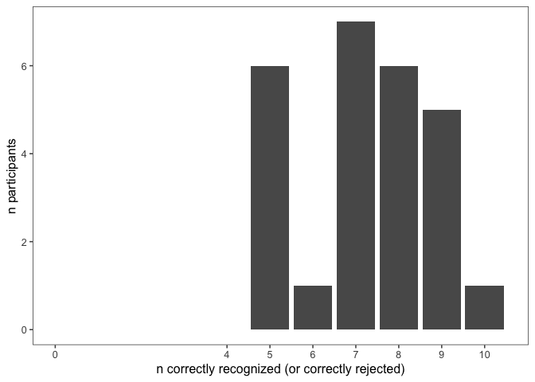
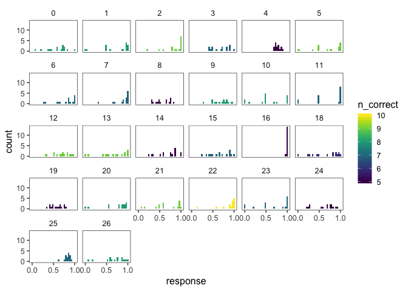
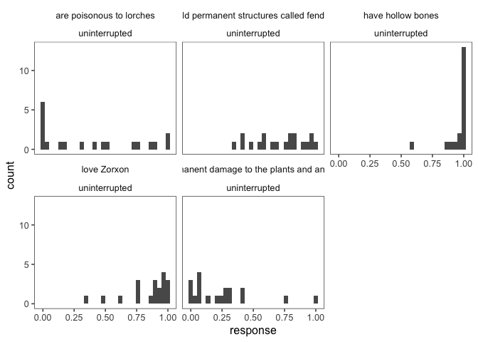
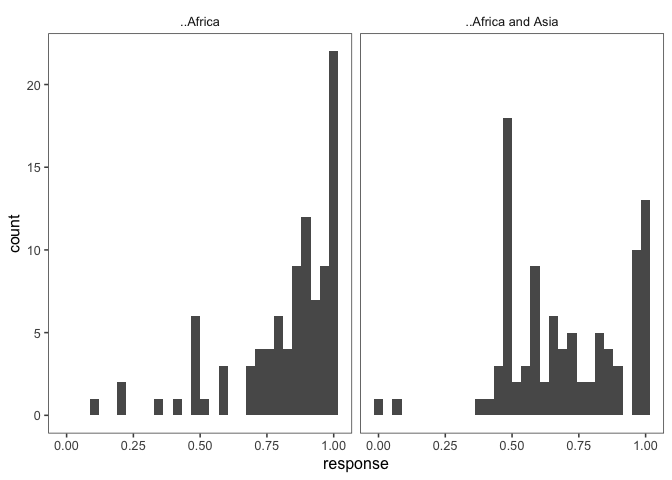
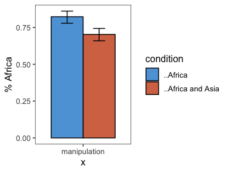
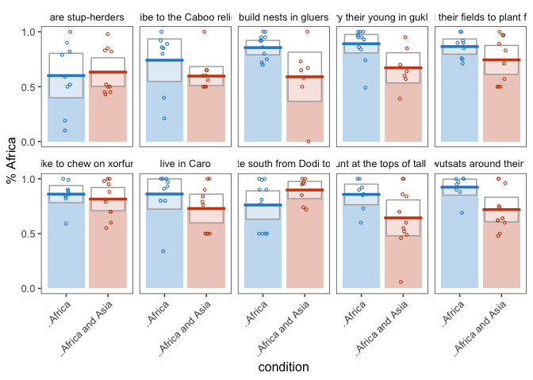
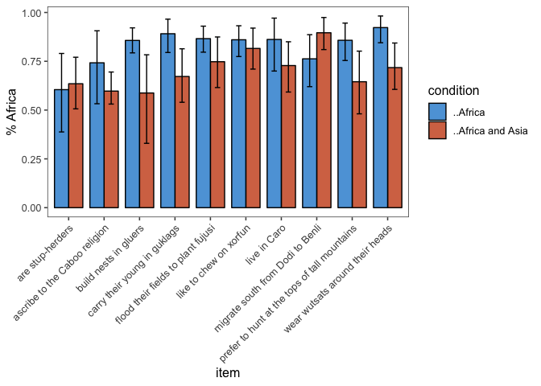
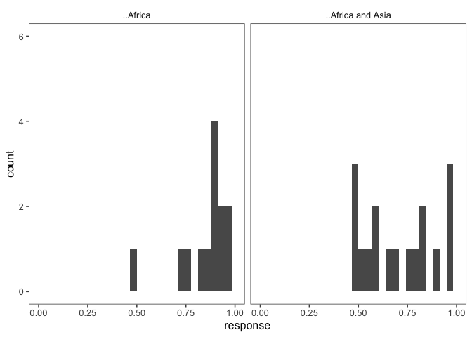
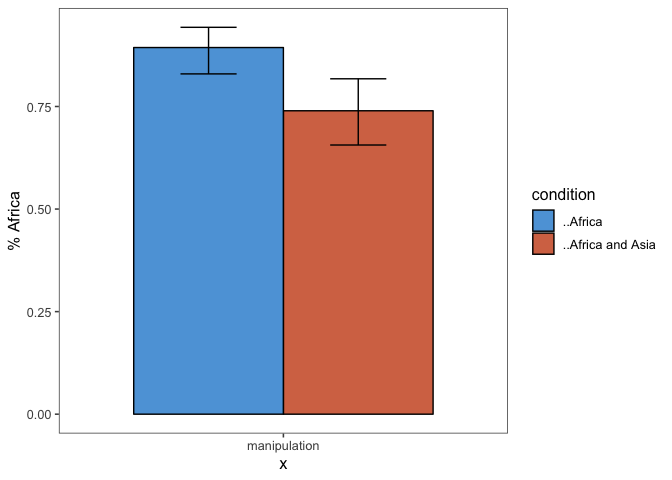

elephants-2-pilot
================
MH Tessler
1/17/2019

[Link to
experiment](http://www.mit.edu/~tessler/projects/elephants/experiments/elephants-2.html)

### Subject information

| workerid | language | enjoyment | age | gender | problems | comments                                                                    |
| -------: | :------- | :-------- | :-- | :----- | :------- | :-------------------------------------------------------------------------- |
|        0 | English  | 0         | 27  | Male   |          |                                                                             |
|        1 | English  | 1         | 37  | Male   | nope     |                                                                             |
|        2 | English  | 0         | 70  | Female | no       |                                                                             |
|        3 | English  | 0         | 30  | Male   |          |                                                                             |
|        4 | English  | 0         | 26  | Male   | none     | Nice Experiment                                                             |
|        5 | English  | 1         | 51  | Female | No       |                                                                             |
|        6 | English  | 1         | 35  | Male   | No       |                                                                             |
|        7 | English  | 1         | 47  | Female | none     | none                                                                        |
|        8 | ENGLISH  | 1         | 41  | Female | NONE     | GOOD I WANT MORE                                                            |
|        9 | english  | 1         | 42  | Male   | no       | Thank you                                                                   |
|       10 | English  | 1         | 35  | Female | No       |                                                                             |
|       11 | english  | 0         | 41  | Male   | No       |                                                                             |
|       12 | english  | 0         | 32  | Male   | Nope     |                                                                             |
|       13 | english  | 0         | 27  | Male   |          |                                                                             |
|       14 | enlgish  | 0         | 23  | Male   | no       |                                                                             |
|       15 | English  | 1         | 24  | Female | no       |                                                                             |
|       16 | ENGLISH  | 1         | 48  | Male   | NO       | GOOD                                                                        |
|       18 | English  | 0         | 25  | Female | No       | Pay was a little low for the amount of time it took to complete this study. |
|       19 |          | 99        |     |        |          |                                                                             |
|       20 | English  | 1         | 43  | Male   | No       | Thanks for the HIT\! I did my best and hope the data is useful\!            |
|       21 | English  | 0         | 38  | Male   | No       |                                                                             |
|       22 | English  | 1         | 32  | Male   | NA       | Great study                                                                 |
|       23 | English  | 0         | 31  | Female |          |                                                                             |
|       24 | English  | 1         | 22  | Female | no       | Very interesting.                                                           |
|       25 | English  | 1         | 30  | Male   | none     | This is some story related survey.                                          |
|       26 | english  | 0         | 34  | Male   | no       |                                                                             |

## Attention check

### Slider practice

Before the experiment, participants practice usign the sliders to rate 3
category–property pairs:

  - dogs bark (coded as correct if x \> 0.5)
  - birds are male (coded as correct if 0.25 \< x \< 0.75)
  - ticks carry lyme disease (coded as correct if x \< 0.50)

Several (9) participants rated % of ticks with Lyme disease as \> 50%
(but got other two slider questions correct). Not excluding anyone using
this metric.

### Memory check

After the story, participants select statements they recall learning
from a list of 10 generic statements about novel animals (5 true, 5
distractor). They are also asked to explain what they did in the
experiment.

<!-- -->

| workerid | correct\_rejections | hits | n\_correct |
| -------: | ------------------: | ---: | ---------: |
|        0 |                   5 |    3 |          8 |
|        1 |                   5 |    3 |          8 |
|        2 |                   4 |    5 |          9 |
|        3 |                   3 |    4 |          7 |
|        4 |                   0 |    5 |          5 |
|        5 |                   5 |    4 |          9 |
|        6 |                   3 |    4 |          7 |
|        7 |                   4 |    3 |          7 |
|        8 |                   2 |    3 |          5 |
|        9 |                   4 |    4 |          8 |
|       10 |                   5 |    3 |          8 |
|       11 |                   3 |    4 |          7 |
|       12 |                   4 |    5 |          9 |
|       13 |                   5 |    4 |          9 |
|       14 |                   3 |    2 |          5 |
|       15 |                   4 |    3 |          7 |
|       16 |                   0 |    5 |          5 |
|       18 |                   3 |    3 |          6 |
|       19 |                   3 |    2 |          5 |
|       20 |                   4 |    4 |          8 |
|       21 |                   5 |    4 |          9 |
|       22 |                   5 |    5 |         10 |
|       23 |                   4 |    3 |          7 |
|       24 |                   0 |    5 |          5 |
|       25 |                   5 |    2 |          7 |
|       26 |                   5 |    3 |          8 |

### Explanations of task

| workerid | explanation                                                                                                                                                                                                                                       |
| -------: | :------------------------------------------------------------------------------------------------------------------------------------------------------------------------------------------------------------------------------------------------ |
|        0 | Skimmed through the pages and tried to remember what I thought were key details that were mentioned per chapter.                                                                                                                                  |
|        1 | tried to guess what percentage of these creatures exhibited certain attributes described vaguely in the text                                                                                                                                      |
|        2 | read a chapter and answered a question on a sliding scale                                                                                                                                                                                         |
|        3 | I read a story about aliens and that made decisions about what I thought about them via sliders.                                                                                                                                                  |
|        4 | No one                                                                                                                                                                                                                                            |
|        5 | I read a story about an alien world and answered probability questions.                                                                                                                                                                           |
|        6 | perception, discovering meaning behind words                                                                                                                                                                                                      |
|        7 | I read the stories and answered the questions based on what I read. Not many of these facts above were in the book though.                                                                                                                        |
|        8 | NICE                                                                                                                                                                                                                                              |
|        9 | I read a short story about aliens and an alien world and answered questions as I went.                                                                                                                                                            |
|       10 | I read chapters about Dox and either remembered or estimated percentages based on what I read.                                                                                                                                                    |
|       11 | Read a story and answered questions about the reading as I interpreted it.                                                                                                                                                                        |
|       12 | I just made some strange assumptions about a fictional land                                                                                                                                                                                       |
|       13 | read chapter about a book that describe another planet and aliens and answer question about the chapter                                                                                                                                           |
|       14 | examined culture of species and answered questions about it                                                                                                                                                                                       |
|       15 | I read chapters on a planet and it gave details and facts on how the aliens live on that planet and we was asked our opinion on each section.                                                                                                     |
|       16 | YES                                                                                                                                                                                                                                               |
|       18 | I read a story about an alien planet and answered questions during the reading.                                                                                                                                                                   |
|       19 | I was making estimates based on the information that I read. I tried my best to recall the facts above as well but my memory isn\&quotechart too great and at times I can forget the information the second I turn the page, I hope this is okay. |
|       20 | I provided ratings of certain characteristics to the aliens and creatures living on the planet.                                                                                                                                                   |
|       21 | I read a short book about the planet that described its various animals and plants.                                                                                                                                                               |
|       22 | I read Chapters and selected what percentage of a certain thing did something.                                                                                                                                                                    |
|       23 | I read a sentence with unfamiliar words/names for creatures and tried to determine whether the sentence was saying ALL creatures did this or SOME, or NONE.                                                                                       |
|       24 | I estimate the existence situation percentage.                                                                                                                                                                                                    |
|       25 | i think this is some learning related book topic and dax story.                                                                                                                                                                                   |
|       26 |                                                                                                                                                                                                                                                   |

## Trial data

Removing participants who got fewer than 7 correct on memory check.

## participant responses

collapsed across trials

  - fill = number of correct responses on the memory check (out of 10)
  - facet = particiapnts

<!-- -->

## filler trials

these used quantifiers (and thus we have strong idea about literal
meaning)

  - “no Xs are poisonous to lorches”
  - “some build permanent structures”
  - “all have hollow bones”
  - “all aliens love Zorxon”
  - “no storms (or few) on Dax result in permanent damage…”

<!-- -->

## critical trials (collapsed across item)

<!-- -->

#### bootstrapped 95% confidence intervals

<!-- -->

### By-item averages

N’s per item X
condition

| predicate\_1                                 | ..Africa | ..Africa and Asia |
| :------------------------------------------- | -------: | ----------------: |
| are stup-herders                             |        9 |                10 |
| ascribe to the Caboo religion                |        8 |                11 |
| build nests in gluers                        |       12 |                 7 |
| carry their young in guklags                 |       12 |                 7 |
| flood their fields to plant fujusi           |        9 |                10 |
| like to chew on xorfun                       |        9 |                10 |
| live in Caro                                 |        9 |                10 |
| migrate south from Dodi to Benli             |       11 |                 8 |
| prefer to hunt at the tops of tall mountains |        8 |                11 |
| wear wutsats around their heads              |        8 |                11 |

Pirate plots

<!-- -->

95% CIs

<!-- -->

By item histograms

## first trial

<!-- -->

<!-- -->
