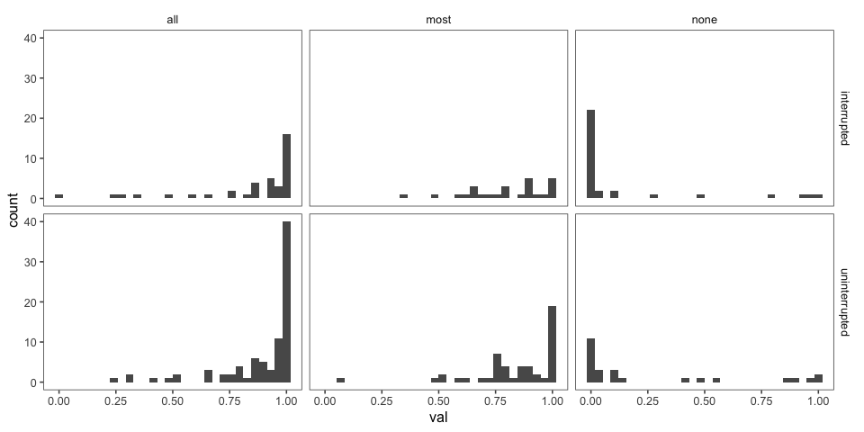
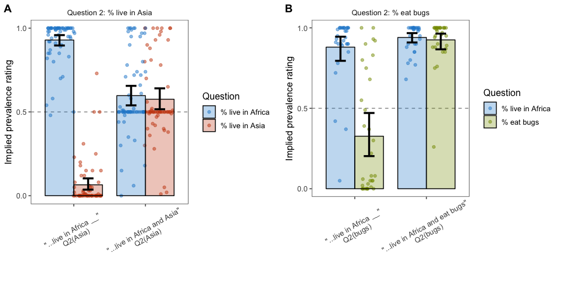

elephants-3i-pilot
================
MH Tessler
1/17/2019

[Link to experiment](http://www.mit.edu/~tessler/projects/elephants/experiments/elephants-3.html)

### Changes from Pilot 3

-   interrupted version of experiment 3 (some trials ask questions mid-chapter)
-   added trials where we ask about non-mutually exclusive properties (NME)
-   randomize order of trials with constraint that no 2 criticals back-to-back

### Subject information

|  workerid| language | enjoyment | age | gender | problems                                                                                                                                                                                                                                                                                                                                                                 | comments                                        |
|---------:|:---------|:----------|:----|:-------|:-------------------------------------------------------------------------------------------------------------------------------------------------------------------------------------------------------------------------------------------------------------------------------------------------------------------------------------------------------------------------|:------------------------------------------------|
|         0| english  | 0         | 29  | Female |                                                                                                                                                                                                                                                                                                                                                                          |                                                 |
|         1| english  | 0         | 25  | Male   | no                                                                                                                                                                                                                                                                                                                                                                       |                                                 |
|         2| English  | 0         | 28  | Female | nothing that i could tell                                                                                                                                                                                                                                                                                                                                                |                                                 |
|         3| English  | 0         | 22  | Male   | None                                                                                                                                                                                                                                                                                                                                                                     |                                                 |
|         4| English  | 1         | 35  | Male   | no                                                                                                                                                                                                                                                                                                                                                                       |                                                 |
|         5| english  | 1         | 28  | Male   | no problems                                                                                                                                                                                                                                                                                                                                                              | good                                            |
|         6| English  | 1         | 27  | Female | none                                                                                                                                                                                                                                                                                                                                                                     | nice survey                                     |
|         7| english  | 0         | 25  | Male   | no                                                                                                                                                                                                                                                                                                                                                                       | ty                                              |
|         8| english  | 1         | 33  | Female | No probelms.                                                                                                                                                                                                                                                                                                                                                             | It was fun, thank you!                          |
|         9| english  | 0         | 35  | Male   | no                                                                                                                                                                                                                                                                                                                                                                       |                                                 |
|        10| english  | 1         | 26  | Female | no problem                                                                                                                                                                                                                                                                                                                                                               | nice                                            |
|        11| english  | 0         | 28  | Female | no                                                                                                                                                                                                                                                                                                                                                                       | nice                                            |
|        12| English  | 0         | 27  | Male   | no                                                                                                                                                                                                                                                                                                                                                                       |                                                 |
|        13| English  | 0         | 55  | Female | no                                                                                                                                                                                                                                                                                                                                                                       |                                                 |
|        14| English  | 0         | 30  | Female | no                                                                                                                                                                                                                                                                                                                                                                       |                                                 |
|        15| English  | 0         | 25  | Male   | no                                                                                                                                                                                                                                                                                                                                                                       | none                                            |
|        16| English  | 0         | 32  | Male   | No general in the experiment                                                                                                                                                                                                                                                                                                                                             | this is very good survey.                       |
|        17| English  | 1         | 32  | Female | no                                                                                                                                                                                                                                                                                                                                                                       |                                                 |
|        18| English  | 0         | 26  | Male   |                                                                                                                                                                                                                                                                                                                                                                          |                                                 |
|        19| english  | 0         | 38  | Male   |                                                                                                                                                                                                                                                                                                                                                                          |                                                 |
|        20| English  | 1         | 34  | Male   | No.                                                                                                                                                                                                                                                                                                                                                                      |                                                 |
|        21| English  | -1        | 27  | Male   |                                                                                                                                                                                                                                                                                                                                                                          |                                                 |
|        22| English  | 1         | 44  | Female | I&quotecharm not positive, but I think a page didn&quotechart display near the beginning. The story talked about how the alien world also had seven continents. The story listed the continents on Earth and it seemed like the alternate continents were then going to be listed, but the story skipped ahead to something else, if I&quotecharm remembering correctly. | No comments                                     |
|        23| English  | 0         | 41  | Female | sometimes the story ended after the questions                                                                                                                                                                                                                                                                                                                            |                                                 |
|        24| english  | 0         | 28  | Male   | none                                                                                                                                                                                                                                                                                                                                                                     | none                                            |
|        25| english  | 1         | 44  | Male   | no                                                                                                                                                                                                                                                                                                                                                                       |                                                 |
|        26| english  | 0         | 28  | Female | no                                                                                                                                                                                                                                                                                                                                                                       | nice experiment and kindly please accept my hit |

Attention check
---------------

### Slider practice

Before the experiment, participants practice usign the sliders to rate 3 category--property pairs:

-   dogs bark (coded as correct if x &gt; 0.5)
-   birds are male (coded as correct if 0.25 &lt; x &lt; 0.75)
-   cats get cancer (coded as correct if x &lt; 0.75)
-   lions lay eggs (coded as correct if x &lt; 0.10)

### Memory check

After the story, participants select statements they recall learning from a list of 10 generic statements about novel animals (5 true, 5 distractor). They are also asked to explain what they did in the experiment.

|  n\_correct|    n|
|-----------:|----:|
|           1|    1|
|           2|    2|
|           3|    3|
|           4|   21|

| property        |  n\_correct|
|:----------------|-----------:|
| birds are male  |          25|
| cats get cancer |          26|
| dogs bark       |          25|
| lions lay eggs  |          22|

### Explanations of task

|  workerid|  n\_slider\_correct|  n\_memory\_correct| explanation                                                                                                                                                              |
|---------:|-------------------:|-------------------:|:-------------------------------------------------------------------------------------------------------------------------------------------------------------------------|
|         0|                   4|                  10| Made judgements about statements based on information                                                                                                                    |
|         1|                   4|                   5| percentage of alien events                                                                                                                                               |
|         2|                   4|                  10| story retention with unusual words                                                                                                                                       |
|         3|                   4|                   9| I read chapters from a story and used the information to infer using sliders the proportion of subjects from the chapter who partake in a certain activity.              |
|         4|                   4|                   7| read a story and tried to remember certain details                                                                                                                       |
|         5|                   4|                   6| asking percentage of a common living and general things                                                                                                                  |
|         6|                   3|                   7| this is about the understanding survey                                                                                                                                   |
|         7|                   4|                   8| idk                                                                                                                                                                      |
|         8|                   4|                   8| I tried to pay attention to key words like  and                                                                                                                          |
|         9|                   4|                   9| read 21 facts about a planet very similar to earth. and were asked question about the facts after having read them.                                                      |
|        10|                   1|                   5| the general terms very experiment                                                                                                                                        |
|        11|                   3|                   4| good provide                                                                                                                                                             |
|        12|                   4|                  10| I read chapters and answered assorted questions based upon what I read about animals/plants on different places.                                                         |
|        13|                   4|                   8| I just read slowly and tried to remember the story.                                                                                                                      |
|        14|                   4|                   7| I tried to remember facts about the story.                                                                                                                               |
|        15|                   4|                   4| read a story about different entities having different traits                                                                                                            |
|        16|                   2|                   5| this is good experiment general and very useful.                                                                                                                         |
|        17|                   4|                   8| I read different chapters and then I had to answer two questions with a percentage slider on what I read                                                                 |
|        18|                   4|                   5| Tried to remember the details of short passages.                                                                                                                         |
|        19|                   4|                   8| Interpretation of given facts to percentages on sliders                                                                                                                  |
|        20|                   4|                   9| I read a story and answered questions about it.                                                                                                                          |
|        21|                   4|                  10| Read about an alien planet and its inhabitants                                                                                                                           |
|        22|                   4|                   8| I read a chapter book that described an alien world full of plants and creatures and answered questions regarding the percentages of certain characteristics and events. |
|        23|                   4|                   6| I read stories of the plants and animals on the planet Dax and answered questions about those stories.                                                                   |
|        24|                   3|                  10| read stories about aliens and answer questions of the likelihood of certain actions.                                                                                     |
|        25|                   4|                   9| answered questions about the aliens and their habitats that I read about                                                                                                 |
|        26|                   2|                   5| judge and learning about the book.                                                                                                                                       |

Subject 12 rated 66% cats get cancer, otherwise seems proficient. In other subjects, attention check mechanisms seem correlated.

Trial data
----------

Removing participants who got fewer than 7 correct on memory check and didn't get all 4 sliders.

participant responses
---------------------

collapsed across trials

-   fill = number of correct responses on the memory check (out of 10)
-   facet = particiapnts

filler trials
-------------

these used quantifiers (and thus we have strong idea about literal meaning)

critical trials (collapsed across item)
---------------------------------------

    ## [1] interrupted       uninterrupted     nme_uninterrupted nme_interrupted  
    ## Levels: interrupted uninterrupted nme_interrupted nme_uninterrupted

#### bootstrapped 95% confidence intervals

### By-item averages

N's per item X condition

| predicate\_1                                   | predicate\_2                                        |  interrupted|  uninterrupted|  nme\_interrupted|  nme\_uninterrupted|
|:-----------------------------------------------|:----------------------------------------------------|------------:|--------------:|-----------------:|-------------------:|
| are part of the Tinno guild                    | are part of the Farza guild                         |            4|             12|                 6|                   6|
| are stup-herders                               | are fishermen                                       |            8|              2|                 8|                   8|
| ascribe to the Caboo religion                  | ascribe to the Daith religion                       |           12|              2|                 4|                   2|
| build nests in gluers                          | build nests in droops                               |            6|             14|                 2|                   2|
| carry their young in guklags                   | carry their young in trullets                       |            2|              8|                NA|                   6|
| chew on xorfun                                 | chew on tunkel                                      |           12|             10|                 4|                   2|
| flood their fields to plant fujusi             | burn their fields to plant soroneeks                |           10|              2|                 4|                   4|
| have four horns                                | have seven horns                                    |            4|             10|                 6|                   4|
| have long wings                                | have short wings                                    |           12|             10|                 4|                   2|
| have six wings                                 | have seven wings                                    |            6|             12|                NA|                   6|
| have striped fur                               | have spotted fur                                    |           14|              2|                 4|                  NA|
| have territories at the tops of tall mountains | have territories at the bottom of deep canyons      |            6|             10|                 6|                   2|
| hibernate in fallen logs                       | hibernate in the abandoned burrows of other animals |           12|             NA|                 8|                   4|
| live on the continent of Caro                  | live on the continent of Este                       |            6|             14|                 2|                   6|
| produce fruit with bumpy skin                  | produce fruit with smooth skin                      |            4|              8|                 4|                   8|
| wear wutsats around their heads                | wear krevnors around their heads                    |           10|             12|                 2|                   2|

### Pirate plots

first trial
-----------

Reaction times
--------------

*how much time do participants spend on the question slide?*

