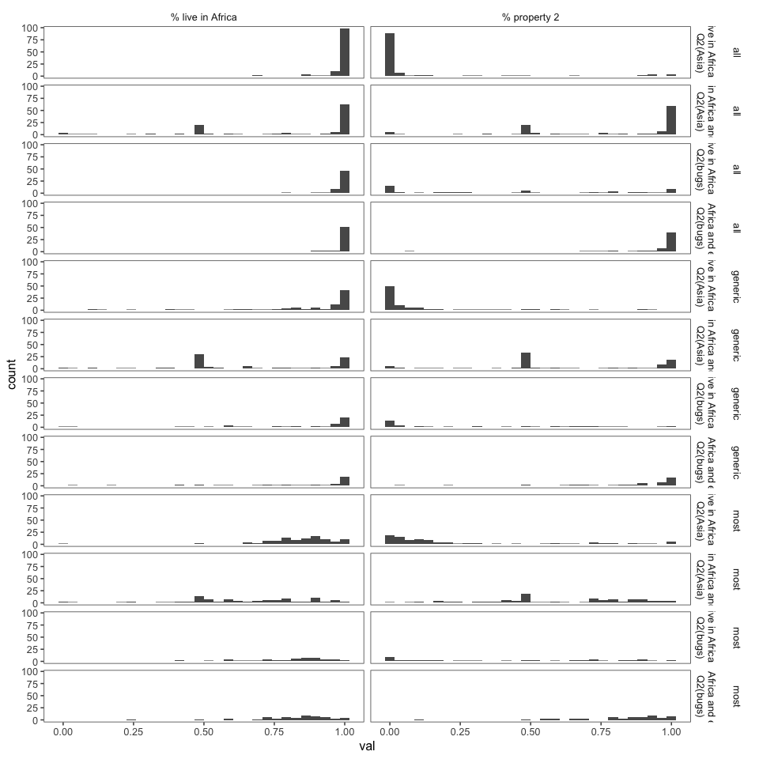

elephants-8-pilot
================
MH Tessler
2/22/2019

[Link to experiment (all condition)](https://www.mit.edu/~karengu/elephants_all/elephants/experiments/elephants-8.html)

### Experiment 8 pilot

-   VP coordination
-   most vs. all vs. some

All questions interrupting.

### Subject information

|  workerid| language   | enjoyment | age | gender | problems                                                                                                                                                      | comments                                                                                                                                                      |
|---------:|:-----------|:----------|:----|:-------|:--------------------------------------------------------------------------------------------------------------------------------------------------------------|:--------------------------------------------------------------------------------------------------------------------------------------------------------------|
|         0| English    | 1         | 36  | Female | no                                                                                                                                                            | Thank you                                                                                                                                                     |
|         1| english    | 0         | 31  | Female |                                                                                                                                                               |                                                                                                                                                               |
|         2| English    | 1         | 52  | Female |                                                                                                                                                               | Thank you                                                                                                                                                     |
|         3| English    | 1         | 63  | Male   | No                                                                                                                                                            | None                                                                                                                                                          |
|         4| english    | 0         | 39  | Male   | no                                                                                                                                                            |                                                                                                                                                               |
|         5| English    | 0         | 25  | Female | No                                                                                                                                                            | A little long for the pay.                                                                                                                                    |
|         6| English    | 0         | 25  | Female | no                                                                                                                                                            | Thanks                                                                                                                                                        |
|         7| english    | 0         | 46  | Female | no                                                                                                                                                            | no                                                                                                                                                            |
|         8| English    | 1         | 45  | Female | no                                                                                                                                                            | thanks                                                                                                                                                        |
|         9| ENGLISH    | 1         | 27  | Male   | NOTHIMG                                                                                                                                                       | NICE                                                                                                                                                          |
|        10| English    | 1         | 30  | Female | No                                                                                                                                                            |                                                                                                                                                               |
|        11| English    | 0         | 31  | Male   | No.                                                                                                                                                           | Somethings I wasn't sure if I read them or not. My memory is unfortunately not the best. I think I did well, but I think I did screw up one or two questions. |
|        12| English    | 0         | 35  | Male   |                                                                                                                                                               |                                                                                                                                                               |
|        13| english    | 0         | 31  | Male   | no                                                                                                                                                            |                                                                                                                                                               |
|        14| English    | 0         | 58  | Male   | no                                                                                                                                                            |                                                                                                                                                               |
|        15| English    | -1        | 65  | Male   | No                                                                                                                                                            |                                                                                                                                                               |
|        16| english    | 1         | 32  | Male   | no                                                                                                                                                            | good                                                                                                                                                          |
|        17| english    | 1         | 30  | Male   | no                                                                                                                                                            |                                                                                                                                                               |
|        18| English    | 1         | 37  | Male   | Some of the chapters were cut off by the questions. The chapter resumed after the question was answered.                                                      | Thank you                                                                                                                                                     |
|        19| English    | 1         | 34  | Male   | No                                                                                                                                                            |                                                                                                                                                               |
|        20| English    | 1         | 28  | Male   | NO                                                                                                                                                            | good                                                                                                                                                          |
|        21| english    | 1         | 28  | Male   | no                                                                                                                                                            | good                                                                                                                                                          |
|        22| English    | 1         | 44  | Male   | no                                                                                                                                                            |                                                                                                                                                               |
|        23| English    | 1         | 31  | Female | No                                                                                                                                                            |                                                                                                                                                               |
|        24| english    | 1         | 28  | Male   | nothing                                                                                                                                                       | good                                                                                                                                                          |
|        25| english    | 1         | 28  | Male   | no                                                                                                                                                            | good                                                                                                                                                          |
|        26| English    | 0         | 23  | Male   | No problems or bugs.                                                                                                                                          | None                                                                                                                                                          |
|        27| English    | 0         | 30  | Female | no                                                                                                                                                            | Maybe specify how long the survey take.                                                                                                                       |
|        28| ENGLISH    | 1         | 28  | Male   | its not have any problem                                                                                                                                      | good                                                                                                                                                          |
|        29| English    | 1         | 29  | Male   | For some of the chapters it would bring me to the page to answer questions before displaying the last page of the chapter to read.                            | Everything was clear.                                                                                                                                         |
|        30| English    | 1         | 44  | Male   | Sometimes there was an extra page after completing a chapter that did not fit in and appeared to be from an alternate version of the previous chapter.        |                                                                                                                                                               |
|        31| English    | 0         | 60  | Female | No                                                                                                                                                            |                                                                                                                                                               |
|        32| English    | 0         | 36  | Female | Sometimes when i would hit the next button it would skip ahead too far.                                                                                       | There should be a back button in case it skips ahead before you get to the questions.                                                                         |
|        33| English    | 1         | 26  | Female | No                                                                                                                                                            |                                                                                                                                                               |
|        34| english    | 0         | 31  | Male   | none                                                                                                                                                          |                                                                                                                                                               |
|        35| english    | 1         | 34  | Female | no                                                                                                                                                            |                                                                                                                                                               |
|        36| english    | 0         | 48  | Female | no                                                                                                                                                            |                                                                                                                                                               |
|        37| English    | 0         | 32  | Male   | No problems for this survey.                                                                                                                                  | very good survey.                                                                                                                                             |
|        38| ehglish    | 0         | 25  | Male   | no                                                                                                                                                            | nothing                                                                                                                                                       |
|        39| English    | -1        | 37  | Male   | No                                                                                                                                                            | This hit is underpaid.                                                                                                                                        |
|        40| English    | -1        | 36  | Male   | No                                                                                                                                                            |                                                                                                                                                               |
|        41| english    | 1         | 49  | Male   | none                                                                                                                                                          |                                                                                                                                                               |
|        42| English    | 0         | 30  | Male   | none                                                                                                                                                          |                                                                                                                                                               |
|        43| English    | 1         | 28  | Female | No                                                                                                                                                            | Nice task and thanks for the Opportunity                                                                                                                      |
|        44| English    | 1         | 23  | Male   | No                                                                                                                                                            | N.A                                                                                                                                                           |
|        45| English    | 0         | 55  | Male   | no                                                                                                                                                            |                                                                                                                                                               |
|        46| English    | 1         | 30  | Female | none                                                                                                                                                          | thanks for your job                                                                                                                                           |
|        47| English    | 0         | 55  | Female |                                                                                                                                                               |                                                                                                                                                               |
|        48| English    | 0         | 41  | Female | no                                                                                                                                                            |                                                                                                                                                               |
|        49| english    | -1        | 27  | Male   | no                                                                                                                                                            | very nice                                                                                                                                                     |
|        50| English    | 0         | 31  | Male   | A few glitches on the pages                                                                                                                                   | None                                                                                                                                                          |
|        51| english    | 0         | 55  | Female | no                                                                                                                                                            | HIT took 14 min, longer than advertised                                                                                                                       |
|        52| English    | 1         | 46  | Female | no problems.                                                                                                                                                  | An interesting study.                                                                                                                                         |
|        53| English    | 0         | 52  | Male   | no                                                                                                                                                            |                                                                                                                                                               |
|        54| English    | 1         | 44  | Female | No                                                                                                                                                            |                                                                                                                                                               |
|        55| english    | 1         | 57  | Male   | no                                                                                                                                                            | interesting                                                                                                                                                   |
|        56| English    | 1         | 26  | Female | Often during a story, it would ask the question related to the chapter then show the last page of the chapter after the question but before the next chapter. |                                                                                                                                                               |
|        57| english    | 0         | 28  | Male   | no                                                                                                                                                            | no                                                                                                                                                            |
|        58| english    | 1         | 33  | Male   | Sometimes, the questions were asked before the section of text was completed.                                                                                 | no                                                                                                                                                            |
|        59| English    | 0         | 27  | Female | No                                                                                                                                                            | N/A                                                                                                                                                           |
|        60| English    | 1         | 27  | Male   | some of the chapter pages appeared after the questions                                                                                                        |                                                                                                                                                               |
|        61| English    | 1         | 35  | Male   | NA                                                                                                                                                            | NA                                                                                                                                                            |
|        62| english    | 1         | 28  | Male   | na                                                                                                                                                            | good                                                                                                                                                          |
|        63| English    | 0         | 40  | Male   | no                                                                                                                                                            |                                                                                                                                                               |
|        64| English    | 0         | 24  | Male   | no.                                                                                                                                                           |                                                                                                                                                               |
|        65| English    | 1         | 35  | Female |                                                                                                                                                               |                                                                                                                                                               |
|        66| English    | 1         | 28  | Male   | No problems here.                                                                                                                                             | Nothing to add, thank you.                                                                                                                                    |
|        67| english    | 0         | 35  | Male   | none                                                                                                                                                          |                                                                                                                                                               |
|        68| english    | 0         | 39  | Male   |                                                                                                                                                               |                                                                                                                                                               |
|        69| english    | 1         | 26  | Male   | no                                                                                                                                                            |                                                                                                                                                               |
|        70| English    | 0         | 31  | Female |                                                                                                                                                               |                                                                                                                                                               |
|        71| ENGLISH    | 0         | 38  | Male   | no                                                                                                                                                            | thanks                                                                                                                                                        |
|        72| English    | 1         | 26  | Male   |                                                                                                                                                               |                                                                                                                                                               |
|        73| US English | 1         | 67  | Male   | Unless it's the alien spelling, there's a typo: quasi-domensticated =)                                                                                        |                                                                                                                                                               |
|        74| English    | 0         | 29  | Male   | no problems                                                                                                                                                   | good                                                                                                                                                          |
|        75| English    | 1         | 29  | Male   | no                                                                                                                                                            |                                                                                                                                                               |
|        76| english    | -1        | 34  | Male   |                                                                                                                                                               |                                                                                                                                                               |
|        77| English    | 1         | 28  | Male   | No                                                                                                                                                            | None.                                                                                                                                                         |
|        78| english    | 0         | 41  | Female | no                                                                                                                                                            |                                                                                                                                                               |
|        79| English    | 0         | 37  | Female | no                                                                                                                                                            | no                                                                                                                                                            |
|        80| English    | 0         | 33  | Female |                                                                                                                                                               |                                                                                                                                                               |
|        81| english    | 1         | 49  | Female | no                                                                                                                                                            |                                                                                                                                                               |
|        82| english    | 0         | 24  | Male   | nothing                                                                                                                                                       | great                                                                                                                                                         |
|        83| english    | 0         | 55  | Male   | I don't think calling them "mooks" is very PC                                                                                                                 |                                                                                                                                                               |
|        84| english    | 0         | 41  | Male   | no                                                                                                                                                            | good                                                                                                                                                          |
|        85| English    | 0         | 38  | Female | no                                                                                                                                                            | nope                                                                                                                                                          |
|        86| English    | 1         | 30  | Female | no                                                                                                                                                            | the exercise was engaging                                                                                                                                     |
|        87| English    | 1         | 40  | Other  | No.                                                                                                                                                           |                                                                                                                                                               |
|        88| English    | -1        | 49  | Female | no                                                                                                                                                            |                                                                                                                                                               |
|        89| ENGLISH    | 0         | 28  | Female | NO                                                                                                                                                            | NICE STUDY                                                                                                                                                    |
|        90| english    | -1        | 28  | Male   | no                                                                                                                                                            | no comments                                                                                                                                                   |
|        91| English    | 0         | 35  | Male   | no                                                                                                                                                            |                                                                                                                                                               |
|        92| English    | 1         | 37  | Male   | No                                                                                                                                                            | None                                                                                                                                                          |
|        93| english    | 1         | 28  | Male   | its not have any problem                                                                                                                                      | good to participate                                                                                                                                           |
|        94| english    | 0         | 55  | Female | no                                                                                                                                                            |                                                                                                                                                               |
|        95| english    | 1         | 31  | Male   | no                                                                                                                                                            | thank you.                                                                                                                                                    |
|        96| English    | 1         | 31  | Male   | no                                                                                                                                                            |                                                                                                                                                               |
|        97| English    | 0         | 26  | Male   | Nothing                                                                                                                                                       | Good task                                                                                                                                                     |
|        98| English    | -1        | 26  | Male   |                                                                                                                                                               |                                                                                                                                                               |
|        99| English    | 0         | 34  | Female | No                                                                                                                                                            |                                                                                                                                                               |
|       100| English    | 1         | 36  | Male   | No                                                                                                                                                            | Have a great day                                                                                                                                              |
|       101| YES        | 0         | 35  | Male   | no                                                                                                                                                            | good                                                                                                                                                          |
|       102| english    | 1         | 30  | Male   | no                                                                                                                                                            | good task this is                                                                                                                                             |
|       103| English    | 0         | 35  | Male   | none                                                                                                                                                          |                                                                                                                                                               |
|       104| English    | 1         | 39  | Male   | No, very smooth                                                                                                                                               |                                                                                                                                                               |
|       105| english    | 1         | 31  | Female | no                                                                                                                                                            |                                                                                                                                                               |
|       106| English    | 1         | 23  | Male   |                                                                                                                                                               |                                                                                                                                                               |
|       107| english    | 0         | 24  | Male   | nothing                                                                                                                                                       | great                                                                                                                                                         |

Attention check
---------------

### Slider practice

Before the experiment, participants practice usign the sliders to rate 3 category--property pairs:

-   dogs bark (coded as correct if x &gt; 0.5)
-   birds are male (coded as correct if 0.25 &lt; x &lt; 0.75)
-   cats get cancer (coded as correct if x &lt; 0.75) \[being generous with this one\]
-   lions lay eggs (coded as correct if x &lt; 0.10)

|  n\_correct|    n|
|-----------:|----:|
|           1|    1|
|           2|    7|
|           3|   21|
|           4|   78|
|          NA|    1|

| property        |  n\_correct|
|:----------------|-----------:|
| birds are male  |         100|
| cats get cancer |         103|
| dogs bark       |         103|
| lions lay eggs  |          86|

A greater number of participants failed on the "lions lay eggs" check. Considering their explanations, this seems to be simply because the range of accepted responses for "lions lay eggs" is smaller. Most of the explanations didn't seem to convey that the participant had actually paid attention.

| property.x     |  response.x|  workerid| property.y                                                                                                         |
|:---------------|-----------:|---------:|:-------------------------------------------------------------------------------------------------------------------|
| lions lay eggs |        0.79|         9| RATING TO THE GIVEN STORY                                                                                          |
| lions lay eggs |        0.43|        12| It was interesting.                                                                                                |
| lions lay eggs |        0.55|        16| it was really good                                                                                                 |
| lions lay eggs |        0.29|        21| i just read the instructions and questions the i answer it.                                                        |
| lions lay eggs |        0.80|        24| this experiment about the animal                                                                                   |
| lions lay eggs |        0.19|        25| i read the a story book about animals and aliens on a far away planet and i read the all question the i answer it. |
| lions lay eggs |        0.40|        27| To see how well y=we pay attention to the short stories.                                                           |
| lions lay eggs |        0.66|        28| i saw the instructions and answer the question                                                                     |
| lions lay eggs |        0.58|        37| very good survey.                                                                                                  |
| lions lay eggs |        0.44|        38| nice work                                                                                                          |
| lions lay eggs |        0.11|        43| How People describe facts                                                                                          |
| lions lay eggs |        0.20|        49| very nice i very accept                                                                                            |
| lions lay eggs |        0.85|        57| no                                                                                                                 |
| lions lay eggs |        0.74|        62| i just read the chapters and i gave the answers with full attention                                                |
| lions lay eggs |        0.51|        67| none                                                                                                               |
| lions lay eggs |        0.75|        74| There was different paragraph                                                                                      |
| lions lay eggs |        0.70|        82| its nice                                                                                                           |
| lions lay eggs |        0.61|        84| good survey                                                                                                        |
| lions lay eggs |        0.92|        90| no comments                                                                                                        |
| lions lay eggs |        0.69|        92| I did experiment with close attention and answer the questions.                                                    |
| lions lay eggs |        0.64|        93| i saw the instructions and answer the questions                                                                    |
| lions lay eggs |        0.53|        95| Read facts about aliens and their habitats then guessed the percentages of certain facts.                          |
| lions lay eggs |        0.10|        97| Good                                                                                                               |
| lions lay eggs |        0.51|        98| read a history with 21 chapters and rate                                                                           |
| lions lay eggs |        0.33|       101| psychologist survey                                                                                                |
| lions lay eggs |        0.41|       107| its good experience                                                                                                |

### Memory check

After the story, participants select statements they recall learning from a list of 10 generic statements about novel animals (5 true, 5 distractor). They are also asked to explain what they did in the experiment.

### Explanations of task

|  workerid|  n\_slider\_correct|  n\_memory\_correct| explanation                                                                                                                                                                                                                                  |
|---------:|-------------------:|-------------------:|:---------------------------------------------------------------------------------------------------------------------------------------------------------------------------------------------------------------------------------------------|
|         0|                   4|                  10| I had to read chapters and answer a couple of questions of what I read per chapter.                                                                                                                                                          |
|         1|                   4|                   9| I answered questions about an alien world                                                                                                                                                                                                    |
|         2|                   4|                   8| Read about aliens and their continent, and then had to remember what we read.                                                                                                                                                                |
|         3|                   4|                   9| I read the story and answered questions about each chapter.                                                                                                                                                                                  |
|         4|                   4|                   8| i read a story about an alien plant which included details about the creatures residing there.                                                                                                                                               |
|         5|                   4|                   8| I tried to remember if it said the verb included 'all' or 'some' of the creatures or items that were being described.                                                                                                                        |
|         6|                   4|                   8| Read a story and then rated the percentage in statements about the story                                                                                                                                                                     |
|         7|                   4|                   8| read the story and answered questions                                                                                                                                                                                                        |
|         8|                   4|                  10| Read short chapters about aliens and answered questions after each chapter.                                                                                                                                                                  |
|         9|                   3|                   5| RATING TO THE GIVEN STORY                                                                                                                                                                                                                    |
|        10|                   4|                   7| Study about The Planet Dax by Noxroz, offspring of Zorxon                                                                                                                                                                                    |
|        11|                   4|                   9| I read about different animals and plants on Dax. I then answered questions based on what I read about in that section.                                                                                                                      |
|        12|                   2|                   6| It was interesting.                                                                                                                                                                                                                          |
|        13|                   4|                   8| I read passages and memorized them in order to answer questions about each passage later on.                                                                                                                                                 |
|        14|                   4|                   5| I read 21 drawn-out chapters about the planet Dax and its inhabitants.                                                                                                                                                                       |
|        15|                   4|                   7| I read about the characteristics of different creatures who lived on another planet and had to answer what percentage of these creatures did a certain thing.                                                                                |
|        16|                   2|                   3| it was really good                                                                                                                                                                                                                           |
|        17|                   4|                   6| I based percentages based on the stories.                                                                                                                                                                                                    |
|        18|                   4|                   9| I read about an alien planets tribes, animals, and agriculture. Then answered questions relating to what was in the story.                                                                                                                   |
|        19|                   4|                   8| Read a story about an alien planet similar to Earth and then answered questions about it after every chapter.                                                                                                                                |
|        20|                   4|                   5| its something different task to remember                                                                                                                                                                                                     |
|        21|                   3|                   3| i just read the instructions and questions the i answer it.                                                                                                                                                                                  |
|        22|                   4|                   8| I read a story about alien life on different planet and the animals that live there.                                                                                                                                                         |
|        23|                   4|                   8| I was supposed to be introduced to the aliens, plants and animals on Dax and understand their characteristics                                                                                                                                |
|        24|                   3|                   4| this experiment about the animal                                                                                                                                                                                                             |
|        25|                   3|                   4| i read the a story book about animals and aliens on a far away planet and i read the all question the i answer it.                                                                                                                           |
|        26|                   4|                   7| Read a short story about aliens, what they do, situations, etc and answers 2 questions about it.                                                                                                                                             |
|        27|                   2|                   8| To see how well y=we pay attention to the short stories.                                                                                                                                                                                     |
|        28|                   3|                   7| i saw the instructions and answer the question                                                                                                                                                                                               |
|        29|                   4|                   8| I read a story about aliens and answered two questions about each chapter after reading each chapter.                                                                                                                                        |
|        30|                   4|                   7| Read chapters from a book about aliens and answered questions.                                                                                                                                                                               |
|        31|                   4|                   8| I paid attention to terms such as "all" or "often" to determine the characteristics.                                                                                                                                                         |
|        32|                   4|                   8| I tried to remember the facts from the story and answer the questions that followed.                                                                                                                                                         |
|        33|                   4|                  10| I read an alien book and answered questions about my thoughts/understanding of the text.                                                                                                                                                     |
|        34|                   3|                   8| I tried to answer in terms of percentages the answer to question based on an alien story.                                                                                                                                                    |
|        35|                   4|                   9| Read a story about aliens and answered questions about it.                                                                                                                                                                                   |
|        36|                   4|                   9| I read a story and answered questions about it                                                                                                                                                                                               |
|        37|                   3|                   4| very good survey.                                                                                                                                                                                                                            |
|        38|                   2|                   8| nice work                                                                                                                                                                                                                                    |
|        39|                   4|                   8| Reviewed explanations of an alien planet and answered questions.                                                                                                                                                                             |
|        40|                   4|                  10| I answered questions about a short story                                                                                                                                                                                                     |
|        41|                   4|                   9| Read the stories and estimated the percentages from the stories read about aliens.                                                                                                                                                           |
|        42|                   4|                   7| read a story and answered questions                                                                                                                                                                                                          |
|        43|                   4|                   8| How People describe facts                                                                                                                                                                                                                    |
|        44|                   4|                   5| I read 21 short passages on the various species of creatures and then answered what I thought was the percentage of those creatures from the species who followed a specific trait or feature of the species.                                |
|        45|                   4|                   8| I read facts about an alien planet and answered questions.                                                                                                                                                                                   |
|        46|                   4|                   8| read a fictional story and answer questions from the told story                                                                                                                                                                              |
|        47|                   4|                   9| Read about aliens and their different lifestyles, likes and dislikes.                                                                                                                                                                        |
|        48|                   4|                  10| I tried to remember odd details and then estimate how often I thought it happened.                                                                                                                                                           |
|        49|                   3|                   6| very nice i very accept                                                                                                                                                                                                                      |
|        50|                   4|                   9| I tried to memorize facts about different aliens (which I had trouble doing)                                                                                                                                                                 |
|        51|                   4|                   6| just tried to keep nonsense words and definitions clear in my mind and it was tough                                                                                                                                                          |
|        52|                   4|                   8| I read a story about an alien planet and the people and animals that live there. We earned about where the creatures live and what characteristics they have.                                                                                |
|        53|                   4|                   8| I was carefully reading the book chapters and tried my best answering the questions.                                                                                                                                                         |
|        54|                   4|                  10| answered the questions about what percentages of aliens did a particular thing after reading the chapters                                                                                                                                    |
|        55|                   4|                   8| remember percentage of facts                                                                                                                                                                                                                 |
|        56|                   4|                  10| I read about different types of alien life and culture                                                                                                                                                                                       |
|        57|                   1|                   5| no                                                                                                                                                                                                                                           |
|        58|                   4|                  10| It was mostly learning about and answering questions about different alien races and how they live on the contients of the planet                                                                                                            |
|        59|                   4|                   7| Read passages about an alien planet and answered questions using a sliding scale from 1 to 100.                                                                                                                                              |
|        60|                   4|                   8| I just tried to remember the facts that stuck out and how many of the creature did that                                                                                                                                                      |
|        61|                   4|                   8| I read the book and answered questions giving my estimation of how much/little certain questions were in agreement with selected passages from the book.                                                                                     |
|        62|                   3|                   3| i just read the chapters and i gave the answers with full attention                                                                                                                                                                          |
|        63|                   4|                   7| read a story about aliens on another planet and answered questions about them                                                                                                                                                                |
|        64|                   4|                   9| Predicted what aliens did                                                                                                                                                                                                                    |
|        65|                   4|                   8| I read chapters of a story about aliens and then answered questions about how likely I thought it was that something about the story was true.                                                                                               |
|        66|                   4|                  10| I read a series of stories about aliens inhabitants and learned their characteristics and habits.                                                                                                                                            |
|        67|                   3|                   6| none                                                                                                                                                                                                                                         |
|        68|                   4|                   9| I read a passage about aliens. Then I was given a task the rate the probability of two characteristics of the aliens.                                                                                                                        |
|        69|                   4|                   9| Read short passages and answered questions with estimations                                                                                                                                                                                  |
|        70|                   4|                   8| tested my reading comprehension                                                                                                                                                                                                              |
|        71|                   4|                   9| read some information about an alien planet and answered questions involving percentages                                                                                                                                                     |
|        72|                   4|                   8| I tried to substitute with familiar animals, words, place                                                                                                                                                                                    |
|        73|                   3|                  10| I tried very hard to follow the thought of each fully-justified and frequently fractured paragraph thru the slider quizzes. And, unless it's the alien spelling, I also found a typo: quasi-domensticated                                    |
|        74|                   3|                   7| There was different paragraph                                                                                                                                                                                                                |
|        75|                   4|                   8| I read a book about planet Dax and had to recall facts about the planet.                                                                                                                                                                     |
|        76|                   4|                   6| I read several paragraphs of tedious nonsense, delivered in annoying blocks that were partially finished, clicking to continue. then I had to answer question s about the percentages of different things I thought applied to the nonsense. |
|        77|                   4|                   9| I read a story about a planet that was similar to earth but with aliens. The planet had an overlord. The story described the habits of the aliens, the animals on the planet, and the plant life on the planet.                              |
|        78|                   4|                   8| read and gave % to questions                                                                                                                                                                                                                 |
|        79|                   4|                   8| I just tried to remember the most prominent characteristics.                                                                                                                                                                                 |
|        80|                   4|                  10| I read a story while occasionally answer questions on sliding scales.                                                                                                                                                                        |
|        81|                   4|                   8| I tried to associate the creatures with known creatures so I could understand them better.                                                                                                                                                   |
|        82|                   2|                   6| its nice                                                                                                                                                                                                                                     |
|        83|                   4|                  10| I read a story about aliens and answered questions about some of the facts on them.                                                                                                                                                          |
|        84|                   3|                   5| good survey                                                                                                                                                                                                                                  |
|        85|                   4|                  10| I read the story and attempted to answer the questions with my best estimates.                                                                                                                                                               |
|        86|                   4|                   8| Study of aliens                                                                                                                                                                                                                              |
|        87|                   4|                  10| Try to understand the alien environment contextually, without having everything spelled out for me.                                                                                                                                          |
|        88|                   4|                   6| I just tried to remember the story                                                                                                                                                                                                           |
|        89|                   4|                   8| I DID THE EXPERIMENT FROM THE GIVEN CHAPTER                                                                                                                                                                                                  |
|        90|                   2|                   5| no comments                                                                                                                                                                                                                                  |
|        91|                   4|                   9| Read several "chapters" of a book about an alien planet and answered 2 questions after each chapter.                                                                                                                                         |
|        92|                   3|                   6| I did experiment with close attention and answer the questions.                                                                                                                                                                              |
|        93|                   3|                   7| i saw the instructions and answer the questions                                                                                                                                                                                              |
|        94|                   4|                  10| read a story and answered questions throughout                                                                                                                                                                                               |
|        95|                   2|                   6| Read facts about aliens and their habitats then guessed the percentages of certain facts.                                                                                                                                                    |
|        96|                   4|                   6| said percentages                                                                                                                                                                                                                             |
|        97|                   3|                   6| Good                                                                                                                                                                                                                                         |
|        98|                   3|                   8| read a history with 21 chapters and rate                                                                                                                                                                                                     |
|        99|                  NA|                   4| Learn about Dax                                                                                                                                                                                                                              |
|       100|                   4|                  10| I read about different alien animals and answered questions about them.                                                                                                                                                                      |
|       101|                   3|                   5| psychologist survey                                                                                                                                                                                                                          |
|       102|                   3|                   2| no i cannot pay the attention in this study                                                                                                                                                                                                  |
|       103|                   3|                   5| I adjusted the slider to what I felt different probability were                                                                                                                                                                              |
|       104|                   4|                   8| Read a story about an alien planet with seven continents. Learned about the different species of inhabitants.                                                                                                                                |
|       105|                   4|                   8| remembered details of a story                                                                                                                                                                                                                |
|       106|                   4|                   9| Read a story about a bunch of alien planets and their inhabitants and then learned facts about them.                                                                                                                                         |
|       107|                   3|                   3| its good experience                                                                                                                                                                                                                          |

Memory check questions seem off:

    ## [1] 36

Trial data
----------

Check number of participants per condition

| predicate\_1                                   |  all|  generic|  most|
|:-----------------------------------------------|----:|--------:|-----:|
| are part of the Tinnoclan                      |   13|        9|    12|
| are stup-herders                               |    7|       13|    12|
| ascribe to Cabooism                            |   10|       14|     7|
| build nests in gluers                          |   11|       14|    11|
| carry their young in guklags                   |   10|        5|    13|
| chew on xorfun bark                            |   11|        9|     4|
| have long wings                                |   12|       13|    10|
| have territories at the tops of tall mountains |   13|       11|    15|
| hibernate in fallen logs                       |   13|        7|    13|
| live on the continent of Caro                  |   11|       10|     8|
| plant fujusi                                   |   10|       12|    14|
| produce fruit with bumpy skin                  |   10|       18|    15|
| wear wutsats around their heads                |   13|        9|    10|

| quantifier |    n|
|:-----------|----:|
| all        |  144|
| generic    |  144|
| most       |  144|

Removing participants who didn't get all 4 sliders. (All participants with bad explanations failed one or more sliders.)

Included/excluded subject numbers

| memory\_fail | slider\_fail |    n|
|:-------------|:-------------|----:|
| FALSE        | FALSE        |   78|
| FALSE        | TRUE         |   30|

participant responses
---------------------

collapsed across trials

-   fill = number of correct responses on the memory check (out of 10)
-   facet = particiapnts

filler trials
-------------

these used quantifiers (and thus we have strong idea about literal meaning)

    ## [1] "...live in Africa __"\nQ2(Asia)          
    ## [2] "...live in Africa __"\nQ2(bugs)          
    ## [3] "...live in Africa and Asia"\nQ2(Asia)    
    ## [4] "...live in Africa and eat bugs"\nQ2(bugs)
    ## 4 Levels: "...live in Africa __"\nQ2(Asia) ...

    ## # A tibble: 24 x 9
    ## # Groups:   quantifier, condition [12]
    ##    quantifier condition key       n empirical_stat ci_lower  mean ci_upper
    ##    <chr>      <fct>     <fct> <int>          <dbl>    <dbl> <dbl>    <dbl>
    ##  1 all        "\"...li % li   116          0.986   0.977  0.986    0.994
    ##  2 all        "\"...li % pr   116          0.103   0.0545 0.102    0.153
    ##  3 all        "\"...li % li   116          0.79    0.735  0.790    0.844
    ##  4 all        "\"...li % pr   116          0.791   0.741  0.792    0.842
    ##  5 generic    "\"...li % li    92          0.868   0.824  0.869    0.911
    ##  6 generic    "\"...li % pr    92          0.123   0.0802 0.123    0.171
    ##  7 generic    "\"...li % li    92          0.662   0.603  0.662    0.716
    ##  8 generic    "\"...li % pr    92          0.612   0.549  0.612    0.677
    ##  9 most       "\"...li % li   104          0.835   0.808  0.835    0.861
    ## 10 most       "\"...li % pr   104          0.268   0.207  0.268    0.330
    ## #  with 14 more rows, and 1 more variable: second_query <chr>

By-item analysis
================

| predicate\_1                                   |  all|  generic|  most|
|:-----------------------------------------------|----:|--------:|-----:|
| are part of the Tinnoclan                      |   12|        4|    10|
| are stup-herders                               |    6|        8|     8|
| ascribe to Cabooism                            |    7|        8|     6|
| build nests in gluers                          |    9|        9|    11|
| carry their young in guklags                   |    9|        5|    10|
| chew on xorfun bark                            |    7|        8|     1|
| have long wings                                |   10|        8|     6|
| have territories at the tops of tall mountains |   11|        8|    11|
| hibernate in fallen logs                       |    9|        5|    10|
| live on the continent of Caro                  |    8|        4|     4|
| plant fujusi                                   |    8|        8|    11|
| produce fruit with bumpy skin                  |    9|       11|    10|
| wear wutsats around their heads                |   11|        6|     6|

| quantifier |    n|
|:-----------|----:|
| all        |  116|
| generic    |   92|
| most       |  104|

Pirate plots by item
--------------------

### Histograms by Item

