Variable Coordination
================
Karen Gu
9/6/2019

## Variable Coordination Level Experiment

Analysis for variable coordination level experiment across 2 pilots.
Pre-processing for the pilots are contained in
`elephants-coord-20200414.Rmd` and `elephants-coord-20200427.Rmd`,
respectively. The experiment for Pilot 1 can be found in
`experiments/legacy/elephants-coord-20200414.html`. The experiment for
Pilot 2 can be found in `experiments/elephants-coord.html`.

[Link to
Pilot 2](https://www.mit.edu/~karengu/elephants_expt1_single_samescreen/elephants/experiments/elephants-12.html)

We’ll load the data in csv format, which is the output from the
pre-processing files.

## Filler Trials

These used quantifiers (and thus we have strong idea about literal
meaning). Overall, it looks like participants understand the
experimental task (close to 1 for “all”, above .5 for “most”, and close
to 0 for “none”).

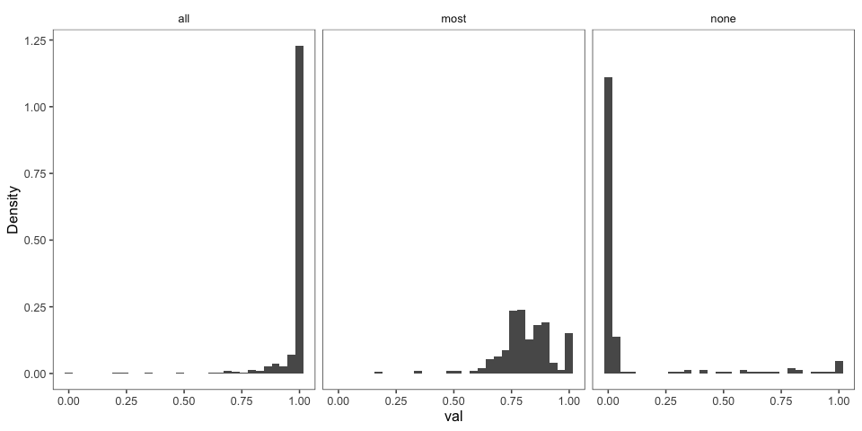<!-- -->

## Critical Trials

### Predicate A only

First we perform analyses while only looking at predicate A. For Pilot
1, participants are only asked about predicate A. For Pilot 2,
participants are asked both about predicate A and about a contrasting
predicate, but we only look at the data for the first predicate (which
may appear before or after the other predicate due to randomization of
conjunct order and question order).

#### Histograms of Prevalence Estimates by Condition (collapsed across item)

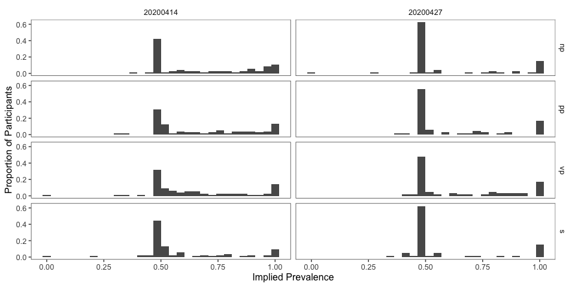<!-- -->

#### 95% Boostrapped CIs

##### Pilot 1 (used in AMLaP abstract)

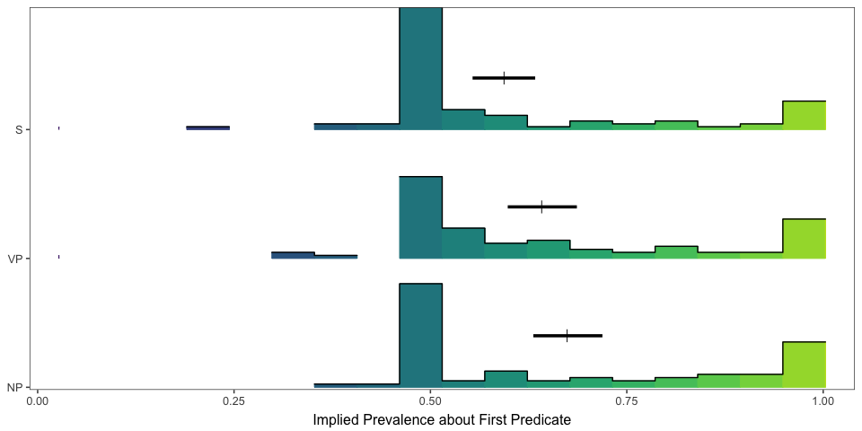<!-- -->

Comparing all conditions to S-coordination as the base level, we see
that the CIs all intersect 0.

    ##  Family: gaussian 
    ##   Links: mu = identity; sigma = identity 
    ## Formula: val ~ condition + (1 + condition | workerid) + (1 + condition | predicate_1) 
    ##    Data: model.data.original (Number of observations: 253) 
    ## Samples: 4 chains, each with iter = 2000; warmup = 1000; thin = 1;
    ##          total post-warmup samples = 4000
    ## 
    ## Group-Level Effects: 
    ## ~predicate_1 (Number of levels: 11) 
    ##                              Estimate Est.Error l-95% CI u-95% CI Rhat Bulk_ESS
    ## sd(Intercept)                    0.04      0.02     0.00     0.09 1.00     1074
    ## sd(conditionnp)                  0.05      0.04     0.00     0.13 1.00     1249
    ## sd(conditionpp)                  0.03      0.02     0.00     0.09 1.00     2267
    ## sd(conditionvp)                  0.07      0.04     0.00     0.16 1.00     1237
    ## cor(Intercept,conditionnp)      -0.33      0.43    -0.93     0.64 1.00     2122
    ## cor(Intercept,conditionpp)      -0.05      0.45    -0.82     0.79 1.00     4262
    ## cor(conditionnp,conditionpp)     0.03      0.44    -0.79     0.80 1.00     4653
    ## cor(Intercept,conditionvp)       0.02      0.43    -0.77     0.81 1.00     2276
    ## cor(conditionnp,conditionvp)    -0.07      0.44    -0.83     0.76 1.00     2188
    ## cor(conditionpp,conditionvp)     0.01      0.45    -0.82     0.80 1.00     2136
    ##                              Tail_ESS
    ## sd(Intercept)                    1515
    ## sd(conditionnp)                  1456
    ## sd(conditionpp)                  2135
    ## sd(conditionvp)                  1441
    ## cor(Intercept,conditionnp)       2798
    ## cor(Intercept,conditionpp)       2687
    ## cor(conditionnp,conditionpp)     3184
    ## cor(Intercept,conditionvp)       2332
    ## cor(conditionnp,conditionvp)     2984
    ## cor(conditionpp,conditionvp)     3045
    ## 
    ## ~workerid (Number of levels: 23) 
    ##                              Estimate Est.Error l-95% CI u-95% CI Rhat Bulk_ESS
    ## sd(Intercept)                    0.14      0.03     0.09     0.20 1.00     1181
    ## sd(conditionnp)                  0.04      0.03     0.00     0.12 1.01      686
    ## sd(conditionpp)                  0.05      0.03     0.00     0.12 1.00     1258
    ## sd(conditionvp)                  0.05      0.04     0.00     0.13 1.01      938
    ## cor(Intercept,conditionnp)      -0.03      0.42    -0.79     0.75 1.00     3954
    ## cor(Intercept,conditionpp)       0.22      0.38    -0.61     0.85 1.00     4004
    ## cor(conditionnp,conditionpp)     0.02      0.44    -0.81     0.81 1.00     2136
    ## cor(Intercept,conditionvp)      -0.03      0.41    -0.77     0.76 1.00     3719
    ## cor(conditionnp,conditionvp)     0.09      0.45    -0.77     0.85 1.00     1676
    ## cor(conditionpp,conditionvp)     0.06      0.44    -0.79     0.82 1.00     2588
    ##                              Tail_ESS
    ## sd(Intercept)                    1702
    ## sd(conditionnp)                  1296
    ## sd(conditionpp)                  1758
    ## sd(conditionvp)                  1420
    ## cor(Intercept,conditionnp)       2949
    ## cor(Intercept,conditionpp)       2754
    ## cor(conditionnp,conditionpp)     2492
    ## cor(Intercept,conditionvp)       2575
    ## cor(conditionnp,conditionvp)     2792
    ## cor(conditionpp,conditionvp)     3137
    ## 
    ## Population-Level Effects: 
    ##             Estimate Est.Error l-95% CI u-95% CI Rhat Bulk_ESS Tail_ESS
    ## Intercept       0.59      0.04     0.51     0.67 1.00      956     1596
    ## conditionnp     0.03      0.04    -0.05     0.10 1.00     3098     2911
    ## conditionpp     0.04      0.03    -0.02     0.11 1.00     3290     3030
    ## conditionvp     0.05      0.04    -0.03     0.14 1.00     2535     2464
    ## 
    ## Family Specific Parameters: 
    ##       Estimate Est.Error l-95% CI u-95% CI Rhat Bulk_ESS Tail_ESS
    ## sigma     0.15      0.01     0.14     0.17 1.00     2537     2888
    ## 
    ## Samples were drawn using sampling(NUTS). For each parameter, Bulk_ESS
    ## and Tail_ESS are effective sample size measures, and Rhat is the potential
    ## scale reduction factor on split chains (at convergence, Rhat = 1).

##### Pilot 2

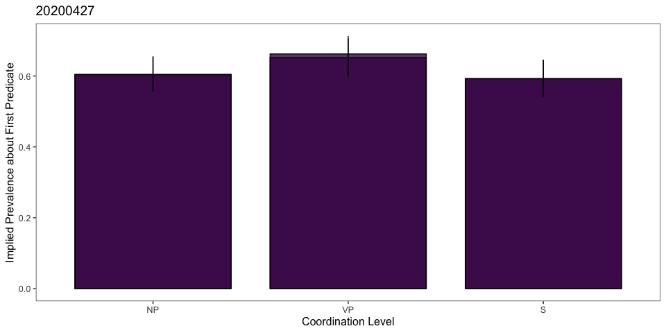<!-- -->

Coding S as the base level and only considering responses for the first
conjunct, Pilot 2 shows no effect of coordination level on prevalence
judgements.

    ##  Family: gaussian 
    ##   Links: mu = identity; sigma = identity 
    ## Formula: val ~ condition + (1 + condition | workerid) + (1 + condition | predicate_1) 
    ##    Data: model.data.rep (Number of observations: 253) 
    ## Samples: 4 chains, each with iter = 2000; warmup = 1000; thin = 1;
    ##          total post-warmup samples = 4000
    ## 
    ## Group-Level Effects: 
    ## ~predicate_1 (Number of levels: 11) 
    ##                              Estimate Est.Error l-95% CI u-95% CI Rhat Bulk_ESS
    ## sd(Intercept)                    0.04      0.02     0.00     0.09 1.00      995
    ## sd(conditionnp)                  0.05      0.04     0.00     0.13 1.00     1279
    ## sd(conditionpp)                  0.03      0.02     0.00     0.09 1.00     2495
    ## sd(conditionvp)                  0.07      0.04     0.00     0.16 1.00     1235
    ## cor(Intercept,conditionnp)      -0.35      0.44    -0.94     0.67 1.00     2129
    ## cor(Intercept,conditionpp)      -0.07      0.46    -0.85     0.79 1.00     4983
    ## cor(conditionnp,conditionpp)     0.03      0.45    -0.80     0.83 1.00     4332
    ## cor(Intercept,conditionvp)       0.03      0.43    -0.75     0.81 1.00     2453
    ## cor(conditionnp,conditionvp)    -0.07      0.43    -0.83     0.73 1.00     2700
    ## cor(conditionpp,conditionvp)     0.02      0.45    -0.80     0.83 1.00     1851
    ##                              Tail_ESS
    ## sd(Intercept)                    1510
    ## sd(conditionnp)                  1712
    ## sd(conditionpp)                  1774
    ## sd(conditionvp)                  1877
    ## cor(Intercept,conditionnp)       2447
    ## cor(Intercept,conditionpp)       2734
    ## cor(conditionnp,conditionpp)     3294
    ## cor(Intercept,conditionvp)       2789
    ## cor(conditionnp,conditionvp)     3069
    ## cor(conditionpp,conditionvp)     3055
    ## 
    ## ~workerid (Number of levels: 23) 
    ##                              Estimate Est.Error l-95% CI u-95% CI Rhat Bulk_ESS
    ## sd(Intercept)                    0.14      0.03     0.09     0.20 1.00     1583
    ## sd(conditionnp)                  0.04      0.03     0.00     0.12 1.00     1566
    ## sd(conditionpp)                  0.05      0.03     0.00     0.12 1.00     1420
    ## sd(conditionvp)                  0.05      0.04     0.00     0.13 1.00     1238
    ## cor(Intercept,conditionnp)      -0.03      0.41    -0.77     0.75 1.00     5373
    ## cor(Intercept,conditionpp)       0.21      0.39    -0.61     0.86 1.00     3493
    ## cor(conditionnp,conditionpp)     0.02      0.44    -0.80     0.81 1.00     2767
    ## cor(Intercept,conditionvp)      -0.03      0.41    -0.79     0.76 1.00     4606
    ## cor(conditionnp,conditionvp)     0.09      0.45    -0.78     0.84 1.00     2274
    ## cor(conditionpp,conditionvp)     0.04      0.44    -0.78     0.80 1.00     2595
    ##                              Tail_ESS
    ## sd(Intercept)                    2340
    ## sd(conditionnp)                  2116
    ## sd(conditionpp)                  1981
    ## sd(conditionvp)                  1780
    ## cor(Intercept,conditionnp)       3050
    ## cor(Intercept,conditionpp)       2689
    ## cor(conditionnp,conditionpp)     3105
    ## cor(Intercept,conditionvp)       2503
    ## cor(conditionnp,conditionvp)     2701
    ## cor(conditionpp,conditionvp)     3191
    ## 
    ## Population-Level Effects: 
    ##             Estimate Est.Error l-95% CI u-95% CI Rhat Bulk_ESS Tail_ESS
    ## Intercept       0.59      0.04     0.52     0.67 1.00     1436     2128
    ## conditionnp     0.03      0.04    -0.05     0.10 1.00     3561     2958
    ## conditionpp     0.04      0.03    -0.03     0.11 1.00     3382     2926
    ## conditionvp     0.05      0.04    -0.03     0.13 1.00     2940     2652
    ## 
    ## Family Specific Parameters: 
    ##       Estimate Est.Error l-95% CI u-95% CI Rhat Bulk_ESS Tail_ESS
    ## sigma     0.15      0.01     0.14     0.17 1.00     3769     2933
    ## 
    ## Samples were drawn using sampling(NUTS). For each parameter, Bulk_ESS
    ## and Tail_ESS are effective sample size measures, and Rhat is the potential
    ## scale reduction factor on split chains (at convergence, Rhat = 1).

#### By-item

##### Pilot 1

There is considerable item-wise variability. The predicted pattern is
observed (numerically) for two predicates: 1. chew on xorfun 2. have
territories at the tops of tall mountains Ignoring NP-coordination
(which may be a special case due to group predication), the predicted
pattern is also observed for two more predicates: 1. ascribe to the
Caboo religion 2. live on the continent of Caro

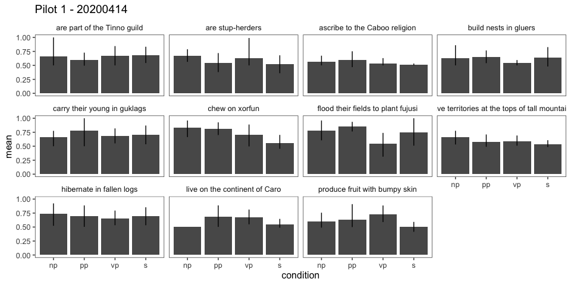<!-- -->

##### Pilot 2

Again, there is high item-wise variability. The predicted pattern is
observed for 2 predicates: 1. have territories at the tops of tall
mountains (replicating above) 2. produce fruit with bumpy skin The other
pattern (ignoring NP-coordination) is not observed for any of the items.

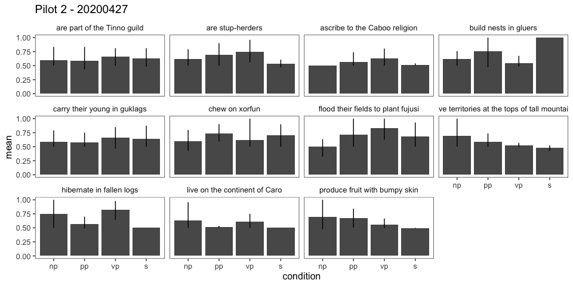<!-- -->

### Conjunct A and B (20200427 only)

We’ll see if there are any systematic differences in participants’
responses to the first conjunct vs. the second conjunct. This is only
possible for Pilot 2, since participants provide a response for both
conjuncts (conjunct order and question order randomized across trial).

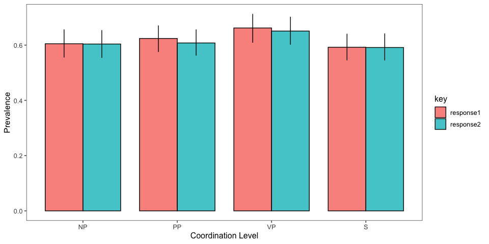<!-- -->

Predicting prevalence across both conjuncts (20200427), with
S-coordination as the base level, there is no effect of the conjunct.

    ##  Family: gaussian 
    ##   Links: mu = identity; sigma = identity 
    ## Formula: val ~ condition * key + (1 + condition | workerid) + (1 + condition | predicate_1) 
    ##    Data: model.data.rep (Number of observations: 506) 
    ## Samples: 4 chains, each with iter = 2000; warmup = 1000; thin = 1;
    ##          total post-warmup samples = 4000
    ## 
    ## Group-Level Effects: 
    ## ~predicate_1 (Number of levels: 11) 
    ##                              Estimate Est.Error l-95% CI u-95% CI Rhat Bulk_ESS
    ## sd(Intercept)                    0.07      0.02     0.04     0.13 1.00     1189
    ## sd(conditionnp)                  0.09      0.03     0.04     0.18 1.00     1219
    ## sd(conditionpp)                  0.04      0.03     0.00     0.10 1.00     1214
    ## sd(conditionvp)                  0.09      0.04     0.02     0.18 1.00     1069
    ## cor(Intercept,conditionnp)      -0.67      0.23    -0.96    -0.09 1.00     1888
    ## cor(Intercept,conditionpp)      -0.33      0.42    -0.92     0.63 1.00     2335
    ## cor(conditionnp,conditionpp)     0.26      0.42    -0.64     0.89 1.00     2702
    ## cor(Intercept,conditionvp)      -0.22      0.34    -0.76     0.51 1.00     2119
    ## cor(conditionnp,conditionvp)     0.15      0.36    -0.59     0.76 1.00     1880
    ## cor(conditionpp,conditionvp)     0.03      0.43    -0.79     0.82 1.00     1020
    ##                              Tail_ESS
    ## sd(Intercept)                    2168
    ## sd(conditionnp)                  1547
    ## sd(conditionpp)                  1988
    ## sd(conditionvp)                   923
    ## cor(Intercept,conditionnp)       2174
    ## cor(Intercept,conditionpp)       2724
    ## cor(conditionnp,conditionpp)     2915
    ## cor(Intercept,conditionvp)       2807
    ## cor(conditionnp,conditionvp)     2460
    ## cor(conditionpp,conditionvp)     1862
    ## 
    ## ~workerid (Number of levels: 23) 
    ##                              Estimate Est.Error l-95% CI u-95% CI Rhat Bulk_ESS
    ## sd(Intercept)                    0.14      0.03     0.09     0.20 1.00     1171
    ## sd(conditionnp)                  0.04      0.03     0.00     0.10 1.01      806
    ## sd(conditionpp)                  0.05      0.03     0.00     0.10 1.01     1252
    ## sd(conditionvp)                  0.08      0.03     0.01     0.15 1.01      651
    ## cor(Intercept,conditionnp)      -0.03      0.39    -0.73     0.77 1.00     3612
    ## cor(Intercept,conditionpp)       0.35      0.34    -0.39     0.90 1.00     2774
    ## cor(conditionnp,conditionpp)     0.15      0.44    -0.71     0.87 1.00     1552
    ## cor(Intercept,conditionvp)      -0.06      0.31    -0.61     0.55 1.00     2292
    ## cor(conditionnp,conditionvp)     0.16      0.44    -0.73     0.86 1.01      679
    ## cor(conditionpp,conditionvp)     0.21      0.41    -0.67     0.85 1.01      968
    ##                              Tail_ESS
    ## sd(Intercept)                    2300
    ## sd(conditionnp)                  1318
    ## sd(conditionpp)                  1500
    ## sd(conditionvp)                   499
    ## cor(Intercept,conditionnp)       2873
    ## cor(Intercept,conditionpp)       2365
    ## cor(conditionnp,conditionpp)     2512
    ## cor(Intercept,conditionvp)       2345
    ## cor(conditionnp,conditionvp)     1510
    ## cor(conditionpp,conditionvp)     1712
    ## 
    ## Population-Level Effects: 
    ##                          Estimate Est.Error l-95% CI u-95% CI Rhat Bulk_ESS
    ## Intercept                    0.60      0.04     0.51     0.68 1.00      867
    ## conditionnp                  0.03      0.04    -0.05     0.11 1.00     1365
    ## conditionpp                  0.04      0.03    -0.03     0.10 1.00     1997
    ## conditionvp                  0.05      0.05    -0.03     0.14 1.00     1655
    ## keyresponse2                -0.00      0.03    -0.05     0.05 1.00     1714
    ## conditionnp:keyresponse2    -0.00      0.04    -0.07     0.07 1.00     2109
    ## conditionpp:keyresponse2    -0.02      0.04    -0.09     0.05 1.00     1978
    ## conditionvp:keyresponse2    -0.01      0.04    -0.08     0.06 1.00     2196
    ##                          Tail_ESS
    ## Intercept                    1150
    ## conditionnp                  1665
    ## conditionpp                  2600
    ## conditionvp                  2304
    ## keyresponse2                 2419
    ## conditionnp:keyresponse2     2836
    ## conditionpp:keyresponse2     2548
    ## conditionvp:keyresponse2     2848
    ## 
    ## Family Specific Parameters: 
    ##       Estimate Est.Error l-95% CI u-95% CI Rhat Bulk_ESS Tail_ESS
    ## sigma     0.14      0.01     0.13     0.15 1.00     2200     2798
    ## 
    ## Samples were drawn using sampling(NUTS). For each parameter, Bulk_ESS
    ## and Tail_ESS are effective sample size measures, and Rhat is the potential
    ## scale reduction factor on split chains (at convergence, Rhat = 1).

### Collapsed across experiment, conjunct

Here we collapse across both pilots and both conjuncts for Pilot 2.

#### Collapsed across predicate

Collapsing across both experiments gives an effect of coordination (S
vs. PP).

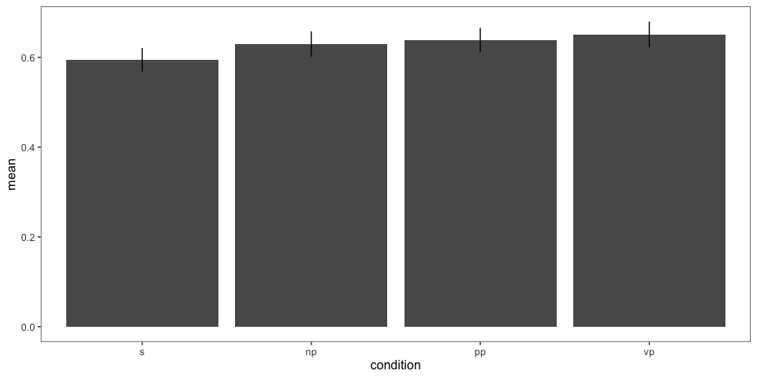<!-- -->

    ##  Family: gaussian 
    ##   Links: mu = identity; sigma = identity 
    ## Formula: val ~ condition + (1 + condition | workerid) + (1 + condition | predicate_1) 
    ##    Data: model.data.collapsed (Number of observations: 814) 
    ## Samples: 4 chains, each with iter = 2000; warmup = 1000; thin = 1;
    ##          total post-warmup samples = 4000
    ## 
    ## Group-Level Effects: 
    ## ~predicate_1 (Number of levels: 11) 
    ##                              Estimate Est.Error l-95% CI u-95% CI Rhat Bulk_ESS
    ## sd(Intercept)                    0.06      0.02     0.03     0.10 1.00     1482
    ## sd(conditionnp)                  0.03      0.02     0.00     0.07 1.00     1573
    ## sd(conditionpp)                  0.03      0.02     0.00     0.09 1.00     1135
    ## sd(conditionvp)                  0.03      0.02     0.00     0.07 1.00     1723
    ## cor(Intercept,conditionnp)      -0.29      0.41    -0.90     0.65 1.00     3635
    ## cor(Intercept,conditionpp)      -0.11      0.40    -0.79     0.69 1.00     3583
    ## cor(conditionnp,conditionpp)     0.00      0.45    -0.82     0.80 1.00     2582
    ## cor(Intercept,conditionvp)       0.00      0.42    -0.76     0.77 1.00     4620
    ## cor(conditionnp,conditionvp)     0.17      0.44    -0.73     0.88 1.00     2714
    ## cor(conditionpp,conditionvp)    -0.03      0.44    -0.82     0.78 1.00     3231
    ##                              Tail_ESS
    ## sd(Intercept)                    2573
    ## sd(conditionnp)                  1900
    ## sd(conditionpp)                  1157
    ## sd(conditionvp)                  2115
    ## cor(Intercept,conditionnp)       2852
    ## cor(Intercept,conditionpp)       2460
    ## cor(conditionnp,conditionpp)     3030
    ## cor(Intercept,conditionvp)       3091
    ## cor(conditionnp,conditionvp)     3299
    ## cor(conditionpp,conditionvp)     3592
    ## 
    ## ~workerid (Number of levels: 51) 
    ##                              Estimate Est.Error l-95% CI u-95% CI Rhat Bulk_ESS
    ## sd(Intercept)                    0.11      0.02     0.08     0.14 1.00     1300
    ## sd(conditionnp)                  0.03      0.02     0.00     0.08 1.00      849
    ## sd(conditionpp)                  0.06      0.02     0.01     0.10 1.01      834
    ## sd(conditionvp)                  0.08      0.03     0.03     0.13 1.00      817
    ## cor(Intercept,conditionnp)      -0.00      0.41    -0.77     0.78 1.00     3671
    ## cor(Intercept,conditionpp)       0.37      0.30    -0.26     0.86 1.00     1676
    ## cor(conditionnp,conditionpp)     0.13      0.43    -0.73     0.84 1.00     1115
    ## cor(Intercept,conditionvp)      -0.09      0.25    -0.53     0.45 1.00     1734
    ## cor(conditionnp,conditionvp)     0.06      0.43    -0.75     0.82 1.01      344
    ## cor(conditionpp,conditionvp)     0.02      0.37    -0.72     0.70 1.00      636
    ##                              Tail_ESS
    ## sd(Intercept)                    2211
    ## sd(conditionnp)                  1385
    ## sd(conditionpp)                   793
    ## sd(conditionvp)                   843
    ## cor(Intercept,conditionnp)       2753
    ## cor(Intercept,conditionpp)       2353
    ## cor(conditionnp,conditionpp)     2044
    ## cor(Intercept,conditionvp)       1925
    ## cor(conditionnp,conditionvp)     1064
    ## cor(conditionpp,conditionvp)     1690
    ## 
    ## Population-Level Effects: 
    ##             Estimate Est.Error l-95% CI u-95% CI Rhat Bulk_ESS Tail_ESS
    ## Intercept       0.60      0.03     0.55     0.65 1.00     1284     2049
    ## conditionnp     0.04      0.02     0.00     0.08 1.00     3354     3034
    ## conditionpp     0.05      0.02     0.01     0.09 1.00     2874     2866
    ## conditionvp     0.04      0.02    -0.01     0.09 1.00     3176     2718
    ## 
    ## Family Specific Parameters: 
    ##       Estimate Est.Error l-95% CI u-95% CI Rhat Bulk_ESS Tail_ESS
    ## sigma     0.16      0.00     0.15     0.17 1.00     3079     2888
    ## 
    ## Samples were drawn using sampling(NUTS). For each parameter, Bulk_ESS
    ## and Tail_ESS are effective sample size measures, and Rhat is the potential
    ## scale reduction factor on split chains (at convergence, Rhat = 1).

#### By-item

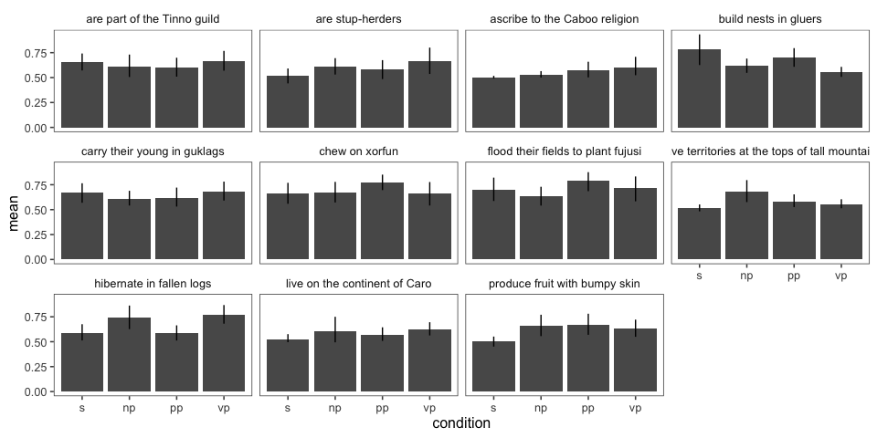<!-- -->

#### Comparing S vs. all other levels

Collapsing all other coordination levels (across pilot) does not produce
an effect of coordination.

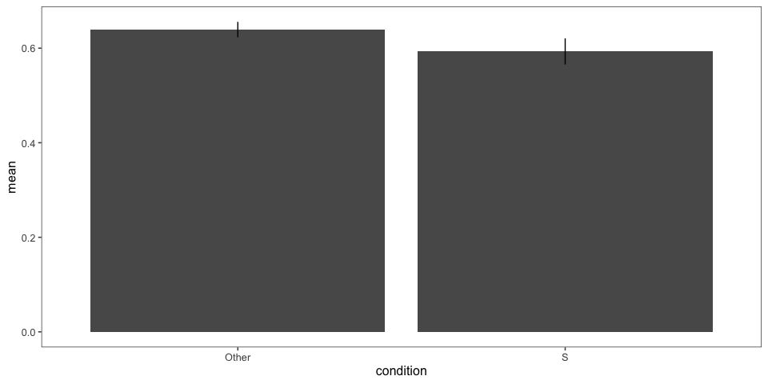<!-- -->

    ##  Family: gaussian 
    ##   Links: mu = identity; sigma = identity 
    ## Formula: val ~ condition + (1 + condition | workerid) + (1 + condition | predicate_1) 
    ##    Data: model.data.collapsed.s.onehot (Number of observations: 814) 
    ## Samples: 4 chains, each with iter = 2000; warmup = 1000; thin = 1;
    ##          total post-warmup samples = 4000
    ## 
    ## Group-Level Effects: 
    ## ~predicate_1 (Number of levels: 11) 
    ##                           Estimate Est.Error l-95% CI u-95% CI Rhat Bulk_ESS
    ## sd(Intercept)                 0.05      0.02     0.03     0.09 1.00     1711
    ## sd(conditionS)                0.04      0.02     0.00     0.09 1.00     1231
    ## cor(Intercept,conditionS)     0.25      0.48    -0.77     0.96 1.00     3715
    ##                           Tail_ESS
    ## sd(Intercept)                 2667
    ## sd(conditionS)                1882
    ## cor(Intercept,conditionS)     2143
    ## 
    ## ~workerid (Number of levels: 51) 
    ##                           Estimate Est.Error l-95% CI u-95% CI Rhat Bulk_ESS
    ## sd(Intercept)                 0.12      0.01     0.09     0.15 1.00     1188
    ## sd(conditionS)                0.04      0.02     0.00     0.09 1.00     1052
    ## cor(Intercept,conditionS)    -0.46      0.36    -0.96     0.47 1.00     2734
    ##                           Tail_ESS
    ## sd(Intercept)                 2036
    ## sd(conditionS)                1469
    ## cor(Intercept,conditionS)     2023
    ## 
    ## Population-Level Effects: 
    ##            Estimate Est.Error l-95% CI u-95% CI Rhat Bulk_ESS Tail_ESS
    ## Intercept      0.64      0.02     0.60     0.69 1.00     1087     1589
    ## conditionS    -0.04      0.02    -0.08    -0.00 1.00     3065     2415
    ## 
    ## Family Specific Parameters: 
    ##       Estimate Est.Error l-95% CI u-95% CI Rhat Bulk_ESS Tail_ESS
    ## sigma     0.16      0.00     0.15     0.17 1.00     4571     2720
    ## 
    ## Samples were drawn using sampling(NUTS). For each parameter, Bulk_ESS
    ## and Tail_ESS are effective sample size measures, and Rhat is the potential
    ## scale reduction factor on split chains (at convergence, Rhat = 1).

### Mutually Exclusive Interpretations (20200427 only)

Now we try to assess the extent to which participants interpreted the
predicates as mutually exclusive. This is easier to do for Pilot 2 since
we have data on both predicates. We first assess mutual exclusivity both
numerically by the total prevalence = prevalence1 + prevalence 2. The
lower the total prevalence, the higher the degree of mutual exclusivity.

Total prevalence is highest in the VP-coordinated condition, although
this difference is small.

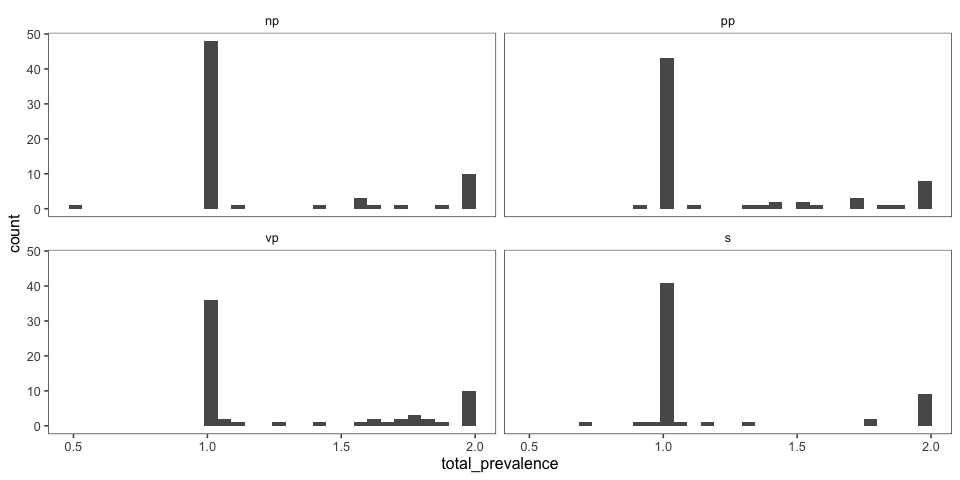<!-- -->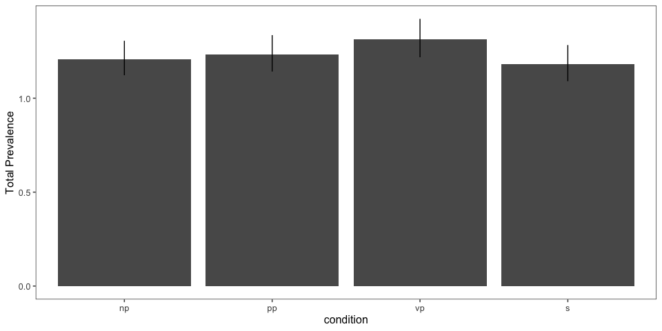<!-- -->

    ##  Family: gaussian 
    ##   Links: mu = identity; sigma = identity 
    ## Formula: total_prevalence ~ condition + (1 + condition | workerid) + (1 + condition | predicate_1) 
    ##    Data: model.data.me (Number of observations: 253) 
    ## Samples: 4 chains, each with iter = 2000; warmup = 1000; thin = 1;
    ##          total post-warmup samples = 4000
    ## 
    ## Group-Level Effects: 
    ## ~predicate_1 (Number of levels: 11) 
    ##                              Estimate Est.Error l-95% CI u-95% CI Rhat Bulk_ESS
    ## sd(Intercept)                    0.10      0.05     0.01     0.22 1.00      957
    ## sd(conditionnp)                  0.11      0.07     0.01     0.27 1.00     1048
    ## sd(conditionpp)                  0.06      0.05     0.00     0.19 1.00     1805
    ## sd(conditionvp)                  0.13      0.08     0.01     0.33 1.00     1280
    ## cor(Intercept,conditionnp)      -0.43      0.40    -0.95     0.53 1.00     2009
    ## cor(Intercept,conditionpp)      -0.11      0.45    -0.87     0.78 1.00     3697
    ## cor(conditionnp,conditionpp)     0.06      0.45    -0.77     0.85 1.00     3127
    ## cor(Intercept,conditionvp)       0.03      0.42    -0.74     0.80 1.00     2262
    ## cor(conditionnp,conditionvp)    -0.00      0.43    -0.80     0.76 1.00     2203
    ## cor(conditionpp,conditionvp)    -0.04      0.45    -0.82     0.80 1.00     1720
    ##                              Tail_ESS
    ## sd(Intercept)                    1093
    ## sd(conditionnp)                  1598
    ## sd(conditionpp)                  2184
    ## sd(conditionvp)                  1769
    ## cor(Intercept,conditionnp)       2791
    ## cor(Intercept,conditionpp)       2706
    ## cor(conditionnp,conditionpp)     2988
    ## cor(Intercept,conditionvp)       2574
    ## cor(conditionnp,conditionvp)     2770
    ## cor(conditionpp,conditionvp)     3127
    ## 
    ## ~workerid (Number of levels: 23) 
    ##                              Estimate Est.Error l-95% CI u-95% CI Rhat Bulk_ESS
    ## sd(Intercept)                    0.27      0.05     0.18     0.39 1.00     1141
    ## sd(conditionnp)                  0.06      0.04     0.00     0.16 1.00     1509
    ## sd(conditionpp)                  0.07      0.05     0.00     0.19 1.00     1592
    ## sd(conditionvp)                  0.10      0.07     0.00     0.25 1.01      730
    ## cor(Intercept,conditionnp)      -0.03      0.44    -0.82     0.78 1.00     4323
    ## cor(Intercept,conditionpp)       0.24      0.41    -0.65     0.89 1.00     3305
    ## cor(conditionnp,conditionpp)     0.07      0.45    -0.77     0.84 1.00     2091
    ## cor(Intercept,conditionvp)      -0.02      0.40    -0.75     0.76 1.00     3442
    ## cor(conditionnp,conditionvp)     0.05      0.45    -0.81     0.84 1.00     1865
    ## cor(conditionpp,conditionvp)     0.08      0.45    -0.78     0.83 1.00     2058
    ##                              Tail_ESS
    ## sd(Intercept)                    1967
    ## sd(conditionnp)                  1004
    ## sd(conditionpp)                  1664
    ## sd(conditionvp)                  1519
    ## cor(Intercept,conditionnp)       2516
    ## cor(Intercept,conditionpp)       2706
    ## cor(conditionnp,conditionpp)     2917
    ## cor(Intercept,conditionvp)       2588
    ## cor(conditionnp,conditionvp)     2544
    ## cor(conditionpp,conditionvp)     2963
    ## 
    ## Population-Level Effects: 
    ##             Estimate Est.Error l-95% CI u-95% CI Rhat Bulk_ESS Tail_ESS
    ## Intercept       1.18      0.08     1.03     1.34 1.00      952     1676
    ## conditionnp     0.06      0.07    -0.08     0.20 1.00     2451     2391
    ## conditionpp     0.07      0.06    -0.05     0.19 1.00     3090     3086
    ## conditionvp     0.10      0.08    -0.05     0.26 1.00     2667     2592
    ## 
    ## Family Specific Parameters: 
    ##       Estimate Est.Error l-95% CI u-95% CI Rhat Bulk_ESS Tail_ESS
    ## sigma     0.29      0.01     0.26     0.32 1.00     2548     3089
    ## 
    ## Samples were drawn using sampling(NUTS). For each parameter, Bulk_ESS
    ## and Tail_ESS are effective sample size measures, and Rhat is the potential
    ## scale reduction factor on split chains (at convergence, Rhat = 1).

We also assess mutual exclusivity as a binary variable, classifying an
interpretation as mutually exclusive if the total prevalence does not
exceed 1.2 (to allow for some fuzziness).

    ##  Family: bernoulli 
    ##   Links: mu = logit 
    ## Formula: me ~ condition + (1 + condition | workerid) + (1 + condition | predicate_1) 
    ##    Data: model.data.me (Number of observations: 253) 
    ## Samples: 4 chains, each with iter = 2000; warmup = 1000; thin = 1;
    ##          total post-warmup samples = 4000
    ## 
    ## Group-Level Effects: 
    ## ~predicate_1 (Number of levels: 11) 
    ##                              Estimate Est.Error l-95% CI u-95% CI Rhat Bulk_ESS
    ## sd(Intercept)                    1.40      0.61     0.31     2.79 1.01      777
    ## sd(conditionnp)                  1.17      0.79     0.06     2.96 1.01      785
    ## sd(conditionpp)                  1.11      0.95     0.04     3.63 1.00     1606
    ## sd(conditionvp)                  0.88      0.69     0.04     2.52 1.00     1482
    ## cor(Intercept,conditionnp)      -0.37      0.41    -0.93     0.59 1.00     2029
    ## cor(Intercept,conditionpp)       0.02      0.44    -0.79     0.81 1.00     3115
    ## cor(conditionnp,conditionpp)    -0.06      0.44    -0.83     0.77 1.00     3333
    ## cor(Intercept,conditionvp)      -0.01      0.44    -0.79     0.79 1.00     3145
    ## cor(conditionnp,conditionvp)     0.06      0.44    -0.77     0.85 1.00     2762
    ## cor(conditionpp,conditionvp)     0.01      0.45    -0.80     0.82 1.00     2631
    ##                              Tail_ESS
    ## sd(Intercept)                     823
    ## sd(conditionnp)                  1474
    ## sd(conditionpp)                  1613
    ## sd(conditionvp)                  2053
    ## cor(Intercept,conditionnp)       2494
    ## cor(Intercept,conditionpp)       2830
    ## cor(conditionnp,conditionpp)     3141
    ## cor(Intercept,conditionvp)       2599
    ## cor(conditionnp,conditionvp)     2744
    ## cor(conditionpp,conditionvp)     2854
    ## 
    ## ~workerid (Number of levels: 23) 
    ##                              Estimate Est.Error l-95% CI u-95% CI Rhat Bulk_ESS
    ## sd(Intercept)                    3.30      0.96     1.77     5.63 1.00     1130
    ## sd(conditionnp)                  0.85      0.70     0.03     2.60 1.00     1446
    ## sd(conditionpp)                  2.80      2.57     0.11     9.80 1.00     1045
    ## sd(conditionvp)                  1.04      0.81     0.05     2.97 1.00     1311
    ## cor(Intercept,conditionnp)      -0.10      0.46    -0.87     0.77 1.00     3111
    ## cor(Intercept,conditionpp)       0.51      0.39    -0.49     0.96 1.00     1823
    ## cor(conditionnp,conditionpp)     0.02      0.45    -0.82     0.82 1.00     2296
    ## cor(Intercept,conditionvp)      -0.07      0.44    -0.83     0.77 1.00     3584
    ## cor(conditionnp,conditionvp)     0.09      0.45    -0.76     0.86 1.00     2388
    ## cor(conditionpp,conditionvp)     0.02      0.44    -0.81     0.79 1.00     3213
    ##                              Tail_ESS
    ## sd(Intercept)                    1683
    ## sd(conditionnp)                  1769
    ## sd(conditionpp)                  1346
    ## sd(conditionvp)                  1714
    ## cor(Intercept,conditionnp)       2151
    ## cor(Intercept,conditionpp)       2464
    ## cor(conditionnp,conditionpp)     2212
    ## cor(Intercept,conditionvp)       2724
    ## cor(conditionnp,conditionvp)     2502
    ## cor(conditionpp,conditionvp)     3509
    ## 
    ## Population-Level Effects: 
    ##             Estimate Est.Error l-95% CI u-95% CI Rhat Bulk_ESS Tail_ESS
    ## Intercept       3.03      1.15     1.06     5.50 1.01      871     1693
    ## conditionnp    -1.19      0.96    -3.22     0.59 1.00     1574     1486
    ## conditionpp    -0.34      1.74    -2.85     3.84 1.00     1080      910
    ## conditionvp    -1.58      0.97    -3.52     0.31 1.00     1464     1914
    ## 
    ## Samples were drawn using sampling(NUTS). For each parameter, Bulk_ESS
    ## and Tail_ESS are effective sample size measures, and Rhat is the potential
    ## scale reduction factor on split chains (at convergence, Rhat = 1).

We’ll also try to predict mutual exclusivity as a total prevalence \< 1,
which is more stringent than above.

    ##  Family: bernoulli 
    ##   Links: mu = logit 
    ## Formula: me ~ condition + (1 + condition | workerid) + (1 + condition | predicate_1) 
    ##    Data: model.data.me %>% mutate(me = total_prevalence <=  (Number of observations: 253) 
    ## Samples: 4 chains, each with iter = 2000; warmup = 1000; thin = 1;
    ##          total post-warmup samples = 4000
    ## 
    ## Group-Level Effects: 
    ## ~predicate_1 (Number of levels: 11) 
    ##                              Estimate Est.Error l-95% CI u-95% CI Rhat Bulk_ESS
    ## sd(Intercept)                    1.00      0.59     0.08     2.32 1.00      931
    ## sd(conditionnp)                  0.90      0.71     0.04     2.61 1.00     1291
    ## sd(conditionpp)                  1.25      0.96     0.07     3.58 1.00     1497
    ## sd(conditionvp)                  1.96      1.26     0.12     4.87 1.00     1193
    ## cor(Intercept,conditionnp)      -0.19      0.45    -0.90     0.72 1.00     3246
    ## cor(Intercept,conditionpp)      -0.19      0.44    -0.89     0.74 1.00     2996
    ## cor(conditionnp,conditionpp)    -0.03      0.44    -0.82     0.81 1.00     3185
    ## cor(Intercept,conditionvp)       0.16      0.41    -0.63     0.85 1.00     2383
    ## cor(conditionnp,conditionvp)     0.06      0.44    -0.76     0.83 1.00     2086
    ## cor(conditionpp,conditionvp)    -0.06      0.43    -0.83     0.77 1.00     2127
    ##                              Tail_ESS
    ## sd(Intercept)                     988
    ## sd(conditionnp)                  1728
    ## sd(conditionpp)                  1951
    ## sd(conditionvp)                  1488
    ## cor(Intercept,conditionnp)       2833
    ## cor(Intercept,conditionpp)       2676
    ## cor(conditionnp,conditionpp)     3082
    ## cor(Intercept,conditionvp)       2524
    ## cor(conditionnp,conditionvp)     2888
    ## cor(conditionpp,conditionvp)     2655
    ## 
    ## ~workerid (Number of levels: 23) 
    ##                              Estimate Est.Error l-95% CI u-95% CI Rhat Bulk_ESS
    ## sd(Intercept)                    4.22      1.28     2.31     7.25 1.00     1158
    ## sd(conditionnp)                  0.85      0.68     0.04     2.61 1.00     2192
    ## sd(conditionpp)                  2.06      1.79     0.07     6.90 1.01     1241
    ## sd(conditionvp)                  1.31      1.20     0.05     4.55 1.00     1421
    ## cor(Intercept,conditionnp)      -0.08      0.47    -0.87     0.79 1.00     4989
    ## cor(Intercept,conditionpp)       0.33      0.41    -0.62     0.91 1.00     3083
    ## cor(conditionnp,conditionpp)     0.02      0.45    -0.81     0.82 1.00     2422
    ## cor(Intercept,conditionvp)       0.10      0.46    -0.79     0.86 1.00     4058
    ## cor(conditionnp,conditionvp)     0.00      0.45    -0.82     0.82 1.00     2384
    ## cor(conditionpp,conditionvp)     0.10      0.46    -0.78     0.85 1.00     2014
    ##                              Tail_ESS
    ## sd(Intercept)                    1711
    ## sd(conditionnp)                  2386
    ## sd(conditionpp)                  1753
    ## sd(conditionvp)                  2012
    ## cor(Intercept,conditionnp)       2635
    ## cor(Intercept,conditionpp)       2655
    ## cor(conditionnp,conditionpp)     2711
    ## cor(Intercept,conditionvp)       2875
    ## cor(conditionnp,conditionvp)     2939
    ## cor(conditionpp,conditionvp)     3312
    ## 
    ## Population-Level Effects: 
    ##             Estimate Est.Error l-95% CI u-95% CI Rhat Bulk_ESS Tail_ESS
    ## Intercept       2.64      1.18     0.53     5.21 1.00     1188     2062
    ## conditionnp    -0.75      0.82    -2.48     0.78 1.00     2815     2323
    ## conditionpp    -0.69      1.24    -2.98     2.13 1.00     1785     1585
    ## conditionvp    -1.46      1.18    -3.84     0.89 1.00     2172     2151
    ## 
    ## Samples were drawn using sampling(NUTS). For each parameter, Bulk_ESS
    ## and Tail_ESS are effective sample size measures, and Rhat is the potential
    ## scale reduction factor on split chains (at convergence, Rhat = 1).

Lastly, the classic interpretation in the case of mutual exclusivity is
that participants will respond 50/50. What proportion of participants do
this? We collapse across both conjuncts for Pilot 2. As expected if
S-coordination leads to the highest levels of mutual exclusivity, the
proportion of participants responding 50% is highest in the S condition,
but the pattern varies by pilot for the other conditions.

| condition | rep      | percent\_half |
| :-------- | :------- | ------------: |
| S         | 20200427 |     0.6637931 |
| NP        | 20200427 |     0.6492537 |
| PP        | 20200427 |     0.6230769 |
| S         | 20200414 |     0.6024096 |
| VP        | 20200427 |     0.5476190 |
| NP        | 20200414 |     0.4657534 |
| VP        | 20200414 |     0.4487179 |
| PP        | 20200414 |     0.4324324 |

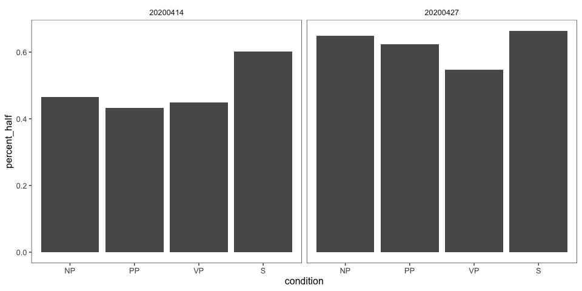<!-- -->

#### By-item

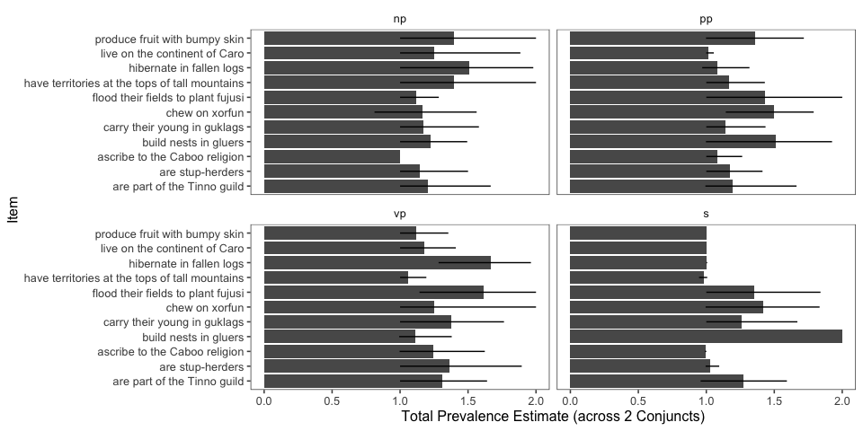<!-- -->
