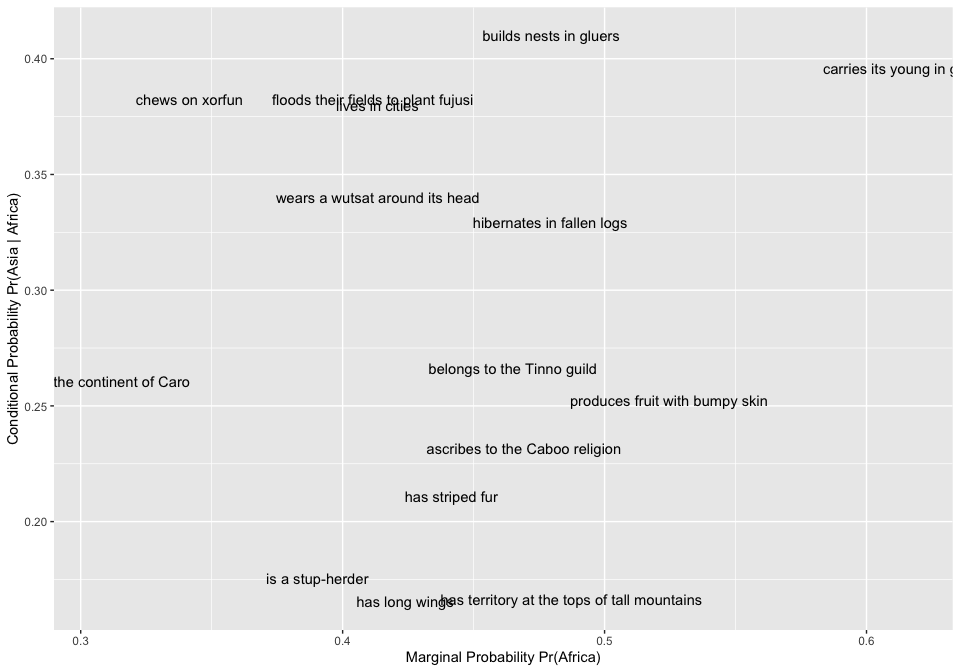
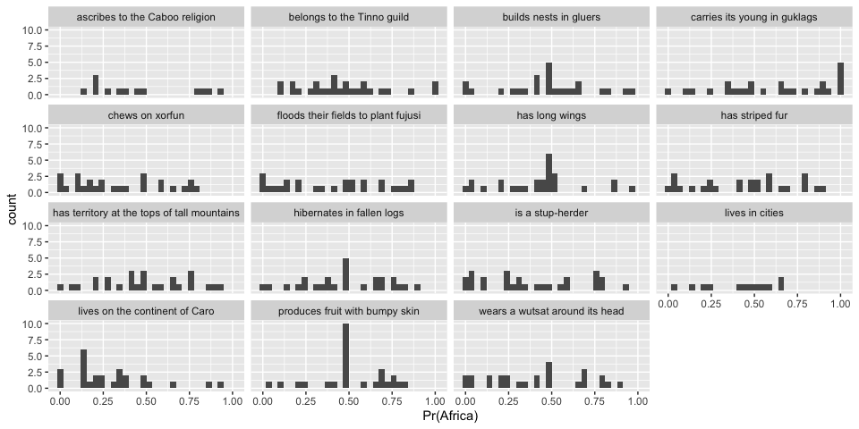
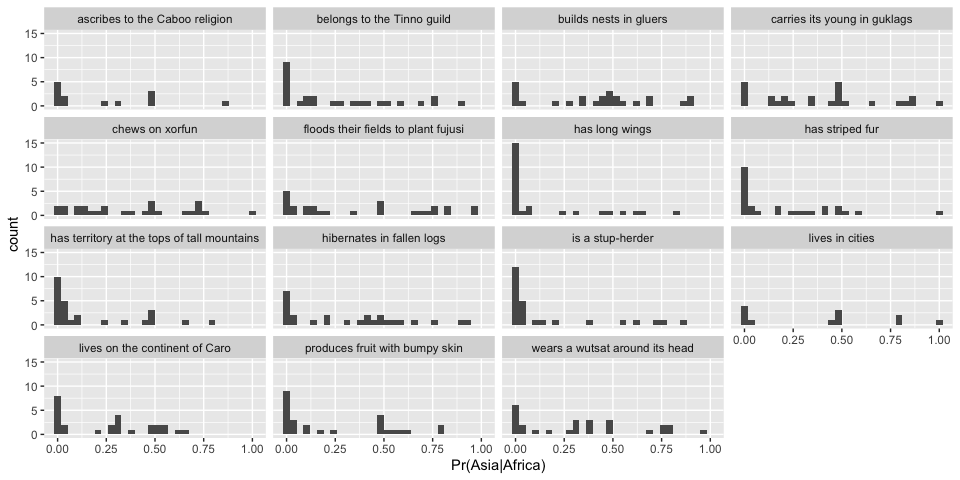
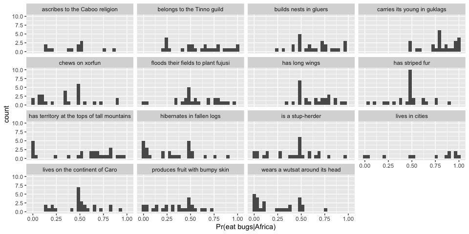
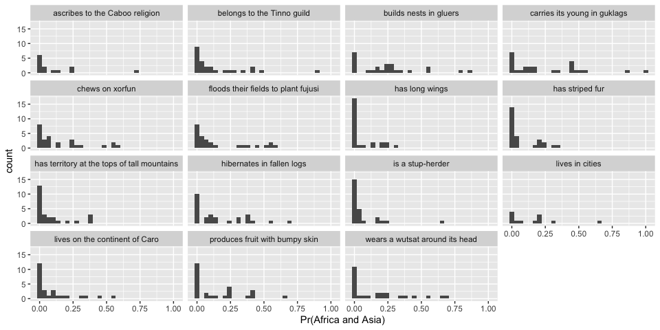
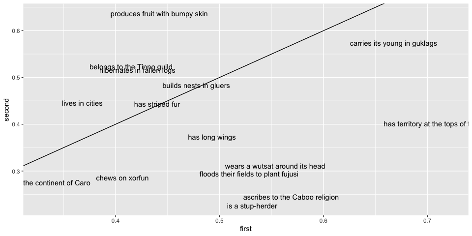

Mutual Exclusivity Norming Experiment
================
Karen Gu
5/19/2019

This file contains analysis for the mutual exclusivity norming pilot.
Raw data for this file is contained in `../../data/elephants-10`.
Preprocessing for this file is contained in
`./preprocessing/elephants-me-20190519.Rmd`.

The experiment uses the same story as in elephants-3, without last
sentence, asking explicitly about the following probabilities:  
\- Pr(Africa) - marginal distribution - Pr(Asia | Africa) - conditional
distribution (ME) - Pr(eat bugs | Africa) - conditional distribution
(ME)

## Mutual Exclusivity

We see that the mutual exclusivity varies across items, where no items
are perfectly correlated (Pr(Asia|Africa) = 1), but no items are
perfectly anticorrelated either (Pr(Asia|Africa) = 0).

<!-- -->

## Marginal Probabilities

<!-- -->

## Conditional Probabilities (ME)

<!-- -->

## Conditional Probabilities (NME)

<!-- -->

## Joint Probabilities

<!-- -->

## Property Symmetry

We alternate between asking about “Africa” and “Asia” for the marginal
probability. Are these symmetric?

<!-- -->

It’s possible that there is some effect of order, which may vary by
item.
