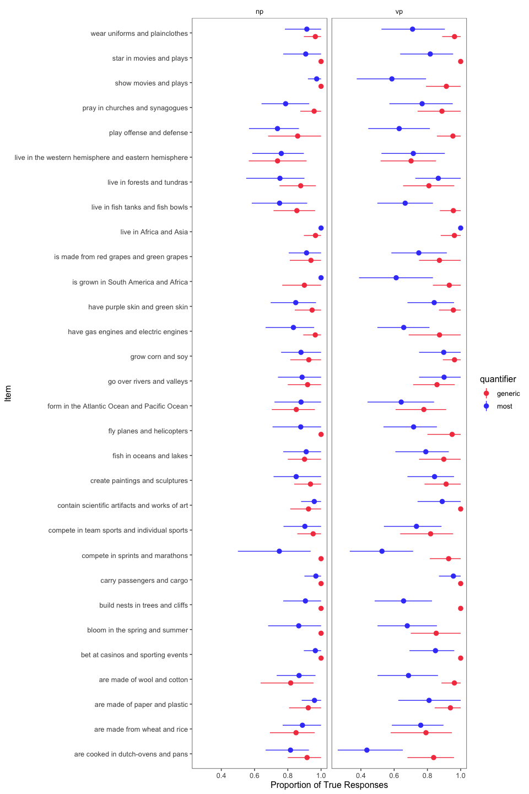

Variable Coordination by Quantifier
================
Karen Gu
5/08/2019

This file contains analysis of the variable coordination by quantifier
experiment, which consists of two pilots featuring different tasks.

Pilot 1 is an acceptability task using a sliding scale (0-100%), where
participants rate items of the form Elephants live in Africa and Asia.
\* between-subjects: VP vs. NP coordination  
\* within-subjects: generic vs. most vs. all  
\* 30 trials per subject (10 generic, 10 most, 10 all) Raw data is
contained in `../data/elephants-9/`. The preprocessing file is contained
in `./preprocessing/elephants-quantifier-coord-acceptability.Rmd`. The
experiment is contained in
`../experiments/elephants-acceptability.html`.

Pilot 2 is a TVJT using a 2-alternative forced choice, where
participants rate items of the form Elephants live in Africa and Asia.
\* between-subjects: VP vs. NP coordination  
\* within-subjects: generic vs. most \* 30 trials per subject (15
generic, 15 most) Raw data is contained in `../data/elephants-9-truth/`.
The preprocessing file is contained in
`./preprocessing/elephants-quantifier-coord-truth.Rmd`. The experiment
is contained in `../experiments/elephants-truth.html`.

## Number of Participants by Item and Condition

### Pilot 1 (Acceptability)

| coordination | combined\_predicate                                        | all | generic | most |
| :----------- | :--------------------------------------------------------- | --: | ------: | ---: |
| np           | are black and brown                                        |  12 |      16 |   11 |
| np           | are cooked in a dutch-oven and on a pan                    |  14 |      11 |   14 |
| np           | are made of wool and cotton                                |  11 |      15 |   13 |
| np           | are orange with black stripes and white with brown stripes |  15 |      12 |   12 |
| np           | are purple and golden                                      |  17 |      11 |   11 |
| np           | are purple and green                                       |  13 |      12 |   14 |
| np           | are white and gray                                         |  16 |      13 |   10 |
| np           | are young and old                                          |  10 |      11 |   18 |
| np           | bloom in the spring and summer                             |  13 |      16 |   10 |
| np           | build nests in trees and on the ground                     |  11 |      16 |   12 |
| np           | compete in team sports and individual sports               |  10 |      13 |   16 |
| np           | create paintings and sculptures                            |  13 |      13 |   13 |
| np           | fish in oceans and lakes                                   |  13 |      17 |    9 |
| np           | form in the Atlantic Ocean and Pacific Ocean               |  17 |       9 |   13 |
| np           | go over rivers and valleys                                 |  11 |      15 |   13 |
| np           | go through the sea and mountains                           |  16 |      10 |   13 |
| np           | grow corn and soy                                          |  19 |       5 |   15 |
| np           | have beautiful feathers and drab feathers                  |  17 |      14 |    8 |
| np           | have gas engines and electric engines                      |   9 |      13 |   17 |
| np           | have meat fillings and vegetable fillings                  |  13 |      10 |   16 |
| np           | is brown and white                                         |   9 |      16 |   14 |
| np           | is white and brown                                         |  13 |      14 |   12 |
| np           | live as pets and live in the wild                          |  11 |      17 |   11 |
| np           | live in Africa and Asia                                    |  12 |      14 |   13 |
| np           | live in fish tanks and fish bowls                          |   9 |       9 |   21 |
| np           | live in forests and tundras                                |  14 |       8 |   17 |
| np           | live in saltwater and freshwater                           |  12 |      17 |   10 |
| np           | live in the western hemisphere and eastern hemisphere      |  17 |      13 |    9 |
| np           | pray in churches and synagogues                            |   9 |      19 |   11 |
| np           | show movies and plays                                      |  14 |      11 |   14 |
| vp           | are black and brown                                        |   7 |      16 |   15 |
| vp           | are cooked in a dutch-oven and on a pan                    |  10 |      13 |   15 |
| vp           | are made of wool and cotton                                |  15 |      11 |   12 |
| vp           | are orange with black stripes and white with brown stripes |  13 |      15 |   10 |
| vp           | are purple and golden                                      |  18 |      11 |    9 |
| vp           | are purple and green                                       |  16 |      12 |   10 |
| vp           | are white and gray                                         |  12 |      15 |   11 |
| vp           | are young and old                                          |   9 |      14 |   15 |
| vp           | bloom in the spring and summer                             |  13 |      13 |   12 |
| vp           | build nests in trees and on the ground                     |   8 |      11 |   19 |
| vp           | compete in team sports and individual sports               |  13 |      14 |   11 |
| vp           | create paintings and sculptures                            |  13 |      13 |   12 |
| vp           | fish in oceans and lakes                                   |  11 |      17 |   10 |
| vp           | form in the Atlantic Ocean and Pacific Ocean               |  15 |      13 |   10 |
| vp           | go over rivers and valleys                                 |   9 |      13 |   16 |
| vp           | go through the sea and mountains                           |  11 |      17 |   10 |
| vp           | grow corn and soy                                          |   9 |      13 |   16 |
| vp           | have beautiful feathers and drab feathers                  |  13 |      12 |   13 |
| vp           | have gas engines and electric engines                      |  10 |       8 |   20 |
| vp           | have meat fillings and vegetable fillings                  |  12 |      11 |   15 |
| vp           | is brown and white                                         |  17 |      15 |    6 |
| vp           | is white and brown                                         |  16 |      13 |    9 |
| vp           | live as pets and live in the wild                          |  14 |      13 |   11 |
| vp           | live in Africa and Asia                                    |   9 |      12 |   17 |
| vp           | live in fish tanks and fish bowls                          |   9 |      13 |   16 |
| vp           | live in forests and tundras                                |  12 |      12 |   14 |
| vp           | live in saltwater and freshwater                           |  19 |      11 |    8 |
| vp           | live in the western hemisphere and eastern hemisphere      |  19 |       7 |   12 |
| vp           | pray in churches and synagogues                            |  11 |      15 |   12 |
| vp           | show movies and plays                                      |  17 |       7 |   14 |

| coordination |    n |
| :----------- | ---: |
| np           | 1170 |
| vp           | 1140 |

### Pilot 2 (Truth)

| coordination | combined\_predicate                                   | generic | most |
| :----------- | :---------------------------------------------------- | ------: | ---: |
| np           | are cooked in dutch-ovens and pans                    |      25 |   27 |
| np           | are made from wheat and rice                          |      26 |   26 |
| np           | are made of paper and plastic                         |      26 |   26 |
| np           | are made of wool and cotton                           |      22 |   30 |
| np           | bet at casinos and sporting events                    |      23 |   29 |
| np           | bloom in the spring and summer                        |      30 |   22 |
| np           | build nests in trees and cliffs                       |      30 |   22 |
| np           | carry passengers and cargo                            |      22 |   30 |
| np           | compete in sprints and marathons                      |      36 |   16 |
| np           | compete in team sports and individual sports          |      21 |   31 |
| np           | contain scientific artifacts and works of art         |      27 |   25 |
| np           | create paintings and sculptures                       |      31 |   21 |
| np           | fish in oceans and lakes                              |      30 |   22 |
| np           | fly planes and helicopters                            |      28 |   24 |
| np           | form in the Atlantic Ocean and Pacific Ocean          |      27 |   25 |
| np           | go over rivers and valleys                            |      25 |   27 |
| np           | grow corn and soy                                     |      27 |   25 |
| np           | have gas engines and electric engines                 |      28 |   24 |
| np           | have purple skin and green skin                       |      19 |   33 |
| np           | is grown in South America and Africa                  |      30 |   22 |
| np           | is made from red grapes and green grapes              |      16 |   36 |
| np           | live in Africa and Asia                               |      29 |   23 |
| np           | live in fish tanks and fish bowls                     |      28 |   24 |
| np           | live in forests and tundras                           |      32 |   20 |
| np           | live in the western hemisphere and eastern hemisphere |      23 |   29 |
| np           | play offense and defense                              |      22 |   30 |
| np           | pray in churches and synagogues                       |      24 |   28 |
| np           | show movies and plays                                 |      14 |   38 |
| np           | star in movies and plays                              |      30 |   22 |
| np           | wear uniforms and plainclothes                        |      29 |   23 |
| vp           | are cooked in dutch-ovens and pans                    |      25 |   23 |
| vp           | are made from wheat and rice                          |      19 |   29 |
| vp           | are made of paper and plastic                         |      32 |   16 |
| vp           | are made of wool and cotton                           |      26 |   22 |
| vp           | bet at casinos and sporting events                    |      22 |   26 |
| vp           | bloom in the spring and summer                        |      20 |   28 |
| vp           | build nests in trees and cliffs                       |      19 |   29 |
| vp           | carry passengers and cargo                            |      25 |   23 |
| vp           | compete in sprints and marathons                      |      27 |   21 |
| vp           | compete in team sports and individual sports          |      22 |   26 |
| vp           | contain scientific artifacts and works of art         |      21 |   27 |
| vp           | create paintings and sculptures                       |      23 |   25 |
| vp           | fish in oceans and lakes                              |      20 |   28 |
| vp           | fly planes and helicopters                            |      20 |   28 |
| vp           | form in the Atlantic Ocean and Pacific Ocean          |      23 |   25 |
| vp           | go over rivers and valleys                            |      28 |   20 |
| vp           | grow corn and soy                                     |      28 |   20 |
| vp           | have gas engines and electric engines                 |      16 |   32 |
| vp           | have purple skin and green skin                       |      23 |   25 |
| vp           | is grown in South America and Africa                  |      30 |   18 |
| vp           | is made from red grapes and green grapes              |      24 |   24 |
| vp           | live in Africa and Asia                               |      25 |   23 |
| vp           | live in fish tanks and fish bowls                     |      24 |   24 |
| vp           | live in forests and tundras                           |      26 |   22 |
| vp           | live in the western hemisphere and eastern hemisphere |      27 |   21 |
| vp           | play offense and defense                              |      21 |   27 |
| vp           | pray in churches and synagogues                       |      27 |   21 |
| vp           | show movies and plays                                 |      24 |   24 |
| vp           | star in movies and plays                              |      26 |   22 |
| vp           | wear uniforms and plainclothes                        |      27 |   21 |

| coordination |    n |
| :----------- | ---: |
| np           | 1560 |
| vp           | 1440 |

## Pilot 1 (Acceptability)

### Acceptability Judgements by Participant

Histogram of all of a single participant’s acceptability judgements,
collapsed across trials and color coded for the number of correct
responses on the memory check.  
\* fill = number of correct responses on the memory check (out of 10)  
\* facet = participants

<!-- -->

### Histograms of Acceptability Judgements by Coordination and Quantifier (collapsed across item)

<!-- -->

### Pirate Plots by Coordination and Quantifier (collapsed across item)

<!-- -->

### Generic VP Analysis

    ## Linear mixed model fit by REML. t-tests use Satterthwaite's method [
    ## lmerModLmerTest]
    ## Formula: response ~ 1 + (1 | workerid) + (1 | combined_predicate)
    ##    Data: df.generic.vp
    ## 
    ## REML criterion at convergence: -112.4
    ## 
    ## Scaled residuals: 
    ##     Min      1Q  Median      3Q     Max 
    ## -3.3541 -0.5565  0.0371  0.5995  3.2332 
    ## 
    ## Random effects:
    ##  Groups             Name        Variance Std.Dev.
    ##  workerid           (Intercept) 0.024608 0.15687 
    ##  combined_predicate (Intercept) 0.007038 0.08389 
    ##  Residual                       0.031385 0.17716 
    ## Number of obs: 380, groups:  workerid, 38; combined_predicate, 30
    ## 
    ## Fixed effects:
    ##             Estimate Std. Error       df t value Pr(>|t|)
    ## (Intercept)  0.04431    0.03110 52.12360   1.424     0.16

## Pilot 2 (Truth)

### Confidence Intervals by Coordination and Quantifier (collapsed across item)

<!-- -->

The model shows an interaction of quantifier and coordination level.

    ## Running /Library/Frameworks/R.framework/Resources/bin/R CMD SHLIB foo.c
    ## clang -mmacosx-version-min=10.13 -I"/Library/Frameworks/R.framework/Resources/include" -DNDEBUG   -I"/Library/Frameworks/R.framework/Versions/4.0/Resources/library/Rcpp/include/"  -I"/Library/Frameworks/R.framework/Versions/4.0/Resources/library/RcppEigen/include/"  -I"/Library/Frameworks/R.framework/Versions/4.0/Resources/library/RcppEigen/include/unsupported"  -I"/Library/Frameworks/R.framework/Versions/4.0/Resources/library/BH/include" -I"/Library/Frameworks/R.framework/Versions/4.0/Resources/library/StanHeaders/include/src/"  -I"/Library/Frameworks/R.framework/Versions/4.0/Resources/library/StanHeaders/include/"  -I"/Library/Frameworks/R.framework/Versions/4.0/Resources/library/rstan/include" -DEIGEN_NO_DEBUG  -D_REENTRANT  -DBOOST_DISABLE_ASSERTS -DBOOST_PENDING_INTEGER_LOG2_HPP -include stan/math/prim/mat/fun/Eigen.hpp   -I/usr/local/include   -fPIC  -Wall -g -O2  -c foo.c -o foo.o
    ## In file included from <built-in>:1:
    ## In file included from /Library/Frameworks/R.framework/Versions/4.0/Resources/library/StanHeaders/include/stan/math/prim/mat/fun/Eigen.hpp:13:
    ## In file included from /Library/Frameworks/R.framework/Versions/4.0/Resources/library/RcppEigen/include/Eigen/Dense:1:
    ## In file included from /Library/Frameworks/R.framework/Versions/4.0/Resources/library/RcppEigen/include/Eigen/Core:88:
    ## /Library/Frameworks/R.framework/Versions/4.0/Resources/library/RcppEigen/include/Eigen/src/Core/util/Macros.h:613:1: error: unknown type name 'namespace'
    ## namespace Eigen {
    ## ^
    ## /Library/Frameworks/R.framework/Versions/4.0/Resources/library/RcppEigen/include/Eigen/src/Core/util/Macros.h:613:16: error: expected ';' after top level declarator
    ## namespace Eigen {
    ##                ^
    ##                ;
    ## In file included from <built-in>:1:
    ## In file included from /Library/Frameworks/R.framework/Versions/4.0/Resources/library/StanHeaders/include/stan/math/prim/mat/fun/Eigen.hpp:13:
    ## In file included from /Library/Frameworks/R.framework/Versions/4.0/Resources/library/RcppEigen/include/Eigen/Dense:1:
    ## /Library/Frameworks/R.framework/Versions/4.0/Resources/library/RcppEigen/include/Eigen/Core:96:10: fatal error: 'complex' file not found
    ## #include <complex>
    ##          ^~~~~~~~~
    ## 3 errors generated.
    ## make: *** [foo.o] Error 1
    ## 
    ## SAMPLING FOR MODEL '3c916a50fcaae592b5576d11ab8bea20' NOW (CHAIN 1).
    ## Chain 1: 
    ## Chain 1: Gradient evaluation took 0.002047 seconds
    ## Chain 1: 1000 transitions using 10 leapfrog steps per transition would take 20.47 seconds.
    ## Chain 1: Adjust your expectations accordingly!
    ## Chain 1: 
    ## Chain 1: 
    ## Chain 1: Iteration:    1 / 2000 [  0%]  (Warmup)
    ## Chain 1: Iteration:  200 / 2000 [ 10%]  (Warmup)
    ## Chain 1: Iteration:  400 / 2000 [ 20%]  (Warmup)
    ## Chain 1: Iteration:  600 / 2000 [ 30%]  (Warmup)
    ## Chain 1: Iteration:  800 / 2000 [ 40%]  (Warmup)
    ## Chain 1: Iteration: 1000 / 2000 [ 50%]  (Warmup)
    ## Chain 1: Iteration: 1001 / 2000 [ 50%]  (Sampling)
    ## Chain 1: Iteration: 1200 / 2000 [ 60%]  (Sampling)
    ## Chain 1: Iteration: 1400 / 2000 [ 70%]  (Sampling)
    ## Chain 1: Iteration: 1600 / 2000 [ 80%]  (Sampling)
    ## Chain 1: Iteration: 1800 / 2000 [ 90%]  (Sampling)
    ## Chain 1: Iteration: 2000 / 2000 [100%]  (Sampling)
    ## Chain 1: 
    ## Chain 1:  Elapsed Time: 69.4787 seconds (Warm-up)
    ## Chain 1:                54.8866 seconds (Sampling)
    ## Chain 1:                124.365 seconds (Total)
    ## Chain 1: 
    ## 
    ## SAMPLING FOR MODEL '3c916a50fcaae592b5576d11ab8bea20' NOW (CHAIN 2).
    ## Chain 2: 
    ## Chain 2: Gradient evaluation took 0.000911 seconds
    ## Chain 2: 1000 transitions using 10 leapfrog steps per transition would take 9.11 seconds.
    ## Chain 2: Adjust your expectations accordingly!
    ## Chain 2: 
    ## Chain 2: 
    ## Chain 2: Iteration:    1 / 2000 [  0%]  (Warmup)
    ## Chain 2: Iteration:  200 / 2000 [ 10%]  (Warmup)
    ## Chain 2: Iteration:  400 / 2000 [ 20%]  (Warmup)
    ## Chain 2: Iteration:  600 / 2000 [ 30%]  (Warmup)
    ## Chain 2: Iteration:  800 / 2000 [ 40%]  (Warmup)
    ## Chain 2: Iteration: 1000 / 2000 [ 50%]  (Warmup)
    ## Chain 2: Iteration: 1001 / 2000 [ 50%]  (Sampling)
    ## Chain 2: Iteration: 1200 / 2000 [ 60%]  (Sampling)
    ## Chain 2: Iteration: 1400 / 2000 [ 70%]  (Sampling)
    ## Chain 2: Iteration: 1600 / 2000 [ 80%]  (Sampling)
    ## Chain 2: Iteration: 1800 / 2000 [ 90%]  (Sampling)
    ## Chain 2: Iteration: 2000 / 2000 [100%]  (Sampling)
    ## Chain 2: 
    ## Chain 2:  Elapsed Time: 74.81 seconds (Warm-up)
    ## Chain 2:                54.0953 seconds (Sampling)
    ## Chain 2:                128.905 seconds (Total)
    ## Chain 2: 
    ## 
    ## SAMPLING FOR MODEL '3c916a50fcaae592b5576d11ab8bea20' NOW (CHAIN 3).
    ## Chain 3: 
    ## Chain 3: Gradient evaluation took 0.000927 seconds
    ## Chain 3: 1000 transitions using 10 leapfrog steps per transition would take 9.27 seconds.
    ## Chain 3: Adjust your expectations accordingly!
    ## Chain 3: 
    ## Chain 3: 
    ## Chain 3: Iteration:    1 / 2000 [  0%]  (Warmup)
    ## Chain 3: Iteration:  200 / 2000 [ 10%]  (Warmup)
    ## Chain 3: Iteration:  400 / 2000 [ 20%]  (Warmup)
    ## Chain 3: Iteration:  600 / 2000 [ 30%]  (Warmup)
    ## Chain 3: Iteration:  800 / 2000 [ 40%]  (Warmup)
    ## Chain 3: Iteration: 1000 / 2000 [ 50%]  (Warmup)
    ## Chain 3: Iteration: 1001 / 2000 [ 50%]  (Sampling)
    ## Chain 3: Iteration: 1200 / 2000 [ 60%]  (Sampling)
    ## Chain 3: Iteration: 1400 / 2000 [ 70%]  (Sampling)
    ## Chain 3: Iteration: 1600 / 2000 [ 80%]  (Sampling)
    ## Chain 3: Iteration: 1800 / 2000 [ 90%]  (Sampling)
    ## Chain 3: Iteration: 2000 / 2000 [100%]  (Sampling)
    ## Chain 3: 
    ## Chain 3:  Elapsed Time: 75.6115 seconds (Warm-up)
    ## Chain 3:                55.1436 seconds (Sampling)
    ## Chain 3:                130.755 seconds (Total)
    ## Chain 3: 
    ## 
    ## SAMPLING FOR MODEL '3c916a50fcaae592b5576d11ab8bea20' NOW (CHAIN 4).
    ## Chain 4: 
    ## Chain 4: Gradient evaluation took 0.003039 seconds
    ## Chain 4: 1000 transitions using 10 leapfrog steps per transition would take 30.39 seconds.
    ## Chain 4: Adjust your expectations accordingly!
    ## Chain 4: 
    ## Chain 4: 
    ## Chain 4: Iteration:    1 / 2000 [  0%]  (Warmup)
    ## Chain 4: Iteration:  200 / 2000 [ 10%]  (Warmup)
    ## Chain 4: Iteration:  400 / 2000 [ 20%]  (Warmup)
    ## Chain 4: Iteration:  600 / 2000 [ 30%]  (Warmup)
    ## Chain 4: Iteration:  800 / 2000 [ 40%]  (Warmup)
    ## Chain 4: Iteration: 1000 / 2000 [ 50%]  (Warmup)
    ## Chain 4: Iteration: 1001 / 2000 [ 50%]  (Sampling)
    ## Chain 4: Iteration: 1200 / 2000 [ 60%]  (Sampling)
    ## Chain 4: Iteration: 1400 / 2000 [ 70%]  (Sampling)
    ## Chain 4: Iteration: 1600 / 2000 [ 80%]  (Sampling)
    ## Chain 4: Iteration: 1800 / 2000 [ 90%]  (Sampling)
    ## Chain 4: Iteration: 2000 / 2000 [100%]  (Sampling)
    ## Chain 4: 
    ## Chain 4:  Elapsed Time: 71.4807 seconds (Warm-up)
    ## Chain 4:                105.53 seconds (Sampling)
    ## Chain 4:                177.011 seconds (Total)
    ## Chain 4:

    ##  Family: bernoulli 
    ##   Links: mu = logit 
    ## Formula: response ~ coordination * quantifier + (1 + coordination * quantifier | workerid) + (1 + coordination * quantifier | combined_predicate) 
    ##    Data: df.query.truth (Number of observations: 3000) 
    ## Samples: 4 chains, each with iter = 2000; warmup = 1000; thin = 1;
    ##          total post-warmup samples = 4000
    ## 
    ## Group-Level Effects: 
    ## ~combined_predicate (Number of levels: 30) 
    ##                                              Estimate Est.Error l-95% CI
    ## sd(Intercept)                                    0.81      0.19     0.48
    ## sd(coordination2)                                0.29      0.20     0.01
    ## sd(quantifier2)                                  0.54      0.26     0.06
    ## sd(coordination2:quantifier2)                    0.36      0.25     0.01
    ## cor(Intercept,coordination2)                    -0.05      0.42    -0.80
    ## cor(Intercept,quantifier2)                      -0.24      0.35    -0.79
    ## cor(coordination2,quantifier2)                   0.02      0.42    -0.79
    ## cor(Intercept,coordination2:quantifier2)        -0.18      0.41    -0.85
    ## cor(coordination2,coordination2:quantifier2)    -0.06      0.44    -0.83
    ## cor(quantifier2,coordination2:quantifier2)      -0.01      0.43    -0.77
    ##                                              u-95% CI Rhat Bulk_ESS Tail_ESS
    ## sd(Intercept)                                    1.22 1.00     1622     2059
    ## sd(coordination2)                                0.76 1.00     1373     2184
    ## sd(quantifier2)                                  1.06 1.00      667      710
    ## sd(coordination2:quantifier2)                    0.93 1.00     1239     1934
    ## cor(Intercept,coordination2)                     0.73 1.00     3482     2988
    ## cor(Intercept,quantifier2)                       0.57 1.00     2046     2269
    ## cor(coordination2,quantifier2)                   0.79 1.00     1014     1326
    ## cor(Intercept,coordination2:quantifier2)         0.66 1.00     4165     2606
    ## cor(coordination2,coordination2:quantifier2)     0.77 1.00     2602     2938
    ## cor(quantifier2,coordination2:quantifier2)       0.81 1.00     2992     2927
    ## 
    ## ~workerid (Number of levels: 100) 
    ##                                              Estimate Est.Error l-95% CI
    ## sd(Intercept)                                    1.33      0.28     0.82
    ## sd(coordination2)                                0.72      0.59     0.03
    ## sd(quantifier2)                                  1.49      0.28     0.96
    ## sd(coordination2:quantifier2)                    0.73      0.57     0.03
    ## cor(Intercept,coordination2)                    -0.04      0.42    -0.78
    ## cor(Intercept,quantifier2)                      -0.09      0.24    -0.53
    ## cor(coordination2,quantifier2)                  -0.02      0.44    -0.82
    ## cor(Intercept,coordination2:quantifier2)         0.01      0.42    -0.77
    ## cor(coordination2,coordination2:quantifier2)    -0.04      0.45    -0.81
    ## cor(quantifier2,coordination2:quantifier2)      -0.10      0.42    -0.80
    ##                                              u-95% CI Rhat Bulk_ESS Tail_ESS
    ## sd(Intercept)                                    2.02 1.01      540      185
    ## sd(coordination2)                                2.46 1.02      214      122
    ## sd(quantifier2)                                  2.06 1.01      977     1765
    ## sd(coordination2:quantifier2)                    2.12 1.00      537      744
    ## cor(Intercept,coordination2)                     0.77 1.01      470      455
    ## cor(Intercept,quantifier2)                       0.43 1.00      783     1292
    ## cor(coordination2,quantifier2)                   0.80 1.03      105      497
    ## cor(Intercept,coordination2:quantifier2)         0.77 1.00     1534     2508
    ## cor(coordination2,coordination2:quantifier2)     0.80 1.00     1026     2368
    ## cor(quantifier2,coordination2:quantifier2)       0.74 1.00     1527     1972
    ## 
    ## Population-Level Effects: 
    ##                           Estimate Est.Error l-95% CI u-95% CI Rhat Bulk_ESS
    ## Intercept                     3.39      0.34     2.78     4.10 1.00      826
    ## coordination2                -0.20      0.41    -0.99     0.60 1.00      997
    ## quantifier2                  -0.36      0.39    -1.11     0.43 1.00     1101
    ## coordination2:quantifier2    -1.01      0.51    -1.97     0.08 1.01      623
    ##                           Tail_ESS
    ## Intercept                      878
    ## coordination2                 1557
    ## quantifier2                   1810
    ## coordination2:quantifier2      197
    ## 
    ## Samples were drawn using sampling(NUTS). For each parameter, Bulk_ESS
    ## and Tail_ESS are effective sample size measures, and Rhat is the potential
    ## scale reduction factor on split chains (at convergence, Rhat = 1).

<!-- -->

## By-item Analyses

### Pilot 1 (Acceptability)

#### Pirate Plots (by item)

<!-- -->

#### Confidence Intervals (by item)

<!-- -->

#### Histograms of Acceptability Ratings by Item

##### by Coordination

<!-- -->

##### by Quantifier

<!-- -->

### Pilot 2 (Truth)

#### Confidence Intervals (by item)

<!-- -->
