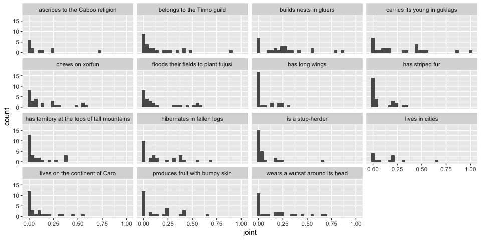
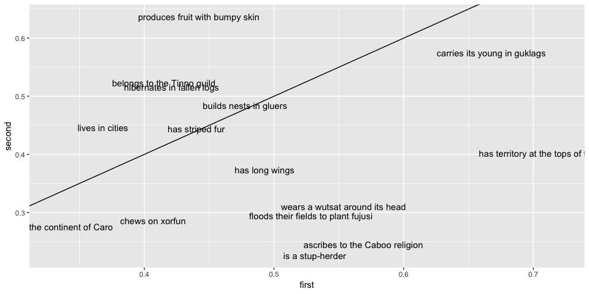

elephants-10-pilot
================
Karen Gu
5/19/2019

elephants-10 (mutual exclusivity norming)
-----------------------------------------

same story as in elephants-3, without last sentence, ask explicitly about the following probabilities:
- Pr(Africa)
- Pr(Asia | Africa)
- Pr(eat bugs | Africa)

### Subject Information

| workerid                         | language              | enjoyment | age | gender | problems                                                                | comments                                                                                                                                       |
|:---------------------------------|:----------------------|:----------|:----|:-------|:------------------------------------------------------------------------|:-----------------------------------------------------------------------------------------------------------------------------------------------|
| 28c89bcb876c482e582f7d6c5601e9c6 | english               | 0         | 33  | Male   | no problems                                                             |                                                                                                                                                |
| 5ba03c97fe7e21b64b444f44a0d1e631 | english               | 0         | 28  | Male   |                                                                         |                                                                                                                                                |
| 3dd3e2eea87241fb99486d141ddcf4e8 | English               | -1        | 31  | Female | no                                                                      | n/a                                                                                                                                            |
| e324aa067998fe012a086c2598a290ea | English               | -1        | 66  | Male   | No                                                                      | This book gives a lot to think about. Wish I had a timer, so I could have spent more time on this                                              |
| 65d2ee5cd5c209d4bc7b9184f03cb847 | english               | 1         | 40  | Female | no                                                                      |                                                                                                                                                |
| 9ca781493b7c852e96a7e5d900dd7d82 | English               | 0         | 28  | Male   | No issues                                                               | None                                                                                                                                           |
| 9ca35426235b2fe66395a5e5b176f19c | english               | 0         | 30  | Male   | not                                                                     | very good                                                                                                                                      |
| 5c9444eed3ec6c5e9bea6d012caad319 | English               | 0         | 34  | Male   | None                                                                    | None                                                                                                                                           |
| 51d5765bbaf7110a7272e09e70c53584 | English               | 1         | 59  | Female | No                                                                      | Great survey                                                                                                                                   |
| 1520d7af68f74af61e9165734b2e5ef0 | United States english | 1         | 57  | Male   | No                                                                      |                                                                                                                                                |
| ec01c4c7495bea5802dad54ea38ad910 | English               | 0         | 36  | Female | No.                                                                     |                                                                                                                                                |
| c619d5729c8522af7e9ba394d05ce546 | English               | 0         | 35  | Male   | not this time                                                           | no comments                                                                                                                                    |
| 3aa42e4118d797a7ac57b2cb6c232684 | English               | 0         | 44  | Male   | No                                                                      |                                                                                                                                                |
| 3189d434120fb90912a383536436a840 | English               | 1         | 32  | Female | I did not encounter any problems or bugs in the experiment.             | I think this is fun but should have a little higher pay rate. Even if you needed to add a few more chapters to the HIT.                        |
| e74437af83674fe2c0d2525d0843a53a | English               | 0         | 43  | Male   |                                                                         | It got confusing, and sometimes I was worried maybe I didn't remember a part.                                                                  |
| e0dc2bdcc9ff38877e73d9fbff754af5 | Korean                | 1         | 37  | Female | N/A                                                                     | It was interesting, I would love to read more about this research.                                                                             |
| 1caf499c433835a337eac2f6e32f91d9 | English               | 1         | 38  | Female |                                                                         |                                                                                                                                                |
| 86ff9a2f42b5a6d7a318655d17ba92f5 | English               | 0         | 31  | Male   | No.                                                                     |                                                                                                                                                |
| 1a123089d5399c3135c6b039ce1c953d | english               | 0         | 36  | Female |                                                                         |                                                                                                                                                |
| 76038c3da2bbb925fd04adca8527ae14 | English               | 0         | 47  | Female | No.                                                                     | None.                                                                                                                                          |
| bc6836a143bef335050e67c556a521f3 | English               | 0         | 25  | Male   | None                                                                    |                                                                                                                                                |
| 8639693a61fe51f7f0190485fb95f5b8 | english               | 1         | 24  | Male   |                                                                         |                                                                                                                                                |
| dc3d4e66e775515f48ba0b8c0ad74ddd | English               | 0         | 39  | Female | No                                                                      |                                                                                                                                                |
| 9cf7f619556c28e0dd050cfe0844cbd7 | english               | 0         | 26  | Female |                                                                         |                                                                                                                                                |
| caad783f2a0e33200001c52ea3cd30a7 | ENGLISH               | 1         | 26  | Male   | NO                                                                      | none                                                                                                                                           |
| dd65b845efaccf270da1019cd0a21c1b | English               | -1        | 48  | Male   | No                                                                      | This was startlingly long and poorly paid.                                                                                                     |
| 16e36a974c099e3f9bdbe1dacf58a861 | English               | 1         | 51  | Female | Not after it was resubmitted.                                           |                                                                                                                                                |
| d41c75a898fab01ba3ba31408575e432 | English               | 1         | 51  | Female | no                                                                      |                                                                                                                                                |
| a1d0744f084b6d74e9e8309a9efd1b04 | English               | 0         | 64  | Female | No problem.                                                             | I was somewhat confused and remembered thinking, how am I going to remember all of this? Thanks.                                               |
| ecccafc1640110d244f85eb5c881d768 | English               | 1         | 67  | Female | None                                                                    |                                                                                                                                                |
| 33ac6a1b465bc44bc9c6c923e796545d | Spanish               | 1         | 35  | Male   | There was a bug and it was fixed! Thank you you are very communicative. | Thank you for your kindness.                                                                                                                   |
| 9e4a5bfb25c80ba903cc73924e20e9b3 | English               | 1         | 50  | Female | no                                                                      |                                                                                                                                                |
| 20d1ef77feb084e6d51d5f6c6e86ee9b | English               | 1         | 46  | Male   | No, it worked perfectly.                                                | Thanks for posting this make-up hit.                                                                                                           |
| dc23eb40aab7c0d75342bde0bc9559a4 | English               | 1         | 38  | Male   |                                                                         |                                                                                                                                                |
| ad986d1d219e191020002d5679f064ef | english               | 1         | 32  | Male   | no                                                                      | none                                                                                                                                           |
| 016b2617c69860dc7fae28d3203beb64 | english               | 0         | 32  | Male   | no                                                                      |                                                                                                                                                |
| c5f8992ab47e915bf792b489351171c0 | English               | 0         | 39  | Female |                                                                         | The hit has a lot of information and it was difficult to process and understand a lot of unfamiliar and strange and also formulated names used |
| 88ae2f28e57efa472d2258d42bac6f23 | English               | 1         | 28  | Female | No                                                                      |                                                                                                                                                |
| 29aa7f12b49c639fc3c34179d9d6fef1 | English               | 1         | 30  | Female | no                                                                      |                                                                                                                                                |
| aa59a2b24a5da1c291ae58cedc75a41a | English               | 0         | 26  | Male   |                                                                         |                                                                                                                                                |
| 44e599b591615f98a20c04f2aa1feaf9 | English               | 1         | 39  | Female | No issues                                                               | This was a fun study.                                                                                                                          |
| b15b14e3860ff80d26647f92bc0e4e69 | English               | 1         | 21  | Female |                                                                         |                                                                                                                                                |
| 1792e7de51e5ee2e18c58654832dd3c6 | English               | 1         | 29  | Female | None                                                                    | Very difficult to keep context in my head with all of the different creature names.                                                            |
| 34f80e40ac496c99af53e3e6067cfe8b | English               | 1         | 63  | Female | None.                                                                   | I enjoyed working on your study.                                                                                                               |
| Good luck with your research.    |                       |           |     |        |                                                                         |                                                                                                                                                |
| be8b8ebb657f62cec2469c6947bfd6d3 | English               | 1         | 57  | Female | No                                                                      |                                                                                                                                                |
| 7832d129ce7e589e7e57c554ff4f0b73 | English               | 0         | 50  | Male   | no                                                                      | Interesting! Have a nice day!                                                                                                                  |
| 3115fe0529a83db9ce258f67b7f8a6d6 | English               | 0         | 35  | Male   | No                                                                      | Good study, thank you.                                                                                                                         |
| a5a371ed1ac79761f30acb5dac667f6b | english               | 1         | 25  | Male   | no                                                                      |                                                                                                                                                |
| 87a61f94d31ef81dbb84edcbb3f99cba | English               | 1         | 46  | Female | no                                                                      | Thank you for making an older lady feel 'not so smart after all'                                                                               |
| 5e445b32fb51b3ee6967b1a87c0395a6 | english               | 0         | 42  | Female |                                                                         |                                                                                                                                                |
| 4f9d0f5b05f8506350dfabacf5b16bb2 | English               | 0         | 35  | Female | No                                                                      |                                                                                                                                                |
| d93f31576b68b7096451a213148a59d0 | English               | 0         | 37  |        | No                                                                      | no comments                                                                                                                                    |
| d43978294aadb1dd131b3f9af932bab0 | English               | 0         | 24  | Female | No problems.                                                            |                                                                                                                                                |
| aff47fab8f45a2b49a5f4551f6334802 | English               | 1         | 42  | Male   | No                                                                      | Good luck with your study.                                                                                                                     |
| a34ec9eaa29b8d684b0f534c9b9f26c5 | english               | 1         | 60  | Female | no                                                                      | no                                                                                                                                             |
| 4444eb3a23aa147de45bb96e15435624 | English               | 1         | 30  | Female | No                                                                      |                                                                                                                                                |

### Subject Exclusions

#### Practice Sliders

Exclude subjects that do not answer all 4 sliders correctly.
- Suppose there is a dog that is a pet. What are the chances that it has a collar? coded as correct if prevalence &gt; 0.5
- Suppose there is an elephant that lives in Africa. What are the chances that it lives in Asia? coded as correct if prevalence &lt; 0.1
- What percentage of birds do you think are male? coded as correct if 0.3 &lt; prevalence &lt; 0.7
- What percentage of lions do you think lay eggs? coded as correct if prevalence &lt; 0.1

| workerid                         |  n\_correct|
|:---------------------------------|-----------:|
| 016b2617c69860dc7fae28d3203beb64 |           4|
| 1520d7af68f74af61e9165734b2e5ef0 |           4|
| 16e36a974c099e3f9bdbe1dacf58a861 |           4|
| 1792e7de51e5ee2e18c58654832dd3c6 |           4|
| 1a123089d5399c3135c6b039ce1c953d |           4|
| 1caf499c433835a337eac2f6e32f91d9 |           3|
| 20d1ef77feb084e6d51d5f6c6e86ee9b |           3|
| 28c89bcb876c482e582f7d6c5601e9c6 |           4|
| 29aa7f12b49c639fc3c34179d9d6fef1 |           1|
| 3115fe0529a83db9ce258f67b7f8a6d6 |           4|
| 3189d434120fb90912a383536436a840 |           4|
| 33ac6a1b465bc44bc9c6c923e796545d |           4|
| 34f80e40ac496c99af53e3e6067cfe8b |           4|
| 3aa42e4118d797a7ac57b2cb6c232684 |           4|
| 3dd3e2eea87241fb99486d141ddcf4e8 |           4|
| 4444eb3a23aa147de45bb96e15435624 |           3|
| 44e599b591615f98a20c04f2aa1feaf9 |           3|
| 4f9d0f5b05f8506350dfabacf5b16bb2 |           4|
| 51d5765bbaf7110a7272e09e70c53584 |           4|
| 5ba03c97fe7e21b64b444f44a0d1e631 |           4|
| 5c9444eed3ec6c5e9bea6d012caad319 |           3|
| 5e445b32fb51b3ee6967b1a87c0395a6 |           4|
| 65d2ee5cd5c209d4bc7b9184f03cb847 |           4|
| 76038c3da2bbb925fd04adca8527ae14 |           4|
| 7832d129ce7e589e7e57c554ff4f0b73 |           4|
| 8639693a61fe51f7f0190485fb95f5b8 |           3|
| 86ff9a2f42b5a6d7a318655d17ba92f5 |           4|
| 87a61f94d31ef81dbb84edcbb3f99cba |           3|
| 88ae2f28e57efa472d2258d42bac6f23 |           4|
| 9ca35426235b2fe66395a5e5b176f19c |           3|
| 9ca781493b7c852e96a7e5d900dd7d82 |           4|
| 9cf7f619556c28e0dd050cfe0844cbd7 |           3|
| 9e4a5bfb25c80ba903cc73924e20e9b3 |           4|
| a1d0744f084b6d74e9e8309a9efd1b04 |           4|
| a34ec9eaa29b8d684b0f534c9b9f26c5 |           2|
| a5a371ed1ac79761f30acb5dac667f6b |           3|
| aa59a2b24a5da1c291ae58cedc75a41a |           3|
| ad986d1d219e191020002d5679f064ef |           4|
| aff47fab8f45a2b49a5f4551f6334802 |           3|
| b15b14e3860ff80d26647f92bc0e4e69 |           4|
| bc6836a143bef335050e67c556a521f3 |           4|
| be8b8ebb657f62cec2469c6947bfd6d3 |           1|
| c5f8992ab47e915bf792b489351171c0 |           2|
| c619d5729c8522af7e9ba394d05ce546 |           1|
| caad783f2a0e33200001c52ea3cd30a7 |           2|
| d41c75a898fab01ba3ba31408575e432 |           4|
| d43978294aadb1dd131b3f9af932bab0 |           3|
| d93f31576b68b7096451a213148a59d0 |           4|
| dc23eb40aab7c0d75342bde0bc9559a4 |           4|
| dc3d4e66e775515f48ba0b8c0ad74ddd |           3|
| dd65b845efaccf270da1019cd0a21c1b |           4|
| e0dc2bdcc9ff38877e73d9fbff754af5 |           3|
| e324aa067998fe012a086c2598a290ea |           4|
| e74437af83674fe2c0d2525d0843a53a |           4|
| ec01c4c7495bea5802dad54ea38ad910 |           4|
| ecccafc1640110d244f85eb5c881d768 |           4|

| property                                                                                                                         |  n\_correct|
|:---------------------------------------------------------------------------------------------------------------------------------|-----------:|
| Suppose there is <strong>a dog that is a pet</strong>. What are the chances that it <strong>has a collar</strong>?               |          42|
| Suppose there is <strong>an elephant that lives in Africa</strong>. What are the chances that it <strong>lives in Asia</strong>? |          47|
| What percentage of <strong>birds</strong> do you think <strong>are male</strong>?                                                |          53|
| What percentage of <strong>lions</strong> do you think <strong>lay eggs</strong>?                                                |          52|

#### Memory Check

Exclude subjects that do not correctly identify 7 out of 10 memory check items.

#### Task Explanations

Participants that give bad explanations are generally eliminated by one of the other exclusion criteria.

| workerid                         |  n\_correct\_sliders|  n\_correct\_memory| explanation                                                                                                                                                                                                                                                                                                                                                                              |
|:---------------------------------|--------------------:|-------------------:|:-----------------------------------------------------------------------------------------------------------------------------------------------------------------------------------------------------------------------------------------------------------------------------------------------------------------------------------------------------------------------------------------|
| 28c89bcb876c482e582f7d6c5601e9c6 |                    4|                   5| Read a fiction story about a second earth and answered questions about the animals that live on this planet.                                                                                                                                                                                                                                                                             |
| 5ba03c97fe7e21b64b444f44a0d1e631 |                    4|                   8| I answered questions about a bunch of made up gibberish                                                                                                                                                                                                                                                                                                                                  |
| 3dd3e2eea87241fb99486d141ddcf4e8 |                    4|                   4| I read different chapters of story book and made estimates about the animals and aliens that were described in the chapters.                                                                                                                                                                                                                                                             |
| e324aa067998fe012a086c2598a290ea |                    4|                   7| I answered question about life on Zap.                                                                                                                                                                                                                                                                                                                                                   |
| 65d2ee5cd5c209d4bc7b9184f03cb847 |                    4|                   8| I read a story about a pretend planet and answered questions about it.                                                                                                                                                                                                                                                                                                                   |
| 9ca781493b7c852e96a7e5d900dd7d82 |                    4|                   8| I read through some short stories about fictional place similar to Earth and tried to guess the likelihood of a life form doing something or living somewhere using a slider.                                                                                                                                                                                                            |
| 9ca35426235b2fe66395a5e5b176f19c |                    3|                   8| Read a storybook and answer questions in each chapter.                                                                                                                                                                                                                                                                                                                                   |
| 5c9444eed3ec6c5e9bea6d012caad319 |                    3|                   7| I read 15 chapters of short passages and answered questions about probabilities.                                                                                                                                                                                                                                                                                                         |
| 51d5765bbaf7110a7272e09e70c53584 |                    4|                   7| Read a story of aliens and had to give our percentage on how we think they live etc                                                                                                                                                                                                                                                                                                      |
| 1520d7af68f74af61e9165734b2e5ef0 |                    4|                   8| I learned about a foreign planet like earth. It had continents and animals and people. I estimated based on given facts the liklihood of the outcome of a question based on those facts                                                                                                                                                                                                  |
| ec01c4c7495bea5802dad54ea38ad910 |                    4|                   7| I read a story about an alien planet and answered questions on possible situations about the creatures that live there.                                                                                                                                                                                                                                                                  |
| c619d5729c8522af7e9ba394d05ce546 |                    1|                   6| it was an interesting experiment and story, but this coming from MIT so its always interesting to be apart of this.                                                                                                                                                                                                                                                                      |
| 3aa42e4118d797a7ac57b2cb6c232684 |                    4|                   8| I read statements about alien beings and judged how likely the statements were to be true.                                                                                                                                                                                                                                                                                               |
| 3189d434120fb90912a383536436a840 |                    4|                  10| I read a multiple chapters of a book about an alien planet and answered 3 questions each on slider bars after each. The chapters described various plants and animals that are found on the planet and where they are located along with what they eat or where they sleep and hide.                                                                                                     |
| e74437af83674fe2c0d2525d0843a53a |                    4|                   9| It seemed I was guessing if certain properties applied to these populations, and then if different properties applied to that subset.                                                                                                                                                                                                                                                    |
| e0dc2bdcc9ff38877e73d9fbff754af5 |                    3|                  10| I was guessing how the lives of alien tribes and creatures on Dax would be like.                                                                                                                                                                                                                                                                                                         |
| 1caf499c433835a337eac2f6e32f91d9 |                    3|                   9| I paid attention to what happened in the stories. I also paid special attention to the questions about percentages of aliens or animals that did things. I did this because sometimes later questions asked about the percentage of creatures who didn't do the same things. Those creatures' percentage was the remaining percentage I didn't give the creatures in the first question. |
| 86ff9a2f42b5a6d7a318655d17ba92f5 |                    4|                   6| I made guesses of the chances of a species doing certain things on the planet Dax.                                                                                                                                                                                                                                                                                                       |
| 1a123089d5399c3135c6b039ce1c953d |                    4|                   7| read about so really weird aliens that live on planet similiar to Earth.                                                                                                                                                                                                                                                                                                                 |
| 76038c3da2bbb925fd04adca8527ae14 |                    4|                   9| I read a story about The Planet Dax and answered questions about what I read.                                                                                                                                                                                                                                                                                                            |
| bc6836a143bef335050e67c556a521f3 |                    4|                   7| I rated the likelihood that certain statements about particular tendencies of Dax residents were true.                                                                                                                                                                                                                                                                                   |
| 8639693a61fe51f7f0190485fb95f5b8 |                    3|                  10| I read pages from a chapterbook about alien spieces on another planet. I made guesses as to their habits when given some information up-front.                                                                                                                                                                                                                                           |
| dc3d4e66e775515f48ba0b8c0ad74ddd |                    3|                   8| I read the chapters of the book and turned the page while answering questions with the percentage.                                                                                                                                                                                                                                                                                       |
| 9cf7f619556c28e0dd050cfe0844cbd7 |                    3|                   7| Read chapters and answered questions.                                                                                                                                                                                                                                                                                                                                                    |
| caad783f2a0e33200001c52ea3cd30a7 |                    2|                   3| CHOOSE A PERCENTAGE ON MULTIPLE DIFFERENT SCIENCE RELATED TOPICS                                                                                                                                                                                                                                                                                                                         |
| dd65b845efaccf270da1019cd0a21c1b |                    4|                   9| I read descriptions of alien animals and guessed how likely it was they did or possessed certain things.                                                                                                                                                                                                                                                                                 |
| 16e36a974c099e3f9bdbe1dacf58a861 |                    4|                   6| I read it all but to be honest I cannot recall the details of the aliens and their lifestyles. I tried to estimate with reason the probabilities of the questions based on the descriptions I read.                                                                                                                                                                                      |
| d41c75a898fab01ba3ba31408575e432 |                    4|                   6| I read the pages and answered the questions to the best of my ability                                                                                                                                                                                                                                                                                                                    |
| a1d0744f084b6d74e9e8309a9efd1b04 |                    4|                   7| Alien creatures from another planet and another language live their everyday lives in the way they know best and communicate their own language.                                                                                                                                                                                                                                         |
| ecccafc1640110d244f85eb5c881d768 |                    4|                   9| I read 14 chapters about life on a planet similar to Earth in that it has seven continents, named in alphabet order. I read about the variety of life and made decisions about how many of each did different things to exist.                                                                                                                                                           |
| 33ac6a1b465bc44bc9c6c923e796545d |                    4|                   6| This is describing stereotypes from our culture with different names.                                                                                                                                                                                                                                                                                                                    |
| 9e4a5bfb25c80ba903cc73924e20e9b3 |                    4|                   7| I read and paid attention best i could all the weirf words through me off                                                                                                                                                                                                                                                                                                                |
| 20d1ef77feb084e6d51d5f6c6e86ee9b |                    3|                  10| I read about an alien world, Dax, that is a lot like Earth but has very different plants and animals. Animals like Kweps, Fengnors, and Reesles. Plants like Isooms, Tunkels, and soroneeks.                                                                                                                                                                                             |
| dc23eb40aab7c0d75342bde0bc9559a4 |                    4|                   8| I went through a book about the planet Dax. It has seven continents like Earth. There are many organisms that reside on the planet and this book described the organisms and their various activities.                                                                                                                                                                                   |
| ad986d1d219e191020002d5679f064ef |                    4|                   8| I read chapters of a story and answered questions about the chapters.                                                                                                                                                                                                                                                                                                                    |
| 016b2617c69860dc7fae28d3203beb64 |                    4|                   6| read about a planet similar to earth and guessed actions of aliens on planet                                                                                                                                                                                                                                                                                                             |
| c5f8992ab47e915bf792b489351171c0 |                    2|                   5| life in planet dax which is similar to earth                                                                                                                                                                                                                                                                                                                                             |
| 88ae2f28e57efa472d2258d42bac6f23 |                    4|                  10| I read the chapters about the animals and aliens living on the planet Dax and tried to guess the percentage of that type of being did a certain activity based on the facts given.                                                                                                                                                                                                       |
| 29aa7f12b49c639fc3c34179d9d6fef1 |                    1|                   8| I read the chapters and then answered questions afterwards.                                                                                                                                                                                                                                                                                                                              |
| aa59a2b24a5da1c291ae58cedc75a41a |                    3|                   9| i read about a similar planet to earth, creatures and habit of the creature on the planet and i also did a job of prediction by percentage                                                                                                                                                                                                                                               |
| 44e599b591615f98a20c04f2aa1feaf9 |                    3|                   9| I answered questions relating to another planet and an alien race using percentages on a slider bar                                                                                                                                                                                                                                                                                      |
| b15b14e3860ff80d26647f92bc0e4e69 |                    4|                   8| I read the storybook and answered the questions that were presented to me.                                                                                                                                                                                                                                                                                                               |
| 1792e7de51e5ee2e18c58654832dd3c6 |                    4|                   8| Read a story about an alien planet with seven continents. Read about creatures native to each and answered questions about the native life there.                                                                                                                                                                                                                                        |
| 34f80e40ac496c99af53e3e6067cfe8b |                    4|                   8| I read stories about aliens on another planet and answered questions about the characteristics of the different life forms on this planet.                                                                                                                                                                                                                                               |
| be8b8ebb657f62cec2469c6947bfd6d3 |                    1|                  10| I read a story about a plant called Dax with seven continents that are a lot like Earth but the plants and animals are quite different.                                                                                                                                                                                                                                                  |
| 7832d129ce7e589e7e57c554ff4f0b73 |                    4|                   7| Payed attention to the theme answered questions as well as I could                                                                                                                                                                                                                                                                                                                       |
| 3115fe0529a83db9ce258f67b7f8a6d6 |                    4|                   5| I learned about an Alien world similar to earth, and about the inhabitants of this world.                                                                                                                                                                                                                                                                                                |
| a5a371ed1ac79761f30acb5dac667f6b |                    3|                  10| read a short story and made predictions on the chances of an instance                                                                                                                                                                                                                                                                                                                    |
| 87a61f94d31ef81dbb84edcbb3f99cba |                    3|                   8| I read a story that was hard to follow and answered questions that wasn't always clear on what the question really was.                                                                                                                                                                                                                                                                  |
| 5e445b32fb51b3ee6967b1a87c0395a6 |                    4|                   6| Making assumptions without enough data                                                                                                                                                                                                                                                                                                                                                   |
| 4f9d0f5b05f8506350dfabacf5b16bb2 |                    4|                  10| Read stories about different plants and animals and made inferences about their lifestyles.                                                                                                                                                                                                                                                                                              |
| d93f31576b68b7096451a213148a59d0 |                    4|                   9| I have to read and think of percentage of possibilities and answer questions.                                                                                                                                                                                                                                                                                                            |
| d43978294aadb1dd131b3f9af932bab0 |                    3|                   9| Answered questions about aliens and animals in scales.                                                                                                                                                                                                                                                                                                                                   |
| aff47fab8f45a2b49a5f4551f6334802 |                    3|                   8| I read about an alien planet and guessed the likelihood of certain things based on what I read.                                                                                                                                                                                                                                                                                          |
| a34ec9eaa29b8d684b0f534c9b9f26c5 |                    2|                   7| how different spices live                                                                                                                                                                                                                                                                                                                                                                |
| 4444eb3a23aa147de45bb96e15435624 |                    3|                   7| Learned about creatures and estimated likelihood of certain properties                                                                                                                                                                                                                                                                                                                   |

#### Total Exclusions

We exclude 30 workers, leaving 362 trials for analysis.

### Mutual Exclusivity

### Marginal Probabilities

### Conditional Probabilities (ME)

### Conditional Probabilities (NME)

### Joint Probabilities

#### Property Symmetry

We alternate between asking about "Africa" and "Asia" for the marginal probability. Are these symmetric?

