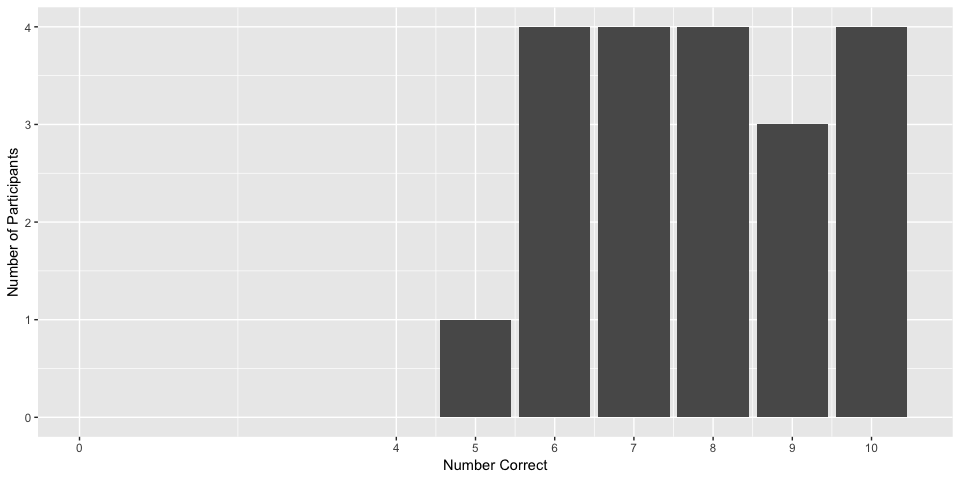
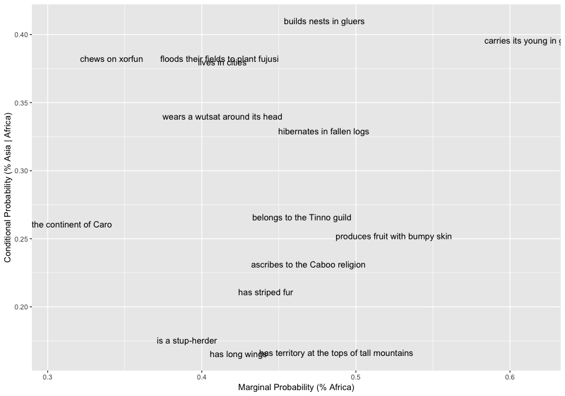
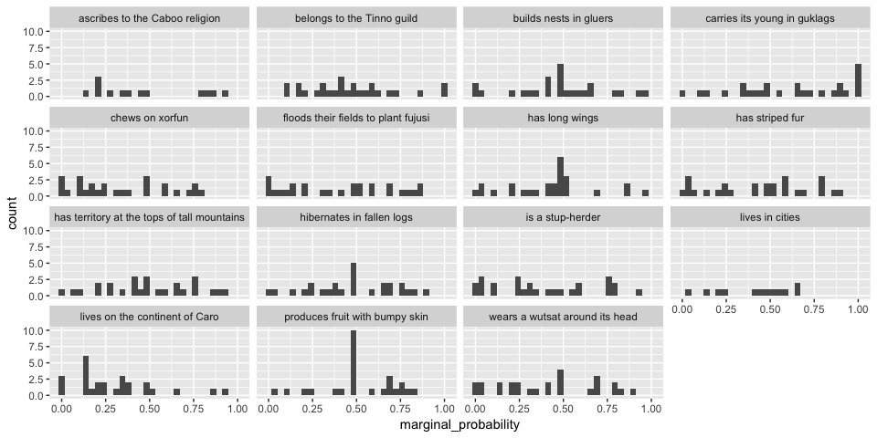
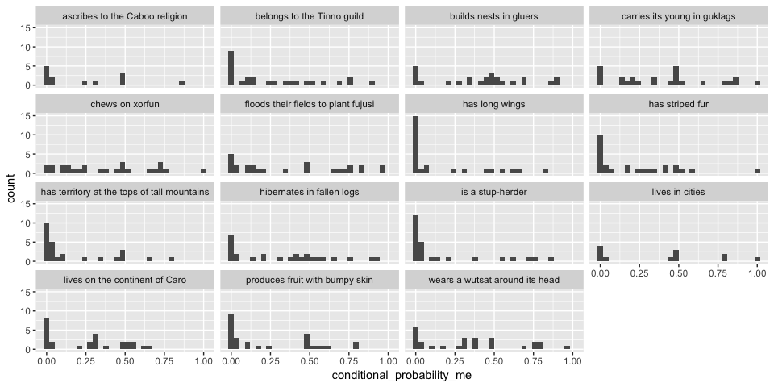
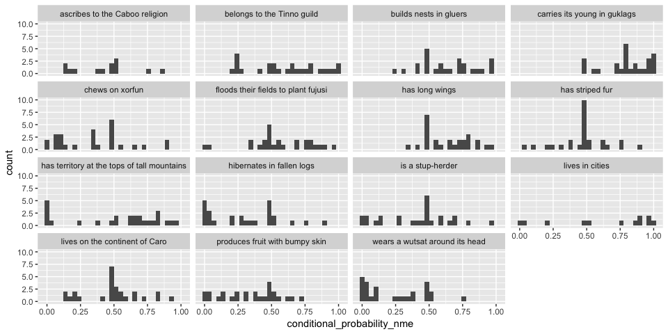

elephants-10-pilot
================
Karen Gu
5/19/2019

elephants-10 (mutual exclusivity norming)
-----------------------------------------

same story as in elephants-3, without last sentence, ask explicitly about the following probabilities:
- Pr(Africa)
- Pr(Asia | Africa)
- Pr(eat bugs | Africa)

### Subject Information

| workerid                         | language              | enjoyment | age | gender | problems                                                                | comments                                                                                                                |
|:---------------------------------|:----------------------|:----------|:----|:-------|:------------------------------------------------------------------------|:------------------------------------------------------------------------------------------------------------------------|
| 1520d7af68f74af61e9165734b2e5ef0 | United States english | 1         | 57  | Male   | No                                                                      |                                                                                                                         |
| ec01c4c7495bea5802dad54ea38ad910 | English               | 0         | 36  | Female | No.                                                                     |                                                                                                                         |
| c619d5729c8522af7e9ba394d05ce546 | English               | 0         | 35  | Male   | not this time                                                           | no comments                                                                                                             |
| 3aa42e4118d797a7ac57b2cb6c232684 | English               | 0         | 44  | Male   | No                                                                      |                                                                                                                         |
| 3189d434120fb90912a383536436a840 | English               | 1         | 32  | Female | I did not encounter any problems or bugs in the experiment.             | I think this is fun but should have a little higher pay rate. Even if you needed to add a few more chapters to the HIT. |
| e74437af83674fe2c0d2525d0843a53a | English               | 0         | 43  | Male   |                                                                         | It got confusing, and sometimes I was worried maybe I didn't remember a part.                                           |
| e0dc2bdcc9ff38877e73d9fbff754af5 | Korean                | 1         | 37  | Female | N/A                                                                     | It was interesting, I would love to read more about this research.                                                      |
| dd65b845efaccf270da1019cd0a21c1b | English               | -1        | 48  | Male   | No                                                                      | This was startlingly long and poorly paid.                                                                              |
| 16e36a974c099e3f9bdbe1dacf58a861 | English               | 1         | 51  | Female | Not after it was resubmitted.                                           |                                                                                                                         |
| d41c75a898fab01ba3ba31408575e432 | English               | 1         | 51  | Female | no                                                                      |                                                                                                                         |
| a1d0744f084b6d74e9e8309a9efd1b04 | English               | 0         | 64  | Female | No problem.                                                             | I was somewhat confused and remembered thinking, how am I going to remember all of this? Thanks.                        |
| ecccafc1640110d244f85eb5c881d768 | English               | 1         | 67  | Female | None                                                                    |                                                                                                                         |
| 33ac6a1b465bc44bc9c6c923e796545d | Spanish               | 1         | 35  | Male   | There was a bug and it was fixed! Thank you you are very communicative. | Thank you for your kindness.                                                                                            |
| 9e4a5bfb25c80ba903cc73924e20e9b3 | English               | 1         | 50  | Female | no                                                                      |                                                                                                                         |
| 20d1ef77feb084e6d51d5f6c6e86ee9b | English               | 1         | 46  | Male   | No, it worked perfectly.                                                | Thanks for posting this make-up hit.                                                                                    |
| dc23eb40aab7c0d75342bde0bc9559a4 | English               | 1         | 38  | Male   |                                                                         |                                                                                                                         |
| 34f80e40ac496c99af53e3e6067cfe8b | English               | 1         | 63  | Female | None.                                                                   | I enjoyed working on your study.                                                                                        |
| Good luck with your research.    |                       |           |     |        |                                                                         |                                                                                                                         |
| be8b8ebb657f62cec2469c6947bfd6d3 | English               | 1         | 57  | Female | No                                                                      |                                                                                                                         |
| 7832d129ce7e589e7e57c554ff4f0b73 | English               | 0         | 50  | Male   | no                                                                      | Interesting! Have a nice day!                                                                                           |
| 3115fe0529a83db9ce258f67b7f8a6d6 | English               | 0         | 35  | Male   | No                                                                      | Good study, thank you.                                                                                                  |

### Subject Exclusions

#### Practice Sliders

Exclude subjects that do not answer all 4 sliders correctly.
- Suppose there is a dog that is a pet. What are the chances that it has a collar? coded as correct if prevalence &gt; 0.5
- Suppose there is an elephant that lives in Africa. What are the chances that it lives in Asia? coded as correct if prevalence &lt; 0.1
- What percentage of birds do you think are male? coded as correct if 0.3 &lt; prevalence &lt; 0.7
- What percentage of lions do you think lay eggs? coded as correct if prevalence &lt; 0.1

| workerid                         |  n\_correct|
|:---------------------------------|-----------:|
| 1520d7af68f74af61e9165734b2e5ef0 |           4|
| 16e36a974c099e3f9bdbe1dacf58a861 |           4|
| 20d1ef77feb084e6d51d5f6c6e86ee9b |           3|
| 3115fe0529a83db9ce258f67b7f8a6d6 |           4|
| 3189d434120fb90912a383536436a840 |           4|
| 33ac6a1b465bc44bc9c6c923e796545d |           4|
| 34f80e40ac496c99af53e3e6067cfe8b |           4|
| 3aa42e4118d797a7ac57b2cb6c232684 |           4|
| 7832d129ce7e589e7e57c554ff4f0b73 |           4|
| 9e4a5bfb25c80ba903cc73924e20e9b3 |           4|
| a1d0744f084b6d74e9e8309a9efd1b04 |           4|
| be8b8ebb657f62cec2469c6947bfd6d3 |           1|
| c619d5729c8522af7e9ba394d05ce546 |           1|
| d41c75a898fab01ba3ba31408575e432 |           4|
| dc23eb40aab7c0d75342bde0bc9559a4 |           4|
| dd65b845efaccf270da1019cd0a21c1b |           4|
| e0dc2bdcc9ff38877e73d9fbff754af5 |           3|
| e74437af83674fe2c0d2525d0843a53a |           4|
| ec01c4c7495bea5802dad54ea38ad910 |           4|
| ecccafc1640110d244f85eb5c881d768 |           4|

| property                                                                                                                         |  n\_correct|
|:---------------------------------------------------------------------------------------------------------------------------------|-----------:|
| Suppose there is <strong>a dog that is a pet</strong>. What are the chances that it <strong>has a collar</strong>?               |          17|
| Suppose there is <strong>an elephant that lives in Africa</strong>. What are the chances that it <strong>lives in Asia</strong>? |          18|
| What percentage of <strong>birds</strong> do you think <strong>are male</strong>?                                                |          19|
| What percentage of <strong>lions</strong> do you think <strong>lay eggs</strong>?                                                |          18|

#### Memory Check

Exclude subjects that do not correctly identify 7 out of 10 memory check items.

#### Task Explanations

Participants that give bad explanations are generally eliminated by one of the other exclusion criteria.

| workerid                         |  n\_correct\_sliders|  n\_correct\_memory| explanation                                                                                                                                                                                                                                                                          |
|:---------------------------------|--------------------:|-------------------:|:-------------------------------------------------------------------------------------------------------------------------------------------------------------------------------------------------------------------------------------------------------------------------------------|
| 1520d7af68f74af61e9165734b2e5ef0 |                    4|                   8| I learned about a foreign planet like earth. It had continents and animals and people. I estimated based on given facts the liklihood of the outcome of a question based on those facts                                                                                              |
| ec01c4c7495bea5802dad54ea38ad910 |                    4|                   7| I read a story about an alien planet and answered questions on possible situations about the creatures that live there.                                                                                                                                                              |
| c619d5729c8522af7e9ba394d05ce546 |                    1|                   6| it was an interesting experiment and story, but this coming from MIT so its always interesting to be apart of this.                                                                                                                                                                  |
| 3aa42e4118d797a7ac57b2cb6c232684 |                    4|                   8| I read statements about alien beings and judged how likely the statements were to be true.                                                                                                                                                                                           |
| 3189d434120fb90912a383536436a840 |                    4|                  10| I read a multiple chapters of a book about an alien planet and answered 3 questions each on slider bars after each. The chapters described various plants and animals that are found on the planet and where they are located along with what they eat or where they sleep and hide. |
| e74437af83674fe2c0d2525d0843a53a |                    4|                   9| It seemed I was guessing if certain properties applied to these populations, and then if different properties applied to that subset.                                                                                                                                                |
| e0dc2bdcc9ff38877e73d9fbff754af5 |                    3|                  10| I was guessing how the lives of alien tribes and creatures on Dax would be like.                                                                                                                                                                                                     |
| dd65b845efaccf270da1019cd0a21c1b |                    4|                   9| I read descriptions of alien animals and guessed how likely it was they did or possessed certain things.                                                                                                                                                                             |
| 16e36a974c099e3f9bdbe1dacf58a861 |                    4|                   6| I read it all but to be honest I cannot recall the details of the aliens and their lifestyles. I tried to estimate with reason the probabilities of the questions based on the descriptions I read.                                                                                  |
| d41c75a898fab01ba3ba31408575e432 |                    4|                   6| I read the pages and answered the questions to the best of my ability                                                                                                                                                                                                                |
| a1d0744f084b6d74e9e8309a9efd1b04 |                    4|                   7| Alien creatures from another planet and another language live their everyday lives in the way they know best and communicate their own language.                                                                                                                                     |
| ecccafc1640110d244f85eb5c881d768 |                    4|                   9| I read 14 chapters about life on a planet similar to Earth in that it has seven continents, named in alphabet order. I read about the variety of life and made decisions about how many of each did different things to exist.                                                       |
| 33ac6a1b465bc44bc9c6c923e796545d |                    4|                   6| This is describing stereotypes from our culture with different names.                                                                                                                                                                                                                |
| 9e4a5bfb25c80ba903cc73924e20e9b3 |                    4|                   7| I read and paid attention best i could all the weirf words through me off                                                                                                                                                                                                            |
| 20d1ef77feb084e6d51d5f6c6e86ee9b |                    3|                  10| I read about an alien world, Dax, that is a lot like Earth but has very different plants and animals. Animals like Kweps, Fengnors, and Reesles. Plants like Isooms, Tunkels, and soroneeks.                                                                                         |
| dc23eb40aab7c0d75342bde0bc9559a4 |                    4|                   8| I went through a book about the planet Dax. It has seven continents like Earth. There are many organisms that reside on the planet and this book described the organisms and their various activities.                                                                               |
| 34f80e40ac496c99af53e3e6067cfe8b |                    4|                   8| I read stories about aliens on another planet and answered questions about the characteristics of the different life forms on this planet.                                                                                                                                           |
| be8b8ebb657f62cec2469c6947bfd6d3 |                    1|                  10| I read a story about a plant called Dax with seven continents that are a lot like Earth but the plants and animals are quite different.                                                                                                                                              |
| 7832d129ce7e589e7e57c554ff4f0b73 |                    4|                   7| Payed attention to the theme answered questions as well as I could                                                                                                                                                                                                                   |
| 3115fe0529a83db9ce258f67b7f8a6d6 |                    4|                   5| I learned about an Alien world similar to earth, and about the inhabitants of this world.                                                                                                                                                                                            |

#### Total Exclusions

We exclude 8 workers, leaving 168 trials for analysis.

### Mutual Exclusivity

### Marginal Probabilities

### Conditional Probabilities (ME)

### Conditional Probabilities (NME)

