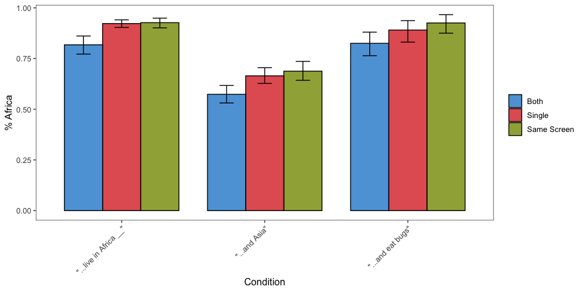

CogSci Experiment 1 (single question, same screen)
================
Karen Gu
9/6/2019

[Link to
experiment](https://www.mit.edu/~karengu/elephants_expt1_single_samescreen/elephants/experiments/elephants-11.html)

## elephants-3, single question, same screen

Experiment 1 for CogSci 2019 (Elephants-3i), with a single question
(Africa only), all info presented on the same
screen

## 

## Subject Information

| workerid                         | language      | enjoyment | age | gender | problems                           | comments                                       |
| :------------------------------- | :------------ | :-------- | :-- | :----- | :--------------------------------- | :--------------------------------------------- |
| e59126bbd20fecb9e8b9c1394003da1f | English       | 1         | 34  | Male   | No problems.                       |                                                |
| ca04e9ed63dcb79ab53989aa12e81ef9 | English       | 0         | 34  | Other  | No, everything worked fine         | None, thanks for fairly compensating workers\! |
| 1cef02fd0b84c505b54f5fe4b15f00e6 | English       | 0         | 37  | Male   | no                                 |                                                |
| 6ee05949db82f1b2a7d8703345b9c46c | United States | 0         | 34  | Male   | none                               |                                                |
| fc3d0f6ad945a9c3bb5399d9e7aa2446 | english       | 1         | 28  | Female | nil                                | nice and useful                                |
| 5934c04d289e3ac41262861d7af21a0f | English       | 1         | 33  | Female |                                    |                                                |
| ed3a50577e6fd3d21cf3a3e968f09063 | English       | 1         | 35  | Male   |                                    |                                                |
| af982cbad1f9f48e846937073a238216 | english       | 0         | 26  | Male   | none                               | none                                           |
| 32daf4698f607d156c871c34d612e89e | English       | 1         | 41  | Female | no                                 |                                                |
| 0f287385531bd54a08600696e7ce0454 | english       | 0         | 34  | Male   | No issues.                         |                                                |
| 0541a894a97a50907ffe62a487cec0a1 | English       | 1         | 28  | Male   | no                                 | good                                           |
| d3defa7a7e9b94696dd42b4ec7f30b2e | English       | 0         | 46  | Female | None                               | None                                           |
| 6e13724f41911dde2e2f24c0c755dff3 | english       | 1         | 41  | Female | no                                 |                                                |
| 73ef4537256069ca142e7a63decb3be5 | English       | \-1       | 31  | Male   | No.                                |                                                |
| 6673d8b0953a7ec746c175c08679181b | english       | 0         | 38  | Male   | none                               | none                                           |
| b95a45b5d49a5d95a0cb9f8af3089b40 | English       | 1         | 51  | Female | No                                 |                                                |
| db8dd3c8f0ddf15708630e330d1bb030 | English       | 1         | 43  | Female | None.                              |                                                |
| 195a61e811ee6a431326a8b20674626d | English       | 0         | 26  | Male   | no                                 |                                                |
| c52074473e55c1cdb563d7185130eed2 | English       | 0         | 52  | Male   | None                               | None                                           |
| edb275de6d287301a22fb9b844fdba73 | English       | 0         | 49  | Female |                                    |                                                |
| f9ab1041e0a0b182264639dad9f125f3 | English       | 1         | 26  | Female | No, their was no problems          | none                                           |
| cb76abad72df18098c8593513610c5d2 | English       | 1         | 31  | Female | No.                                | Thank you\!                                    |
| 80d5f4bb6b2fa799cc458fd16cd86486 | english       | 1         | 47  | Female | no issues, everything ran smoothly |                                                |
| ba8a3e8a9d70b2faaa9cbaaf1fb74588 | English       | 1         | 40  | Male   | no                                 | Thank you for not asking about coronavirus     |
| e16a46bb97fdc690c5caf7229c1e2ea3 | English       | 1         | 26  | Male   | No                                 |                                                |
| 4f625042d19af8fae683ac55944291d7 | English       | 1         | 22  | Female | no                                 |                                                |
| 0d00290f86c1fdd44430baab44cdf892 | English       | 1         | 28  | Male   | None at all                        | I hope my input helps\! Thank you\!            |

## Attention Checks

### Slider Practice

Before the experiment, participants practice using the sliders to rate 3
category-property pairs:

  - dogs bark (coded as correct if x \> 0.5)
  - birds are male (coded as correct if 0.25 \< x \< 0.75)
  - cats get cancer (coded as correct if x \< 0.75) \[being generous
    with this one\]
  - lions lay eggs (coded as correct if x \< 0.10)

| n\_correct |  n |
| ---------: | -: |
|          1 |  1 |
|          3 |  1 |
|          4 | 25 |

| property        | n\_correct |
| :-------------- | ---------: |
| birds are male  |         26 |
| cats get cancer |         26 |
| dogs bark       |         27 |
| lions lay eggs  |         25 |

### Memory Check

After the story, participants select statements they recall learning
from a list of 10 generic statements about novel animals (5 true, 5
distractor). They are also asked to explain what they did in the
experiment.
<!-- -->

### Slider Practice and Memory Check

<!-- -->

### Explanations of Task

After the story, participants are also asked to explain generally what
they did in the
experiment.

| workerid                         | n\_slider\_correct | n\_memory\_correct | explanation                                                                                                                                                                  |
| :------------------------------- | -----------------: | -----------------: | :--------------------------------------------------------------------------------------------------------------------------------------------------------------------------- |
| e59126bbd20fecb9e8b9c1394003da1f |                  4 |                  8 | Set a value of what percentage of a type of alien have or do something                                                                                                       |
| ca04e9ed63dcb79ab53989aa12e81ef9 |                  4 |                 10 | read a short passage and then used a slider to indicate whether the subject in question did X behavior/had Y characteristic a certain percentage of the time.                |
| 1cef02fd0b84c505b54f5fe4b15f00e6 |                  4 |                 10 | I made probability judgements due to phrases                                                                                                                                 |
| 6ee05949db82f1b2a7d8703345b9c46c |                  4 |                  9 | learn about creatures on alien planets and decide what percentage of them have a characteristics based on the facts stated.                                                  |
| fc3d0f6ad945a9c3bb5399d9e7aa2446 |                  1 |                  5 | nice and usefull                                                                                                                                                             |
| 5934c04d289e3ac41262861d7af21a0f |                  4 |                  6 | we read short passages about an alien world called Dax, and answered questions about each passage                                                                            |
| ed3a50577e6fd3d21cf3a3e968f09063 |                  4 |                  9 | I read paragraphs of aliens and their environment and determined whether the statement provided was correct based on the wording and details of the paragraph.               |
| af982cbad1f9f48e846937073a238216 |                  4 |                  8 | reading comprehension.                                                                                                                                                       |
| 32daf4698f607d156c871c34d612e89e |                  4 |                  7 | That was tough with all those hard names. I had to try and figure out the percentage I thought the story described.                                                          |
| 0f287385531bd54a08600696e7ce0454 |                  4 |                  9 | Read passages about aliens and answered a question about each of the passages.                                                                                               |
| 0541a894a97a50907ffe62a487cec0a1 |                  4 |                  5 | Aliens language                                                                                                                                                              |
| d3defa7a7e9b94696dd42b4ec7f30b2e |                  4 |                 10 | I read information on different aliens and animals and then make guesses as to the percentage of those animals or aliens did things in response to the questions.            |
| 6e13724f41911dde2e2f24c0c755dff3 |                  4 |                  9 | read sentences and select how true a statement is                                                                                                                            |
| 73ef4537256069ca142e7a63decb3be5 |                  4 |                  9 | Rate the likelihood that a given statement is true or false on a scale out of 100%.                                                                                          |
| 6673d8b0953a7ec746c175c08679181b |                  4 |                 10 | I read each paragraph. Then, I read the question. Finally, I went back through the paragraph to find that specific answer and confirm that I was selecting the right answer. |
| b95a45b5d49a5d95a0cb9f8af3089b40 |                  4 |                  5 | Read about animals and aliens on a far-away planet, and was asked some questions about them.                                                                                 |
| db8dd3c8f0ddf15708630e330d1bb030 |                  4 |                  8 | I paid attention to words like all or some to get an idea of the percentages.                                                                                                |
| 195a61e811ee6a431326a8b20674626d |                  4 |                  8 | I read about different aliens.                                                                                                                                               |
| c52074473e55c1cdb563d7185130eed2 |                  4 |                 10 | A statement was given and then we had to answer a question based on that statement giving a percentage answer.                                                               |
| edb275de6d287301a22fb9b844fdba73 |                  4 |                  8 | I marked on a slider what number seemed to apply to a statement according to a short passage.                                                                                |
| f9ab1041e0a0b182264639dad9f125f3 |                  4 |                 10 | Well i read a either what animals did or aliens did then i had to choose what percentage that the animal or aliens did.                                                      |
| cb76abad72df18098c8593513610c5d2 |                  4 |                 10 | Read about aliens on an alien planet and answered questions about percentages of their habits and features based on the reading.                                             |
| 80d5f4bb6b2fa799cc458fd16cd86486 |                  4 |                 10 | tried to make logical estimates based on provided information                                                                                                                |
| ba8a3e8a9d70b2faaa9cbaaf1fb74588 |                  4 |                 10 | Select percentage of animals that did a particular thing/fact.                                                                                                               |
| e16a46bb97fdc690c5caf7229c1e2ea3 |                  4 |                  9 | I read passages and answer questions about the quantity of animals that have certain traits or behaviors.                                                                    |
| 4f625042d19af8fae683ac55944291d7 |                  4 |                 10 | read about wierd alien creatures with weird names                                                                                                                            |
| 0d00290f86c1fdd44430baab44cdf892 |                  3 |                  8 | I was asked to determine how true I thought a fact was about an alien race based upon the text that I read.                                                                  |

### Exclusions

## Participants

### Included/Excluded Subject Numbers

Removing participants who got fewer than 7 correct on memory check and
didn’t get all 4 sliders. (Participants with bad explanations usually
fell into one of these other groups.)

| memory\_fail | slider\_fail |  n |
| :----------- | :----------- | -: |
| FALSE        | FALSE        | 22 |
| FALSE        | TRUE         |  1 |
| TRUE         | FALSE        |  3 |
| TRUE         | TRUE         |  1 |

### Prevalence Estimates by Participant

Histogram of all of a single participant’s prevalence estimates,
collapsed across trials and color coded for the number of correct
responses on the memory check. \* fill = number of correct responses on
the memory check (out of 10) \* facet =
participants

<!-- -->

## Filler Trials

These used quantifiers (and thus we have strong idea about literal
meaning).

<!-- -->

## Critical Trials (collapsed across item)

## Histograms of Prevalence Estimates by Condition (collapsed across item)

<!-- -->

### Bootstrapped 95% Confidence Intervals (collapsed across item)

<!-- -->

### Pirate Plots (collapsed across item)

<!-- -->

### Ridge Plots

<!-- -->

### Stats

#### Regression

    ## Linear mixed model fit by REML ['lmerMod']
    ## Formula: val ~ condition + (1 | workerid) + (1 | predicate_1)
    ##    Data: model.data
    ## 
    ## REML criterion at convergence: -477.9
    ## 
    ## Scaled residuals: 
    ##     Min      1Q  Median      3Q     Max 
    ## -4.5661 -0.5450  0.1657  0.5306  2.8494 
    ## 
    ## Random effects:
    ##  Groups      Name        Variance  Std.Dev.
    ##  workerid    (Intercept) 0.0124752 0.11169 
    ##  predicate_1 (Intercept) 0.0005949 0.02439 
    ##  Residual                0.0290558 0.17046 
    ## Number of obs: 930, groups:  workerid, 82; predicate_1, 16
    ## 
    ## Fixed effects:
    ##                                     Estimate Std. Error t value
    ## (Intercept)                          0.89076    0.01603  55.561
    ## condition"...and Asia"\nQ(Asia)     -0.24927    0.01258 -19.816
    ## condition"...and eat bugs"\nQ(bugs) -0.01342    0.01567  -0.856
    ## 
    ## Correlation of Fixed Effects:
    ##             (Intr) c"..AQ
    ## c"...A"Q(A) -0.338       
    ## c"...eb"Q() -0.269  0.345
