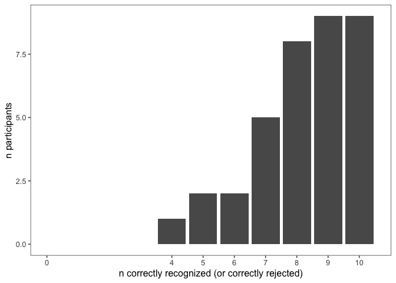
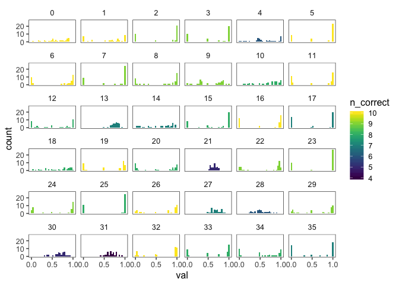
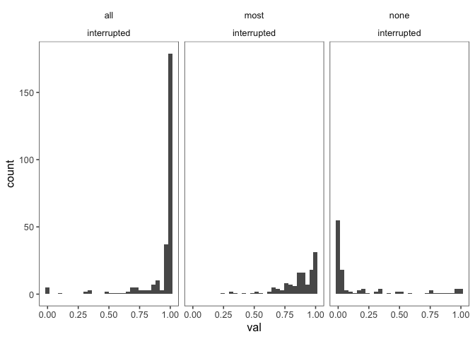
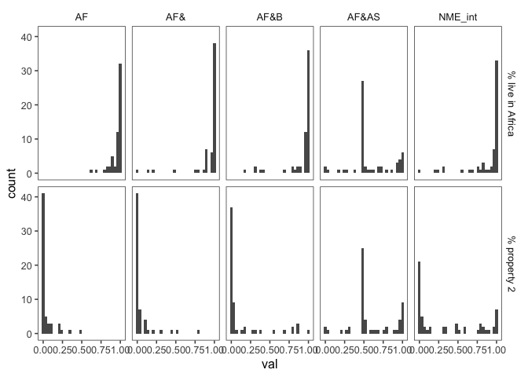
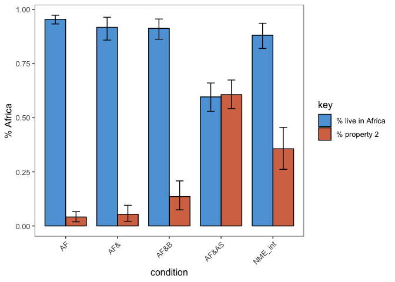
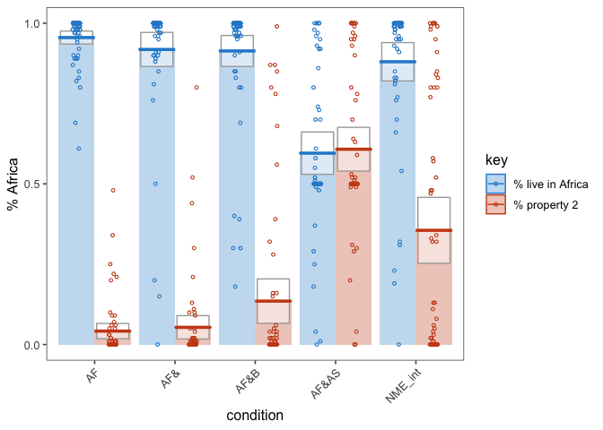
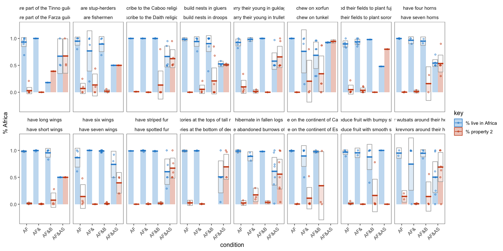
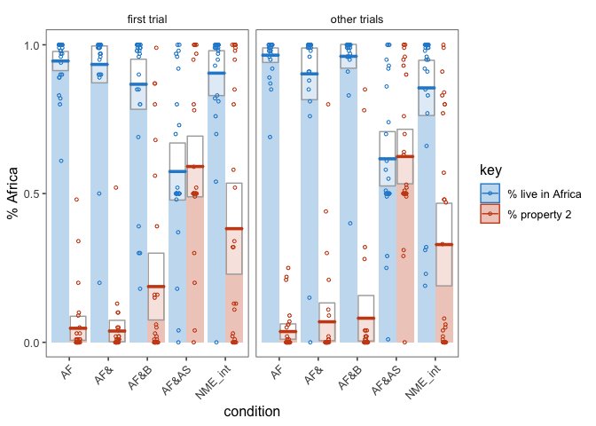
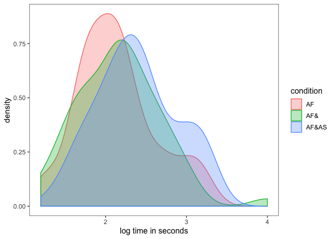

elephants-4-pilot
================
MH Tessler
1/28/2019

[Link to experiment](http://www.mit.edu/~tessler/projects/elephants/experiments/elephants-4.html)

Experiment 4 pilot
------------------

All questions interrupting.

-   int1: (Africa) -- Q(Af, As) -- (and eat bugs in the wild)
-   int2: (Africa and) -- Q(Af, As) -- (eat bugs in the wild)
-   int4: (Africa and Asia) -- Q(Af, As) -- (which is warm)

Subject Information
-------------------

|  workerid| language      | enjoyment | age | gender | problems              | comments                                                                                                                                                                                                                                                                      |
|---------:|:--------------|:----------|:----|:-------|:----------------------|:------------------------------------------------------------------------------------------------------------------------------------------------------------------------------------------------------------------------------------------------------------------------------|
|         0| english       | 1         | 42  | Male   | no                    | Thank you                                                                                                                                                                                                                                                                     |
|         1| English       | 0         | 38  | Male   | No                    | The reading and thinking was a little intense so I think it could pay a little more.                                                                                                                                                                                          |
|         2| English       | 0         | 33  | Male   | no                    | no                                                                                                                                                                                                                                                                            |
|         3| English       | 0         | 43  | Female | No.                   | No.                                                                                                                                                                                                                                                                           |
|         4| english       | 0         | 30  | Male   | no                    |                                                                                                                                                                                                                                                                               |
|         5| English       | 1         | 28  | Male   | No                    | Thank you!                                                                                                                                                                                                                                                                    |
|         6| English       | 0         | 45  | Female | no                    | no comments thank you                                                                                                                                                                                                                                                         |
|         7| English       | 1         | 34  | Female | No                    |                                                                                                                                                                                                                                                                               |
|         8| english       | 0         | 34  | Male   | no                    | thanks                                                                                                                                                                                                                                                                        |
|         9| English       | 0         | 22  | Male   | no                    |                                                                                                                                                                                                                                                                               |
|        10| English       | 1         | 61  | Male   | no                    |                                                                                                                                                                                                                                                                               |
|        11| English       | 0         | 23  | Female | No                    | Please please give additional time on mturk.                                                                                                                                                                                                                                  |
|        12| english       | 0         | 33  | Female | none at all           | I read the directions but now i&quotecharm like ahhh b/c you asked me twice about them. We had to mark the percentage some were zero. some were 100. was it wrong to put percentages in the middle. I&quotecharm confused now.                                                |
|        13| English       | 1         | 31  | Male   | no..                  | its very useful                                                                                                                                                                                                                                                               |
|        14| English       | 1         | 33  | Other  | No.                   |                                                                                                                                                                                                                                                                               |
|        15| English       | 1         | 29  | Female | no                    |                                                                                                                                                                                                                                                                               |
|        16| English       | 1         | 50  | Female | None, ran smoothly.   | I enjoyed it. Thank you.                                                                                                                                                                                                                                                      |
|        17| English       | 1         | 36  | Female | None                  |                                                                                                                                                                                                                                                                               |
|        18| English       | 0         | 37  | Male   | no                    |                                                                                                                                                                                                                                                                               |
|        19| English       | 1         | 50  | Female | None                  |                                                                                                                                                                                                                                                                               |
|        20| English       | 0         | 42  | Female | no                    | nope                                                                                                                                                                                                                                                                          |
|        21| English       | 1         | 28  | Male   | no                    | good task                                                                                                                                                                                                                                                                     |
|        22| English       | 1         | 51  | Female | No                    |                                                                                                                                                                                                                                                                               |
|        23| English       | 1         | 31  | Female | No                    | This was fun. Thanks!                                                                                                                                                                                                                                                         |
|        24| english       | 0         | 40  | Female | none                  |                                                                                                                                                                                                                                                                               |
|        25| English       | 0         | 34  | Female | no                    | My memory isn&quotechart good,so I had a hard time remember what I read, but I tried my best                                                                                                                                                                                  |
|        26| English       | 1         | 27  | Male   | No, I had no issues   |                                                                                                                                                                                                                                                                               |
|        27| English       | 1         | 27  | Female | No Problems           | The survey very good as well task                                                                                                                                                                                                                                             |
|        28| United States | 1         | 55  | Female | NO                    | THIS WAS GREAT                                                                                                                                                                                                                                                                |
|        29| English       | 1         | 37  | Male   | None                  |                                                                                                                                                                                                                                                                               |
|        30| english       | 0         | 27  | Female | no                    | This survey is superb.                                                                                                                                                                                                                                                        |
|        31| English       | 1         | 30  | Female | No                    | This study nice and learning a lots of things.                                                                                                                                                                                                                                |
|        32| English       | 1         | 54  | Female | no                    | By the end my brain was very tired of tryin to learn and associate new strange facts so it was a lot harder.                                                                                                                                                                  |
|        33| English       | 1         | 79  | Female | no                    |                                                                                                                                                                                                                                                                               |
|        34| english       | 0         | 35  | Female | no                    |                                                                                                                                                                                                                                                                               |
|        35| english       | 1         | 56  | Male   | None that I detected. | I did this in the late evening, pretty sure I would have performed noticeably better in early morning. Just something I&quotecharve picked up on over the years when it comes to my own attention/retention levels, wonder if there is any interesting research in this area. |

Attention Checks
----------------

### Slider Practice

Before the experiment, participants practice using the sliders to rate 3 category-property pairs:

-   dogs bark (coded as correct if x &gt; 0.5)
-   birds are male (coded as correct if 0.25 &lt; x &lt; 0.75)
-   cats get cancer (coded as correct if x &lt; 0.75) \[being generous with this one\]
-   lions lay eggs (coded as correct if x &lt; 0.10)

|  n\_correct|    n|
|-----------:|----:|
|           3|    3|
|           4|   33|

| property        |  n\_correct|
|:----------------|-----------:|
| birds are male  |          36|
| cats get cancer |          36|
| dogs bark       |          36|
| lions lay eggs  |          33|

### Memory Check

After the story, participants select statements they recall learning from a list of 10 generic statements about novel animals (5 true, 5 distractor).

### Explanations of Task

After the story, participants are also asked to explain generally what they did in the experiment.

|  workerid|  n\_slider\_correct|  n\_memory\_correct| explanation                                                                                                                                                                                                                                                                  |
|---------:|-------------------:|-------------------:|:-----------------------------------------------------------------------------------------------------------------------------------------------------------------------------------------------------------------------------------------------------------------------------|
|         0|                   4|                  10| I read chapters of a story one by one and answered questions following each.                                                                                                                                                                                                 |
|         1|                   4|                  10| I read stories and selected scales on what I believed to be true.                                                                                                                                                                                                            |
|         2|                   4|                   9| I just read a story and compared in percentages how much I thought an item was true of something I read about.                                                                                                                                                               |
|         3|                   4|                   9| I read about animals on a different planet and responded to questions about what percentage of the animals did certain things that I read about.                                                                                                                             |
|         4|                   4|                   6| read a story and answer quiz                                                                                                                                                                                                                                                 |
|         5|                   4|                  10| I read a story and responded to questions about it.                                                                                                                                                                                                                          |
|         6|                   4|                  10| A read a short clip about creatures on another plant. I then answered two questions about what I had read.                                                                                                                                                                   |
|         7|                   4|                   9| Read a story about aliens that live on a planet similar to earth and answer questions about the story.                                                                                                                                                                       |
|         8|                   4|                   9| read the different chapters and answered questions about the information in it                                                                                                                                                                                               |
|         9|                   4|                   9| I read a book and answered questions of what percentage I thought something was. For example &quotecharWhat percentage of plovs Did I think lived in Aga&quotechar                                                                                                           |
|        10|                   4|                   8| After reading I decided the likelihood of an event happening.                                                                                                                                                                                                                |
|        11|                   4|                  10| I gave my opinion on what creature did or didnt do something in an alien place.                                                                                                                                                                                              |
|        12|                   4|                   8| i read a bunch of short chapters about a place that has 7 continents, where aliens live and answered questions right after each chapter...to see if i could remember what i read which was hard. These words had me all over the place and confusing me on what i just read. |
|        13|                   3|                   7| i&quotecharll read a story..learn language and answer some questions                                                                                                                                                                                                         |
|        14|                   4|                   7| Rad short passages about an alien planet and was asked questions pertaining to the percentages that certain creatures did specific things.                                                                                                                                   |
|        15|                   4|                   8| I read a book about an alien planet and the creatures that live on it. Then i answered questions about it periodically.                                                                                                                                                      |
|        16|                   4|                  10| I read a story about aliens and life of creatures and plants on their seven continents. Trying to remember percentages of what creatures or aliens do.                                                                                                                       |
|        17|                   4|                   7| I read an alien children&quotechars book that described a planet very much like Earth.                                                                                                                                                                                       |
|        18|                   4|                   8| tried to recall facts about alien races                                                                                                                                                                                                                                      |
|        19|                   4|                  10| Read a story about an alien planet and its creatures, then answered periodic questions about what we read using percentages.                                                                                                                                                 |
|        20|                   4|                   8| Read short informative excerpts about different types of plants and animals and aliens on a planet and then decided on percentages for what they do.                                                                                                                         |
|        21|                   3|                   5| read a story-book about animals and aliens on a far-away planet                                                                                                                                                                                                              |
|        22|                   4|                   9| I read aloud as much as I could and just tried to get an image in my mind of the species and its properties.                                                                                                                                                                 |
|        23|                   4|                   9| I read a variety of stories and remembered details of them by using a slider to answer the questions.                                                                                                                                                                        |
|        24|                   4|                   9| I read short stories and guess what percentage of something I think did it.                                                                                                                                                                                                  |
|        25|                   4|                   8| I read a story and tried to remember the story by answering the questions next using a slider.                                                                                                                                                                               |
|        26|                   4|                  10| I just read the story and then reported what percentage of X had or engaged in Y                                                                                                                                                                                             |
|        27|                   3|                   7| Nice                                                                                                                                                                                                                                                                         |
|        28|                   4|                   6| I LEAN ALOT AND IT WAS FUN                                                                                                                                                                                                                                                   |
|        29|                   4|                   9| How people use percentages for different words.                                                                                                                                                                                                                              |
|        30|                   4|                   5| This is very nice.                                                                                                                                                                                                                                                           |
|        31|                   4|                   4| I study a lots of most valuable infoemation.                                                                                                                                                                                                                                 |
|        32|                   4|                  10| I read stories and answered questions that would intermittently appar.                                                                                                                                                                                                       |
|        33|                   4|                   8| I read stories about aliens and the habitat and then after each story I answered questions agout the story.                                                                                                                                                                  |
|        34|                   4|                   8| Read about the continents and the creatures that live there.                                                                                                                                                                                                                 |
|        35|                   4|                   7| I struggled to see how many specifics I could retain without resorting to taking notes as I went along. I didn&quotechart expect to do very well, and I was right.                                                                                                           |

Participants
------------

### Included/Excluded Subject Numbers

Removing participants who got fewer than 7 correct on memory check and didn't get all 4 sliders. (Participants with bad explanations usually fell into one of these other groups.)

| memory\_fail | slider\_fail |    n|
|:-------------|:-------------|----:|
| FALSE        | FALSE        |   29|
| FALSE        | TRUE         |    2|
| TRUE         | FALSE        |    4|
| TRUE         | TRUE         |    1|

### Prevalence Estimates by Participant

Histogram of all of a single participant's prevalence estimates, collapsed across trials and color coded for the number of correct responses on the memory check.
\* fill = number of correct responses on the memory check (out of 10)
\* facet = participants

Filler Trials
-------------

These used quantifiers (and thus we have strong idea about literal meaning).

Critical Trials (collapsed across item)
---------------------------------------

*Conditions*

1.  AF: "Elephants live in Africa" -- Q(Africa, Asia) -- "and breathe oxygen"
2.  AF&: "Elephants live in Africa and" -- Q(Africa, Asia) -- "breathe oxygen"
3.  AF&B: "Elephants live in Africa and breathe oxygen" -- Q(Africa, Asia) -- "while alive"
4.  AF&AS: "Elephants live in Africa and Asia" -- Q(Africa, Asia) -- "while alive"
5.  NME\_int: "Elephants live in Africa" -- Q(Africa, breathe) -- "while alive"

### Number of Participants by Condition

| condition |    n|
|:----------|----:|
| AF        |   58|
| AF&       |   58|
| AF&B      |   61|
| AF&AS     |   58|
| NME\_int  |   58|

### Histograms of Prevalence Estimates by Condition (collapsed across trials)

### Bootstrapped 95% Confidence Intervals (collapsed across item)

*Property 2* = "% live in Asia" for ME trials and "% eat bugs" for NME trials

### Pirate Plots (collapsed across item)

By-item Analyses
----------------

### Number of Participants by Item and Condition

| predicate\_1                                   | predicate\_2                                        |   AF|  AF&|  AF&B|  AF&AS|  NME\_int|
|:-----------------------------------------------|:----------------------------------------------------|----:|----:|-----:|------:|---------:|
| are part of the Tinno guild                    | are part of the Farza guild                         |   14|    2|     2|      6|        10|
| are stup-herders                               | are fishermen                                       |   10|    8|     8|      2|        10|
| ascribe to the Caboo religion                  | ascribe to the Daith religion                       |    2|    4|    12|     10|         8|
| build nests in gluers                          | build nests in droops                               |    4|   10|    16|      6|         6|
| carry their young in guklags                   | carry their young in trullets                       |   10|    6|     4|     12|         6|
| chew on xorfun                                 | chew on tunkel                                      |    4|    8|    12|      4|        10|
| flood their fields to plant fujusi             | burn their fields to plant soroneeks                |   10|   12|     2|      2|         6|
| have four horns                                | have seven horns                                    |   14|    6|     4|     12|         4|
| have long wings                                | have short wings                                    |    6|   12|     8|      6|         8|
| have six wings                                 | have seven wings                                    |    8|    4|    20|      6|         4|
| have striped fur                               | have spotted fur                                    |    2|   10|     6|     10|        10|
| have territories at the tops of tall mountains | have territories at the bottom of deep canyons      |    4|    6|     0|     10|         6|
| hibernate in fallen logs                       | hibernate in the abandoned burrows of other animals |    6|    6|     4|     14|         4|
| live on the continent of Caro                  | live on the continent of Este                       |    8|   10|     6|      0|        10|
| produce fruit with bumpy skin                  | produce fruit with smooth skin                      |   10|    4|    10|      2|         4|
| wear wutsats around their heads                | wear krevnors around their heads                    |    4|    8|     8|     14|        10|

### Pirate plots (by item)

First Trial vs. Other Trials (for each condition)
-------------------------------------------------

Reaction times
--------------

*how much time do participants spend on the question slide?*

Looking only at

-   AF: "Elephants live in Africa"
-   AF&: "Elephants live in Africa and"
-   AF&AS: "Elephants live in Africa and Asia"

