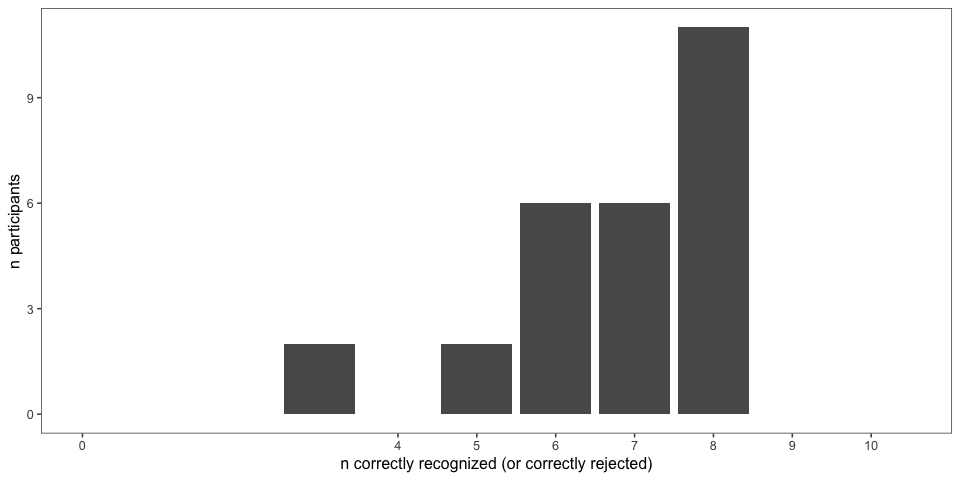
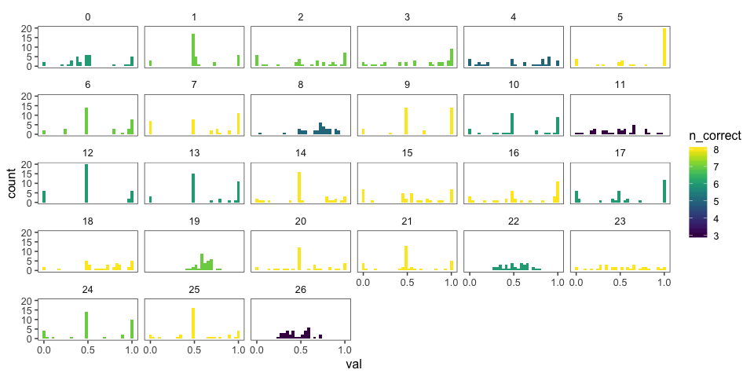
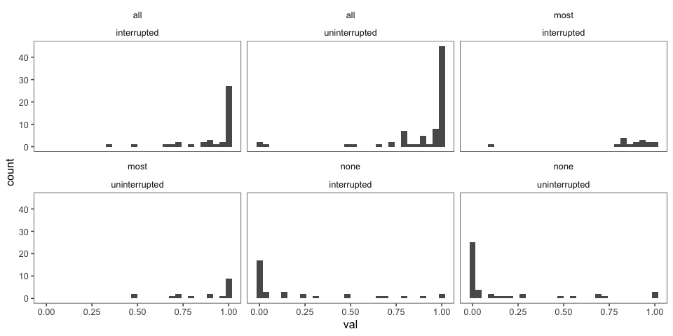
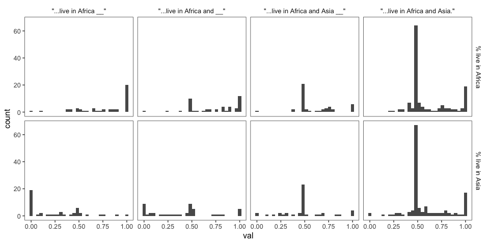
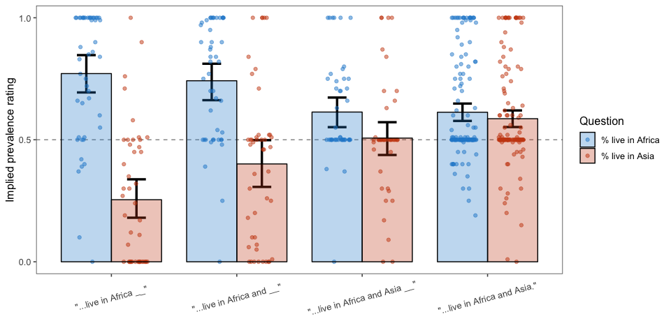
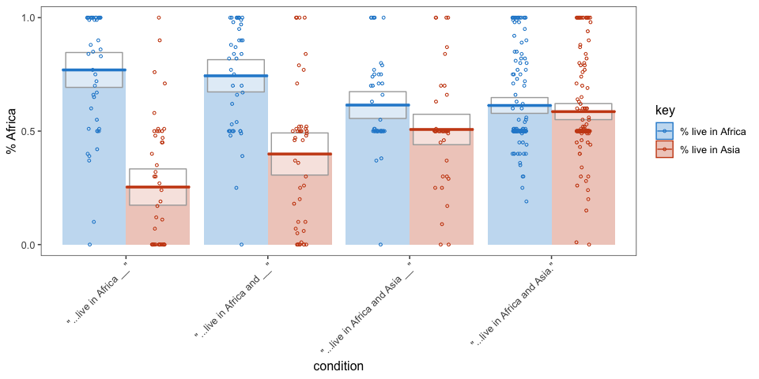
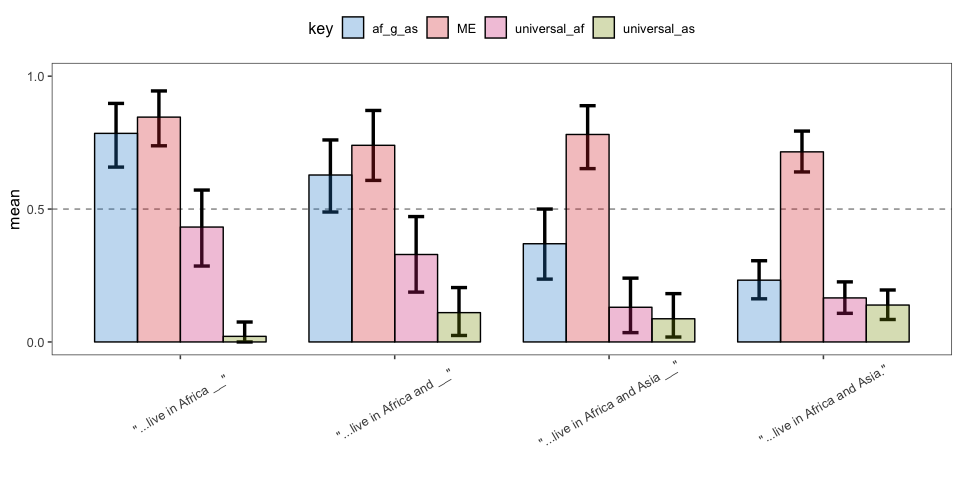
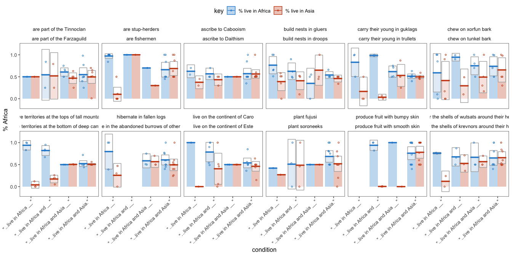
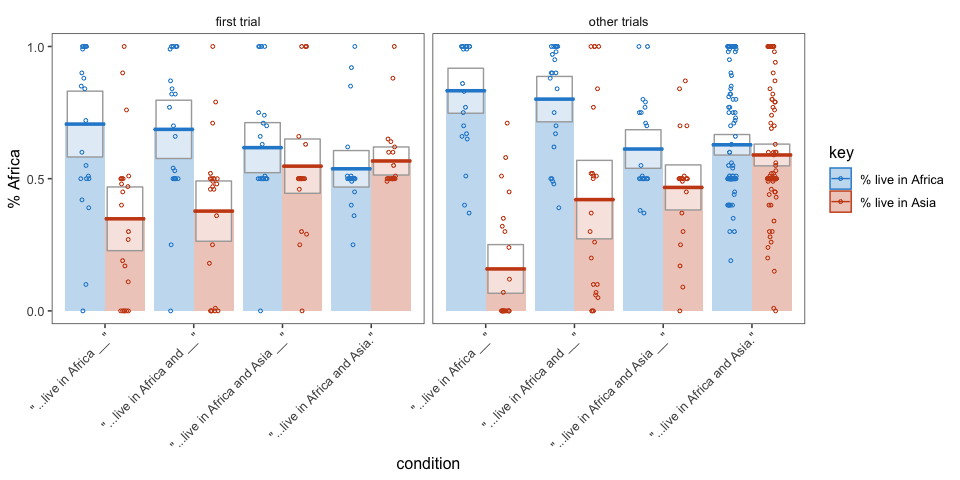
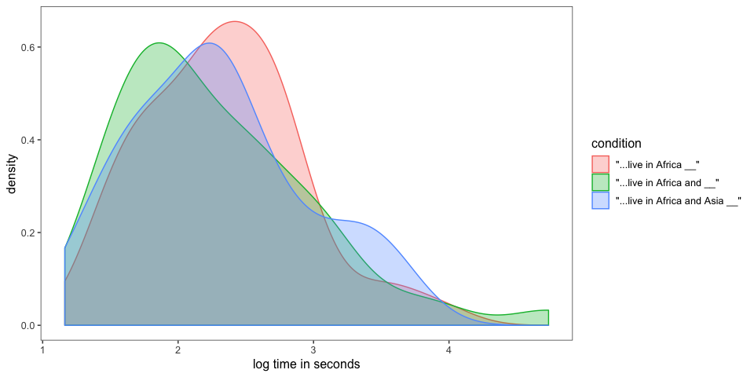

elephants-5-pilot
================
MH Tessler
1/28/2019

[Link to experiment](http://www.mit.edu/~tessler/projects/elephants/experiments/elephants-5.html)

### Experiment 5 pilot

All questions interrupting.

-   int1: (Africa) -- Q(Af, As) -- (and eat bugs in the wild)
-   int2: (Africa and) -- Q(Af, As) -- (eat bugs in the wild)
-   int4: (Africa and Asia) -- Q(Af, As) -- (which is warm)

### Subject information

|  workerid| language | enjoyment | age | gender | problems                                                                                                | comments                                                                                                                                |
|---------:|:---------|:----------|:----|:-------|:--------------------------------------------------------------------------------------------------------|:----------------------------------------------------------------------------------------------------------------------------------------|
|         0| English  | 1         | 35  | Male   | There are too many made up words to make it possible to remember most things after the chapter is over. |                                                                                                                                         |
|         1| english  | 1         | 45  | Female | no                                                                                                      |                                                                                                                                         |
|         2| English  | 0         | 35  | Male   |                                                                                                         |                                                                                                                                         |
|         3| English  | 1         | 44  | Male   | No.                                                                                                     |                                                                                                                                         |
|         4| English  | 0         | 27  | Female | no                                                                                                      |                                                                                                                                         |
|         5| English  | 1         | 30  | Female | no                                                                                                      |                                                                                                                                         |
|         6| English  | 1         | 66  | Male   | no                                                                                                      | n/a                                                                                                                                     |
|         7| English  | 1         | 23  | Male   | No                                                                                                      | It would be nice to have a little extra time on the hit so we don&quotechart have to rush too much. But other than that it was perfect. |
|         8| english  | 1         | 58  | Female | no                                                                                                      |                                                                                                                                         |
|         9| english  | 1         | 45  | Male   | no                                                                                                      | thanks!                                                                                                                                 |
|        10| English  | 0         | 32  | Female | No                                                                                                      |                                                                                                                                         |
|        11| ENGLISH  | 0         | 30  | Male   | NO                                                                                                      | NO COMMENTS                                                                                                                             |
|        12| turkish  | 0         | 34  | Female |                                                                                                         |                                                                                                                                         |
|        13| english  | 1         | 47  | Female | no                                                                                                      |                                                                                                                                         |
|        14| English  | 0         | 24  | Female | Sometimes a page would skip without me clicking on it.                                                  |                                                                                                                                         |
|        15| English  | 0         | 44  | Female | no                                                                                                      | no                                                                                                                                      |
|        16| english  | 1         | 29  | Female | no                                                                                                      |                                                                                                                                         |
|        17| english  | 0         | 31  | Female | none                                                                                                    |                                                                                                                                         |
|        18| english  | 0         | 38  | Female | no                                                                                                      |                                                                                                                                         |
|        19| English  | 1         | 30  | Male   | No                                                                                                      | Nothing                                                                                                                                 |
|        20| English  | -1        | 24  | Female | no                                                                                                      |                                                                                                                                         |
|        21| English  | 0         | 38  | Female | no                                                                                                      |                                                                                                                                         |
|        22| ENGLISH  | 0         | 32  | Male   | NO                                                                                                      |                                                                                                                                         |
|        23| English  | 1         | 48  | Female | I kept feeling like there were extra pages, or things out of place.                                     |                                                                                                                                         |
|        24| English  | -1        | 35  | Male   |                                                                                                         | Brutal.                                                                                                                                 |
|        25| English  | 0         | 35  | Female | no                                                                                                      |                                                                                                                                         |
|        26| ENGLISH  | 0         | 31  | Male   | YES SOME CONFUSED                                                                                       | NICE STUDY                                                                                                                              |

Attention check
---------------

### Slider practice

Before the experiment, participants practice usign the sliders to rate 3 category--property pairs:

-   dogs bark (coded as correct if x &gt; 0.5)
-   birds are male (coded as correct if 0.25 &lt; x &lt; 0.75)
-   cats get cancer (coded as correct if x &lt; 0.75) \[being generous with this one\]
-   lions lay eggs (coded as correct if x &lt; 0.10)

|  n\_correct|    n|
|-----------:|----:|
|           2|    2|
|           4|   25|

| property        |  n\_correct|
|:----------------|-----------:|
| birds are male  |          26|
| cats get cancer |          27|
| dogs bark       |          26|
| lions lay eggs  |          25|

### Memory check

After the story, participants select statements they recall learning from a list of 10 generic statements about novel animals (5 true, 5 distractor). They are also asked to explain what they did in the experiment.
Note: for this pilot, memory checks were mistakenly asked even though the participant did not see the corresponding chapter. This was resolved for future experiments, beginning at elephants-6.

### Explanations of task

|  workerid|  n\_slider\_correct|  n\_memory\_correct| explanation                                                                                                                                                                                                                                                                             |
|---------:|-------------------:|-------------------:|:----------------------------------------------------------------------------------------------------------------------------------------------------------------------------------------------------------------------------------------------------------------------------------------|
|         0|                   4|                   6| Read a story about alien stuff and try to answer questions with little context as best I could.                                                                                                                                                                                         |
|         1|                   4|                   7| i answered questions about the aliens and their habitats.                                                                                                                                                                                                                               |
|         2|                   4|                   7| Memory and interp. of story                                                                                                                                                                                                                                                             |
|         3|                   4|                   7| I focused on the primary focus of each chapter and any attributes to remember later.                                                                                                                                                                                                    |
|         4|                   4|                   5| Read a book about an alien planets and their creatures/weather and then provided percentage chance on things                                                                                                                                                                            |
|         5|                   4|                   8| Read a story about animals and had to answer questions after every chapter                                                                                                                                                                                                              |
|         6|                   4|                   7| I read the stories out loud and answered the questions as best as I could.                                                                                                                                                                                                              |
|         7|                   4|                   8| I read the story and answered random questions about it by providing percentages about certain facts from the story.                                                                                                                                                                    |
|         8|                   4|                   5| I read about an a different planet that has similar continents to earth but different animals and people and read and marked on a scales what I thought they did in life                                                                                                                |
|         9|                   4|                   8| read a story about aliens and their habits and used sliders to answer percentage questions                                                                                                                                                                                              |
|        10|                   4|                   6| I had to read chapters about aliens and answer questions about percentages on sliding scales.                                                                                                                                                                                           |
|        11|                   2|                   3| THE SURVEY IS ABOUT A BIRDS                                                                                                                                                                                                                                                             |
|        12|                   4|                   6| I read the stories and answered the questions.                                                                                                                                                                                                                                          |
|        13|                   4|                   6| i just tried to remember names and places and items used as many details as possible.                                                                                                                                                                                                   |
|        14|                   4|                   8| We read a story about a different world and how that world operated, occasionally answering questions as we went along.                                                                                                                                                                 |
|        15|                   4|                   8| Read a story about a planet similiar to Earth and what the aliens are like that live there.                                                                                                                                                                                             |
|        16|                   4|                   8| I read about different aleins and answered questions along the way.                                                                                                                                                                                                                     |
|        17|                   4|                   6| I read chapters from a history of the planet Dax, and then estimated percentages for two things from each chapter.                                                                                                                                                                      |
|        18|                   4|                   8| Read a story and gave percentage values to questions                                                                                                                                                                                                                                    |
|        19|                   4|                   7| Very nice experiment.                                                                                                                                                                                                                                                                   |
|        20|                   4|                   8| I read things about a foreign planet and answered questions about them                                                                                                                                                                                                                  |
|        21|                   4|                   8| Read a story about aliens and answered percentage questions                                                                                                                                                                                                                             |
|        22|                   4|                   6| i learnt an alien language                                                                                                                                                                                                                                                              |
|        23|                   4|                   8| Read a fictional story about a made up planet, and answered questions about the likelihood of various things about the story.                                                                                                                                                           |
|        24|                   4|                   7| I tried to remember what I read as well as I could, but pretty much found it to be impossible. I kept wondering why the text was broken into bits like it was...made comprehension and retention so much more difficult and needlessly increased the time it took to complete the task. |
|        25|                   4|                   8| I read about different aliens that live on a planet that is similar to earth. I learned all about the aliens and answered questions about percentages of them as I went along.                                                                                                          |
|        26|                   2|                   3| TO READ A STORY AND ANSWER THE QUESTIONS                                                                                                                                                                                                                                                |

Trial data
----------

Removing participants who got fewer than 7 correct on memory check and didn't get all 4 sliders.

### Included/excluded subject numbers

| memory\_fail | slider\_fail | bad\_expln |    n|
|:-------------|:-------------|:-----------|----:|
| FALSE        | FALSE        | FALSE      |   16|
| FALSE        | FALSE        | TRUE       |    1|
| TRUE         | FALSE        | FALSE      |    7|
| TRUE         | FALSE        | TRUE       |    1|
| TRUE         | TRUE         | TRUE       |    2|

### Prevalence Estimates per Participant

Histogram of all of a single participant's prevalence estimates, collapsed across trials and color coded for the number of correct responses on the memory check.
- fill = number of correct responses on the memory check (out of 10)
- facet = participants

filler trials
-------------

these used quantifiers (and thus we have strong idea about literal meaning)

critical trials (collapsed across item)
---------------------------------------

*Conditions*

1.  AF: "Elephants live in Africa" -- Q(Africa, Asia) -- "and breathe oxygen"
2.  AF&: "Elephants live in Africa and" -- Q(Africa, Asia) -- "breathe oxygen"
3.  AF&AS: "Elephants live in Africa and Asia" -- Q(Africa, Asia) -- "while alive"

### N's per condition

| condition                         |    n|
|:----------------------------------|----:|
| "...live in Africa \_\_"          |   46|
| "...live in Africa and \_\_"      |   46|
| "...live in Africa and Asia \_\_" |   46|
| "...live in Africa and Asia."     |  138|

### bootstrapped 95% confidence intervals

*Property 2* = "% live in Asia" for all but the NME (non mutually exclusive) trials

### pirate plots

### Bootstrapped 95% Confidence Intervals for Relationships Between Prevalence Estimates (collapsed across items)

The relationships between prevalence estimates of the mentioned property (property 1) and the other property (property 2) could be: - mutually exclusive: both properties cannot occur at the same time, so the sum of prevalence estimates cannot exceed 1
- prevalence for property 1 is greater than property 2
- property 1 is interpreted as a universal
- property 2 is interpreted as a universal
\* These conditions are not mutually exclusive; a participant can fall into one or more of the categories for a given trial.

### By-item averages

### Number of participants by Item and Condition

| predicate\_1                                   | predicate\_2                                        |  "...live in Africa \_\_"|  "...live in Africa and \_\_"|  "...live in Africa and Asia \_\_"|  "...live in Africa and Asia."|
|:-----------------------------------------------|:----------------------------------------------------|-------------------------:|-----------------------------:|----------------------------------:|------------------------------:|
| are part of the Tinnoclan                      | are part of the Farzaguild                          |                         2|                             4|                                 10|                             16|
| are stup-herders                               | are fishermen                                       |                        12|                             2|                                  2|                             16|
| ascribe to Cabooism                            | ascribe to Daithism                                 |                         4|                             6|                                  2|                             20|
| build nests in gluers                          | build nests in droops                               |                        10|                             8|                                  6|                              8|
| carry their young in guklags                   | carry their young in trullets                       |                         6|                             4|                                  8|                             14|
| chew on xorfun bark                            | chew on tunkel bark                                 |                        10|                             4|                                  8|                             10|
| have territories at the tops of tall mountains | have territories at the bottom of deep canyons      |                         6|                             8|                                  4|                             14|
| hibernate in fallen logs                       | hibernate in the abandoned burrows of other animals |                         6|                             0|                                  6|                             20|
| live on the continent of Caro                  | live on the continent of Este                       |                         2|                            10|                                  6|                             14|
| plant fujusi                                   | plant soroneeks                                     |                         2|                             6|                                  4|                             20|
| produce fruit with bumpy skin                  | produce fruit with smooth skin                      |                         0|                             6|                                  2|                             24|
| wear the shells of wutsats around their heads  | wear the shells of krevnors around their heads      |                         4|                             6|                                  6|                             16|

### Pirate plots (by item)

first trial vs. other trials (for each condition)
-------------------------------------------------

### Pirate Plots (first vs. other trials)

Reaction times
--------------

*how much time do participants spend on the question slide?*

Looking only at

-   AF: "Elephants live in Africa"
-   AF&: "Elephants live in Africa and"
-   AF&AS: "Elephants live in Africa and Asia"

