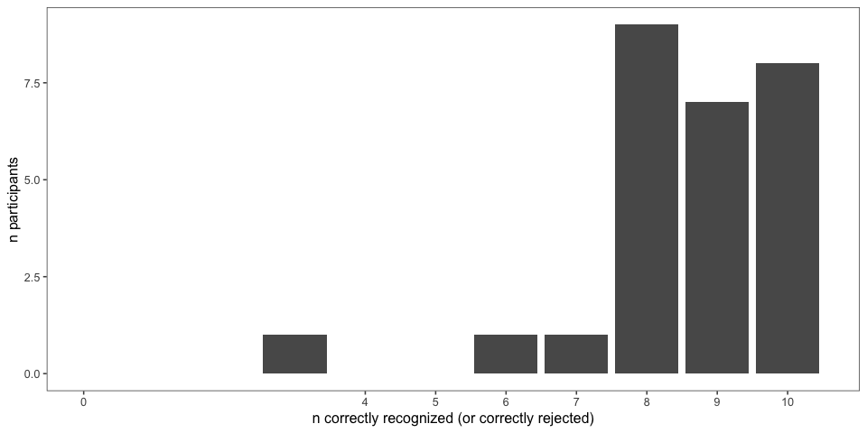
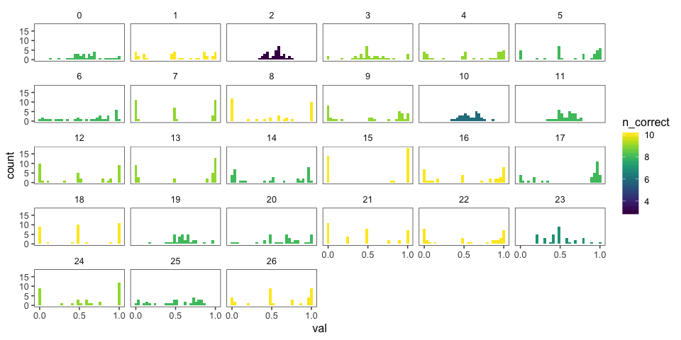
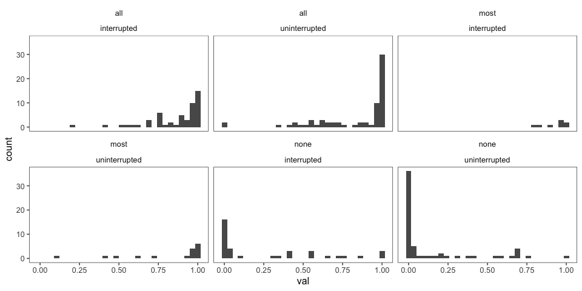
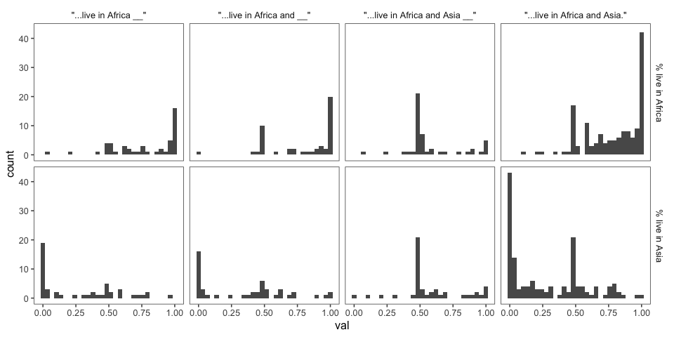
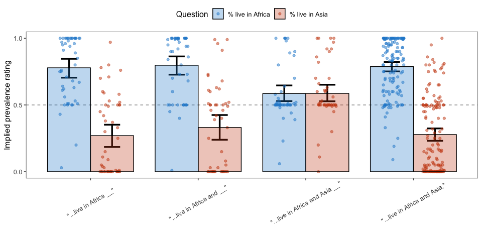
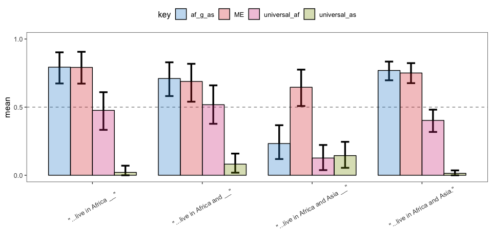
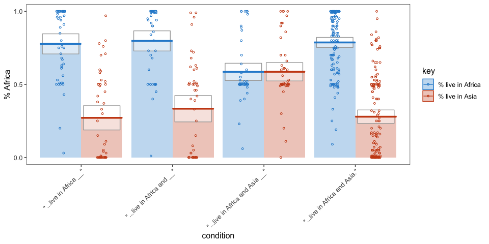
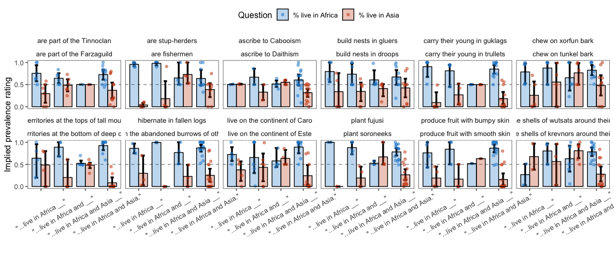
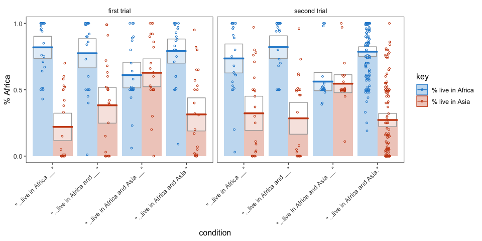
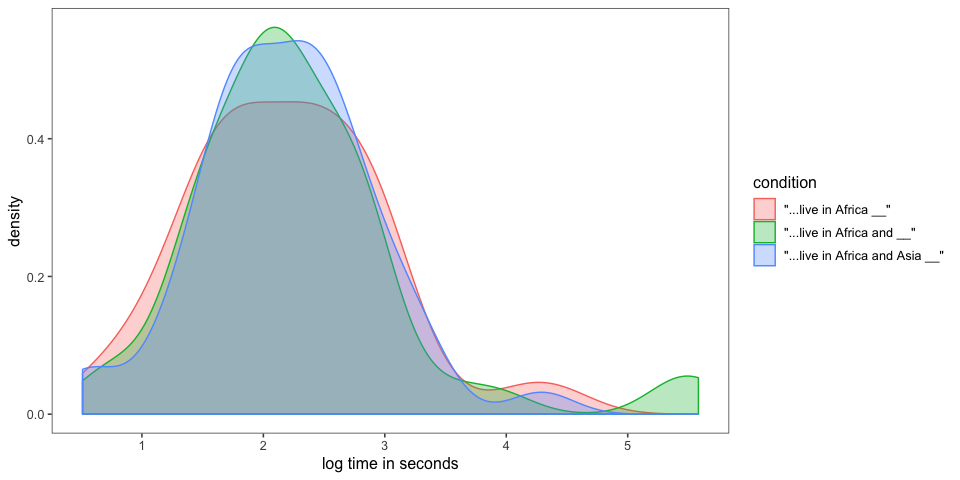

elephants-5-pilot
================
MH Tessler
1/28/2019

[Link to experiment](http://www.mit.edu/~tessler/projects/elephants/experiments/elephants-6.html)

Experiment 6 pilot
------------------

All questions interrupting.

-   int1: (Africa) -- Q(Af, As) -- (and eat bugs in the wild)
-   int2: (Africa and) -- Q(Af, As) -- (eat bugs in the wild)
-   int4: (Africa and Asia) -- Q(Af, As) -- (which is warm)

Subject information
-------------------

|  workerid| language      | enjoyment | age | gender | problems         | comments                                                                                                                                                                                                                                     |
|---------:|:--------------|:----------|:----|:-------|:-----------------|:---------------------------------------------------------------------------------------------------------------------------------------------------------------------------------------------------------------------------------------------|
|         0| english       | 0         | 23  | Male   | no               |                                                                                                                                                                                                                                              |
|         1| English       | 0         | 23  | Male   | No bugs          |                                                                                                                                                                                                                                              |
|         2| English       | 0         | 40  | Female |                  |                                                                                                                                                                                                                                              |
|         3| English       | 0         | 27  | Male   |                  |                                                                                                                                                                                                                                              |
|         4| english       | 0         | 29  | Female | no               |                                                                                                                                                                                                                                              |
|         5| english       | 0         | 40  | Female | none             |                                                                                                                                                                                                                                              |
|         6| english       | 0         | 40  | Female | none             |                                                                                                                                                                                                                                              |
|         7| english       | 1         | 45  | Male   | no               |                                                                                                                                                                                                                                              |
|         8| English       | 0         | 50  | Male   | No.              | Thank you.                                                                                                                                                                                                                                   |
|         9| english       | 0         | 42  | Female | no               |                                                                                                                                                                                                                                              |
|        10| English       | 1         | 29  | Female |                  |                                                                                                                                                                                                                                              |
|        11| United States | 0         | 25  | Male   |                  |                                                                                                                                                                                                                                              |
|        12| English       | 0         | 56  | Male   | none             |                                                                                                                                                                                                                                              |
|        13| English       | 1         | 31  | Male   | None!            | Nope! Thanks for the opportunity and I hope y&quotecharalls study goes well.                                                                                                                                                                 |
|        14| english       | 1         | 36  | Female |                  |                                                                                                                                                                                                                                              |
|        15| English       | 1         | 34  | Male   | No               | The stories were interesting                                                                                                                                                                                                                 |
|        16| english       | 1         | 54  | Female | no               | thank you                                                                                                                                                                                                                                    |
|        17| English       | 0         | 34  | Male   | No               | None                                                                                                                                                                                                                                         |
|        18| english       | 0         | 44  |        | no all went well |                                                                                                                                                                                                                                              |
|        19| English       | 0         | 44  | Male   | no               | none                                                                                                                                                                                                                                         |
|        20| english       | 1         | 31  | Female | no               |                                                                                                                                                                                                                                              |
|        21| English       | -1        | 32  | Male   |                  | Not a bad format, but convoluted due to the sheer amount of information included. Shortened or featuring fewer creatures would make it more interesting. Difficult to really  anything when a new creature is being mentioned so frequently. |
|        22| English       | 1         | 28  | Male   | n/a              |                                                                                                                                                                                                                                              |
|        23| English       | 0         | 27  | Female | nope             |                                                                                                                                                                                                                                              |
|        24| English       | 0         | 33  | Female | No               | Neat!                                                                                                                                                                                                                                        |
|        25| english       | 0         | 45  | Female | no               |                                                                                                                                                                                                                                              |
|        26| English       | 0         | 70  | Female | none             | interesting, thank you                                                                                                                                                                                                                       |

Attention check
---------------

### Slider practice

Before the experiment, participants practice using the sliders to rate 3 category-property pairs: - dogs bark (coded as correct if x &gt; 0.5) - birds are male (coded as correct if 0.25 &lt; x &lt; 0.75) - cats get cancer (coded as correct if x &lt; 0.75) \[being generous with this one\] - lions lay eggs (coded as correct if x &lt; 0.10)

|  n\_correct|    n|
|-----------:|----:|
|           3|    1|
|           4|   26|

| property        |  n\_correct|
|:----------------|-----------:|
| birds are male  |          27|
| cats get cancer |          27|
| dogs bark       |          27|
| lions lay eggs  |          26|

### Memory check

After the story, participants select statements they recall learning from a list of 10 generic statements about novel animals (5 true, 5 distractor).

### Explanations of task

After the story, participants are also asked to explain generally what they did in the experiment.

|  workerid|  n\_slider\_correct|  n\_memory\_correct| explanation                                                                                                                                                                                                            |
|---------:|-------------------:|-------------------:|:-----------------------------------------------------------------------------------------------------------------------------------------------------------------------------------------------------------------------|
|         0|                   4|                   8| learned about creatures and cultures                                                                                                                                                                                   |
|         1|                   4|                  10| I read a story about aliens and judged on a scale what I thought was true about them, their planet, and animals.                                                                                                       |
|         2|                   4|                   3| Reading about a planet called Dax                                                                                                                                                                                      |
|         3|                   4|                   9| Read about an alien story                                                                                                                                                                                              |
|         4|                   4|                   9| Read a story with madeup words                                                                                                                                                                                         |
|         5|                   4|                   8| I tried to read out loud and went slowly to help me retain what I was reading.                                                                                                                                         |
|         6|                   4|                   8| opinions                                                                                                                                                                                                               |
|         7|                   4|                   9| Tried to remember facts from a story about aliens and then answer questions on a scale about the story                                                                                                                 |
|         8|                   4|                  10| Learned about aliens, their habitats and culture and answered questions about the aliens, estimating various probability questions based upon what I read.                                                             |
|         9|                   4|                   9| I read and answered questions about aliens.                                                                                                                                                                            |
|        10|                   4|                   6| I read a story about aliens.                                                                                                                                                                                           |
|        11|                   4|                   8| I was reading about different types of aliens and their preferences.                                                                                                                                                   |
|        12|                   4|                   9| I tried to remember the details of the story as it went along, concentrating on names.                                                                                                                                 |
|        13|                   4|                   9| I read a bunch of gobbledeygoop and then answered a few questions about said gobbledeygoop. Major bonus points for the interesting alien names... I&quotechard like to know what regimen of drugs they&quotecharre on. |
|        14|                   4|                   8| i had to read the story and answer the questions                                                                                                                                                                       |
|        15|                   4|                  10| I was asked to rate the percentage of facts in a story.                                                                                                                                                                |
|        16|                   4|                  10| Read stories about alien life on another planet and answered questions.                                                                                                                                                |
|        17|                   3|                   8| Read all the story with full attention.And give the answer.                                                                                                                                                            |
|        18|                   4|                  10| read a story and answered questions on each chapter                                                                                                                                                                    |
|        19|                   4|                   8| read a story trying to learn a alien language                                                                                                                                                                          |
|        20|                   4|                   8| I read chapters about a made up world of aliens. What they eat, where they live and what they do. I then answered questions about how likely some of the events happening were.                                        |
|        21|                   4|                  10| Estimate the percentage that a certain species did something or exhibited a certain trait based on the information provided by the story                                                                               |
|        22|                   4|                  10| Answer questions with a scale about how accurate certain statements related to the story were.                                                                                                                         |
|        23|                   4|                   7| I mostly tried to think about how their lifestyle related to real people but it wasn&quotechart always easy                                                                                                            |
|        24|                   4|                   9| I read everything out loud, and then tried to remember when the screen came up with percentages what the specifics were. It was actually really difficult.                                                             |
|        25|                   4|                   8| I read about different things with odd new names then answered questions in percentages.                                                                                                                               |
|        26|                   4|                  10| took notes, read about strangely named locals and creatures                                                                                                                                                            |

Included/excluded subject numbers
---------------------------------

Removing participants who got fewer than 7 correct on memory check and didn't get all 4 sliders. (Participants with bad explanations usually fell into one of these other groups.)

| memory\_fail | slider\_fail |    n|
|:-------------|:-------------|----:|
| FALSE        | FALSE        |   24|
| FALSE        | TRUE         |    1|
| TRUE         | FALSE        |    2|

Prevalence Estimates per Participant
------------------------------------

Histogram of all of a single participant's prevalence estimates, collapsed across trials and color coded for the number of correct responses on the memory check.
- fill = number of correct responses on the memory check (out of 10)
- facet = participants

Filler Trials
-------------

These used quantifiers (and thus we have strong idea about literal meaning).

Critical Trials (collapsed across item)
---------------------------------------

*Conditions*

1.  AF: "Elephants live in Africa" -- Q(Africa, Asia) -- "and breathe oxygen"
2.  AF&: "Elephants live in Africa and" -- Q(Africa, Asia) -- "breathe oxygen"
3.  AF&AS: "Elephants live in Africa and Asia" -- Q(Africa, Asia) -- "while alive"

### Number of Participants by Condition

| condition                         |    n|
|:----------------------------------|----:|
| "...live in Africa \_\_"          |   48|
| "...live in Africa and \_\_"      |   48|
| "...live in Africa and Asia \_\_" |   48|
| "...live in Africa and Asia."     |  144|

### Histograms of Prevalence Estimates by Condition (collapsed across trials)

### Bootstrapped 95% Confidence Intervals (collapsed across item)

*Property 2* = "% live in Asia" for ME trials and "% eat bugs" for NME trials

### Bootstrapped 95% Confidence Intervals for Relationships Between Prevalence Estimates (collapsed across items)

The relationships between prevalence estimates of the mentioned property (property 1) and the other property (property 2) could be: - mutually exclusive: both properties cannot occur at the same time, so the sum of prevalence estimates cannot exceed 1
- prevalence for property 1 is greater than property 2
- property 1 is interpreted as a universal
- property 2 is interpreted as a universal
\* These conditions are not mutually exclusive; a participant can fall into one or more of the categories for a given trial.

### Pirate Plots (collapsed across item)

By-item Analyses
----------------

### Number of participants by Item and Condition

| predicate\_1                                   | predicate\_2                                        |  "...live in Africa \_\_"|  "...live in Africa and \_\_"|  "...live in Africa and Asia \_\_"|  "...live in Africa and Asia."|
|:-----------------------------------------------|:----------------------------------------------------|-------------------------:|-----------------------------:|----------------------------------:|------------------------------:|
| are part of the Tinnoclan                      | are part of the Farzaguild                          |                        12|                            12|                                  2|                             22|
| are stup-herders                               | are fishermen                                       |                        12|                            10|                                  8|                             18|
| ascribe to Cabooism                            | ascribe to Daithism                                 |                         4|                             4|                                 10|                             30|
| build nests in gluers                          | build nests in droops                               |                         8|                            12|                                 10|                             18|
| carry their young in guklags                   | carry their young in trullets                       |                        10|                             8|                                  6|                             24|
| chew on xorfun bark                            | chew on tunkel bark                                 |                        10|                             8|                                 10|                             20|
| have territories at the tops of tall mountains | have territories at the bottom of deep canyons      |                         8|                             6|                                 16|                             18|
| hibernate in fallen logs                       | hibernate in the abandoned burrows of other animals |                         6|                             4|                                  6|                             32|
| live on the continent of Caro                  | live on the continent of Este                       |                        10|                            12|                                  8|                             18|
| plant fujusi                                   | plant soroneeks                                     |                         4|                             8|                                  6|                             30|
| produce fruit with bumpy skin                  | produce fruit with smooth skin                      |                         8|                             6|                                  2|                             32|
| wear the shells of wutsats around their heads  | wear the shells of krevnors around their heads      |                         4|                             6|                                 12|                             26|

### Pirate Plots (by item)

First Trial vs. Other Trials (for each condition)
-------------------------------------------------

### Pirate Plots (first vs. other trials)

Reaction times
--------------

*how much time do participants spend on the question slide?*

Looking only at - AF: "Elephants live in Africa" - AF&: "Elephants live in Africa and" - AF&AS: "Elephants live in Africa and Asia"

