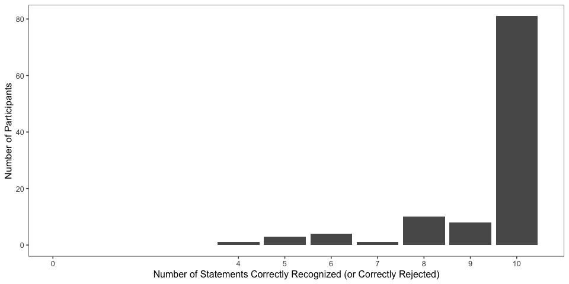
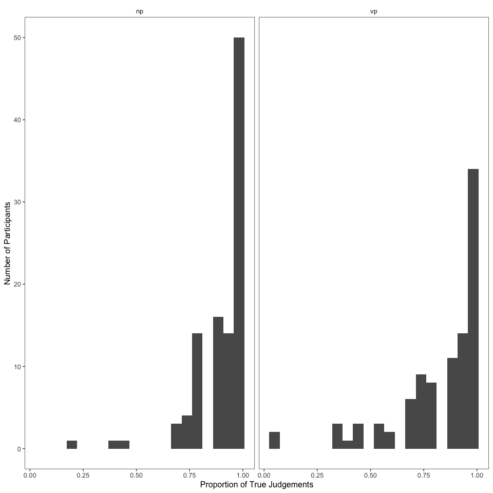
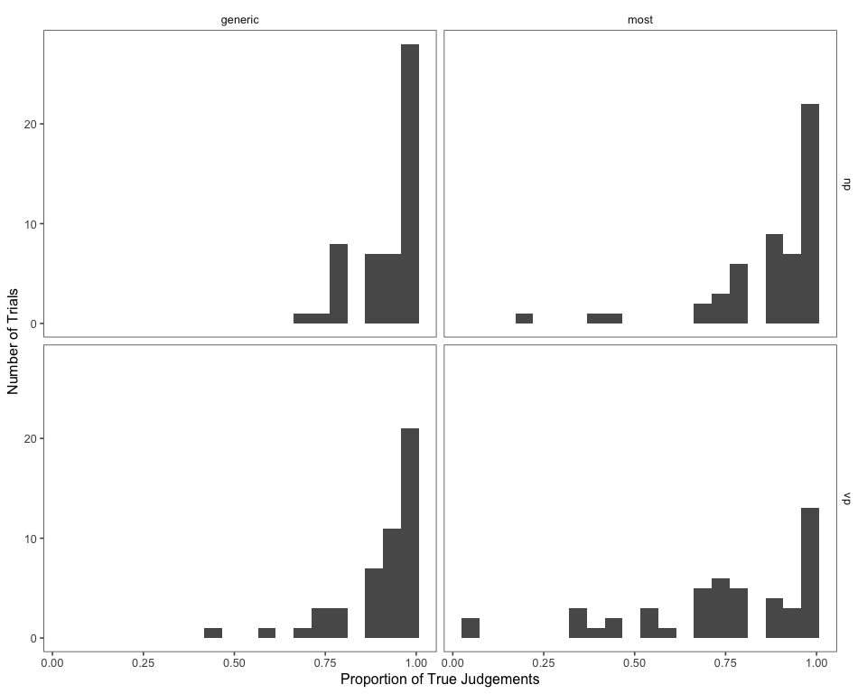
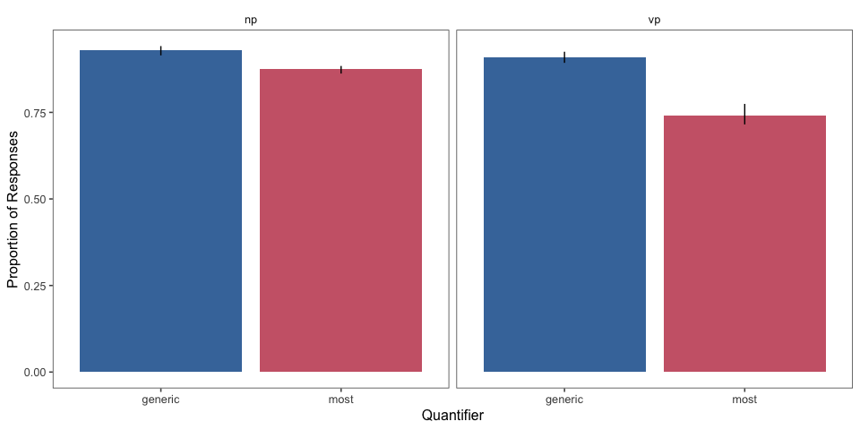
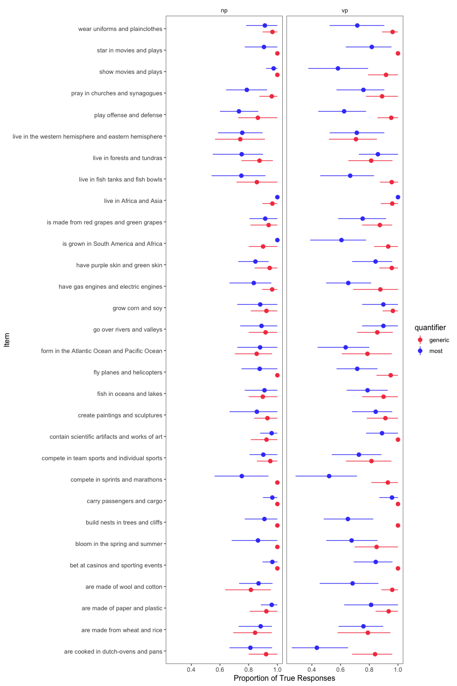

elephants-9-pilot
================
Karen Gu
5/08/2019

[Link to experiment (VP)](https://www.mit.edu/~karengu/elephants_vp/elephants/experiments/elephants-9.html)

Experiment 9 Pilot (Truth Version)
----------------------------------

TVJT using a 2-alternative forced choice, where participants rate items of the form Elephants live in Africa and Asia. \* between-subjects: VP vs. NP coordination
\* within-subjects: generic vs. most \* 30 trials per subject (15 generic, 15 most)

Subject Information
-------------------

|  workerid| language         | enjoyment | age | gender | problems                                                                                                                                                                | comments                                                                                                                                                                                                                                                                                                                                                                                                                                             |
|---------:|:-----------------|:----------|:----|:-------|:------------------------------------------------------------------------------------------------------------------------------------------------------------------------|:-----------------------------------------------------------------------------------------------------------------------------------------------------------------------------------------------------------------------------------------------------------------------------------------------------------------------------------------------------------------------------------------------------------------------------------------------------|
|         0| english          | 2         | 31  | Male   | not at all                                                                                                                                                              | its nice                                                                                                                                                                                                                                                                                                                                                                                                                                             |
|         1| eng              | 2         | 40  | Female | no                                                                                                                                                                      | It was a bit fun like a trivia game.                                                                                                                                                                                                                                                                                                                                                                                                                 |
|         2| English          | 1         | 30  | Male   | None                                                                                                                                                                    |                                                                                                                                                                                                                                                                                                                                                                                                                                                      |
|         3| English          | 1         | 35  | Female | No                                                                                                                                                                      | No comment                                                                                                                                                                                                                                                                                                                                                                                                                                           |
|         4| English          | 2         | 20  | Male   | No.                                                                                                                                                                     |                                                                                                                                                                                                                                                                                                                                                                                                                                                      |
|         5| English          | 2         | 26  | Male   |                                                                                                                                                                         |                                                                                                                                                                                                                                                                                                                                                                                                                                                      |
|         6| english          | 2         | 31  | Male   | not at all                                                                                                                                                              | its nice                                                                                                                                                                                                                                                                                                                                                                                                                                             |
|         7| English          | 2         | 57  | Female | no                                                                                                                                                                      |                                                                                                                                                                                                                                                                                                                                                                                                                                                      |
|         8| English          | 1         | 45  | Male   | no                                                                                                                                                                      |                                                                                                                                                                                                                                                                                                                                                                                                                                                      |
|         9| english          | 2         | 25  | Female | no                                                                                                                                                                      |                                                                                                                                                                                                                                                                                                                                                                                                                                                      |
|        10| English          | 2         | 37  | Female | no                                                                                                                                                                      |                                                                                                                                                                                                                                                                                                                                                                                                                                                      |
|        11| English          | 1         | 40  | Female | no                                                                                                                                                                      |                                                                                                                                                                                                                                                                                                                                                                                                                                                      |
|        12| english          | 1         | 35  | Female | none                                                                                                                                                                    | Good study, thank you                                                                                                                                                                                                                                                                                                                                                                                                                                |
|        13| English          | 1         | 25  | Male   | no                                                                                                                                                                      |                                                                                                                                                                                                                                                                                                                                                                                                                                                      |
|        14| English          | 1         | 35  | Female | NA                                                                                                                                                                      | Thanks                                                                                                                                                                                                                                                                                                                                                                                                                                               |
|        15| English          | 1         | 29  | Male   | No                                                                                                                                                                      |                                                                                                                                                                                                                                                                                                                                                                                                                                                      |
|        16| English          | 2         | 36  | Female | no                                                                                                                                                                      |                                                                                                                                                                                                                                                                                                                                                                                                                                                      |
|        17| English          | 1         | 51  | Male   | no                                                                                                                                                                      |                                                                                                                                                                                                                                                                                                                                                                                                                                                      |
|        18| English          | 2         | 18  | Male   | no                                                                                                                                                                      |                                                                                                                                                                                                                                                                                                                                                                                                                                                      |
|        19| English          | 2         | 22  | Male   |                                                                                                                                                                         |                                                                                                                                                                                                                                                                                                                                                                                                                                                      |
|        20| English          | 2         | 33  | Male   | N/A                                                                                                                                                                     | Interesting experiment.                                                                                                                                                                                                                                                                                                                                                                                                                              |
|        21| english          | 2         | 25  | Male   | no                                                                                                                                                                      | nothing                                                                                                                                                                                                                                                                                                                                                                                                                                              |
|        22| English          | 1         | 40  | Male   | No                                                                                                                                                                      |                                                                                                                                                                                                                                                                                                                                                                                                                                                      |
|        23| English          | 1         | 36  | Female | no                                                                                                                                                                      |                                                                                                                                                                                                                                                                                                                                                                                                                                                      |
|        24| English          | 2         | 24  | Male   | No                                                                                                                                                                      |                                                                                                                                                                                                                                                                                                                                                                                                                                                      |
|        25| English          | 2         | 48  | Female | no                                                                                                                                                                      | I love this experiment as it was very educational and informative. Thank you and keep up the good work!                                                                                                                                                                                                                                                                                                                                              |
|        26| English          | 2         | 39  | Male   | No                                                                                                                                                                      |                                                                                                                                                                                                                                                                                                                                                                                                                                                      |
|        27| english          | 1         | 29  | Male   | no                                                                                                                                                                      |                                                                                                                                                                                                                                                                                                                                                                                                                                                      |
|        28| english          | 2         | 33  | Male   | no                                                                                                                                                                      | very nice                                                                                                                                                                                                                                                                                                                                                                                                                                            |
|        29| English          | 2         | 27  | Male   |                                                                                                                                                                         | Fun, interesting, and much better pay than most HITs (that is, the pay is actually fair). Thanks!                                                                                                                                                                                                                                                                                                                                                    |
|        30| english          | 1         | 43  | Female | no                                                                                                                                                                      |                                                                                                                                                                                                                                                                                                                                                                                                                                                      |
|        31| English          | 2         | 37  | Female | No                                                                                                                                                                      | Thanks                                                                                                                                                                                                                                                                                                                                                                                                                                               |
|        32| English          | 2         | 28  | Female | NO                                                                                                                                                                      | I like this hit, it was different.                                                                                                                                                                                                                                                                                                                                                                                                                   |
|        33| english          | 1         | 37  | Male   | no                                                                                                                                                                      |                                                                                                                                                                                                                                                                                                                                                                                                                                                      |
|        34| English          | 1         | 34  | Female | No problems                                                                                                                                                             | No comments - it was well-organized and easy to follow                                                                                                                                                                                                                                                                                                                                                                                               |
|        35| English          | 2         | 44  | Female | No.                                                                                                                                                                     |                                                                                                                                                                                                                                                                                                                                                                                                                                                      |
|        36| English          | 2         | 49  | Male   | no                                                                                                                                                                      |                                                                                                                                                                                                                                                                                                                                                                                                                                                      |
|        37| english          | 2         | 54  | Female | no                                                                                                                                                                      | thanks                                                                                                                                                                                                                                                                                                                                                                                                                                               |
|        38| English          | 2         | 50  | Male   | No.                                                                                                                                                                     | HIT was very interesting. Shows how much interpretation is a part of how we understand a sentence. I found myself having some trouble determining if the sentences were saying all or not. For example, if you say fish live in rivers and lakes, are you saying they only live in rivers and lakes, or they can live in rivers and lakes? Some context is missing and the reader has to fill it in. Very interesting. Good luck with your research. |
|        39| English          | 2         | 23  | Male   |                                                                                                                                                                         |                                                                                                                                                                                                                                                                                                                                                                                                                                                      |
|        40| English          | 2         | 26  | Female |                                                                                                                                                                         |                                                                                                                                                                                                                                                                                                                                                                                                                                                      |
|        41| english          | 1         | 64  | Male   | no                                                                                                                                                                      |                                                                                                                                                                                                                                                                                                                                                                                                                                                      |
|        42| Vietnamese       | 1         | 32  | Male   | No.                                                                                                                                                                     |                                                                                                                                                                                                                                                                                                                                                                                                                                                      |
|        43| English          | 1         | 32  | Male   | No issues.                                                                                                                                                              |                                                                                                                                                                                                                                                                                                                                                                                                                                                      |
|        44| English          | 2         | 23  | Male   | No.                                                                                                                                                                     |                                                                                                                                                                                                                                                                                                                                                                                                                                                      |
|        45| ENGLISH          | 2         | 23  | Male   | N/A                                                                                                                                                                     | GOOD SURVEY THANKS                                                                                                                                                                                                                                                                                                                                                                                                                                   |
|        46| English          | 2         | 38  | Female | No problems                                                                                                                                                             | Interesting and enjoyable study and know some knowledgeable questions.                                                                                                                                                                                                                                                                                                                                                                               |
|        47| English          | 1         | 35  | Female |                                                                                                                                                                         |                                                                                                                                                                                                                                                                                                                                                                                                                                                      |
|        48| english, arabic  | 1         | 39  | Female | no                                                                                                                                                                      | none                                                                                                                                                                                                                                                                                                                                                                                                                                                 |
|        49| English          | 1         | 22  | Male   | No                                                                                                                                                                      |                                                                                                                                                                                                                                                                                                                                                                                                                                                      |
|        50| English          | 2         | 30  | Male   | no                                                                                                                                                                      |                                                                                                                                                                                                                                                                                                                                                                                                                                                      |
|        51| English          | 1         | 45  | Male   | no                                                                                                                                                                      |                                                                                                                                                                                                                                                                                                                                                                                                                                                      |
|        52| English          | 1         | 32  | Male   | no                                                                                                                                                                      | thanks                                                                                                                                                                                                                                                                                                                                                                                                                                               |
|        53| English          | 2         | 31  | Male   | no issues                                                                                                                                                               | Thank you. It was a decent hit for decent pay.                                                                                                                                                                                                                                                                                                                                                                                                       |
|        54| english          | 2         | 39  | Female | no                                                                                                                                                                      | Fun hit, thanks                                                                                                                                                                                                                                                                                                                                                                                                                                      |
|        55| English          | 1         | 27  | Male   | no                                                                                                                                                                      |                                                                                                                                                                                                                                                                                                                                                                                                                                                      |
|        56| English          | 2         | 25  | Male   | no                                                                                                                                                                      |                                                                                                                                                                                                                                                                                                                                                                                                                                                      |
|        57| English          | 2         | 66  | Female | NO                                                                                                                                                                      |                                                                                                                                                                                                                                                                                                                                                                                                                                                      |
|        58| english          | 2         | 36  | Female |                                                                                                                                                                         |                                                                                                                                                                                                                                                                                                                                                                                                                                                      |
|        59| ENGLISH          | 2         | 24  | Male   | None noticed                                                                                                                                                            |                                                                                                                                                                                                                                                                                                                                                                                                                                                      |
|        60| English          | 2         | 49  | Female | no                                                                                                                                                                      |                                                                                                                                                                                                                                                                                                                                                                                                                                                      |
|        61| English          | 2         | 45  | Female | no                                                                                                                                                                      | That was interesting!                                                                                                                                                                                                                                                                                                                                                                                                                                |
|        62| English          | 2         | 35  | Male   | None                                                                                                                                                                    | More please, this is clean and very stress free survey.                                                                                                                                                                                                                                                                                                                                                                                              |
|        63| English          | 2         | 28  | Male   | Nope                                                                                                                                                                    | Thanks for the study                                                                                                                                                                                                                                                                                                                                                                                                                                 |
|        64| ENGLISH          | 2         | 28  | Female | NONE                                                                                                                                                                    | NICE                                                                                                                                                                                                                                                                                                                                                                                                                                                 |
|        65| English          | 2         | 54  | Male   | none                                                                                                                                                                    | none                                                                                                                                                                                                                                                                                                                                                                                                                                                 |
|        66| English          | 2         | 60  | Male   | None                                                                                                                                                                    |                                                                                                                                                                                                                                                                                                                                                                                                                                                      |
|        67| English          | 1         | 32  | Male   | No.                                                                                                                                                                     |                                                                                                                                                                                                                                                                                                                                                                                                                                                      |
|        68| English          | 2         | 31  | Male   | No                                                                                                                                                                      |                                                                                                                                                                                                                                                                                                                                                                                                                                                      |
|        69| English          | 1         | 25  | Male   |                                                                                                                                                                         |                                                                                                                                                                                                                                                                                                                                                                                                                                                      |
|        70| English          | 1         | 43  | Female | no                                                                                                                                                                      |                                                                                                                                                                                                                                                                                                                                                                                                                                                      |
|        71| English          | 1         | 51  | Male   | no                                                                                                                                                                      |                                                                                                                                                                                                                                                                                                                                                                                                                                                      |
|        72| English          | 1         | 43  | Male   | no                                                                                                                                                                      |                                                                                                                                                                                                                                                                                                                                                                                                                                                      |
|        73| english          | 1         | 26  | Male   |                                                                                                                                                                         |                                                                                                                                                                                                                                                                                                                                                                                                                                                      |
|        74| English          | 2         | 23  | Female | No                                                                                                                                                                      |                                                                                                                                                                                                                                                                                                                                                                                                                                                      |
|        75| English          | 2         | 51  | Female | no                                                                                                                                                                      | Thank you                                                                                                                                                                                                                                                                                                                                                                                                                                            |
|        76| English          | 2         | 39  | Male   | No                                                                                                                                                                      |                                                                                                                                                                                                                                                                                                                                                                                                                                                      |
|        77| English          | 1         | 22  | Male   | none                                                                                                                                                                    |                                                                                                                                                                                                                                                                                                                                                                                                                                                      |
|        78| English          | 2         | 28  | Male   | Nope.                                                                                                                                                                   |                                                                                                                                                                                                                                                                                                                                                                                                                                                      |
|        79| English          | 2         | 27  | Male   |                                                                                                                                                                         |                                                                                                                                                                                                                                                                                                                                                                                                                                                      |
|        80| English          | 2         | 23  | Female |                                                                                                                                                                         |                                                                                                                                                                                                                                                                                                                                                                                                                                                      |
|        81| english          | 1         | 38  | Female | No                                                                                                                                                                      |                                                                                                                                                                                                                                                                                                                                                                                                                                                      |
|        82| english          | 1         | 37  | Female | no                                                                                                                                                                      | It was fine.                                                                                                                                                                                                                                                                                                                                                                                                                                         |
|        83| English          | 1         | 28  | Female | No                                                                                                                                                                      |                                                                                                                                                                                                                                                                                                                                                                                                                                                      |
|        84| English          | 1         | 31  | Male   | none                                                                                                                                                                    |                                                                                                                                                                                                                                                                                                                                                                                                                                                      |
|        85| english          | 2         | 39  | Male   | Using tab is very messy. After hitting 'continue' the 'cursor' stays on the button so hitting 'tab' brings you to an odd spot on the page rather than the next question |                                                                                                                                                                                                                                                                                                                                                                                                                                                      |
|        86| Russian          | 2         | 29  | Female | no                                                                                                                                                                      | interesting Hit                                                                                                                                                                                                                                                                                                                                                                                                                                      |
|        87| English          | 2         | 23  | Male   | No.                                                                                                                                                                     |                                                                                                                                                                                                                                                                                                                                                                                                                                                      |
|        88| English          | 2         | 24  | Female | No.                                                                                                                                                                     |                                                                                                                                                                                                                                                                                                                                                                                                                                                      |
|        89| English          | 2         | 28  | Male   | No                                                                                                                                                                      | Nil                                                                                                                                                                                                                                                                                                                                                                                                                                                  |
|        90| English          | 2         | 30  | Female | No                                                                                                                                                                      | None                                                                                                                                                                                                                                                                                                                                                                                                                                                 |
|        91| English          | 2         | 40  | Male   | No                                                                                                                                                                      |                                                                                                                                                                                                                                                                                                                                                                                                                                                      |
|        92| English          | 2         | 27  | Male   | no                                                                                                                                                                      |                                                                                                                                                                                                                                                                                                                                                                                                                                                      |
|        93| English          | 2         | 38  | Male   | None                                                                                                                                                                    | None, thanks.                                                                                                                                                                                                                                                                                                                                                                                                                                        |
|        94| english          | 2         | 27  | Male   | no                                                                                                                                                                      | thank you please post more hits!                                                                                                                                                                                                                                                                                                                                                                                                                     |
|        95| English          | 2         | 27  | Other  | None                                                                                                                                                                    | On some questions, such as the hurricane one, I was undecided on whether to answer regarding what the object was or what it was called.                                                                                                                                                                                                                                                                                                              |
|        96| english          | 2         | 25  | Male   | no                                                                                                                                                                      | nothihg                                                                                                                                                                                                                                                                                                                                                                                                                                              |
|        97| English          | 2         | 37  | Male   | no                                                                                                                                                                      | n/a- thanks                                                                                                                                                                                                                                                                                                                                                                                                                                          |
|        98| English, Spanish | 1         | 35  | Female | no                                                                                                                                                                      |                                                                                                                                                                                                                                                                                                                                                                                                                                                      |
|        99| English          | 1         | 24  | Male   | No issues                                                                                                                                                               | No comments                                                                                                                                                                                                                                                                                                                                                                                                                                          |
|       100| English          | 2         | 30  | Male   |                                                                                                                                                                         |                                                                                                                                                                                                                                                                                                                                                                                                                                                      |
|       101| english          | 2         | 31  | Female | no                                                                                                                                                                      | I loved participating in this HIT thank you. I hope to be able to do more for you! have an awesome day!!!                                                                                                                                                                                                                                                                                                                                            |
|       102| english          | 2         | 34  | Female | No                                                                                                                                                                      |                                                                                                                                                                                                                                                                                                                                                                                                                                                      |
|       103| English          | 1         | 29  | Female | No problems                                                                                                                                                             | No comments                                                                                                                                                                                                                                                                                                                                                                                                                                          |
|       104| English          | 2         | 39  | Female | none                                                                                                                                                                    |                                                                                                                                                                                                                                                                                                                                                                                                                                                      |
|       105| english          | 2         | 35  | Male   | no                                                                                                                                                                      |                                                                                                                                                                                                                                                                                                                                                                                                                                                      |
|       106| English          | 1         | 40  | Male   | No                                                                                                                                                                      | none                                                                                                                                                                                                                                                                                                                                                                                                                                                 |
|       107| english          | 2         | 46  | Female | no                                                                                                                                                                      |                                                                                                                                                                                                                                                                                                                                                                                                                                                      |

Attention Checks
----------------

### Slider Practice

Before the experiment, participants practice using the sliders to rate 3 sentences:

-   There are ten continents on Earth. (coded as correct if response == false)
-   Firefighters work on boats. (coded as correct if response == false)
-   The sun rises in the east. (coded as correct if response == true)

|  n\_correct|    n|
|-----------:|----:|
|           0|    1|
|           1|    3|
|           2|   24|
|           3|   80|

| sentence                           |  n\_correct|
|:-----------------------------------|-----------:|
| Firefighters work on boats.        |          95|
| The sun rises in the east.         |          98|
| There are ten continents on Earth. |          98|

### Memory Check

After the story, participants select statements they recall seeing from a list of 10 (5 true, 5 distractor).

### Explanations of Task

After the story, participants are also asked to explain generally what they did in the experiment.

|  workerid|  n\_slider\_correct|  n\_memory\_correct| explanation                                                                                                                                            |
|---------:|-------------------:|-------------------:|:-------------------------------------------------------------------------------------------------------------------------------------------------------|
|         0|                  10|                   8| choose true or false                                                                                                                                   |
|         1|                  10|                   8| I assessed sentence as true or false.                                                                                                                  |
|         2|                  12|                  10| chose whether the sentences/statements were true or false.                                                                                             |
|         3|                  12|                  10| I selected whether or not I thought the statements I was shown were true or false.                                                                     |
|         4|                  12|                  10| Determined if sentences were true or false.                                                                                                            |
|         5|                   9|                   8| I selected what I thought were true sentences.                                                                                                         |
|         6|                  10|                   8| choose true or false                                                                                                                                   |
|         7|                  11|                  10| I answered whether a sentence was true or false.                                                                                                       |
|         8|                  11|                   9| It seemed that all of the sentences were true because they were 'most this do A and B' where a and b are 'left' and 'right'.                           |
|         9|                  12|                  10| Decided whether sentences were true or false.                                                                                                          |
|        10|                  12|                  10| I had to choose whether a sentence was true or false.                                                                                                  |
|        11|                  12|                  10| Select whether a statement was true or false                                                                                                           |
|        12|                  11|                  10| answer true or false questions                                                                                                                         |
|        13|                  11|                   9| I had to say whether a statement is true or false                                                                                                      |
|        14|                   6|                   5| A lot of the statements are true.                                                                                                                      |
|        15|                  12|                  10| I was to judge sentences by selecting if I thought they were true or false.                                                                            |
|        16|                  12|                  10| I carefully read the sentences and marked whether I believed they were true or false.                                                                  |
|        17|                  10|                  10| decided if a statement was true or false                                                                                                               |
|        18|                  12|                  10| I determined is the sentence made sense (was true)                                                                                                     |
|        19|                  12|                  10| I though if it's possible to have both at the same time                                                                                                |
|        20|                  12|                  10| I judged sentences on whether or not they were true. If I believed they were true I would pick that option, if not then I would pick the false option. |
|        21|                   6|                   6| nothing                                                                                                                                                |
|        22|                  11|                  10| I read 30 sentences and answered if they were true or false.                                                                                           |
|        23|                  12|                  10| decided whether a sentence was true or false                                                                                                           |
|        24|                  11|                   9| I told whether statements were true or not.                                                                                                            |
|        25|                  12|                  10| I read true and false statements about questions asked.                                                                                                |
|        26|                  12|                  10| Answered whether the statement was true or not based on how it was written                                                                             |
|        27|                  11|                  10| decide wether a statement is true or false                                                                                                             |
|        28|                   6|                   5| very useful and knowledge improvement                                                                                                                  |
|        29|                  12|                  10| I read a number of "and" sentences, and decided whether they were true or false.                                                                       |
|        30|                  12|                  10| decide whether a sentence is true or false.                                                                                                            |
|        31|                  12|                  10| Determine if statements are true or false.                                                                                                             |
|        32|                  11|                  10| Answer if questions were true or false.                                                                                                                |
|        33|                  12|                  10| I made True/False judgements on a number of sentences                                                                                                  |
|        34|                  12|                  10| I tried to decide whether both favors applied to whatever the subject was. So do professional athletes compete in team sports AND individual sports.   |
|        35|                  12|                  10| I answered whether or not a question was true or false.                                                                                                |
|        36|                   5|                   6| i choose ture or false statment                                                                                                                        |
|        37|                  12|                  10| chose if a sentence was true or not                                                                                                                    |
|        38|                  12|                  10| I was presented with 30 declarative sentences and had to decide if the statements were true or false.                                                  |
|        39|                  11|                  10| Determine if a sentence was true or false.                                                                                                             |
|        40|                  12|                  10| Read sentences and choose if they were true or false.                                                                                                  |
|        41|                  12|                  10| true or false                                                                                                                                          |
|        42|                  11|                  10| Select whether a sentence is true or false.                                                                                                            |
|        43|                  10|                   8| Asked to state if a sentence was either true or false.                                                                                                 |
|        44|                   8|                   7| Tried to determine if a sentence was real or not.                                                                                                      |
|        45|                  12|                  10| NICE SURVEY THANKS,                                                                                                                                    |
|        46|                  12|                  10| I just answered the general questions whether true or false.                                                                                           |
|        47|                  12|                  10| I decided if statements were true or false.                                                                                                            |
|        48|                  12|                  10| decided whether a sentence was true or false                                                                                                           |
|        49|                  10|                   8| I read the sentence and determined if it was true or false.                                                                                            |
|        50|                  10|                   8| I was shown a sentence and was asked to decide if it's true or false                                                                                   |
|        51|                  12|                  10| I don't know                                                                                                                                           |
|        52|                  12|                  10| I answered questions about whether statements were true or false                                                                                       |
|        53|                  12|                  10| I had to decide whether a statement was true of false.                                                                                                 |
|        54|                  12|                  10| answered true or false to simple questions                                                                                                             |
|        55|                  12|                  10| selected true or false for sentences                                                                                                                   |
|        56|                  12|                  10| decided whether things were true or false                                                                                                              |
|        57|                   9|                   8| SENTENCE ARE TRUE OR FALSE                                                                                                                             |
|        58|                  12|                  10| I had to answer whether statements were true or false.                                                                                                 |
|        59|                  12|                  10| Memory experiment                                                                                                                                      |
|        60|                  12|                  10| Stated whether I thought each sentence was true or not                                                                                                 |
|        61|                  11|                  10| I decided if I felt that a sentence was true or not.                                                                                                   |
|        62|                   7|                   6| Very difficult to provide a bold answer whether the statement is false or not.                                                                         |
|        63|                  12|                  10| Pretty much was labeling statements as true or false.                                                                                                  |
|        64|                   6|                   5| THIS SURVEY IS TRUE OR FALSE QUESTON                                                                                                                   |
|        65|                  12|                  10| I decided if both parts of a sentence are true.                                                                                                        |
|        66|                  11|                  10| I chose whether a statement was true of false. All were true as far as I could tell.                                                                   |
|        67|                  12|                  10| Say where a statement is true or false.                                                                                                                |
|        68|                  12|                  10| I decided whether statements were true or false.                                                                                                       |
|        69|                  12|                  10| you asked me if the pharse made sense                                                                                                                  |
|        70|                   9|                   8| tell whether sentences are true or false                                                                                                               |
|        71|                  11|                  10| tried to figure out if statements were true                                                                                                            |
|        72|                  11|                  10| I determined if a statement was true or false.                                                                                                         |
|        73|                  12|                  10| I rated if sentences were true or false                                                                                                                |
|        74|                  12|                  10| I said if sentences were true or false                                                                                                                 |
|        75|                  12|                  10| I rated statements as true or false. The point seemed to be whether or not the "and" was appropriate for the statement, I think.                       |
|        76|                  12|                  10| I selected whether any given statement was true or not.                                                                                                |
|        77|                  11|                   9| Truth or false opinion                                                                                                                                 |
|        78|                  12|                  10| I decided on whether or not the statement was true or false.                                                                                           |
|        79|                   9|                   8| Rate statements whether they ae true or not                                                                                                            |
|        80|                  12|                  10| I decided whether sentences were true or false.                                                                                                        |
|        81|                  11|                  10| Marked true or false for statements                                                                                                                    |
|        82|                  12|                  10| I picked whether a statement was true or false                                                                                                         |
|        83|                  11|                   9| I decided if a sentence is true or not.                                                                                                                |
|        84|                  12|                  10| Are the statement mostly true                                                                                                                          |
|        85|                  12|                  10| I went by the knowledge that I knew about. I knew most of te answers, and felt reasonably sure about them                                              |
|        86|                  12|                  10| i was deciding if the sentences are true or false                                                                                                      |
|        87|                  12|                  10| I read sentences and was asked to rate if they were true or false.                                                                                     |
|        88|                  12|                  10| I chose whether sentences were true or false.                                                                                                          |
|        89|                  12|                  10| I said whether the given statement is true or false.                                                                                                   |
|        90|                   8|                   6| I am select True or False statement.                                                                                                                   |
|        91|                  12|                  10| Tried to decide whether or not statements were true.                                                                                                   |
|        92|                  12|                  10| I decided if a statement is true or not                                                                                                                |
|        93|                  11|                   9| Determined if 30 sentences were true or false.                                                                                                         |
|        94|                  12|                  10| i selected if the statement above was true or false.                                                                                                   |
|        95|                  11|                  10| I decided whether a given statement was true or false. The statements were about general knowledge concepts.                                           |
|        96|                   4|                   4| nothing                                                                                                                                                |
|        97|                  12|                  10| judged sentences as true or false and tried to recall a few                                                                                            |
|        98|                  12|                  10| Answer true or false concerning the sentences.                                                                                                         |
|        99|                  12|                  10| I was asked to determine whether the sentences presented were true or false.                                                                           |
|       100|                  11|                   9| Decide if statements were True or False.                                                                                                               |
|       101|                  12|                  10| chose whether sentence was true or false                                                                                                               |
|       102|                  11|                  10| I clicked true or false.                                                                                                                               |
|       103|                  12|                  10| Selected if a sentence was true or false                                                                                                               |
|       104|                  12|                  10| I selected whether a statement was true or false.                                                                                                      |
|       105|                  12|                  10| agree or disagree with various statements                                                                                                              |
|       106|                  12|                  10| Selected if a sentence was either true or false.                                                                                                       |
|       107|                  10|                   9| determined whether statements were true or not                                                                                                         |

Participants
------------

### Included/Excluded Subject Numbers

Removing participants who didn't get the first two sliders and who answered less than 7 of the memory check questions correctly.

| memory\_fail | slider\_fail | include |    n|
|:-------------|:-------------|:--------|----:|
| FALSE        | FALSE        | TRUE    |  100|
| TRUE         | FALSE        | FALSE   |    8|

### Number of Participants by Item and Condition

| coordination | combined\_predicate                                   |  generic|  most|
|:-------------|:------------------------------------------------------|--------:|-----:|
| np           | are cooked in dutch-ovens and pans                    |       25|    27|
| np           | are made from wheat and rice                          |       26|    26|
| np           | are made of paper and plastic                         |       26|    26|
| np           | are made of wool and cotton                           |       22|    30|
| np           | bet at casinos and sporting events                    |       23|    29|
| np           | bloom in the spring and summer                        |       30|    22|
| np           | build nests in trees and cliffs                       |       30|    22|
| np           | carry passengers and cargo                            |       22|    30|
| np           | compete in sprints and marathons                      |       36|    16|
| np           | compete in team sports and individual sports          |       21|    31|
| np           | contain scientific artifacts and works of art         |       27|    25|
| np           | create paintings and sculptures                       |       31|    21|
| np           | fish in oceans and lakes                              |       30|    22|
| np           | fly planes and helicopters                            |       28|    24|
| np           | form in the Atlantic Ocean and Pacific Ocean          |       27|    25|
| np           | go over rivers and valleys                            |       25|    27|
| np           | grow corn and soy                                     |       27|    25|
| np           | have gas engines and electric engines                 |       28|    24|
| np           | have purple skin and green skin                       |       19|    33|
| np           | is grown in South America and Africa                  |       30|    22|
| np           | is made from red grapes and green grapes              |       16|    36|
| np           | live in Africa and Asia                               |       29|    23|
| np           | live in fish tanks and fish bowls                     |       28|    24|
| np           | live in forests and tundras                           |       32|    20|
| np           | live in the western hemisphere and eastern hemisphere |       23|    29|
| np           | play offense and defense                              |       22|    30|
| np           | pray in churches and synagogues                       |       24|    28|
| np           | show movies and plays                                 |       14|    38|
| np           | star in movies and plays                              |       30|    22|
| np           | wear uniforms and plainclothes                        |       29|    23|
| vp           | are cooked in dutch-ovens and pans                    |       25|    23|
| vp           | are made from wheat and rice                          |       19|    29|
| vp           | are made of paper and plastic                         |       32|    16|
| vp           | are made of wool and cotton                           |       26|    22|
| vp           | bet at casinos and sporting events                    |       22|    26|
| vp           | bloom in the spring and summer                        |       20|    28|
| vp           | build nests in trees and cliffs                       |       19|    29|
| vp           | carry passengers and cargo                            |       25|    23|
| vp           | compete in sprints and marathons                      |       27|    21|
| vp           | compete in team sports and individual sports          |       22|    26|
| vp           | contain scientific artifacts and works of art         |       21|    27|
| vp           | create paintings and sculptures                       |       23|    25|
| vp           | fish in oceans and lakes                              |       20|    28|
| vp           | fly planes and helicopters                            |       20|    28|
| vp           | form in the Atlantic Ocean and Pacific Ocean          |       23|    25|
| vp           | go over rivers and valleys                            |       28|    20|
| vp           | grow corn and soy                                     |       28|    20|
| vp           | have gas engines and electric engines                 |       16|    32|
| vp           | have purple skin and green skin                       |       23|    25|
| vp           | is grown in South America and Africa                  |       30|    18|
| vp           | is made from red grapes and green grapes              |       24|    24|
| vp           | live in Africa and Asia                               |       25|    23|
| vp           | live in fish tanks and fish bowls                     |       24|    24|
| vp           | live in forests and tundras                           |       26|    22|
| vp           | live in the western hemisphere and eastern hemisphere |       27|    21|
| vp           | play offense and defense                              |       21|    27|
| vp           | pray in churches and synagogues                       |       27|    21|
| vp           | show movies and plays                                 |       24|    24|
| vp           | star in movies and plays                              |       26|    22|
| vp           | wear uniforms and plainclothes                        |       27|    21|

| coordination |     n|
|:-------------|-----:|
| np           |  1560|
| vp           |  1440|

### Truth Judgements by Participant

Histograms of Acceptability Judgements by Coordination and Quantifier (collapsed across item)
---------------------------------------------------------------------------------------------

### Confidence Intervals by Coordination and Quantifier (collapsed across item)

By-item Analyses
----------------

### Number of Trials by Item and Quantifier

| coordination |  generic|  most|
|:-------------|--------:|-----:|
| np           |      780|   780|
| vp           |      720|   720|

| quantifier |     n|
|:-----------|-----:|
| generic    |  1500|
| most       |  1500|

### Confidence Intervals (by item)

