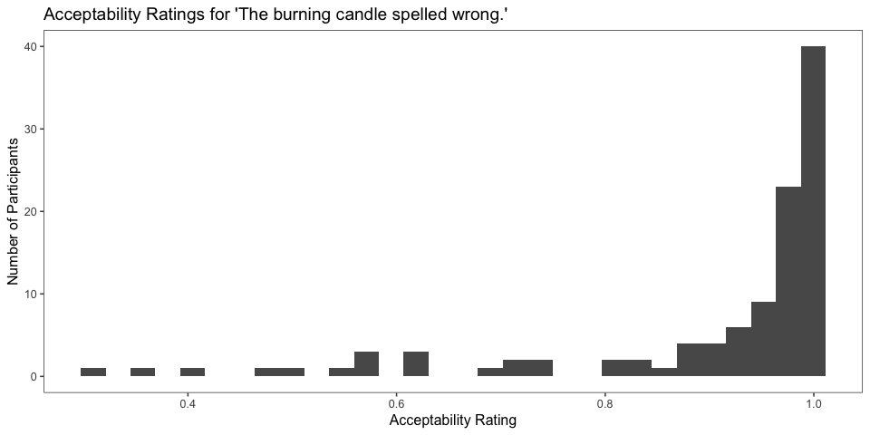
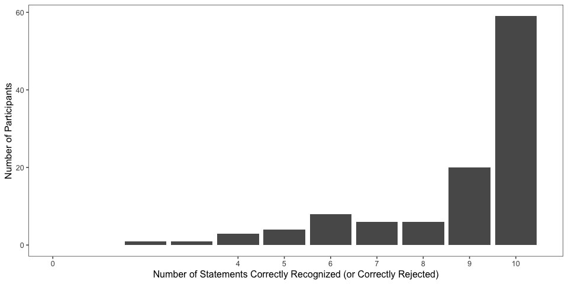
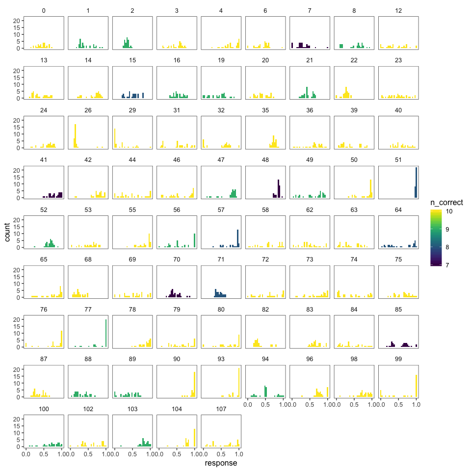
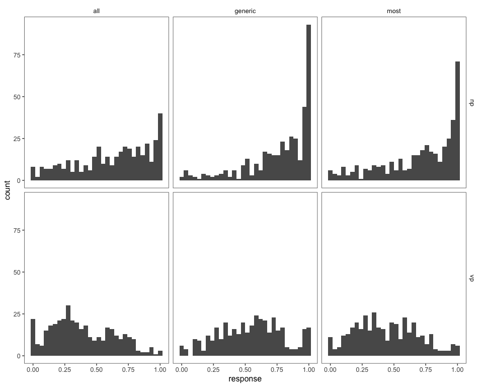
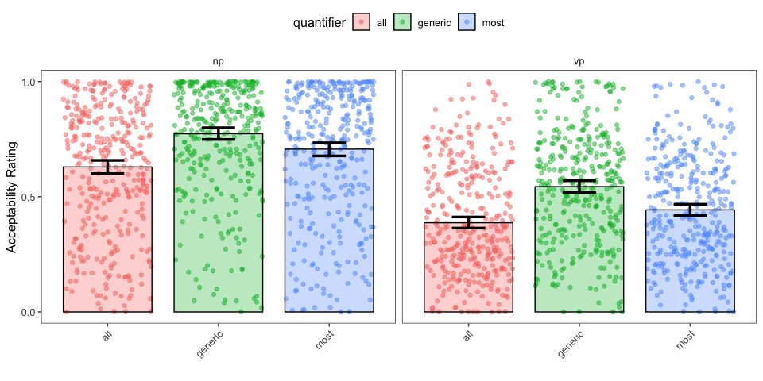
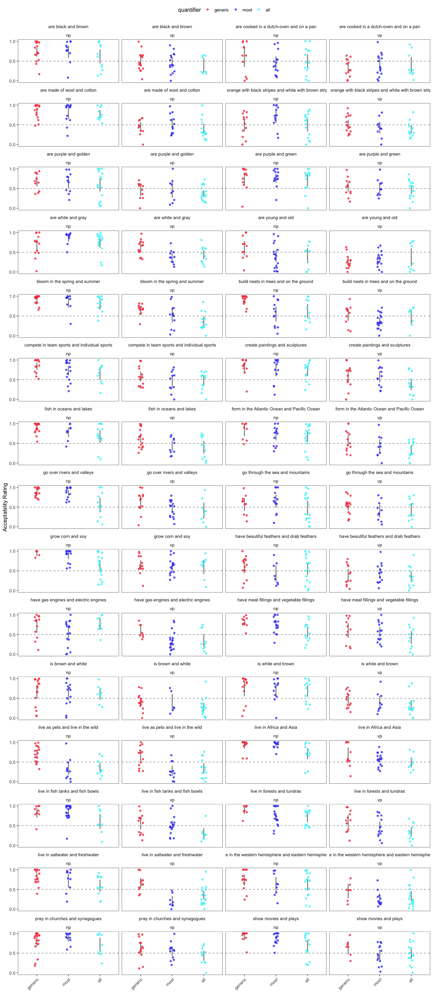
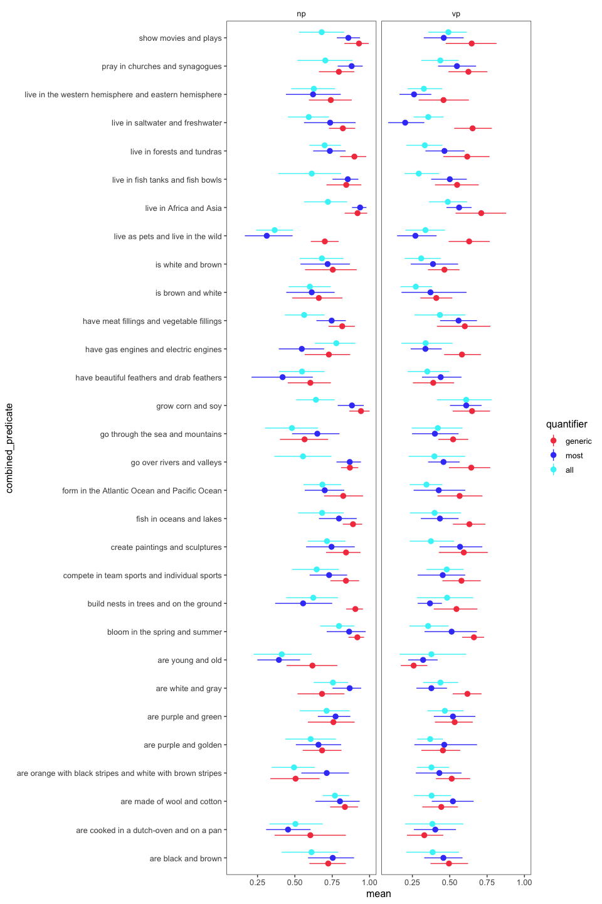
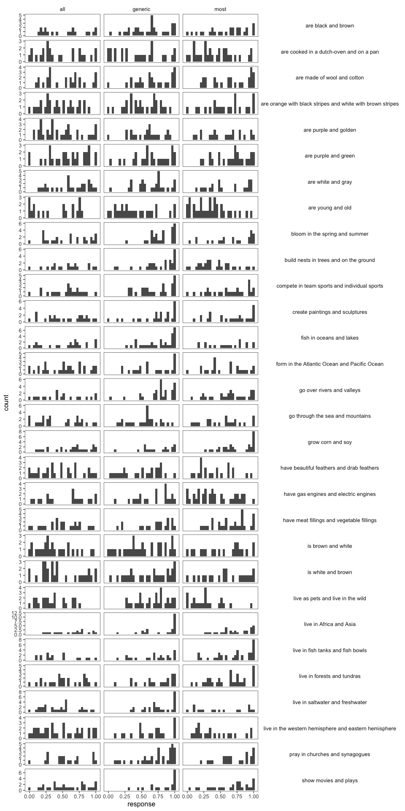
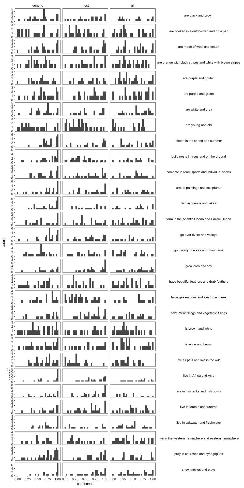

elephants-9-pilot
================
Karen Gu
2/22/2019

[Link to experiment (VP)](https://www.mit.edu/~karengu/elephants_vp/elephants/experiments/elephants-9.html)

Experiment 9 Pilot
------------------

Acceptability task using a sliding scale (0-100%), where participants rate items of the form Elephants live in Africa and Asia. \* between-subjects: VP vs. NP coordination
\* within-subjects: generic vs. most vs. all
\* 30 trials per subject (10 generic, 10 most, 10 all)

Subject Information
-------------------

|  workerid| language | enjoyment | age  | gender | problems                                                                                         | comments                                                                                                                                       |
|---------:|:---------|:----------|:-----|:-------|:-------------------------------------------------------------------------------------------------|:-----------------------------------------------------------------------------------------------------------------------------------------------|
|         0| english  | 2         | 51   | Female |                                                                                                  |                                                                                                                                                |
|         1| English  | 2         | 40   | Male   | No                                                                                               | N/A. Worthwhile and kept my attention throughout.                                                                                              |
|         2| english  | 2         | 33   | Female | no                                                                                               |                                                                                                                                                |
|         3| english  | 1         | 44   | Male   | None                                                                                             | None                                                                                                                                           |
|         4| English  | 1         | 27   | Male   | nothing                                                                                          | nice experiment                                                                                                                                |
|         5| English  | 2         | 29   | Male   |                                                                                                  |                                                                                                                                                |
|         6| English  | 2         | 30   | Female | No                                                                                               | N/A                                                                                                                                            |
|         7| english  | 2         | 32   | Male   | No                                                                                               | I disliked most of the way things were phrased.                                                                                                |
|         8| English  | 2         | 41   | Male   |                                                                                                  |                                                                                                                                                |
|         9| English  | 2         | 28   | Male   | No                                                                                               | good                                                                                                                                           |
|        10| English  | 1         | 20   | Female | no                                                                                               |                                                                                                                                                |
|        11| english  | 2         | 32   | Male   | no                                                                                               |                                                                                                                                                |
|        12| English  | 2         | 26   | Male   | No                                                                                               |                                                                                                                                                |
|        13| English  | 2         | 52   | Male   | There were no problems or bugs in the experiment.                                                | Thanks for the opportunity to participate and good luck with your research!                                                                    |
|        14| english  | 2         | 28   | Female | no                                                                                               | good                                                                                                                                           |
|        15| english  | 2         | 40   | Male   |                                                                                                  |                                                                                                                                                |
|        16| english  | 2         | 29   | Female | no                                                                                               |                                                                                                                                                |
|        17| English  | 1         | 35   | Female | nothing                                                                                          | nice                                                                                                                                           |
|        18| english  | 2         | 35   | Female | no                                                                                               | nice                                                                                                                                           |
|        19| English  | 1         | 55   | Male   | None                                                                                             | None                                                                                                                                           |
|        20| English  | 1         | 31   | Female | No                                                                                               |                                                                                                                                                |
|        21| English  | 2         | 27   | Female | none                                                                                             | quick, easy to understand, different, well-paid.                                                                                               |
|        22| English  | 2         | 32   | Male   | no                                                                                               | Fun!                                                                                                                                           |
|        23| English  | 2         | 26   | Female |                                                                                                  |                                                                                                                                                |
|        24| eng      | 1         | 40   | Male   | no                                                                                               |                                                                                                                                                |
|        25| english  | 1         | 39   | Male   |                                                                                                  |                                                                                                                                                |
|        26| Italian  | 2         | 40   | Male   | None at all                                                                                      | Thank you very much for this HIT, and best of luck with your research!                                                                         |
|        27| english  | 2         | 29   | Male   |                                                                                                  |                                                                                                                                                |
|        28| English  | 1         | 35   | Male   | No                                                                                               |                                                                                                                                                |
|        29| english  | 2         | 25   | Male   | no                                                                                               |                                                                                                                                                |
|        30| English  | 2         | 40   | Female | No                                                                                               | Interesting.                                                                                                                                   |
|        31| English  | 2         | 37   | Female | No.                                                                                              | I marked some untrue sentences as good because the grammar was correct, and I don't think I was meant to determine if they were true or false. |
|        32| English  | 2         | 42   | Female | no                                                                                               |                                                                                                                                                |
|        33| ENGLISH  | 2         | 35   | Male   | NOTHING                                                                                          | NICE                                                                                                                                           |
|        34| English  | 2         | 28   | Male   | No                                                                                               | No                                                                                                                                             |
|        35| English  | 1         | 29   | Male   | no                                                                                               | Great thanks!                                                                                                                                  |
|        36| English  | 2         | 24   | Female | no                                                                                               |                                                                                                                                                |
|        37| ENGLISH  | 1         | 28   | Male   |                                                                                                  | GOOD                                                                                                                                           |
|        38| English  | 1         | 42   | Male   | no                                                                                               |                                                                                                                                                |
|        39| English  | 2         | 25   | Female | No                                                                                               |                                                                                                                                                |
|        40| English  | 1         | 60   | Female | No                                                                                               |                                                                                                                                                |
|        41| English  | 1         | 26   | Female | none                                                                                             |                                                                                                                                                |
|        42| en       | 1         | 56   | Male   |                                                                                                  |                                                                                                                                                |
|        43| ENGLISH  | 2         | 28   | Male   | NA                                                                                               | good to participate                                                                                                                            |
|        44| english  | 2         | 35   | Male   | no                                                                                               | interesting hit. keep it up!                                                                                                                   |
|        45| english  | 1         | 28   | Male   | no                                                                                               | good                                                                                                                                           |
|        46| English  | 2         | 34   | Female | None                                                                                             | No problems at all.                                                                                                                            |
|        47| english  | 1         | 46   | Female | no                                                                                               |                                                                                                                                                |
|        48| english  | 2         | 27   | Male   | no issues                                                                                        |                                                                                                                                                |
|        49| English  | 1         | 66   | Male   | no                                                                                               | n/a                                                                                                                                            |
|        50| English  | 1         | 29   | Male   |                                                                                                  |                                                                                                                                                |
|        51| English  | 2         | 64   | Male   | No                                                                                               | Good hit                                                                                                                                       |
|        52| english  | 2         | 28   | Male   | na                                                                                               | good                                                                                                                                           |
|        53| English  | 2         | 28   | Male   | No problem                                                                                       | Good                                                                                                                                           |
|        54| English  | 2         | 54   | Female | No                                                                                               |                                                                                                                                                |
|        55| English  | 1         | 31   | Male   | no                                                                                               |                                                                                                                                                |
|        56| English  | 2         | 46   | Male   | no                                                                                               |                                                                                                                                                |
|        57| English  | 1         | 38   | Male   | no                                                                                               |                                                                                                                                                |
|        58| English  | 1         | 37   | Female | Nope.                                                                                            | I think maybe some more specific information on what you mean by good sentence would have helped.                                              |
|        59| english  | 1         | 24   | Male   | none                                                                                             | This wasn't bad, fair compensation in my point of view. THank you have a great weekend!                                                        |
|        60| ENGLISH  | 2         | 1983 | Female | NO                                                                                               | NICE THIS EXPERIMENT                                                                                                                           |
|        61| English  | 2         | 28   | Male   | no                                                                                               | no                                                                                                                                             |
|        62| english  | 2         | 49   | Female | na                                                                                               |                                                                                                                                                |
|        63| English  | 2         | 32   | Male   | No.                                                                                              |                                                                                                                                                |
|        64| ENGLISH  | 1         | 45   | Male   | no                                                                                               | its a really nice hit,and i would like to do such again another time                                                                           |
|        65| English  | 2         | 45   | Female | No                                                                                               | I enjoyed the HIT. Thank you the opportunity to participate.                                                                                   |
|        66| ENGLISH  | 2         | 25   | Male   | NO                                                                                               | GOOD                                                                                                                                           |
|        67| english  | 2         | 40   | Male   | no                                                                                               | nice                                                                                                                                           |
|        68| English  | 2         | 43   | Female | No                                                                                               |                                                                                                                                                |
|        69| English  | 1         | 28   | Male   | No                                                                                               | Thank you                                                                                                                                      |
|        70| english  | 2         | 34   | Female | no                                                                                               |                                                                                                                                                |
|        71| English  | 1         | 23   | Male   |                                                                                                  |                                                                                                                                                |
|        72| English  | 2         | 27   | Female | no                                                                                               | I really liked this HIT because it made me think and let my inner grammar nerd out!                                                            |
|        73| English  | 2         | 49   | Male   | No                                                                                               |                                                                                                                                                |
|        74| english  | 1         | 24   | Female | no                                                                                               |                                                                                                                                                |
|        75| English  | 2         | 26   | Male   | No                                                                                               | None, I enjoyed this work                                                                                                                      |
|        76| English  | 2         | 26   | Male   | I had no issues with the HIT.                                                                    |                                                                                                                                                |
|        77| English  | 1         | Male | Male   | No                                                                                               | Easy HIT, thank you                                                                                                                            |
|        78| English  | 2         | 34   | Female | No                                                                                               | It was interesting.                                                                                                                            |
|        79| English  | 2         | 25   | Male   | no                                                                                               | Really interesting.                                                                                                                            |
|        80| English  | 1         | 48   | Male   | No.                                                                                              | None.                                                                                                                                          |
|        81| English  | 1         | 37   | Female | no                                                                                               | none                                                                                                                                           |
|        82| English  | 1         | 27   | Male   |                                                                                                  |                                                                                                                                                |
|        83| english  | 1         | 42   | Female |                                                                                                  |                                                                                                                                                |
|        84| English  | 1         | 41   | Female | I didn't understand if you wanted the sentence to be grammatically correct or logically correct. |                                                                                                                                                |
|        85| english  | 1         | 36   | Male   | no                                                                                               | thanks and good luck                                                                                                                           |
|        86| english  | 2         | 49   | Male   | nothing                                                                                          | good servey and nice                                                                                                                           |
|        87| English  | 2         | 27   | Female | No                                                                                               |                                                                                                                                                |
|        88| English  | 2         | 40   | Female | no                                                                                               | this was super easy so it makes me think i may have missed something                                                                           |
|        89| english  | 2         | 33   | Male   | no                                                                                               |                                                                                                                                                |
|        90| English  | 2         | 44   | Male   | No                                                                                               | Thanks for the HIT! I did my best and hope the data is useful!                                                                                 |
|        91| English  | 2         | 29   | Female | no                                                                                               |                                                                                                                                                |
|        92| english  | 2         | 32   | Male   | no                                                                                               | goodone                                                                                                                                        |
|        93| english  | 1         | 34   | Male   | Nope                                                                                             | No comments - thanks for the opportunity                                                                                                       |
|        94| English  | 2         | 35   | Male   |                                                                                                  |                                                                                                                                                |
|        95| English  | 2         | 57   | Male   | no                                                                                               | Thank you!                                                                                                                                     |
|        96| English  | 1         | 31   | Male   | None                                                                                             | None                                                                                                                                           |
|        97| English  | 2         | 25   | Female |                                                                                                  |                                                                                                                                                |
|        98| English  | 2         | 30   | Male   | No.                                                                                              | Nothing to report.                                                                                                                             |
|        99| English  | 2         | 63   | Male   | no                                                                                               | I thought this was very interesting and it gave me something to think about regarding how we use the English language.                         |
|       100| English  | 2         | 33   | Female | no problems                                                                                      | no comments                                                                                                                                    |
|       101| English  | 2         | 28   | Male   | No problems                                                                                      | good                                                                                                                                           |
|       102| English  | 1         | 34   | Male   | No                                                                                               | Interesting hit that required some thinking                                                                                                    |
|       103| English  | 2         | 31   | Female | None that I noticed                                                                              | I really enjoyed this hit. I would love to do more work like this, or something equally stimulating.                                           |
|       104| English  | 1         | 42   | Male   | no                                                                                               |                                                                                                                                                |
|       105| english  | 2         | 26   | Female | no                                                                                               |                                                                                                                                                |
|       106| English  | 0         | 49   | Male   | Nothing                                                                                          | Good survey                                                                                                                                    |
|       107| English  | 1         | 59   | Female | none                                                                                             |                                                                                                                                                |

Attention Checks
----------------

### Slider Practice

Before the experiment, participants practice using the sliders to rate 3 sentences:

-   Anna laughed on Jon. (coded as correct if x &lt; 0.5)
-   The train from Edmonton to Orlando was late. (coded as correct if x &gt; 0.5)
-   The burning candle spelled wrong. (coded as correct if x &lt; 0.5)

Most participants judged the third sentence to be acceptable, so we don't exclude any participants who did so. 

|  n\_correct|    n|
|-----------:|----:|
|           1|    2|
|           2|   27|
|           3|   79|

| sentence                          |  n\_correct|
|:----------------------------------|-----------:|
| Anna laughed on Jon.              |          81|
| The burning candle spelled wrong. |         108|
| The train was late this morning.  |         104|

### Memory Check

After the story, participants select statements they recall seeing from a list of 10 (5 true, 5 distractor).

### Explanations of Task

After the story, participants are also asked to explain generally what they did in the experiment.

|  workerid|  n\_slider\_correct|  n\_memory\_correct| explanation                                                                                                                                                                                                        |
|---------:|-------------------:|-------------------:|:-------------------------------------------------------------------------------------------------------------------------------------------------------------------------------------------------------------------|
|         0|                   3|                  10| I rated the quality of the language used in various sentences.                                                                                                                                                     |
|         1|                   3|                   9| Evaluate the cohesiveness of sentence structuring.                                                                                                                                                                 |
|         2|                   3|                   9| i rated sentences on its quality: if they are written well or poorly.                                                                                                                                              |
|         3|                   3|                  10| I rated the quality of a sentence.                                                                                                                                                                                 |
|         4|                   3|                  10| check good and bad sentence                                                                                                                                                                                        |
|         5|                   2|                  10| I gave my opinion on whether sentences were good or bad                                                                                                                                                            |
|         6|                   3|                  10| Rated the quality of sentences.                                                                                                                                                                                    |
|         7|                   3|                   7| I selected how correct or incorrect the sentences sounded                                                                                                                                                          |
|         8|                   3|                   9| I chose, on a scale, whether a sentence was acceptable or not and to what degree.                                                                                                                                  |
|         9|                   2|                  10| Rating the sentence whether it is good or bad and remember experiment                                                                                                                                              |
|        10|                   3|                   6| I stated if I thought a sentence was good or bad                                                                                                                                                                   |
|        11|                   2|                   6| full concentration                                                                                                                                                                                                 |
|        12|                   3|                  10| i just read the sentences and tried to determine if they were good or not.                                                                                                                                         |
|        13|                   3|                  10| In this experiment, I selected whether a sentence was either "good" or "bad".                                                                                                                                      |
|        14|                   3|                  10| read the sentence provide my best opinion.                                                                                                                                                                         |
|        15|                   3|                   8| determined if the sentence was good or not                                                                                                                                                                         |
|        16|                   3|                   9| in this experiment i rated sentences                                                                                                                                                                               |
|        17|                   2|                   2| Nice very interested experiment                                                                                                                                                                                    |
|        18|                   2|                   4| nice                                                                                                                                                                                                               |
|        19|                   3|                   9| Choice how good the sentence is with a slider as a gauge.                                                                                                                                                          |
|        20|                   3|                  10| Determine if it is a good sentence or not.                                                                                                                                                                         |
|        21|                   3|                   9| I had to read sentences and gauge how 'good' or 'bad' these sentences were by using a slider-scale.                                                                                                                |
|        22|                   3|                  10| Decided using a sliding scale whether a sentence was good or bad sounding.                                                                                                                                         |
|        23|                   3|                  10| I rated how good sentences were                                                                                                                                                                                    |
|        24|                   3|                  10| judge weather it sounds right or not                                                                                                                                                                               |
|        25|                   1|                   6| NONE                                                                                                                                                                                                               |
|        26|                   3|                  10| Pick which sentences were good, and which bad (the majority).                                                                                                                                                      |
|        27|                   2|                   4| selected statements which is good or bad                                                                                                                                                                           |
|        28|                   2|                   9| I rated weather sentences were good or bad                                                                                                                                                                         |
|        29|                   3|                  10| rated sentences                                                                                                                                                                                                    |
|        30|                   2|                   6| Language Study                                                                                                                                                                                                     |
|        31|                   3|                  10| The sentences are all structured similarly, but I sorted them into good or bad depending on how contradictory the statements were, or if the grammar made sense.                                                   |
|        32|                   3|                  10| I evaluated sentence for whether they were good or bad.                                                                                                                                                            |
|        33|                   2|                   4| NICE VERY INTERESTED EXPERIMENT.                                                                                                                                                                                   |
|        34|                   2|                  10| I have learned a new sentence from this experiment                                                                                                                                                                 |
|        35|                   3|                  10| Chose if a sentence was good or bad.                                                                                                                                                                               |
|        36|                   3|                  10| determined if a sentence was bad or good                                                                                                                                                                           |
|        37|                   2|                   8| GOOD                                                                                                                                                                                                               |
|        38|                   2|                  10| Say how I felt about sentences                                                                                                                                                                                     |
|        39|                   3|                  10| I had to judge the quality of sentences                                                                                                                                                                            |
|        40|                   3|                  10| I paid attention to the wording in the statements. Some of the statements seemed contradictory and ambiguous.                                                                                                      |
|        41|                   3|                   7| Sentence rating                                                                                                                                                                                                    |
|        42|                   3|                  10| pick a sentence as good or bad                                                                                                                                                                                     |
|        43|                   2|                   9| i saw the sentence and answer the sentence like good or bad.                                                                                                                                                       |
|        44|                   3|                  10| i judged whether or not a sentence was good.                                                                                                                                                                       |
|        45|                   2|                   6| never                                                                                                                                                                                                              |
|        46|                   3|                  10| I graded sentences on a scale from bad to good.                                                                                                                                                                    |
|        47|                   3|                   9| i determined how correct the sentence was                                                                                                                                                                          |
|        48|                   3|                   7| judge whether sentences are good or bad                                                                                                                                                                            |
|        49|                   3|                   9| I tried to judge if a sentence SOUNDED right. My kingdom for an 'or!'                                                                                                                                              |
|        50|                   3|                  10| Phonetically determine if a sentence sounds good or not.                                                                                                                                                           |
|        51|                   3|                   8| I judged whether it was a good or bad sentence                                                                                                                                                                     |
|        52|                   3|                   9| about rating and remembering task                                                                                                                                                                                  |
|        53|                   3|                  10| About the sentence which is correct or not.                                                                                                                                                                        |
|        54|                   2|                   3| Evaluated Statements given.                                                                                                                                                                                        |
|        55|                   3|                  10| I determined whether a sentence was good or not                                                                                                                                                                    |
|        56|                   3|                   9| Selected whether the sentence was good, bad or in between.                                                                                                                                                         |
|        57|                   3|                   8| Read and grade sentences as good or bad.                                                                                                                                                                           |
|        58|                   3|                  10| I was rating how good a sentence was.                                                                                                                                                                              |
|        59|                   3|                   6| In this experiment I rated sentences on how good or bad they sounded.                                                                                                                                              |
|        60|                   1|                   5| LANGUAGE STUDY                                                                                                                                                                                                     |
|        61|                   2|                   5| I have checked whether the sentence would be good or bad                                                                                                                                                           |
|        62|                   3|                  10| read the sentence and decided if it was correct                                                                                                                                                                    |
|        63|                   3|                  10| I decided whether the sentence was good or bad. I decided this based on whether it would make sense to someone who didn't know about the subject of the sentence.                                                  |
|        64|                   3|                   8| i determined whether a sentence is phrased in the right way                                                                                                                                                        |
|        65|                   3|                  10| I chose whether I thought the sentence was good or bad.                                                                                                                                                            |
|        66|                   2|                   5| GOOD                                                                                                                                                                                                               |
|        67|                   2|                   6| nice the survey                                                                                                                                                                                                    |
|        68|                   3|                  10| I rated the quality of sentences. They all seemed to have the same structure with superfluous words.                                                                                                               |
|        69|                   3|                  10| I tried to determine what was, and was not, a good sentence from the examples which were provided                                                                                                                  |
|        70|                   3|                   7| said if a sentence made sense or not                                                                                                                                                                               |
|        71|                   3|                   8| Rate the sentences show on the screen from good to bad                                                                                                                                                             |
|        72|                   3|                  10| I was evaluating sentence structure,along with re-reading the sentences several times, determining if the choice of words is appropriate or not and if the sentence makes sense in a whole                         |
|        73|                   3|                  10| I saw a number of sentences and rated them as "good" or "bad" using a slider which allowed me to pick in-between (closer to bad, closer to good, etc.)                                                             |
|        74|                   3|                  10| Just did my best to see how much sense the sentences made                                                                                                                                                          |
|        75|                   3|                  10| I decided how good a sentence sounded when read                                                                                                                                                                    |
|        76|                   3|                  10| I rated how good a sentence was using a slider scale.                                                                                                                                                              |
|        77|                   3|                   9| Judge and rate a sentence on how good it is.                                                                                                                                                                       |
|        78|                   3|                  10| I tried to pay attention to if it was a full sentence and if it made sense, like the raisins sentence implied that all raisins were purple AND gold at the same time, so that wasn't a good sentence, for example. |
|        79|                   3|                  10| I paid attention in the experiment.                                                                                                                                                                                |
|        80|                   3|                  10| Decide whether sentences were good or not                                                                                                                                                                          |
|        81|                   2|                  10| Try to determine if a sentence was good.                                                                                                                                                                           |
|        82|                   3|                  10| determined how good or bad sentences sounded.                                                                                                                                                                      |
|        83|                   3|                  10| Rate sentences by how good they are.                                                                                                                                                                               |
|        84|                   3|                  10| Tried to decide if a sentence was good or bad.                                                                                                                                                                     |
|        85|                   3|                   7| i just went with my first thought i tried to not overthink it.                                                                                                                                                     |
|        86|                   2|                   5| squash is round and is yellow tigers are orange with black stripes and are white with brown stripes all lightning storms cause fires and cause floods                                                              |
|        87|                   3|                  10| Sentences that didn't sound as if they were implying both X and Y could be true to one individual of the group (example: monkeys, raisins) were better than ones that did.                                         |
|        88|                   3|                   9| rated sentences on their goodness                                                                                                                                                                                  |
|        89|                   3|                   9| decided if sentences were good or bad                                                                                                                                                                              |
|        90|                   3|                  10| I rated sentences as good or bad on a scale.                                                                                                                                                                       |
|        91|                   2|                   9| I answered whether or not a sentence was grammatical (good) or not (bad).                                                                                                                                          |
|        92|                   2|                   7| sentence learning                                                                                                                                                                                                  |
|        93|                   3|                  10| Judged whether sentences were valid sentences or simply verbal train wrecks.                                                                                                                                       |
|        94|                   3|                   9| Rated the quality of sentences.                                                                                                                                                                                    |
|        95|                   2|                  10| I selected whether a sentence was good or not on a sliding scale                                                                                                                                                   |
|        96|                   3|                  10| Read sentences and judge how good they are                                                                                                                                                                         |
|        97|                   2|                  10| I said if sentences were good or bad.                                                                                                                                                                              |
|        98|                   3|                  10| I just decided whether the sentence made sense and if It was accurate in it's message.                                                                                                                             |
|        99|                   3|                  10| I read sentences and made a judgement about if they made sense to me.                                                                                                                                              |
|       100|                   3|                   9| Read sentences and rated how bad or good they were - sounding wise and gramatically correct                                                                                                                        |
|       101|                   2|                   9| In this experiment we have to rate the answer for the question                                                                                                                                                     |
|       102|                   3|                  10| Determine how good a sentence is                                                                                                                                                                                   |
|       103|                   3|                   9| I was shown various sentences and asked to judge whether they were good or not.                                                                                                                                    |
|       104|                   3|                  10| graded sentences                                                                                                                                                                                                   |
|       105|                   2|                  10| I decided whether sentences were good or bad sounding.                                                                                                                                                             |
|       106|                   2|                   6| experiment of the religious people pray in churches and synagogues grass is green and short in the terms and survey.                                                                                               |
|       107|                   3|                  10| picked sentences that I thought sounded good.                                                                                                                                                                      |

Participants
------------

### Included/Excluded Subject Numbers

Removing participants who didn't get the first two sliders and who answered less than 7 of the memory check questions correctly.

| memory\_fail | slider\_fail | include |    n|
|:-------------|:-------------|:--------|----:|
| FALSE        | FALSE        | TRUE    |   77|
| FALSE        | TRUE         | FALSE   |   14|
| TRUE         | FALSE        | FALSE   |    2|
| TRUE         | TRUE         | FALSE   |   15|

### Number of Participants by Item and Condition

| coordination | combined\_predicate                                        |  generic|  most|  all|
|:-------------|:-----------------------------------------------------------|--------:|-----:|----:|
| np           | are black and brown                                        |       16|    11|   12|
| np           | are cooked in a dutch-oven and on a pan                    |       11|    14|   14|
| np           | are made of wool and cotton                                |       15|    13|   11|
| np           | are orange with black stripes and white with brown stripes |       12|    12|   15|
| np           | are purple and golden                                      |       11|    11|   17|
| np           | are purple and green                                       |       12|    14|   13|
| np           | are white and gray                                         |       13|    10|   16|
| np           | are young and old                                          |       11|    18|   10|
| np           | bloom in the spring and summer                             |       16|    10|   13|
| np           | build nests in trees and on the ground                     |       16|    12|   11|
| np           | compete in team sports and individual sports               |       13|    16|   10|
| np           | create paintings and sculptures                            |       13|    13|   13|
| np           | fish in oceans and lakes                                   |       17|     9|   13|
| np           | form in the Atlantic Ocean and Pacific Ocean               |        9|    13|   17|
| np           | go over rivers and valleys                                 |       15|    13|   11|
| np           | go through the sea and mountains                           |       10|    13|   16|
| np           | grow corn and soy                                          |        5|    15|   19|
| np           | have beautiful feathers and drab feathers                  |       14|     8|   17|
| np           | have gas engines and electric engines                      |       13|    17|    9|
| np           | have meat fillings and vegetable fillings                  |       10|    16|   13|
| np           | is brown and white                                         |       16|    14|    9|
| np           | is white and brown                                         |       14|    12|   13|
| np           | live as pets and live in the wild                          |       17|    11|   11|
| np           | live in Africa and Asia                                    |       14|    13|   12|
| np           | live in fish tanks and fish bowls                          |        9|    21|    9|
| np           | live in forests and tundras                                |        8|    17|   14|
| np           | live in saltwater and freshwater                           |       17|    10|   12|
| np           | live in the western hemisphere and eastern hemisphere      |       13|     9|   17|
| np           | pray in churches and synagogues                            |       19|    11|    9|
| np           | show movies and plays                                      |       11|    14|   14|
| vp           | are black and brown                                        |       16|    15|    7|
| vp           | are cooked in a dutch-oven and on a pan                    |       13|    15|   10|
| vp           | are made of wool and cotton                                |       11|    12|   15|
| vp           | are orange with black stripes and white with brown stripes |       15|    10|   13|
| vp           | are purple and golden                                      |       11|     9|   18|
| vp           | are purple and green                                       |       12|    10|   16|
| vp           | are white and gray                                         |       15|    11|   12|
| vp           | are young and old                                          |       14|    15|    9|
| vp           | bloom in the spring and summer                             |       13|    12|   13|
| vp           | build nests in trees and on the ground                     |       11|    19|    8|
| vp           | compete in team sports and individual sports               |       14|    11|   13|
| vp           | create paintings and sculptures                            |       13|    12|   13|
| vp           | fish in oceans and lakes                                   |       17|    10|   11|
| vp           | form in the Atlantic Ocean and Pacific Ocean               |       13|    10|   15|
| vp           | go over rivers and valleys                                 |       13|    16|    9|
| vp           | go through the sea and mountains                           |       17|    10|   11|
| vp           | grow corn and soy                                          |       13|    16|    9|
| vp           | have beautiful feathers and drab feathers                  |       12|    13|   13|
| vp           | have gas engines and electric engines                      |        8|    20|   10|
| vp           | have meat fillings and vegetable fillings                  |       11|    15|   12|
| vp           | is brown and white                                         |       15|     6|   17|
| vp           | is white and brown                                         |       13|     9|   16|
| vp           | live as pets and live in the wild                          |       13|    11|   14|
| vp           | live in Africa and Asia                                    |       12|    17|    9|
| vp           | live in fish tanks and fish bowls                          |       13|    16|    9|
| vp           | live in forests and tundras                                |       12|    14|   12|
| vp           | live in saltwater and freshwater                           |       11|     8|   19|
| vp           | live in the western hemisphere and eastern hemisphere      |        7|    12|   19|
| vp           | pray in churches and synagogues                            |       15|    12|   11|
| vp           | show movies and plays                                      |        7|    14|   17|

| coordination |     n|
|:-------------|-----:|
| np           |  1170|
| vp           |  1140|

### Acceptability Judgements by Participant

Histogram of all of a single participant's acceptability judgements, collapsed across trials and color coded for the number of correct responses on the memory check.
\* fill = number of correct responses on the memory check (out of 10)
\* facet = participants

Histograms of Acceptability Judgements by Coordination and Quantifier (collapsed across item)
---------------------------------------------------------------------------------------------

### Pirate Plots by Coordination and Quantifier (collapsed across item)

Generic VP Analysis
-------------------

    ## Linear mixed model fit by REML. t-tests use Satterthwaite's method [
    ## lmerModLmerTest]
    ## Formula: response ~ 1 + (1 | workerid) + (1 | combined_predicate)
    ##    Data: df.generic.vp
    ## 
    ## REML criterion at convergence: -112.4
    ## 
    ## Scaled residuals: 
    ##     Min      1Q  Median      3Q     Max 
    ## -3.3541 -0.5565  0.0371  0.5995  3.2332 
    ## 
    ## Random effects:
    ##  Groups             Name        Variance Std.Dev.
    ##  workerid           (Intercept) 0.024608 0.15687 
    ##  combined_predicate (Intercept) 0.007038 0.08389 
    ##  Residual                       0.031385 0.17716 
    ## Number of obs: 380, groups:  workerid, 38; combined_predicate, 30
    ## 
    ## Fixed effects:
    ##             Estimate Std. Error       df t value Pr(>|t|)
    ## (Intercept)  0.04431    0.03110 52.12360   1.424     0.16

By-item Analyses
----------------

### Number of Trials by Item and Quantifier

| coordination |  generic|  most|  all|
|:-------------|--------:|-----:|----:|
| np           |      390|   390|  390|
| vp           |      380|   380|  380|

| quantifier |    n|
|:-----------|----:|
| all        |  770|
| generic    |  770|
| most       |  770|

Pirate Plots (by item)
----------------------

### Confidence Intervals (by item)

### Histograms of Acceptability Ratings by Item

### by Coordination

### by Quantifier

