Variable Coordination
================
Karen Gu
9/6/2019

[Link to
experiment](http://www.mit.edu/~tessler/projects/elephants/experiments/elephants-3.html)

## Variable Coordination Level Experiment

## 

## Subject Information

| workerid                         | language | enjoyment | age | gender | problems                                              | comments                                                                                |
| :------------------------------- | :------- | :-------- | :-- | :----- | :---------------------------------------------------- | :-------------------------------------------------------------------------------------- |
| 94e02b964710f084b0757f009b32007f | English  | 0         | 48  | Male   | no                                                    |                                                                                         |
| bec83fc61d00a7d4ffa3b946951a2e70 | English  | 1         | 30  | Male   | no                                                    | good                                                                                    |
| 9f4d1fae505bbe3e4a176721c615da03 | English  | 1         | 22  | Male   |                                                       |                                                                                         |
| 0d7fbc5dba7f680e33a708fbc32a4509 | english  | 0         | 30  | Male   | nothing                                               | nice                                                                                    |
| 121e3fe89c89319899b22bf74ac5dbe4 | english  | 0         | 29  | Female | no                                                    |                                                                                         |
| 504a1d228c641dfdf1b1fdba00bf18b9 | english  | 0         | 34  | Male   | no                                                    |                                                                                         |
| 3a7dd723f40fed7a0a383a069939343d | english  | 1         | 62  | Female | no                                                    |                                                                                         |
| 6e018d15d88a81eb8f01ce0bfcd221a0 | English  | 0         | 47  | Female | no                                                    |                                                                                         |
| 4bc289a226eaf2ebed9a6f266ed21cb1 | englishn | 0         | 35  | Female | no                                                    | nice                                                                                    |
| 02366c44bbdda170f60a5df9c41b0bcd | English  | 1         | 26  | Male   | No                                                    | Thanks.                                                                                 |
| 119b8973de0826f10b078c559732ccb5 | English  | 1         | 37  | Male   | NA                                                    |                                                                                         |
| ef9c52a3fa42154591f632b272ccaffc | English  | 0         | 27  | Male   |                                                       |                                                                                         |
| e2ae41e9b9346ca4ea2e59c1a0501329 | English  | 0         | 51  | Female | no                                                    | good                                                                                    |
| 66cf644fb24f93f8dda74bf0c7d6289c | English  | 0         | 47  | Male   | no                                                    | none                                                                                    |
| 3e54d549e8f32aa6f207a618fc317211 | English  | 1         | 59  | Female | No                                                    |                                                                                         |
| 2be9e3418de9907c15e8b011c77da948 | English  | 0         | 23  | Female |                                                       |                                                                                         |
| d8413cc35a0124e58fb9594da7aaf179 | English  | 1         | 40  | Male   | no                                                    | good                                                                                    |
| eac605a670b8d8beb74503980aea1f55 | English  | 0         | 25  | Male   | NA                                                    |                                                                                         |
| 3a9e470cb2caf2c71de688ffe8ffe959 | English  | 1         | 71  | Female | No                                                    | Thanks :-)                                                                              |
| 5bbce14c88a0178a2dd09cc1006492df | English  | 0         | 30  | Female | No                                                    |                                                                                         |
| a35e6f82148886b36e7ae4a2ca8da853 | English  | 1         | 43  | Male   | No                                                    | Interesting study. I enjoyed reading the strange names of creatures and hapitats.       |
| 765cdd58c0e4dc60cb61beaedf2cf9c8 | english  | 0         | 25  | Female | no                                                    | good                                                                                    |
| 4e5181c68125e1284735f78d2403ada5 | English  | 1         | 28  | Male   | nope.                                                 |                                                                                         |
| cbf5362060e69fd44eef754cf95a4431 | english  | 0         | 39  | Female | no                                                    |                                                                                         |
| 956fd002ea95bbd4d212530f6e982185 | ENGLISH  | 1         | 50  |        | In very general terms, please describe what you       | In very general terms, please describe what you                                         |
| 0cf23b5795a4be0cd3092a670f413cb2 | ENGLISH  | 1         | 56  | Female | NA                                                    | good                                                                                    |
| 65b7c457a1fca600cb3ab0d0129ccb21 | ENGLISH  | 1         | 34  | Female | NO                                                    | GOOD                                                                                    |
| 2607cdd53c86dfa858102b97eef02bab | English  | 0         | 61  | Female | I did not encounter any problem                       |                                                                                         |
| 89b1607270f1c539f8e372967b779c24 | ENGLISH  | 0         | 50  | Female | none                                                  | nice                                                                                    |
| 4b15038f4f37b3eb2794cdd1866d3eae | English  | 0         | 25  | Female | No                                                    | The study went well. Thanks for making me a part of it.                                 |
| 66aae99c932b12f0948167dcd3e36fce | ENGLISH  | 0         | 30  | Male   | no                                                    |                                                                                         |
| f0e5c785b7741a01b77429489c185f80 | ENGLISH  | 1         | 29  | Male   | n/a                                                   | great                                                                                   |
| db5577cef114410f546b921cbd4ffefc | english  | 1         | 32  | Female | no                                                    |                                                                                         |
| 855ae1f624237dc12490ae1d36594044 | English  | 0         | 34  | Male   | No                                                    |                                                                                         |
| 37ce7e57a208f286e9d799f5bffe1203 | english  | 0         | 29  | Male   | no                                                    | good                                                                                    |
| 3ee583b126cffcabcf1bec64b21be9fb | English  | 0         | 40  | Male   | n                                                     |                                                                                         |
| b5bef9db68cf17777e947eac8d9f306d | English  | 0         | 31  | Male   |                                                       |                                                                                         |
| 09e79e08b7533c4966bb94301c2a15da | English  | 0         | 31  | Male   |                                                       |                                                                                         |
| fd5048577f56504208c368c3bd702034 | English  | 1         | 59  | Female | no                                                    |                                                                                         |
| 351b702d37553c2576276b02684bdff0 | english  | 1         | 58  | Male   | no                                                    |                                                                                         |
| 52e27cf4e687651051ea256c2d0d81ac | english  | 0         | 41  | Female | no                                                    |                                                                                         |
| b28ee0d4be8559414380bdd754c773ec | english  | 1         | 30  | Male   | none                                                  | useful survey                                                                           |
| 4bc1124843141ab50a73e77675044196 | english  | 0         | 25  | Male   | no                                                    |                                                                                         |
| 0048659161e3aec37849a721e4dd3293 | English  | 0         | 45  | Male   | No.                                                   |                                                                                         |
| 7cbb04b9387ea74eb938b16baa1f4c77 | English  | 1         | 44  | Male   | No                                                    | It was interesting but somewhat hard to guess some of them. By design, I suppose…       |
| 7659f65701f909cb8e5b83c1372c2850 | english  | 1         | 35  | Male   | no                                                    |                                                                                         |
| 2443f2a8df5cccb4003cdad142d57725 | English  | 0         | 39  | Male   | No                                                    |                                                                                         |
| 42d22c4ca6b080feb7badaa1c3ded662 | English  | 1         | 40  | Male   |                                                       |                                                                                         |
| 2f09bb178d82d57ee9e98784da1bb16f | English  | 1         | 51  | Male   | NA                                                    | good                                                                                    |
| 623d7e45f942af8337eac5316c496387 | English  | 0         | 55  | Female | no problems                                           | none                                                                                    |
| 1eb3ec9876cc6a17bbae44d4761137d3 | English  | 0         | 28  | Male   | none                                                  |                                                                                         |
| 504aa8560363dc18f9b1095cf6407c35 | english  | 1         | 55  | Male   | no                                                    | good task                                                                               |
| 51341274f8e540b4e117d74ec4d70784 | English  | 1         | 31  | Male   | no                                                    |                                                                                         |
| e9fd624d2da155125da39c67a5e9293c | english  | 1         | 29  | Female | no                                                    |                                                                                         |
| 02c9b466a8218e0431007a14d7054500 | english  | 1         | 26  | Male   | none                                                  | none                                                                                    |
| f2a592b14183a908ede748ad8b13952d | English  | 1         | 56  |        | none                                                  | none                                                                                    |
| 75b0624edb002bc35f9a8b8be60d6dd4 | English  | 0         | 32  | Male   | no                                                    | nice                                                                                    |
| da5013b7c30b3d20264f36989fbe4ac3 |          | 0         | 35  |        | no                                                    | good                                                                                    |
| b7ca4e22ce73506ccb019c3113166247 | English  | 0         | 28  | Male   | None                                                  |                                                                                         |
| e6532b573753e96d9385d652aba8da12 | English  | 0         | 25  | Male   |                                                       |                                                                                         |
| a3623ffaecf1e89cbe218cd459dbc6e5 | English  | 0         | 28  | Male   |                                                       |                                                                                         |
| dcbb83c20d1772b3067ff1aab040a173 | English  | 0         | 32  | Male   | no                                                    | no                                                                                      |
| 9d7e9117678074c390bfb883475724ad | english  | 0         | 27  | Male   | no                                                    |                                                                                         |
| 645a6517e313390917505e79b3797f3b | English  | 1         | 35  | Male   | no                                                    | good                                                                                    |
| 9a9e45610826bfacedf73f5de2601e51 | English  | 1         | 24  | Male   | No                                                    | No                                                                                      |
| f45892b186aeab06cdee625bba4f5a9a | English  | 0         | 54  | Male   | no problems                                           | no comments                                                                             |
| 9c069c5790858cfb00c23bacc10f1e95 | english  | 1         | 55  | Male   | no                                                    |                                                                                         |
| 2b5794d92119d7e92d115695bf207170 | english  | 1         | 60  | Female |                                                       |                                                                                         |
| b0b009fa310999f3c6a62369f60ee4ea | English  | 1         | 38  | Female | No                                                    | No                                                                                      |
| 8b2c8ccf3a2cb3195fede2d26826e767 | English  | 1         | 37  | Female |                                                       |                                                                                         |
| 51c779342eb79cb81ac7c6876a14c6ab | english  | 0         | 33  | Male   | no                                                    |                                                                                         |
| e7cdf8f23775e00be94ee8bb071df978 | English  | 1         | 29  | Male   | Not really, no.                                       | Thank you for letting me take this\!                                                    |
| ed5dd04a85b58e5266067c40ee228267 | English  | 1         | 32  | Male   | No                                                    |                                                                                         |
| f415b7277e92d2fa8cfc4496f190885d | english  | 1         | 33  | Male   | none                                                  | none                                                                                    |
| 386f1972cecb1d9502470056b3edf9ee | english  | 0         | 25  | Female | no                                                    | good luck with ur research\!                                                            |
| d8f41aac6f8904f59410bb1d9feb785c | English  | 1         | 33  | Male   | There were no problems or bugs in the experiment.     | Thank you for a fun and informative survey.                                             |
| 6975903e61ee2fe45b0b1df3d7b8b80d | English  | 1         | 55  | Female | No                                                    | I love these surveys\!                                                                  |
| c057e1bf96bc06277cae3c8eddebe374 | English  | 1         | 33  | Female | no                                                    |                                                                                         |
| 862b46d5fa579d805cf1791f97744b68 | english  | 1         | 47  | Female | no                                                    | Great survey                                                                            |
| f36f4037e8934adf47c5188fa01f3644 | English  | 0         | 34  | Female |                                                       |                                                                                         |
| 95e57d6a6388233676b7925b0929ee6f | English  | 0         | 31  | Male   | No problems                                           |                                                                                         |
| 84cf0e42557990a784ef998dd8af955e | english  | 0         | 61  | Male   | nothing                                               | good                                                                                    |
| 01da851ac67defcef8b30d7b34765075 | eng      | \-1       | 44  | Male   |                                                       |                                                                                         |
| bb1eff92d221b29f94905f4eb5107b7e | english  | 1         | 40  | Female | no                                                    | Thank you                                                                               |
| 9b53fbf4be0e9dc0ecb5db3222388b55 | english  | 1         | 28  | Female | none                                                  | nice experiment                                                                         |
| e939e85066823b64bdde1c15784f9de9 | eng      | 0         | 20  | Male   |                                                       |                                                                                         |
| 7fcdeb660933916fbf28803a4c73c774 | English  | 1         | 66  | Male   | It flowed logically but let a lot to the imagination. | None, thank you.                                                                        |
| 4eb837e530256569dbebf90476f938f6 | english  | 0         | 21  | Female | no                                                    |                                                                                         |
| ac6c17439d0eaa1e355a58d6b18cf25d | English  | 0         | 30  | Male   | No                                                    | No                                                                                      |
| f64e240c246dda2026c269b105a7fa18 | english  | 1         | 44  | Male   | good                                                  |                                                                                         |
| 920e94362bfd486741373e3f22a37fae | English  | 0         | 39  | Female | no..                                                  | none                                                                                    |
| d40cc09b913fc992a03f89ff58ce036b | english  | 1         | 48  | Male   | nothing                                               | good                                                                                    |
| 5279f2b3688838d26444e2661fb7ba7c | English  | 1         | 29  | Female | no                                                    |                                                                                         |
| f6b09b71ab5f49ed042c59a3fe4c0281 | English  | 0         | 30  | Male   | Worked great                                          |                                                                                         |
| e7ff54db5a0fa6912b2820ec670eec43 | English  | 1         | 27  | Female | no                                                    |                                                                                         |
| ffacfb9561b44af604061483dff68fbf | English  | 1         | 27  | Female | no                                                    |                                                                                         |
| c7cd887f367d429fc95be745baea3039 | English  | 0         | 28  |        | No                                                    | I liked this study                                                                      |
| 1ff677d9263a4dc0b9bd82481bf45c47 | English  | 1         | 25  | Male   | Nothing                                               | Interesting survey                                                                      |
| 130868e2258ca5112789154b314994c3 | English  | 1         | 41  | Male   | no                                                    | nice study                                                                              |
| b051ccb94b01db37002bcc8f0de29e5e | English  | \-1       | 33  | Male   | No.                                                   | I think the the delays in each of the pages made it longer than it should have. Thanks. |
| 51db9191ad3c7a7a8ef897891360f578 | eng      | 0         | 22  | Male   | no                                                    | pay more                                                                                |
| 3284fe295d95b5c601aefe8ada85826f | English  | 0         | 31  | Male   | No                                                    |                                                                                         |
| 44a97c6d2adae4bd4003da78c286ff5c | english  | 1         | 66  | Female | no                                                    | thanks                                                                                  |
| f8ba19c69876bb549c822669018b17a0 | english  | 1         | 22  | Male   | no                                                    |                                                                                         |
| a78e14ab9b0e21c53221c8c616e27c61 | English  | 1         | 24  | Male   | No.                                                   |                                                                                         |
| b12752e3dcbff696bf4ab9efb28bf5c4 | English  | 0         | 25  | Female | its going good                                        | very good experience                                                                    |
| 7fb721a8748660a36b0bf33d07b465f2 | english  | 1         | 57  | Male   | no                                                    |                                                                                         |
| 8caf8d405cf4552c1fec1397341699ca | English  | 1         | 42  | Male   | no                                                    | no comments                                                                             |
| 60efd6cd3f3b1ef22e249845f3bbdcfe | English  | 1         | 33  | Male   | No Issues                                             | Nice Experiment                                                                         |
| 8a35442a3777f2c456f729e8b9559022 | English  | 1         | 30  | Male   | no                                                    | good                                                                                    |
| 2833bcafb3e18cc5e820aaea208a47cb | English  | 0         | 44  | Female | No                                                    |                                                                                         |
| 45456924d6df6c4535e39857e87f7190 | English  | 1         | 26  | Female | no                                                    | interesting                                                                             |
| 23f2419b9d18746c0bab3b12eb208819 | English  | 0         | 35  | Female | no                                                    |                                                                                         |
| 730cc415993d5d65ab0e3b16c71eeb14 | English  | 0         | 30  | Male   | No                                                    | Good and Nice.                                                                          |
| db1f13ca0e5b754f5ec37e333fe514fb | English  | 0         | 50  | Female | No                                                    | Good                                                                                    |
| eea3a419fad867bc8c5ca38bffa3dd3d | English  | 1         | 33  | Male   | very nice                                             | very nice survey                                                                        |
| 6f3ea53937a14a2300b55d94f399406f | English  | 0         | 31  | Female | no                                                    |                                                                                         |

## Attention Checks

### Slider Practice

Before the experiment, participants practice using the sliders to rate 3
category-property pairs:

  - dogs bark (coded as correct if x \> 0.5)
  - birds are male (coded as correct if 0.25 \< x \< 0.75)
  - cats get cancer (coded as correct if x \< 0.75) \[being generous
    with this one\]
  - lions lay eggs (coded as correct if x \< 0.10)

| n\_correct |  n |
| ---------: | -: |
|          2 | 12 |
|          3 | 25 |
|          4 | 80 |

| property        | n\_correct |
| :-------------- | ---------: |
| birds are male  |        117 |
| cats get cancer |        108 |
| dogs bark       |        109 |
| lions lay eggs  |         85 |

### Memory Check

After the story, participants select statements they recall learning
from a list of 10 generic statements about novel animals (5 true, 5
distractor). They are also asked to explain what they did in the
experiment.
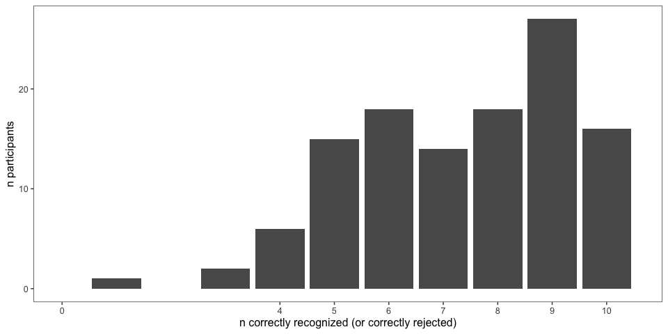<!-- -->

### Explanations of Task

After the story, participants are also asked to explain generally what
they did in the
experiment.

| workerid                         | n\_slider\_correct | n\_memory\_correct | explanation                                                                                                                                                                                                              |
| :------------------------------- | -----------------: | -----------------: | :----------------------------------------------------------------------------------------------------------------------------------------------------------------------------------------------------------------------- |
| 94e02b964710f084b0757f009b32007f |                  4 |                  7 | I interpreted statements to determine what percentage of a certain alien had a certain trait                                                                                                                             |
| bec83fc61d00a7d4ffa3b946951a2e70 |                  3 |                  5 | well                                                                                                                                                                                                                     |
| 9f4d1fae505bbe3e4a176721c615da03 |                  4 |                 10 | I read about aliens and gave an estimation of what percentage of them aligns with a certain trait.                                                                                                                       |
| 0d7fbc5dba7f680e33a708fbc32a4509 |                  3 |                  6 | the experiment give some story and what percentage that is correct and i believe they asked this experiment.                                                                                                             |
| 121e3fe89c89319899b22bf74ac5dbe4 |                  3 |                  9 | I read short stories or sentences about alien life forms on their alien planets and had to figure out what percentage of these events seemed to happen.                                                                  |
| 504a1d228c641dfdf1b1fdba00bf18b9 |                  4 |                  8 | I read a passage and chose the percentage of a statement.                                                                                                                                                                |
| 3a7dd723f40fed7a0a383a069939343d |                  4 |                  4 | nothing                                                                                                                                                                                                                  |
| 6e018d15d88a81eb8f01ce0bfcd221a0 |                  4 |                  4 | I worked on understanding some facts and the probability of each happening                                                                                                                                               |
| 4bc289a226eaf2ebed9a6f266ed21cb1 |                  2 |                  6 | nice                                                                                                                                                                                                                     |
| 02366c44bbdda170f60a5df9c41b0bcd |                  4 |                  9 | Read text about a fictional alien planet and retained information for this quiz and interpreting the stats given in the information.                                                                                     |
| 119b8973de0826f10b078c559732ccb5 |                  4 |                  8 | I read the section and then re-read to answer the question.                                                                                                                                                              |
| ef9c52a3fa42154591f632b272ccaffc |                  4 |                  9 | Determine if a species lived or after a certain way by percentage.                                                                                                                                                       |
| e2ae41e9b9346ca4ea2e59c1a0501329 |                  3 |                  4 | good                                                                                                                                                                                                                     |
| 66cf644fb24f93f8dda74bf0c7d6289c |                  4 |                  9 | Tried to guess percentages based on given information                                                                                                                                                                    |
| 3e54d549e8f32aa6f207a618fc317211 |                  4 |                  8 | I read a passage about an alien and then answered a question about the passage on a sliding scale.                                                                                                                       |
| 2be9e3418de9907c15e8b011c77da948 |                  4 |                  7 | I estimated what percentage of an alien population does something based on a short text.                                                                                                                                 |
| d8413cc35a0124e58fb9594da7aaf179 |                  3 |                  5 | fully understand the experiment                                                                                                                                                                                          |
| eac605a670b8d8beb74503980aea1f55 |                  4 |                  9 | I estimated how likely aliens from another planet would be to do something, be something, or other things to that effect.                                                                                                |
| 3a9e470cb2caf2c71de688ffe8ffe959 |                  4 |                  9 | I read carefully, slowly, and sometimes twice for each entry.                                                                                                                                                            |
| 5bbce14c88a0178a2dd09cc1006492df |                  4 |                 10 | Chose a percentage based on what was said in the paragraph.                                                                                                                                                              |
| a35e6f82148886b36e7ae4a2ca8da853 |                  4 |                  7 | I looked for words that stated such things as ALL, and if there were two options for something, I just gave it a 50% chance.                                                                                             |
| 765cdd58c0e4dc60cb61beaedf2cf9c8 |                  4 |                  1 | paid close attention of the description then provide my answer.                                                                                                                                                          |
| 4e5181c68125e1284735f78d2403ada5 |                  4 |                 10 | Gave percentage-based answers according to given scenarios.                                                                                                                                                              |
| cbf5362060e69fd44eef754cf95a4431 |                  4 |                  9 | I made predictions about percentages of groups that have certain characteristics.                                                                                                                                        |
| 956fd002ea95bbd4d212530f6e982185 |                  2 |                  4 | In very general terms, please describe what you                                                                                                                                                                          |
| 0cf23b5795a4be0cd3092a670f413cb2 |                  3 |                  7 | about the animals and plant                                                                                                                                                                                              |
| 65b7c457a1fca600cb3ab0d0129ccb21 |                 NA |                  5 | GOOD                                                                                                                                                                                                                     |
| 2607cdd53c86dfa858102b97eef02bab |                  4 |                  6 | read a story about aliens and choose the percentage depending on the given question.                                                                                                                                     |
| 89b1607270f1c539f8e372967b779c24 |                  3 |                  8 | nice                                                                                                                                                                                                                     |
| 4b15038f4f37b3eb2794cdd1866d3eae |                  4 |                  9 | I rated in percentage deducing from short passage given how true or false a statement was.                                                                                                                               |
| 66aae99c932b12f0948167dcd3e36fce |                  4 |                  8 | I rated statements by the percentage I thought was correct                                                                                                                                                               |
| f0e5c785b7741a01b77429489c185f80 |                  4 |                  6 | i answered questions about animals and aliens on a far away planet.                                                                                                                                                      |
| db5577cef114410f546b921cbd4ffefc |                  4 |                  6 | I looked for most, all, none for a my percentage.                                                                                                                                                                        |
| 855ae1f624237dc12490ae1d36594044 |                  4 |                  5 | Answer a percentage question about a made up alien race.                                                                                                                                                                 |
| 37ce7e57a208f286e9d799f5bffe1203 |                  3 |                  5 | Read about aliens and animals                                                                                                                                                                                            |
| 3ee583b126cffcabcf1bec64b21be9fb |                  4 |                  7 | gave percentage of how many of something there was                                                                                                                                                                       |
| b5bef9db68cf17777e947eac8d9f306d |                  3 |                  8 | I read a piece of information and answered questions about it.                                                                                                                                                           |
| 09e79e08b7533c4966bb94301c2a15da |                  4 |                 10 | Selected how likely the alien life was to have behaved in a certain way in the context of a passage.                                                                                                                     |
| fd5048577f56504208c368c3bd702034 |                  4 |                  9 | I gave a percent of what I thought was accurate                                                                                                                                                                          |
| 351b702d37553c2576276b02684bdff0 |                  4 |                 10 | i read a little passage about alien and plant and i answered some question                                                                                                                                               |
| 52e27cf4e687651051ea256c2d0d81ac |                  4 |                  8 | I read little stories and decided what percentage of aliens did things based on the story                                                                                                                                |
| b28ee0d4be8559414380bdd754c773ec |                  2 |                  3 | estimate the statmetns                                                                                                                                                                                                   |
| 4bc1124843141ab50a73e77675044196 |                  4 |                  9 | what percentage of aliens did something                                                                                                                                                                                  |
| 0048659161e3aec37849a721e4dd3293 |                  4 |                  5 | I read a short paragraph and then answered, in terms of percentage, how many of X did Y.                                                                                                                                 |
| 7cbb04b9387ea74eb938b16baa1f4c77 |                  4 |                 10 | Read an excerpt about aliens and their planet (including plants, animals, etc) and answered a question about the excerpt in percentage form.                                                                             |
| 7659f65701f909cb8e5b83c1372c2850 |                  4 |                 10 | I read facts about aliens species and answered questions about them.                                                                                                                                                     |
| 2443f2a8df5cccb4003cdad142d57725 |                  4 |                  8 | read statements about aliens and then decided what percentage of them do a certain statement                                                                                                                             |
| 42d22c4ca6b080feb7badaa1c3ded662 |                  4 |                  9 | determined what percentage of various alien species did something based on the wording of a paragraphs.                                                                                                                  |
| 2f09bb178d82d57ee9e98784da1bb16f |                  3 |                  5 | I can remember                                                                                                                                                                                                           |
| 623d7e45f942af8337eac5316c496387 |                  4 |                 10 | I had to put percentages to words like most and all.                                                                                                                                                                     |
| 1eb3ec9876cc6a17bbae44d4761137d3 |                  3 |                  4 | i tried to make sense of some foreign languages                                                                                                                                                                          |
| 504aa8560363dc18f9b1095cf6407c35 |                  2 |                  5 | good task                                                                                                                                                                                                                |
| 51341274f8e540b4e117d74ec4d70784 |                  4 |                 10 | I answered questions about various alien species and habits on the planet DAX.                                                                                                                                           |
| e9fd624d2da155125da39c67a5e9293c |                  4 |                  8 | I read sentences about different creatures and then answered a question about how many of them did something.                                                                                                            |
| 02c9b466a8218e0431007a14d7054500 |                  3 |                  8 | very sure                                                                                                                                                                                                                |
| f2a592b14183a908ede748ad8b13952d |                  4 |                  8 | Guessed percentages on questions asked about DAX aliens and there planet.                                                                                                                                                |
| 75b0624edb002bc35f9a8b8be60d6dd4 |                  4 |                  6 | it is about alien                                                                                                                                                                                                        |
| da5013b7c30b3d20264f36989fbe4ac3 |                  4 |                  6 | lives about alliens                                                                                                                                                                                                      |
| b7ca4e22ce73506ccb019c3113166247 |                  4 |                  9 | The study is to check our level of concentration.                                                                                                                                                                        |
| e6532b573753e96d9385d652aba8da12 |                  3 |                  5 | To rate the possibility of a fact.                                                                                                                                                                                       |
| a3623ffaecf1e89cbe218cd459dbc6e5 |                  4 |                  9 | Answer questions related to the prompt                                                                                                                                                                                   |
| dcbb83c20d1772b3067ff1aab040a173 |                  4 |                  8 | Paid attention to what I read in each story.                                                                                                                                                                             |
| 9d7e9117678074c390bfb883475724ad |                 NA |                  6 | i have zero idea                                                                                                                                                                                                         |
| 645a6517e313390917505e79b3797f3b |                  3 |                  7 | i give a accurate answer for this question                                                                                                                                                                               |
| 9a9e45610826bfacedf73f5de2601e51 |                  4 |                  9 | I was given certain information about alien-animals and given a slider to rate the population that perform or have certain characteristics.                                                                              |
| f45892b186aeab06cdee625bba4f5a9a |                  4 |                 10 | I read paragraphs about aliens and their environment I then answered questions about what I read in percentage terms.                                                                                                    |
| 9c069c5790858cfb00c23bacc10f1e95 |                  3 |                 10 | imagine about dax                                                                                                                                                                                                        |
| 2b5794d92119d7e92d115695bf207170 |                 NA |                  4 | king of all beings                                                                                                                                                                                                       |
| b0b009fa310999f3c6a62369f60ee4ea |                  4 |                  8 | I read about aliens and answered questions.                                                                                                                                                                              |
| 8b2c8ccf3a2cb3195fede2d26826e767 |                  4 |                  9 | i rated aliens from 1 to 100% on some basic attributes                                                                                                                                                                   |
| 51c779342eb79cb81ac7c6876a14c6ab |                  4 |                  9 | I answered questions about alien kingdom.                                                                                                                                                                                |
| e7cdf8f23775e00be94ee8bb071df978 |                  4 |                 10 | I read about alien plants and animals and moved sliders in relation to questions about them.                                                                                                                             |
| ed5dd04a85b58e5266067c40ee228267 |                  4 |                 10 | Picked what percent you think agree with the statements made above about various fictional creatures habits                                                                                                              |
| f415b7277e92d2fa8cfc4496f190885d |                  3 |                  5 | i am very interesting to doing this experiment.                                                                                                                                                                          |
| 386f1972cecb1d9502470056b3edf9ee |                  4 |                  8 | determining percentages for behavior of alien creatures                                                                                                                                                                  |
| d8f41aac6f8904f59410bb1d9feb785c |                  4 |                  9 | I read stories about aliens and animals on a planet and then used sliders to relay the information I learned.                                                                                                            |
| 6975903e61ee2fe45b0b1df3d7b8b80d |                  3 |                  7 | Determined the population, habitat, and life style of aliens.                                                                                                                                                            |
| c057e1bf96bc06277cae3c8eddebe374 |                  4 |                 10 | Mostly I read to find keywords like “all”, “most”, “some”, “none” to determine related percentages of what creatures, plants, or beings do or don’t do.                                                                  |
| 862b46d5fa579d805cf1791f97744b68 |                  4 |                  6 | I just did some calculations regarding to what the short paragraph says                                                                                                                                                  |
| f36f4037e8934adf47c5188fa01f3644 |                  4 |                  9 | I gave estimated percentages based on the information provided.                                                                                                                                                          |
| 95e57d6a6388233676b7925b0929ee6f |                  4 |                 10 | In this experiment, I had to read short texts and respond to questions about them. The texts were about aliens and details about life on their planet. I had to use scales to answer questions based on the text I read. |
| 84cf0e42557990a784ef998dd8af955e |                 NA |                  5 | good                                                                                                                                                                                                                     |
| 01da851ac67defcef8b30d7b34765075 |                  4 |                  8 | Picked sentences                                                                                                                                                                                                         |
| bb1eff92d221b29f94905f4eb5107b7e |                  4 |                  9 | I read little stories about aliens and creatures and answered simple questions about percentages.                                                                                                                        |
| 9b53fbf4be0e9dc0ecb5db3222388b55 |                  3 |                  7 | language judgement                                                                                                                                                                                                       |
| e939e85066823b64bdde1c15784f9de9 |                  4 |                  7 | I stated the probability I thought some things were true                                                                                                                                                                 |
| 7fcdeb660933916fbf28803a4c73c774 |                  4 |                  9 | I either followed the statements in the texts or made assumptions when there were multiple options.                                                                                                                      |
| 4eb837e530256569dbebf90476f938f6 |                  3 |                  6 | I basically summarized the info I got from reading the facts.                                                                                                                                                            |
| ac6c17439d0eaa1e355a58d6b18cf25d |                  4 |                  7 | I read details about alien creatures and then I used sliders to state how many aliens do one thing or another.                                                                                                           |
| f64e240c246dda2026c269b105a7fa18 |                 NA |                  3 | good                                                                                                                                                                                                                     |
| 920e94362bfd486741373e3f22a37fae |                  4 |                  6 | not sure.                                                                                                                                                                                                                |
| d40cc09b913fc992a03f89ff58ce036b |                 NA |                  6 | very intersting                                                                                                                                                                                                          |
| 5279f2b3688838d26444e2661fb7ba7c |                  4 |                  8 | I read about aliens and answered questions about different species                                                                                                                                                       |
| f6b09b71ab5f49ed042c59a3fe4c0281 |                  4 |                  9 | Rated how many of a subject fall in certain categories using percentages.                                                                                                                                                |
| e7ff54db5a0fa6912b2820ec670eec43 |                  3 |                  5 | I tried to understand activities of an alien race and commented how probable an action was.                                                                                                                              |
| ffacfb9561b44af604061483dff68fbf |                  4 |                 10 | I had to answer questions about the planet Dax, and its creatures based on the information I was given.                                                                                                                  |
| c7cd887f367d429fc95be745baea3039 |                  4 |                  7 | To know about public opinion                                                                                                                                                                                             |
| 1ff677d9263a4dc0b9bd82481bf45c47 |                  2 |                  6 | Language study                                                                                                                                                                                                           |
| 130868e2258ca5112789154b314994c3 |                  4 |                  9 | it is very useful and interesting                                                                                                                                                                                        |
| b051ccb94b01db37002bcc8f0de29e5e |                  4 |                  8 | I was asked to estimate the probability, using a percentage slider, of a statement being true.                                                                                                                           |
| 51db9191ad3c7a7a8ef897891360f578 |                  4 |                  7 | i selected and guessed percentages.                                                                                                                                                                                      |
| 3284fe295d95b5c601aefe8ada85826f |                  4 |                  9 | Just answered some percentage questions about different alien species – who lives where, eats what, etc.                                                                                                                 |
| 44a97c6d2adae4bd4003da78c286ff5c |                  4 |                  9 | i only agree or disagree                                                                                                                                                                                                 |
| f8ba19c69876bb549c822669018b17a0 |                  4 |                  5 | Answer a percentage after reading about facts.                                                                                                                                                                           |
| a78e14ab9b0e21c53221c8c616e27c61 |                  3 |                  6 | I gave my estimation about beliefs put forth by an exercpt that I read.                                                                                                                                                  |
| b12752e3dcbff696bf4ab9efb28bf5c4 |                  4 |                  6 | its about language study                                                                                                                                                                                                 |
| 7fb721a8748660a36b0bf33d07b465f2 |                  4 |                  9 | I learned an alien language                                                                                                                                                                                              |
| 8caf8d405cf4552c1fec1397341699ca |                  4 |                  6 | percentage marking                                                                                                                                                                                                       |
| 60efd6cd3f3b1ef22e249845f3bbdcfe |                  4 |                  7 | Ratings in paragraph question answer                                                                                                                                                                                     |
| 8a35442a3777f2c456f729e8b9559022 |                  2 |                  5 | I paid to my full attention into this study.                                                                                                                                                                             |
| 2833bcafb3e18cc5e820aaea208a47cb |                  4 |                  9 | Determined percentage based on content presented.                                                                                                                                                                        |
| 45456924d6df6c4535e39857e87f7190 |                  3 |                  7 | very interesting                                                                                                                                                                                                         |
| 23f2419b9d18746c0bab3b12eb208819 |                  4 |                  8 | I gave percentages based on the representations given in the texts.                                                                                                                                                      |
| 730cc415993d5d65ab0e3b16c71eeb14 |                 NA |                  6 | Decision making study.                                                                                                                                                                                                   |
| db1f13ca0e5b754f5ec37e333fe514fb |                  3 |                  5 | We are read about animals and aliens on a far-away planet called Dax.                                                                                                                                                    |
| eea3a419fad867bc8c5ca38bffa3dd3d |                 NA |                  6 | The very nice of the choosing in indian                                                                                                                                                                                  |
| 6f3ea53937a14a2300b55d94f399406f |                  4 |                  9 | read a passage about aliens and use the slider to answer the question about the passage                                                                                                                                  |

### Exclusions

## Participants

### Included/Excluded Subject Numbers

Removing participants who got fewer than 7 correct on memory check and
didn’t get all 4 sliders. (Participants with bad explanations usually
fell into one of these other groups.)

| memory\_fail | slider\_fail | bad\_expln | rep      |  n |
| :----------- | :----------- | :--------- | :------- | -: |
| FALSE        | FALSE        | FALSE      | 20200417 | 29 |
| FALSE        | FALSE        | FALSE      | 20200427 | 25 |
| FALSE        | FALSE        | TRUE       | 20200417 |  5 |
| FALSE        | FALSE        | TRUE       | 20200427 |  6 |
| FALSE        | TRUE         | FALSE      | 20200417 |  2 |
| FALSE        | TRUE         | FALSE      | 20200427 |  1 |
| FALSE        | TRUE         | TRUE       | 20200417 |  3 |
| FALSE        | TRUE         | TRUE       | 20200427 |  4 |
| TRUE         | FALSE        | FALSE      | 20200417 |  6 |
| TRUE         | FALSE        | FALSE      | 20200427 |  2 |
| TRUE         | FALSE        | TRUE       | 20200417 |  6 |
| TRUE         | FALSE        | TRUE       | 20200427 |  9 |
| TRUE         | TRUE         | FALSE      | 20200417 |  2 |
| TRUE         | TRUE         | FALSE      | 20200427 |  5 |
| TRUE         | TRUE         | TRUE       | 20200417 | 10 |
| TRUE         | TRUE         | TRUE       | 20200427 |  2 |

### Prevalence Estimates by Participant

Histogram of all of a single participant’s prevalence estimates,
collapsed across trials and color coded for the number of correct
responses on the memory check. \* fill = number of correct responses on
the memory check (out of 10) \* facet = participants

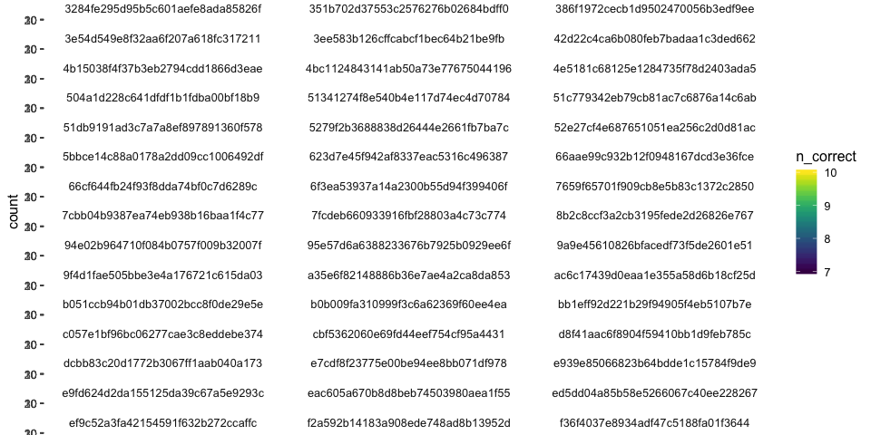<!-- -->

## Filler Trials

These used quantifiers (and thus we have strong idea about literal
meaning).

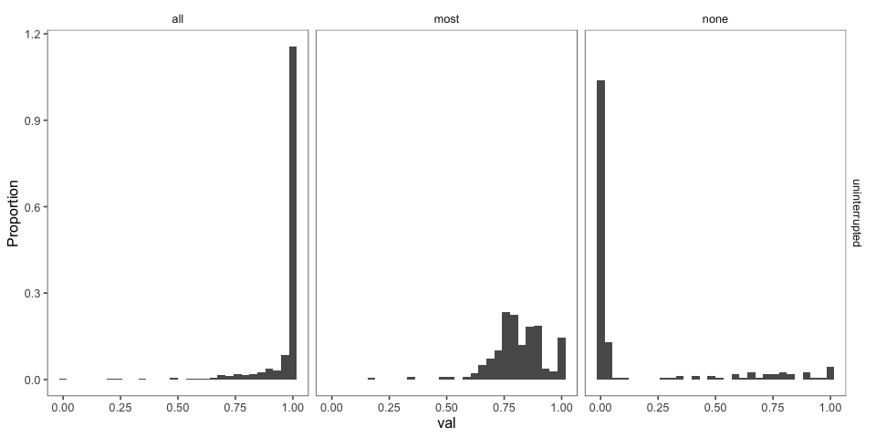<!-- -->

## Critical Trials (collapsed across item)

## Histograms of Prevalence Estimates by Condition (collapsed across item, conjunct A)

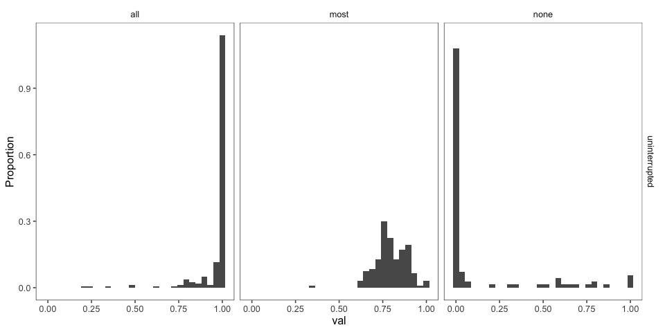<!-- -->

### By-item, conjunct A

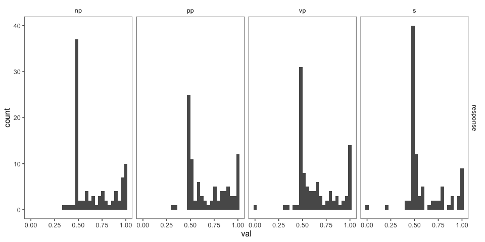<!-- -->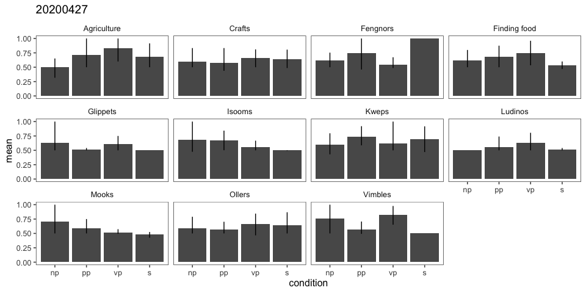<!-- -->

### Mutually Exclusive Interpretations (20200427 only)

Defining a mutually exclusive interpretation as one in which the total
prevalence is less than 1.2 (to allow for some fuzziness).

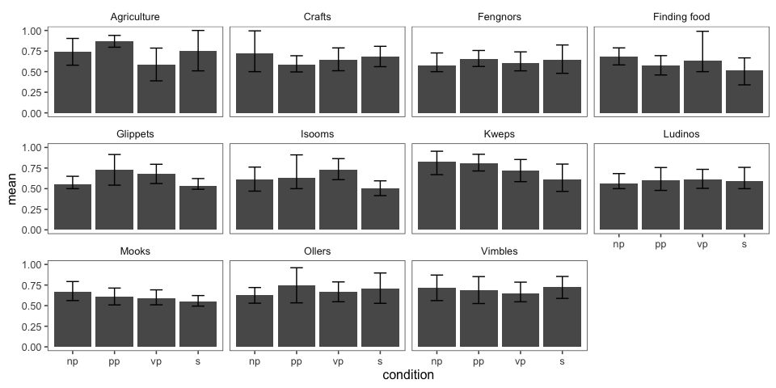<!-- -->

    ## # A tibble: 2 x 2
    ##   me        n
    ##   <lgl> <int>
    ## 1 FALSE    73
    ## 2 TRUE    180

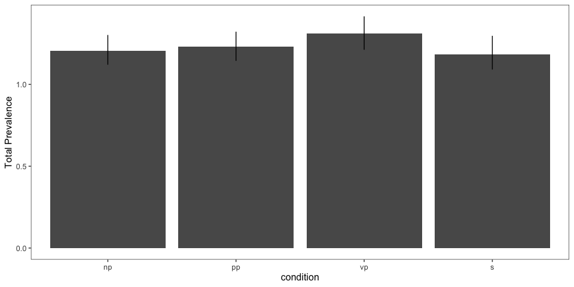<!-- -->

#### By Item

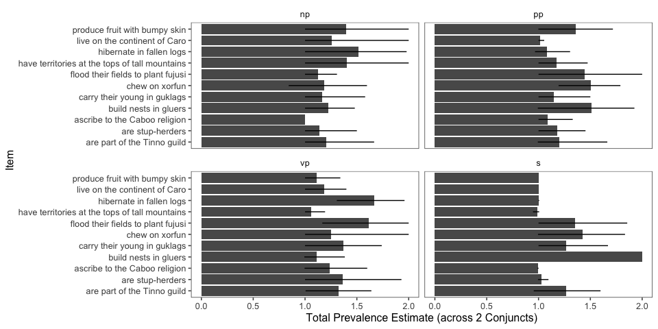<!-- -->

### Bootstrapped 95% Confidence Intervals (collapsed across item)

#### Prevalence for Conjunct A, 20200417 (used in AMLaP abstract)

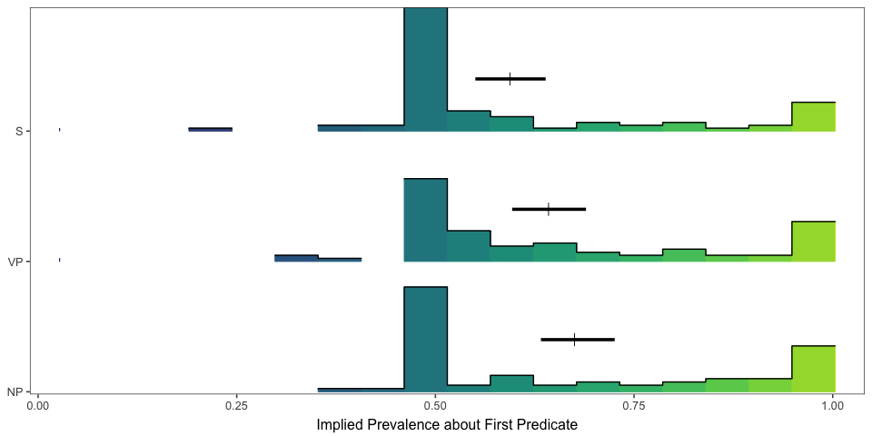<!-- -->

#### Prevalence for Conjunct A, 20200427

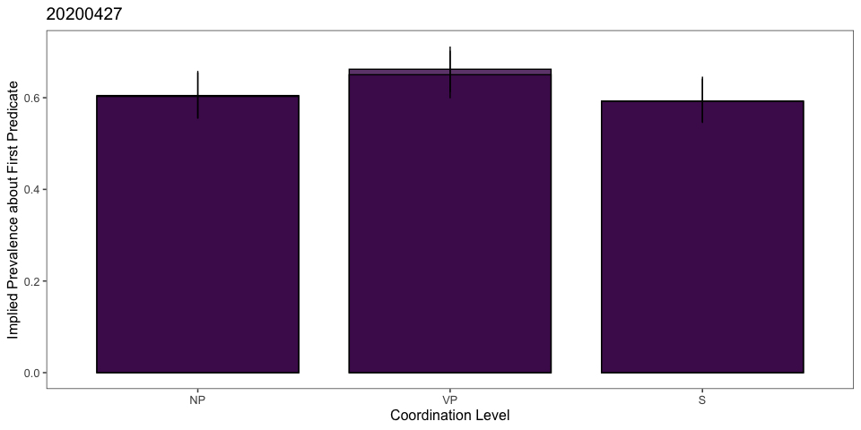<!-- -->

#### Prevalence for Conjunct A and B, 20200427

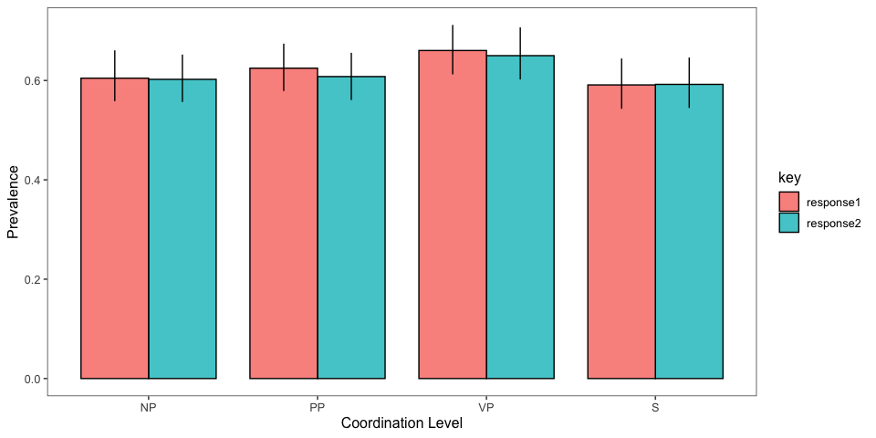<!-- -->

### Proportion of Participants that Responded ~50%

| condition | rep      | key       | percent\_half |
| :-------- | :------- | :-------- | ------------: |
| S         | 20200427 | response2 |     0.6724138 |
| NP        | 20200427 | response1 |     0.6567164 |
| S         | 20200427 | response1 |     0.6551724 |
| NP        | 20200427 | response2 |     0.6417910 |
| PP        | 20200427 | response2 |     0.6307692 |
| PP        | 20200427 | response1 |     0.6153846 |
| S         | 20200417 | response1 |     0.6024096 |
| VP        | 20200427 | response2 |     0.5555556 |
| VP        | 20200427 | response1 |     0.5396825 |
| NP        | 20200417 | response1 |     0.4657534 |
| VP        | 20200417 | response1 |     0.4487179 |
| PP        | 20200417 | response1 |     0.4324324 |

### Stats

Coded with S as base level, predicting conjunct A
    only.

#### 20201417

    ## Running /Library/Frameworks/R.framework/Resources/bin/R CMD SHLIB foo.c
    ## clang -I"/Library/Frameworks/R.framework/Resources/include" -DNDEBUG   -I"/Library/Frameworks/R.framework/Versions/3.6/Resources/library/Rcpp/include/"  -I"/Library/Frameworks/R.framework/Versions/3.6/Resources/library/RcppEigen/include/"  -I"/Library/Frameworks/R.framework/Versions/3.6/Resources/library/RcppEigen/include/unsupported"  -I"/Library/Frameworks/R.framework/Versions/3.6/Resources/library/BH/include" -I"/Library/Frameworks/R.framework/Versions/3.6/Resources/library/StanHeaders/include/src/"  -I"/Library/Frameworks/R.framework/Versions/3.6/Resources/library/StanHeaders/include/"  -I"/Library/Frameworks/R.framework/Versions/3.6/Resources/library/rstan/include" -DEIGEN_NO_DEBUG  -D_REENTRANT  -DBOOST_DISABLE_ASSERTS -DBOOST_PENDING_INTEGER_LOG2_HPP -include stan/math/prim/mat/fun/Eigen.hpp   -isysroot /Library/Developer/CommandLineTools/SDKs/MacOSX.sdk -I/usr/local/include  -fPIC  -isysroot /Library/Developer/CommandLineTools/SDKs/MacOSX.sdk -c foo.c -o foo.o
    ## In file included from <built-in>:1:
    ## In file included from /Library/Frameworks/R.framework/Versions/3.6/Resources/library/StanHeaders/include/stan/math/prim/mat/fun/Eigen.hpp:13:
    ## In file included from /Library/Frameworks/R.framework/Versions/3.6/Resources/library/RcppEigen/include/Eigen/Dense:1:
    ## In file included from /Library/Frameworks/R.framework/Versions/3.6/Resources/library/RcppEigen/include/Eigen/Core:88:
    ## /Library/Frameworks/R.framework/Versions/3.6/Resources/library/RcppEigen/include/Eigen/src/Core/util/Macros.h:613:1: error: unknown type name 'namespace'
    ## namespace Eigen {
    ## ^
    ## /Library/Frameworks/R.framework/Versions/3.6/Resources/library/RcppEigen/include/Eigen/src/Core/util/Macros.h:613:16: error: expected ';' after top level declarator
    ## namespace Eigen {
    ##                ^
    ##                ;
    ## In file included from <built-in>:1:
    ## In file included from /Library/Frameworks/R.framework/Versions/3.6/Resources/library/StanHeaders/include/stan/math/prim/mat/fun/Eigen.hpp:13:
    ## In file included from /Library/Frameworks/R.framework/Versions/3.6/Resources/library/RcppEigen/include/Eigen/Dense:1:
    ## /Library/Frameworks/R.framework/Versions/3.6/Resources/library/RcppEigen/include/Eigen/Core:96:10: fatal error: 'complex' file not found
    ## #include <complex>
    ##          ^~~~~~~~~
    ## 3 errors generated.
    ## make: *** [foo.o] Error 1
    ## 
    ## SAMPLING FOR MODEL 'bb951cd7c76bf306a492eebdbf82ce12' NOW (CHAIN 1).
    ## Chain 1: 
    ## Chain 1: Gradient evaluation took 0.000249 seconds
    ## Chain 1: 1000 transitions using 10 leapfrog steps per transition would take 2.49 seconds.
    ## Chain 1: Adjust your expectations accordingly!
    ## Chain 1: 
    ## Chain 1: 
    ## Chain 1: Iteration:    1 / 2000 [  0%]  (Warmup)
    ## Chain 1: Iteration:  200 / 2000 [ 10%]  (Warmup)
    ## Chain 1: Iteration:  400 / 2000 [ 20%]  (Warmup)
    ## Chain 1: Iteration:  600 / 2000 [ 30%]  (Warmup)
    ## Chain 1: Iteration:  800 / 2000 [ 40%]  (Warmup)
    ## Chain 1: Iteration: 1000 / 2000 [ 50%]  (Warmup)
    ## Chain 1: Iteration: 1001 / 2000 [ 50%]  (Sampling)
    ## Chain 1: Iteration: 1200 / 2000 [ 60%]  (Sampling)
    ## Chain 1: Iteration: 1400 / 2000 [ 70%]  (Sampling)
    ## Chain 1: Iteration: 1600 / 2000 [ 80%]  (Sampling)
    ## Chain 1: Iteration: 1800 / 2000 [ 90%]  (Sampling)
    ## Chain 1: Iteration: 2000 / 2000 [100%]  (Sampling)
    ## Chain 1: 
    ## Chain 1:  Elapsed Time: 5.69603 seconds (Warm-up)
    ## Chain 1:                2.41514 seconds (Sampling)
    ## Chain 1:                8.11117 seconds (Total)
    ## Chain 1: 
    ## 
    ## SAMPLING FOR MODEL 'bb951cd7c76bf306a492eebdbf82ce12' NOW (CHAIN 2).
    ## Chain 2: 
    ## Chain 2: Gradient evaluation took 0.000169 seconds
    ## Chain 2: 1000 transitions using 10 leapfrog steps per transition would take 1.69 seconds.
    ## Chain 2: Adjust your expectations accordingly!
    ## Chain 2: 
    ## Chain 2: 
    ## Chain 2: Iteration:    1 / 2000 [  0%]  (Warmup)
    ## Chain 2: Iteration:  200 / 2000 [ 10%]  (Warmup)
    ## Chain 2: Iteration:  400 / 2000 [ 20%]  (Warmup)
    ## Chain 2: Iteration:  600 / 2000 [ 30%]  (Warmup)
    ## Chain 2: Iteration:  800 / 2000 [ 40%]  (Warmup)
    ## Chain 2: Iteration: 1000 / 2000 [ 50%]  (Warmup)
    ## Chain 2: Iteration: 1001 / 2000 [ 50%]  (Sampling)
    ## Chain 2: Iteration: 1200 / 2000 [ 60%]  (Sampling)
    ## Chain 2: Iteration: 1400 / 2000 [ 70%]  (Sampling)
    ## Chain 2: Iteration: 1600 / 2000 [ 80%]  (Sampling)
    ## Chain 2: Iteration: 1800 / 2000 [ 90%]  (Sampling)
    ## Chain 2: Iteration: 2000 / 2000 [100%]  (Sampling)
    ## Chain 2: 
    ## Chain 2:  Elapsed Time: 5.82611 seconds (Warm-up)
    ## Chain 2:                2.5146 seconds (Sampling)
    ## Chain 2:                8.34071 seconds (Total)
    ## Chain 2: 
    ## 
    ## SAMPLING FOR MODEL 'bb951cd7c76bf306a492eebdbf82ce12' NOW (CHAIN 3).
    ## Chain 3: 
    ## Chain 3: Gradient evaluation took 9.1e-05 seconds
    ## Chain 3: 1000 transitions using 10 leapfrog steps per transition would take 0.91 seconds.
    ## Chain 3: Adjust your expectations accordingly!
    ## Chain 3: 
    ## Chain 3: 
    ## Chain 3: Iteration:    1 / 2000 [  0%]  (Warmup)
    ## Chain 3: Iteration:  200 / 2000 [ 10%]  (Warmup)
    ## Chain 3: Iteration:  400 / 2000 [ 20%]  (Warmup)
    ## Chain 3: Iteration:  600 / 2000 [ 30%]  (Warmup)
    ## Chain 3: Iteration:  800 / 2000 [ 40%]  (Warmup)
    ## Chain 3: Iteration: 1000 / 2000 [ 50%]  (Warmup)
    ## Chain 3: Iteration: 1001 / 2000 [ 50%]  (Sampling)
    ## Chain 3: Iteration: 1200 / 2000 [ 60%]  (Sampling)
    ## Chain 3: Iteration: 1400 / 2000 [ 70%]  (Sampling)
    ## Chain 3: Iteration: 1600 / 2000 [ 80%]  (Sampling)
    ## Chain 3: Iteration: 1800 / 2000 [ 90%]  (Sampling)
    ## Chain 3: Iteration: 2000 / 2000 [100%]  (Sampling)
    ## Chain 3: 
    ## Chain 3:  Elapsed Time: 5.81784 seconds (Warm-up)
    ## Chain 3:                2.54676 seconds (Sampling)
    ## Chain 3:                8.36461 seconds (Total)
    ## Chain 3: 
    ## 
    ## SAMPLING FOR MODEL 'bb951cd7c76bf306a492eebdbf82ce12' NOW (CHAIN 4).
    ## Chain 4: 
    ## Chain 4: Gradient evaluation took 8.5e-05 seconds
    ## Chain 4: 1000 transitions using 10 leapfrog steps per transition would take 0.85 seconds.
    ## Chain 4: Adjust your expectations accordingly!
    ## Chain 4: 
    ## Chain 4: 
    ## Chain 4: Iteration:    1 / 2000 [  0%]  (Warmup)
    ## Chain 4: Iteration:  200 / 2000 [ 10%]  (Warmup)
    ## Chain 4: Iteration:  400 / 2000 [ 20%]  (Warmup)
    ## Chain 4: Iteration:  600 / 2000 [ 30%]  (Warmup)
    ## Chain 4: Iteration:  800 / 2000 [ 40%]  (Warmup)
    ## Chain 4: Iteration: 1000 / 2000 [ 50%]  (Warmup)
    ## Chain 4: Iteration: 1001 / 2000 [ 50%]  (Sampling)
    ## Chain 4: Iteration: 1200 / 2000 [ 60%]  (Sampling)
    ## Chain 4: Iteration: 1400 / 2000 [ 70%]  (Sampling)
    ## Chain 4: Iteration: 1600 / 2000 [ 80%]  (Sampling)
    ## Chain 4: Iteration: 1800 / 2000 [ 90%]  (Sampling)
    ## Chain 4: Iteration: 2000 / 2000 [100%]  (Sampling)
    ## Chain 4: 
    ## Chain 4:  Elapsed Time: 5.75096 seconds (Warm-up)
    ## Chain 4:                2.49824 seconds (Sampling)
    ## Chain 4:                8.2492 seconds (Total)
    ## Chain 4:

    ##  Family: gaussian 
    ##   Links: mu = identity; sigma = identity 
    ## Formula: val ~ condition + (1 + condition | workerid) + (1 + condition | predicate_1) 
    ##    Data: model.data.original (Number of observations: 253) 
    ## Samples: 4 chains, each with iter = 2000; warmup = 1000; thin = 1;
    ##          total post-warmup samples = 4000
    ## 
    ## Group-Level Effects: 
    ## ~predicate_1 (Number of levels: 11) 
    ##                              Estimate Est.Error l-95% CI u-95% CI Rhat
    ## sd(Intercept)                    0.04      0.02     0.00     0.09 1.00
    ## sd(conditionnp)                  0.05      0.04     0.00     0.14 1.00
    ## sd(conditionpp)                  0.03      0.02     0.00     0.09 1.00
    ## sd(conditionvp)                  0.07      0.04     0.00     0.16 1.00
    ## cor(Intercept,conditionnp)      -0.36      0.44    -0.93     0.66 1.00
    ## cor(Intercept,conditionpp)      -0.08      0.45    -0.85     0.78 1.00
    ## cor(conditionnp,conditionpp)     0.04      0.44    -0.80     0.83 1.00
    ## cor(Intercept,conditionvp)       0.04      0.42    -0.74     0.83 1.00
    ## cor(conditionnp,conditionvp)    -0.09      0.43    -0.84     0.75 1.00
    ## cor(conditionpp,conditionvp)     0.01      0.44    -0.81     0.81 1.00
    ##                              Bulk_ESS Tail_ESS
    ## sd(Intercept)                     916     1686
    ## sd(conditionnp)                  1144     1721
    ## sd(conditionpp)                  2637     1964
    ## sd(conditionvp)                  1274     1567
    ## cor(Intercept,conditionnp)       1793     2390
    ## cor(Intercept,conditionpp)       4150     2648
    ## cor(conditionnp,conditionpp)     3927     3414
    ## cor(Intercept,conditionvp)       2452     2382
    ## cor(conditionnp,conditionvp)     2340     2398
    ## cor(conditionpp,conditionvp)     2532     3138
    ## 
    ## ~workerid (Number of levels: 23) 
    ##                              Estimate Est.Error l-95% CI u-95% CI Rhat
    ## sd(Intercept)                    0.14      0.03     0.09     0.20 1.00
    ## sd(conditionnp)                  0.04      0.03     0.00     0.12 1.00
    ## sd(conditionpp)                  0.05      0.03     0.00     0.12 1.00
    ## sd(conditionvp)                  0.05      0.04     0.00     0.13 1.00
    ## cor(Intercept,conditionnp)      -0.03      0.42    -0.78     0.76 1.00
    ## cor(Intercept,conditionpp)       0.22      0.39    -0.63     0.86 1.00
    ## cor(conditionnp,conditionpp)     0.01      0.44    -0.80     0.80 1.00
    ## cor(Intercept,conditionvp)      -0.03      0.41    -0.77     0.76 1.00
    ## cor(conditionnp,conditionvp)     0.08      0.45    -0.78     0.86 1.00
    ## cor(conditionpp,conditionvp)     0.04      0.45    -0.81     0.83 1.00
    ##                              Bulk_ESS Tail_ESS
    ## sd(Intercept)                    1181     2096
    ## sd(conditionnp)                  1278     1843
    ## sd(conditionpp)                  1445     2020
    ## sd(conditionvp)                  1208     2028
    ## cor(Intercept,conditionnp)       3840     2610
    ## cor(Intercept,conditionpp)       3574     2772
    ## cor(conditionnp,conditionpp)     2373     3192
    ## cor(Intercept,conditionvp)       3150     2811
    ## cor(conditionnp,conditionvp)     1945     2726
    ## cor(conditionpp,conditionvp)     2330     2771
    ## 
    ## Population-Level Effects: 
    ##             Estimate Est.Error l-95% CI u-95% CI Rhat Bulk_ESS Tail_ESS
    ## Intercept       0.59      0.04     0.52     0.67 1.00     1202     1819
    ## conditionnp     0.02      0.04    -0.05     0.10 1.00     2830     2819
    ## conditionpp     0.04      0.03    -0.02     0.11 1.00     3118     2944
    ## conditionvp     0.05      0.04    -0.03     0.13 1.00     2579     2594
    ## 
    ## Family Specific Parameters: 
    ##       Estimate Est.Error l-95% CI u-95% CI Rhat Bulk_ESS Tail_ESS
    ## sigma     0.15      0.01     0.14     0.17 1.00     3812     2649
    ## 
    ## Samples were drawn using sampling(NUTS). For each parameter, Eff.Sample 
    ## is a crude measure of effective sample size, and Rhat is the potential 
    ## scale reduction factor on split chains (at convergence, Rhat = 1).

#### 20200427

    ## Running /Library/Frameworks/R.framework/Resources/bin/R CMD SHLIB foo.c
    ## clang -I"/Library/Frameworks/R.framework/Resources/include" -DNDEBUG   -I"/Library/Frameworks/R.framework/Versions/3.6/Resources/library/Rcpp/include/"  -I"/Library/Frameworks/R.framework/Versions/3.6/Resources/library/RcppEigen/include/"  -I"/Library/Frameworks/R.framework/Versions/3.6/Resources/library/RcppEigen/include/unsupported"  -I"/Library/Frameworks/R.framework/Versions/3.6/Resources/library/BH/include" -I"/Library/Frameworks/R.framework/Versions/3.6/Resources/library/StanHeaders/include/src/"  -I"/Library/Frameworks/R.framework/Versions/3.6/Resources/library/StanHeaders/include/"  -I"/Library/Frameworks/R.framework/Versions/3.6/Resources/library/rstan/include" -DEIGEN_NO_DEBUG  -D_REENTRANT  -DBOOST_DISABLE_ASSERTS -DBOOST_PENDING_INTEGER_LOG2_HPP -include stan/math/prim/mat/fun/Eigen.hpp   -isysroot /Library/Developer/CommandLineTools/SDKs/MacOSX.sdk -I/usr/local/include  -fPIC  -isysroot /Library/Developer/CommandLineTools/SDKs/MacOSX.sdk -c foo.c -o foo.o
    ## In file included from <built-in>:1:
    ## In file included from /Library/Frameworks/R.framework/Versions/3.6/Resources/library/StanHeaders/include/stan/math/prim/mat/fun/Eigen.hpp:13:
    ## In file included from /Library/Frameworks/R.framework/Versions/3.6/Resources/library/RcppEigen/include/Eigen/Dense:1:
    ## In file included from /Library/Frameworks/R.framework/Versions/3.6/Resources/library/RcppEigen/include/Eigen/Core:88:
    ## /Library/Frameworks/R.framework/Versions/3.6/Resources/library/RcppEigen/include/Eigen/src/Core/util/Macros.h:613:1: error: unknown type name 'namespace'
    ## namespace Eigen {
    ## ^
    ## /Library/Frameworks/R.framework/Versions/3.6/Resources/library/RcppEigen/include/Eigen/src/Core/util/Macros.h:613:16: error: expected ';' after top level declarator
    ## namespace Eigen {
    ##                ^
    ##                ;
    ## In file included from <built-in>:1:
    ## In file included from /Library/Frameworks/R.framework/Versions/3.6/Resources/library/StanHeaders/include/stan/math/prim/mat/fun/Eigen.hpp:13:
    ## In file included from /Library/Frameworks/R.framework/Versions/3.6/Resources/library/RcppEigen/include/Eigen/Dense:1:
    ## /Library/Frameworks/R.framework/Versions/3.6/Resources/library/RcppEigen/include/Eigen/Core:96:10: fatal error: 'complex' file not found
    ## #include <complex>
    ##          ^~~~~~~~~
    ## 3 errors generated.
    ## make: *** [foo.o] Error 1
    ## 
    ## SAMPLING FOR MODEL 'bb951cd7c76bf306a492eebdbf82ce12' NOW (CHAIN 1).
    ## Chain 1: 
    ## Chain 1: Gradient evaluation took 0.000274 seconds
    ## Chain 1: 1000 transitions using 10 leapfrog steps per transition would take 2.74 seconds.
    ## Chain 1: Adjust your expectations accordingly!
    ## Chain 1: 
    ## Chain 1: 
    ## Chain 1: Iteration:    1 / 2000 [  0%]  (Warmup)
    ## Chain 1: Iteration:  200 / 2000 [ 10%]  (Warmup)
    ## Chain 1: Iteration:  400 / 2000 [ 20%]  (Warmup)
    ## Chain 1: Iteration:  600 / 2000 [ 30%]  (Warmup)
    ## Chain 1: Iteration:  800 / 2000 [ 40%]  (Warmup)
    ## Chain 1: Iteration: 1000 / 2000 [ 50%]  (Warmup)
    ## Chain 1: Iteration: 1001 / 2000 [ 50%]  (Sampling)
    ## Chain 1: Iteration: 1200 / 2000 [ 60%]  (Sampling)
    ## Chain 1: Iteration: 1400 / 2000 [ 70%]  (Sampling)
    ## Chain 1: Iteration: 1600 / 2000 [ 80%]  (Sampling)
    ## Chain 1: Iteration: 1800 / 2000 [ 90%]  (Sampling)
    ## Chain 1: Iteration: 2000 / 2000 [100%]  (Sampling)
    ## Chain 1: 
    ## Chain 1:  Elapsed Time: 6.53027 seconds (Warm-up)
    ## Chain 1:                3.21325 seconds (Sampling)
    ## Chain 1:                9.74352 seconds (Total)
    ## Chain 1: 
    ## 
    ## SAMPLING FOR MODEL 'bb951cd7c76bf306a492eebdbf82ce12' NOW (CHAIN 2).
    ## Chain 2: 
    ## Chain 2: Gradient evaluation took 0.000138 seconds
    ## Chain 2: 1000 transitions using 10 leapfrog steps per transition would take 1.38 seconds.
    ## Chain 2: Adjust your expectations accordingly!
    ## Chain 2: 
    ## Chain 2: 
    ## Chain 2: Iteration:    1 / 2000 [  0%]  (Warmup)
    ## Chain 2: Iteration:  200 / 2000 [ 10%]  (Warmup)
    ## Chain 2: Iteration:  400 / 2000 [ 20%]  (Warmup)
    ## Chain 2: Iteration:  600 / 2000 [ 30%]  (Warmup)
    ## Chain 2: Iteration:  800 / 2000 [ 40%]  (Warmup)
    ## Chain 2: Iteration: 1000 / 2000 [ 50%]  (Warmup)
    ## Chain 2: Iteration: 1001 / 2000 [ 50%]  (Sampling)
    ## Chain 2: Iteration: 1200 / 2000 [ 60%]  (Sampling)
    ## Chain 2: Iteration: 1400 / 2000 [ 70%]  (Sampling)
    ## Chain 2: Iteration: 1600 / 2000 [ 80%]  (Sampling)
    ## Chain 2: Iteration: 1800 / 2000 [ 90%]  (Sampling)
    ## Chain 2: Iteration: 2000 / 2000 [100%]  (Sampling)
    ## Chain 2: 
    ## Chain 2:  Elapsed Time: 6.19289 seconds (Warm-up)
    ## Chain 2:                2.84873 seconds (Sampling)
    ## Chain 2:                9.04162 seconds (Total)
    ## Chain 2: 
    ## 
    ## SAMPLING FOR MODEL 'bb951cd7c76bf306a492eebdbf82ce12' NOW (CHAIN 3).
    ## Chain 3: 
    ## Chain 3: Gradient evaluation took 9e-05 seconds
    ## Chain 3: 1000 transitions using 10 leapfrog steps per transition would take 0.9 seconds.
    ## Chain 3: Adjust your expectations accordingly!
    ## Chain 3: 
    ## Chain 3: 
    ## Chain 3: Iteration:    1 / 2000 [  0%]  (Warmup)
    ## Chain 3: Iteration:  200 / 2000 [ 10%]  (Warmup)
    ## Chain 3: Iteration:  400 / 2000 [ 20%]  (Warmup)
    ## Chain 3: Iteration:  600 / 2000 [ 30%]  (Warmup)
    ## Chain 3: Iteration:  800 / 2000 [ 40%]  (Warmup)
    ## Chain 3: Iteration: 1000 / 2000 [ 50%]  (Warmup)
    ## Chain 3: Iteration: 1001 / 2000 [ 50%]  (Sampling)
    ## Chain 3: Iteration: 1200 / 2000 [ 60%]  (Sampling)
    ## Chain 3: Iteration: 1400 / 2000 [ 70%]  (Sampling)
    ## Chain 3: Iteration: 1600 / 2000 [ 80%]  (Sampling)
    ## Chain 3: Iteration: 1800 / 2000 [ 90%]  (Sampling)
    ## Chain 3: Iteration: 2000 / 2000 [100%]  (Sampling)
    ## Chain 3: 
    ## Chain 3:  Elapsed Time: 5.8148 seconds (Warm-up)
    ## Chain 3:                2.60649 seconds (Sampling)
    ## Chain 3:                8.4213 seconds (Total)
    ## Chain 3: 
    ## 
    ## SAMPLING FOR MODEL 'bb951cd7c76bf306a492eebdbf82ce12' NOW (CHAIN 4).
    ## Chain 4: 
    ## Chain 4: Gradient evaluation took 9.1e-05 seconds
    ## Chain 4: 1000 transitions using 10 leapfrog steps per transition would take 0.91 seconds.
    ## Chain 4: Adjust your expectations accordingly!
    ## Chain 4: 
    ## Chain 4: 
    ## Chain 4: Iteration:    1 / 2000 [  0%]  (Warmup)
    ## Chain 4: Iteration:  200 / 2000 [ 10%]  (Warmup)
    ## Chain 4: Iteration:  400 / 2000 [ 20%]  (Warmup)
    ## Chain 4: Iteration:  600 / 2000 [ 30%]  (Warmup)
    ## Chain 4: Iteration:  800 / 2000 [ 40%]  (Warmup)
    ## Chain 4: Iteration: 1000 / 2000 [ 50%]  (Warmup)
    ## Chain 4: Iteration: 1001 / 2000 [ 50%]  (Sampling)
    ## Chain 4: Iteration: 1200 / 2000 [ 60%]  (Sampling)
    ## Chain 4: Iteration: 1400 / 2000 [ 70%]  (Sampling)
    ## Chain 4: Iteration: 1600 / 2000 [ 80%]  (Sampling)
    ## Chain 4: Iteration: 1800 / 2000 [ 90%]  (Sampling)
    ## Chain 4: Iteration: 2000 / 2000 [100%]  (Sampling)
    ## Chain 4: 
    ## Chain 4:  Elapsed Time: 5.62966 seconds (Warm-up)
    ## Chain 4:                2.68177 seconds (Sampling)
    ## Chain 4:                8.31142 seconds (Total)
    ## Chain 4:

    ##  Family: gaussian 
    ##   Links: mu = identity; sigma = identity 
    ## Formula: val ~ condition + (1 + condition | workerid) + (1 + condition | predicate_1) 
    ##    Data: model.data.rep (Number of observations: 253) 
    ## Samples: 4 chains, each with iter = 2000; warmup = 1000; thin = 1;
    ##          total post-warmup samples = 4000
    ## 
    ## Group-Level Effects: 
    ## ~predicate_1 (Number of levels: 11) 
    ##                              Estimate Est.Error l-95% CI u-95% CI Rhat
    ## sd(Intercept)                    0.04      0.02     0.00     0.09 1.00
    ## sd(conditionnp)                  0.05      0.04     0.00     0.13 1.00
    ## sd(conditionpp)                  0.03      0.02     0.00     0.09 1.00
    ## sd(conditionvp)                  0.07      0.04     0.00     0.17 1.00
    ## cor(Intercept,conditionnp)      -0.31      0.45    -0.93     0.65 1.00
    ## cor(Intercept,conditionpp)      -0.08      0.45    -0.84     0.76 1.00
    ## cor(conditionnp,conditionpp)     0.02      0.45    -0.79     0.82 1.00
    ## cor(Intercept,conditionvp)       0.04      0.42    -0.73     0.79 1.00
    ## cor(conditionnp,conditionvp)    -0.09      0.43    -0.83     0.75 1.00
    ## cor(conditionpp,conditionvp)     0.03      0.45    -0.79     0.81 1.00
    ##                              Bulk_ESS Tail_ESS
    ## sd(Intercept)                    1133     1708
    ## sd(conditionnp)                  1268     1536
    ## sd(conditionpp)                  3180     2578
    ## sd(conditionvp)                  1381     1341
    ## cor(Intercept,conditionnp)       2303     2614
    ## cor(Intercept,conditionpp)       5581     3210
    ## cor(conditionnp,conditionpp)     4615     3610
    ## cor(Intercept,conditionvp)       2832     2532
    ## cor(conditionnp,conditionvp)     2862     2802
    ## cor(conditionpp,conditionvp)     2540     3445
    ## 
    ## ~workerid (Number of levels: 23) 
    ##                              Estimate Est.Error l-95% CI u-95% CI Rhat
    ## sd(Intercept)                    0.14      0.03     0.09     0.20 1.00
    ## sd(conditionnp)                  0.04      0.03     0.00     0.12 1.00
    ## sd(conditionpp)                  0.05      0.03     0.00     0.12 1.00
    ## sd(conditionvp)                  0.05      0.04     0.00     0.13 1.01
    ## cor(Intercept,conditionnp)      -0.03      0.41    -0.78     0.76 1.00
    ## cor(Intercept,conditionpp)       0.21      0.39    -0.60     0.87 1.00
    ## cor(conditionnp,conditionpp)    -0.00      0.44    -0.80     0.81 1.00
    ## cor(Intercept,conditionvp)      -0.03      0.40    -0.76     0.76 1.00
    ## cor(conditionnp,conditionvp)     0.07      0.45    -0.78     0.84 1.00
    ## cor(conditionpp,conditionvp)     0.04      0.45    -0.80     0.84 1.00
    ##                              Bulk_ESS Tail_ESS
    ## sd(Intercept)                    1461     1860
    ## sd(conditionnp)                  1338     1443
    ## sd(conditionpp)                  1519     2218
    ## sd(conditionvp)                  1415     1828
    ## cor(Intercept,conditionnp)       5411     2614
    ## cor(Intercept,conditionpp)       4455     2477
    ## cor(conditionnp,conditionpp)     2689     2939
    ## cor(Intercept,conditionvp)       4562     2751
    ## cor(conditionnp,conditionvp)     2340     3203
    ## cor(conditionpp,conditionvp)     2554     3345
    ## 
    ## Population-Level Effects: 
    ##             Estimate Est.Error l-95% CI u-95% CI Rhat Bulk_ESS Tail_ESS
    ## Intercept       0.59      0.04     0.51     0.67 1.00     1380     2280
    ## conditionnp     0.03      0.04    -0.04     0.10 1.00     3761     2828
    ## conditionpp     0.04      0.03    -0.02     0.11 1.00     4128     2999
    ## conditionvp     0.05      0.04    -0.03     0.14 1.00     3121     2734
    ## 
    ## Family Specific Parameters: 
    ##       Estimate Est.Error l-95% CI u-95% CI Rhat Bulk_ESS Tail_ESS
    ## sigma     0.15      0.01     0.14     0.17 1.00     3956     3007
    ## 
    ## Samples were drawn using sampling(NUTS). For each parameter, Eff.Sample 
    ## is a crude measure of effective sample size, and Rhat is the potential 
    ## scale reduction factor on split chains (at convergence, Rhat = 1).

Predicting total prevalence (extent of mutual
    exclusivity).

    ## Running /Library/Frameworks/R.framework/Resources/bin/R CMD SHLIB foo.c
    ## clang -I"/Library/Frameworks/R.framework/Resources/include" -DNDEBUG   -I"/Library/Frameworks/R.framework/Versions/3.6/Resources/library/Rcpp/include/"  -I"/Library/Frameworks/R.framework/Versions/3.6/Resources/library/RcppEigen/include/"  -I"/Library/Frameworks/R.framework/Versions/3.6/Resources/library/RcppEigen/include/unsupported"  -I"/Library/Frameworks/R.framework/Versions/3.6/Resources/library/BH/include" -I"/Library/Frameworks/R.framework/Versions/3.6/Resources/library/StanHeaders/include/src/"  -I"/Library/Frameworks/R.framework/Versions/3.6/Resources/library/StanHeaders/include/"  -I"/Library/Frameworks/R.framework/Versions/3.6/Resources/library/rstan/include" -DEIGEN_NO_DEBUG  -D_REENTRANT  -DBOOST_DISABLE_ASSERTS -DBOOST_PENDING_INTEGER_LOG2_HPP -include stan/math/prim/mat/fun/Eigen.hpp   -isysroot /Library/Developer/CommandLineTools/SDKs/MacOSX.sdk -I/usr/local/include  -fPIC  -isysroot /Library/Developer/CommandLineTools/SDKs/MacOSX.sdk -c foo.c -o foo.o
    ## In file included from <built-in>:1:
    ## In file included from /Library/Frameworks/R.framework/Versions/3.6/Resources/library/StanHeaders/include/stan/math/prim/mat/fun/Eigen.hpp:13:
    ## In file included from /Library/Frameworks/R.framework/Versions/3.6/Resources/library/RcppEigen/include/Eigen/Dense:1:
    ## In file included from /Library/Frameworks/R.framework/Versions/3.6/Resources/library/RcppEigen/include/Eigen/Core:88:
    ## /Library/Frameworks/R.framework/Versions/3.6/Resources/library/RcppEigen/include/Eigen/src/Core/util/Macros.h:613:1: error: unknown type name 'namespace'
    ## namespace Eigen {
    ## ^
    ## /Library/Frameworks/R.framework/Versions/3.6/Resources/library/RcppEigen/include/Eigen/src/Core/util/Macros.h:613:16: error: expected ';' after top level declarator
    ## namespace Eigen {
    ##                ^
    ##                ;
    ## In file included from <built-in>:1:
    ## In file included from /Library/Frameworks/R.framework/Versions/3.6/Resources/library/StanHeaders/include/stan/math/prim/mat/fun/Eigen.hpp:13:
    ## In file included from /Library/Frameworks/R.framework/Versions/3.6/Resources/library/RcppEigen/include/Eigen/Dense:1:
    ## /Library/Frameworks/R.framework/Versions/3.6/Resources/library/RcppEigen/include/Eigen/Core:96:10: fatal error: 'complex' file not found
    ## #include <complex>
    ##          ^~~~~~~~~
    ## 3 errors generated.
    ## make: *** [foo.o] Error 1
    ## 
    ## SAMPLING FOR MODEL '2937bde617402b26b7eff09e95b2b36a' NOW (CHAIN 1).
    ## Chain 1: 
    ## Chain 1: Gradient evaluation took 0.000319 seconds
    ## Chain 1: 1000 transitions using 10 leapfrog steps per transition would take 3.19 seconds.
    ## Chain 1: Adjust your expectations accordingly!
    ## Chain 1: 
    ## Chain 1: 
    ## Chain 1: Iteration:    1 / 2000 [  0%]  (Warmup)
    ## Chain 1: Iteration:  200 / 2000 [ 10%]  (Warmup)
    ## Chain 1: Iteration:  400 / 2000 [ 20%]  (Warmup)
    ## Chain 1: Iteration:  600 / 2000 [ 30%]  (Warmup)
    ## Chain 1: Iteration:  800 / 2000 [ 40%]  (Warmup)
    ## Chain 1: Iteration: 1000 / 2000 [ 50%]  (Warmup)
    ## Chain 1: Iteration: 1001 / 2000 [ 50%]  (Sampling)
    ## Chain 1: Iteration: 1200 / 2000 [ 60%]  (Sampling)
    ## Chain 1: Iteration: 1400 / 2000 [ 70%]  (Sampling)
    ## Chain 1: Iteration: 1600 / 2000 [ 80%]  (Sampling)
    ## Chain 1: Iteration: 1800 / 2000 [ 90%]  (Sampling)
    ## Chain 1: Iteration: 2000 / 2000 [100%]  (Sampling)
    ## Chain 1: 
    ## Chain 1:  Elapsed Time: 4.06868 seconds (Warm-up)
    ## Chain 1:                2.37366 seconds (Sampling)
    ## Chain 1:                6.44234 seconds (Total)
    ## Chain 1: 
    ## 
    ## SAMPLING FOR MODEL '2937bde617402b26b7eff09e95b2b36a' NOW (CHAIN 2).
    ## Chain 2: 
    ## Chain 2: Gradient evaluation took 0.000105 seconds
    ## Chain 2: 1000 transitions using 10 leapfrog steps per transition would take 1.05 seconds.
    ## Chain 2: Adjust your expectations accordingly!
    ## Chain 2: 
    ## Chain 2: 
    ## Chain 2: Iteration:    1 / 2000 [  0%]  (Warmup)
    ## Chain 2: Iteration:  200 / 2000 [ 10%]  (Warmup)
    ## Chain 2: Iteration:  400 / 2000 [ 20%]  (Warmup)
    ## Chain 2: Iteration:  600 / 2000 [ 30%]  (Warmup)
    ## Chain 2: Iteration:  800 / 2000 [ 40%]  (Warmup)
    ## Chain 2: Iteration: 1000 / 2000 [ 50%]  (Warmup)
    ## Chain 2: Iteration: 1001 / 2000 [ 50%]  (Sampling)
    ## Chain 2: Iteration: 1200 / 2000 [ 60%]  (Sampling)
    ## Chain 2: Iteration: 1400 / 2000 [ 70%]  (Sampling)
    ## Chain 2: Iteration: 1600 / 2000 [ 80%]  (Sampling)
    ## Chain 2: Iteration: 1800 / 2000 [ 90%]  (Sampling)
    ## Chain 2: Iteration: 2000 / 2000 [100%]  (Sampling)
    ## Chain 2: 
    ## Chain 2:  Elapsed Time: 4.15529 seconds (Warm-up)
    ## Chain 2:                2.36986 seconds (Sampling)
    ## Chain 2:                6.52514 seconds (Total)
    ## Chain 2: 
    ## 
    ## SAMPLING FOR MODEL '2937bde617402b26b7eff09e95b2b36a' NOW (CHAIN 3).
    ## Chain 3: 
    ## Chain 3: Gradient evaluation took 0.000146 seconds
    ## Chain 3: 1000 transitions using 10 leapfrog steps per transition would take 1.46 seconds.
    ## Chain 3: Adjust your expectations accordingly!
    ## Chain 3: 
    ## Chain 3: 
    ## Chain 3: Iteration:    1 / 2000 [  0%]  (Warmup)
    ## Chain 3: Iteration:  200 / 2000 [ 10%]  (Warmup)
    ## Chain 3: Iteration:  400 / 2000 [ 20%]  (Warmup)
    ## Chain 3: Iteration:  600 / 2000 [ 30%]  (Warmup)
    ## Chain 3: Iteration:  800 / 2000 [ 40%]  (Warmup)
    ## Chain 3: Iteration: 1000 / 2000 [ 50%]  (Warmup)
    ## Chain 3: Iteration: 1001 / 2000 [ 50%]  (Sampling)
    ## Chain 3: Iteration: 1200 / 2000 [ 60%]  (Sampling)
    ## Chain 3: Iteration: 1400 / 2000 [ 70%]  (Sampling)
    ## Chain 3: Iteration: 1600 / 2000 [ 80%]  (Sampling)
    ## Chain 3: Iteration: 1800 / 2000 [ 90%]  (Sampling)
    ## Chain 3: Iteration: 2000 / 2000 [100%]  (Sampling)
    ## Chain 3: 
    ## Chain 3:  Elapsed Time: 4.18372 seconds (Warm-up)
    ## Chain 3:                2.68519 seconds (Sampling)
    ## Chain 3:                6.8689 seconds (Total)
    ## Chain 3: 
    ## 
    ## SAMPLING FOR MODEL '2937bde617402b26b7eff09e95b2b36a' NOW (CHAIN 4).
    ## Chain 4: 
    ## Chain 4: Gradient evaluation took 0.000174 seconds
    ## Chain 4: 1000 transitions using 10 leapfrog steps per transition would take 1.74 seconds.
    ## Chain 4: Adjust your expectations accordingly!
    ## Chain 4: 
    ## Chain 4: 
    ## Chain 4: Iteration:    1 / 2000 [  0%]  (Warmup)
    ## Chain 4: Iteration:  200 / 2000 [ 10%]  (Warmup)
    ## Chain 4: Iteration:  400 / 2000 [ 20%]  (Warmup)
    ## Chain 4: Iteration:  600 / 2000 [ 30%]  (Warmup)
    ## Chain 4: Iteration:  800 / 2000 [ 40%]  (Warmup)
    ## Chain 4: Iteration: 1000 / 2000 [ 50%]  (Warmup)
    ## Chain 4: Iteration: 1001 / 2000 [ 50%]  (Sampling)
    ## Chain 4: Iteration: 1200 / 2000 [ 60%]  (Sampling)
    ## Chain 4: Iteration: 1400 / 2000 [ 70%]  (Sampling)
    ## Chain 4: Iteration: 1600 / 2000 [ 80%]  (Sampling)
    ## Chain 4: Iteration: 1800 / 2000 [ 90%]  (Sampling)
    ## Chain 4: Iteration: 2000 / 2000 [100%]  (Sampling)
    ## Chain 4: 
    ## Chain 4:  Elapsed Time: 4.90839 seconds (Warm-up)
    ## Chain 4:                2.53706 seconds (Sampling)
    ## Chain 4:                7.44545 seconds (Total)
    ## Chain 4:

    ##  Family: gaussian 
    ##   Links: mu = identity; sigma = identity 
    ## Formula: total_prevalence ~ condition + (1 + condition | workerid) + (1 + condition | predicate_1) 
    ##    Data: model.data.me (Number of observations: 253) 
    ## Samples: 4 chains, each with iter = 2000; warmup = 1000; thin = 1;
    ##          total post-warmup samples = 4000
    ## 
    ## Group-Level Effects: 
    ## ~predicate_1 (Number of levels: 11) 
    ##                              Estimate Est.Error l-95% CI u-95% CI Rhat
    ## sd(Intercept)                    0.10      0.05     0.01     0.21 1.00
    ## sd(conditionnp)                  0.10      0.07     0.01     0.27 1.00
    ## sd(conditionpp)                  0.06      0.05     0.00     0.19 1.00
    ## sd(conditionvp)                  0.13      0.08     0.01     0.32 1.01
    ## cor(Intercept,conditionnp)      -0.40      0.41    -0.94     0.55 1.00
    ## cor(Intercept,conditionpp)      -0.09      0.44    -0.84     0.78 1.00
    ## cor(conditionnp,conditionpp)     0.05      0.45    -0.78     0.82 1.00
    ## cor(Intercept,conditionvp)       0.02      0.42    -0.76     0.80 1.00
    ## cor(conditionnp,conditionvp)    -0.02      0.44    -0.82     0.78 1.00
    ## cor(conditionpp,conditionvp)    -0.02      0.43    -0.82     0.78 1.00
    ##                              Bulk_ESS Tail_ESS
    ## sd(Intercept)                     929      915
    ## sd(conditionnp)                   868     1439
    ## sd(conditionpp)                  2302     2431
    ## sd(conditionvp)                  1217     1259
    ## cor(Intercept,conditionnp)       1976     2511
    ## cor(Intercept,conditionpp)       4559     2549
    ## cor(conditionnp,conditionpp)     4277     3257
    ## cor(Intercept,conditionvp)       2708     2482
    ## cor(conditionnp,conditionvp)     2631     3065
    ## cor(conditionpp,conditionvp)     2243     2816
    ## 
    ## ~workerid (Number of levels: 23) 
    ##                              Estimate Est.Error l-95% CI u-95% CI Rhat
    ## sd(Intercept)                    0.27      0.05     0.18     0.39 1.00
    ## sd(conditionnp)                  0.06      0.04     0.00     0.17 1.00
    ## sd(conditionpp)                  0.08      0.05     0.00     0.19 1.00
    ## sd(conditionvp)                  0.10      0.07     0.00     0.26 1.01
    ## cor(Intercept,conditionnp)      -0.05      0.43    -0.81     0.78 1.00
    ## cor(Intercept,conditionpp)       0.25      0.40    -0.62     0.87 1.00
    ## cor(conditionnp,conditionpp)     0.08      0.45    -0.78     0.86 1.00
    ## cor(Intercept,conditionvp)      -0.04      0.40    -0.76     0.73 1.00
    ## cor(conditionnp,conditionvp)     0.06      0.45    -0.78     0.84 1.00
    ## cor(conditionpp,conditionvp)     0.09      0.44    -0.76     0.85 1.00
    ##                              Bulk_ESS Tail_ESS
    ## sd(Intercept)                    1421     2546
    ## sd(conditionnp)                  1992     1806
    ## sd(conditionpp)                  1573     1686
    ## sd(conditionvp)                  1066     1708
    ## cor(Intercept,conditionnp)       5562     3201
    ## cor(Intercept,conditionpp)       5050     2971
    ## cor(conditionnp,conditionpp)     2683     2833
    ## cor(Intercept,conditionvp)       3882     2842
    ## cor(conditionnp,conditionvp)     2244     3029
    ## cor(conditionpp,conditionvp)     2033     2789
    ## 
    ## Population-Level Effects: 
    ##             Estimate Est.Error l-95% CI u-95% CI Rhat Bulk_ESS Tail_ESS
    ## Intercept       1.18      0.08     1.03     1.32 1.00     1340     1831
    ## conditionnp     0.06      0.07    -0.07     0.20 1.00     2818     2073
    ## conditionpp     0.06      0.06    -0.06     0.20 1.00     3023     2881
    ## conditionvp     0.10      0.08    -0.06     0.25 1.00     2936     2316
    ## 
    ## Family Specific Parameters: 
    ##       Estimate Est.Error l-95% CI u-95% CI Rhat Bulk_ESS Tail_ESS
    ## sigma     0.29      0.02     0.26     0.32 1.00     3515     2946
    ## 
    ## Samples were drawn using sampling(NUTS). For each parameter, Eff.Sample 
    ## is a crude measure of effective sample size, and Rhat is the potential 
    ## scale reduction factor on split chains (at convergence, Rhat = 1).

Predicting mutual exclusivity as a binary
    variable.

    ## Running /Library/Frameworks/R.framework/Resources/bin/R CMD SHLIB foo.c
    ## clang -I"/Library/Frameworks/R.framework/Resources/include" -DNDEBUG   -I"/Library/Frameworks/R.framework/Versions/3.6/Resources/library/Rcpp/include/"  -I"/Library/Frameworks/R.framework/Versions/3.6/Resources/library/RcppEigen/include/"  -I"/Library/Frameworks/R.framework/Versions/3.6/Resources/library/RcppEigen/include/unsupported"  -I"/Library/Frameworks/R.framework/Versions/3.6/Resources/library/BH/include" -I"/Library/Frameworks/R.framework/Versions/3.6/Resources/library/StanHeaders/include/src/"  -I"/Library/Frameworks/R.framework/Versions/3.6/Resources/library/StanHeaders/include/"  -I"/Library/Frameworks/R.framework/Versions/3.6/Resources/library/rstan/include" -DEIGEN_NO_DEBUG  -D_REENTRANT  -DBOOST_DISABLE_ASSERTS -DBOOST_PENDING_INTEGER_LOG2_HPP -include stan/math/prim/mat/fun/Eigen.hpp   -isysroot /Library/Developer/CommandLineTools/SDKs/MacOSX.sdk -I/usr/local/include  -fPIC  -isysroot /Library/Developer/CommandLineTools/SDKs/MacOSX.sdk -c foo.c -o foo.o
    ## In file included from <built-in>:1:
    ## In file included from /Library/Frameworks/R.framework/Versions/3.6/Resources/library/StanHeaders/include/stan/math/prim/mat/fun/Eigen.hpp:13:
    ## In file included from /Library/Frameworks/R.framework/Versions/3.6/Resources/library/RcppEigen/include/Eigen/Dense:1:
    ## In file included from /Library/Frameworks/R.framework/Versions/3.6/Resources/library/RcppEigen/include/Eigen/Core:88:
    ## /Library/Frameworks/R.framework/Versions/3.6/Resources/library/RcppEigen/include/Eigen/src/Core/util/Macros.h:613:1: error: unknown type name 'namespace'
    ## namespace Eigen {
    ## ^
    ## /Library/Frameworks/R.framework/Versions/3.6/Resources/library/RcppEigen/include/Eigen/src/Core/util/Macros.h:613:16: error: expected ';' after top level declarator
    ## namespace Eigen {
    ##                ^
    ##                ;
    ## In file included from <built-in>:1:
    ## In file included from /Library/Frameworks/R.framework/Versions/3.6/Resources/library/StanHeaders/include/stan/math/prim/mat/fun/Eigen.hpp:13:
    ## In file included from /Library/Frameworks/R.framework/Versions/3.6/Resources/library/RcppEigen/include/Eigen/Dense:1:
    ## /Library/Frameworks/R.framework/Versions/3.6/Resources/library/RcppEigen/include/Eigen/Core:96:10: fatal error: 'complex' file not found
    ## #include <complex>
    ##          ^~~~~~~~~
    ## 3 errors generated.
    ## make: *** [foo.o] Error 1
    ## 
    ## SAMPLING FOR MODEL '1089a75610a3d526ca52bb8d30bda9ae' NOW (CHAIN 1).
    ## Chain 1: 
    ## Chain 1: Gradient evaluation took 0.000255 seconds
    ## Chain 1: 1000 transitions using 10 leapfrog steps per transition would take 2.55 seconds.
    ## Chain 1: Adjust your expectations accordingly!
    ## Chain 1: 
    ## Chain 1: 
    ## Chain 1: Iteration:    1 / 2000 [  0%]  (Warmup)
    ## Chain 1: Iteration:  200 / 2000 [ 10%]  (Warmup)
    ## Chain 1: Iteration:  400 / 2000 [ 20%]  (Warmup)
    ## Chain 1: Iteration:  600 / 2000 [ 30%]  (Warmup)
    ## Chain 1: Iteration:  800 / 2000 [ 40%]  (Warmup)
    ## Chain 1: Iteration: 1000 / 2000 [ 50%]  (Warmup)
    ## Chain 1: Iteration: 1001 / 2000 [ 50%]  (Sampling)
    ## Chain 1: Iteration: 1200 / 2000 [ 60%]  (Sampling)
    ## Chain 1: Iteration: 1400 / 2000 [ 70%]  (Sampling)
    ## Chain 1: Iteration: 1600 / 2000 [ 80%]  (Sampling)
    ## Chain 1: Iteration: 1800 / 2000 [ 90%]  (Sampling)
    ## Chain 1: Iteration: 2000 / 2000 [100%]  (Sampling)
    ## Chain 1: 
    ## Chain 1:  Elapsed Time: 5.98932 seconds (Warm-up)
    ## Chain 1:                5.3309 seconds (Sampling)
    ## Chain 1:                11.3202 seconds (Total)
    ## Chain 1: 
    ## 
    ## SAMPLING FOR MODEL '1089a75610a3d526ca52bb8d30bda9ae' NOW (CHAIN 2).
    ## Chain 2: 
    ## Chain 2: Gradient evaluation took 0.000115 seconds
    ## Chain 2: 1000 transitions using 10 leapfrog steps per transition would take 1.15 seconds.
    ## Chain 2: Adjust your expectations accordingly!
    ## Chain 2: 
    ## Chain 2: 
    ## Chain 2: Iteration:    1 / 2000 [  0%]  (Warmup)
    ## Chain 2: Iteration:  200 / 2000 [ 10%]  (Warmup)
    ## Chain 2: Iteration:  400 / 2000 [ 20%]  (Warmup)
    ## Chain 2: Iteration:  600 / 2000 [ 30%]  (Warmup)
    ## Chain 2: Iteration:  800 / 2000 [ 40%]  (Warmup)
    ## Chain 2: Iteration: 1000 / 2000 [ 50%]  (Warmup)
    ## Chain 2: Iteration: 1001 / 2000 [ 50%]  (Sampling)
    ## Chain 2: Iteration: 1200 / 2000 [ 60%]  (Sampling)
    ## Chain 2: Iteration: 1400 / 2000 [ 70%]  (Sampling)
    ## Chain 2: Iteration: 1600 / 2000 [ 80%]  (Sampling)
    ## Chain 2: Iteration: 1800 / 2000 [ 90%]  (Sampling)
    ## Chain 2: Iteration: 2000 / 2000 [100%]  (Sampling)
    ## Chain 2: 
    ## Chain 2:  Elapsed Time: 6.55588 seconds (Warm-up)
    ## Chain 2:                5.44435 seconds (Sampling)
    ## Chain 2:                12.0002 seconds (Total)
    ## Chain 2: 
    ## 
    ## SAMPLING FOR MODEL '1089a75610a3d526ca52bb8d30bda9ae' NOW (CHAIN 3).
    ## Chain 3: 
    ## Chain 3: Gradient evaluation took 0.0001 seconds
    ## Chain 3: 1000 transitions using 10 leapfrog steps per transition would take 1 seconds.
    ## Chain 3: Adjust your expectations accordingly!
    ## Chain 3: 
    ## Chain 3: 
    ## Chain 3: Iteration:    1 / 2000 [  0%]  (Warmup)
    ## Chain 3: Iteration:  200 / 2000 [ 10%]  (Warmup)
    ## Chain 3: Iteration:  400 / 2000 [ 20%]  (Warmup)
    ## Chain 3: Iteration:  600 / 2000 [ 30%]  (Warmup)
    ## Chain 3: Iteration:  800 / 2000 [ 40%]  (Warmup)
    ## Chain 3: Iteration: 1000 / 2000 [ 50%]  (Warmup)
    ## Chain 3: Iteration: 1001 / 2000 [ 50%]  (Sampling)
    ## Chain 3: Iteration: 1200 / 2000 [ 60%]  (Sampling)
    ## Chain 3: Iteration: 1400 / 2000 [ 70%]  (Sampling)
    ## Chain 3: Iteration: 1600 / 2000 [ 80%]  (Sampling)
    ## Chain 3: Iteration: 1800 / 2000 [ 90%]  (Sampling)
    ## Chain 3: Iteration: 2000 / 2000 [100%]  (Sampling)
    ## Chain 3: 
    ## Chain 3:  Elapsed Time: 6.91521 seconds (Warm-up)
    ## Chain 3:                5.24441 seconds (Sampling)
    ## Chain 3:                12.1596 seconds (Total)
    ## Chain 3: 
    ## 
    ## SAMPLING FOR MODEL '1089a75610a3d526ca52bb8d30bda9ae' NOW (CHAIN 4).
    ## Chain 4: 
    ## Chain 4: Gradient evaluation took 0.0001 seconds
    ## Chain 4: 1000 transitions using 10 leapfrog steps per transition would take 1 seconds.
    ## Chain 4: Adjust your expectations accordingly!
    ## Chain 4: 
    ## Chain 4: 
    ## Chain 4: Iteration:    1 / 2000 [  0%]  (Warmup)
    ## Chain 4: Iteration:  200 / 2000 [ 10%]  (Warmup)
    ## Chain 4: Iteration:  400 / 2000 [ 20%]  (Warmup)
    ## Chain 4: Iteration:  600 / 2000 [ 30%]  (Warmup)
    ## Chain 4: Iteration:  800 / 2000 [ 40%]  (Warmup)
    ## Chain 4: Iteration: 1000 / 2000 [ 50%]  (Warmup)
    ## Chain 4: Iteration: 1001 / 2000 [ 50%]  (Sampling)
    ## Chain 4: Iteration: 1200 / 2000 [ 60%]  (Sampling)
    ## Chain 4: Iteration: 1400 / 2000 [ 70%]  (Sampling)
    ## Chain 4: Iteration: 1600 / 2000 [ 80%]  (Sampling)
    ## Chain 4: Iteration: 1800 / 2000 [ 90%]  (Sampling)
    ## Chain 4: Iteration: 2000 / 2000 [100%]  (Sampling)
    ## Chain 4: 
    ## Chain 4:  Elapsed Time: 6.42936 seconds (Warm-up)
    ## Chain 4:                5.13135 seconds (Sampling)
    ## Chain 4:                11.5607 seconds (Total)
    ## Chain 4:

    ##  Family: bernoulli 
    ##   Links: mu = logit 
    ## Formula: me ~ condition + (1 + condition | workerid) + (1 + condition | predicate_1) 
    ##    Data: model.data.me (Number of observations: 253) 
    ## Samples: 4 chains, each with iter = 2000; warmup = 1000; thin = 1;
    ##          total post-warmup samples = 4000
    ## 
    ## Group-Level Effects: 
    ## ~predicate_1 (Number of levels: 11) 
    ##                              Estimate Est.Error l-95% CI u-95% CI Rhat
    ## sd(Intercept)                    1.85      0.85     0.53     3.83 1.00
    ## sd(conditionnp)                  1.67      1.11     0.11     4.33 1.00
    ## sd(conditionpp)                  3.99      4.70     0.11    16.23 1.01
    ## sd(conditionvp)                  1.07      0.90     0.04     3.36 1.00
    ## cor(Intercept,conditionnp)      -0.47      0.39    -0.95     0.47 1.00
    ## cor(Intercept,conditionpp)       0.13      0.43    -0.74     0.84 1.00
    ## cor(conditionnp,conditionpp)    -0.15      0.43    -0.87     0.71 1.00
    ## cor(Intercept,conditionvp)      -0.09      0.45    -0.84     0.78 1.00
    ## cor(conditionnp,conditionvp)     0.11      0.44    -0.76     0.84 1.00
    ## cor(conditionpp,conditionvp)    -0.01      0.44    -0.81     0.80 1.00
    ##                              Bulk_ESS Tail_ESS
    ## sd(Intercept)                    1092     1474
    ## sd(conditionnp)                  1018     1586
    ## sd(conditionpp)                   530      429
    ## sd(conditionvp)                  1313     1797
    ## cor(Intercept,conditionnp)       1714     2395
    ## cor(Intercept,conditionpp)       2237     2628
    ## cor(conditionnp,conditionpp)     2206     2731
    ## cor(Intercept,conditionvp)       2692     2486
    ## cor(conditionnp,conditionvp)     2381     2975
    ## cor(conditionpp,conditionvp)     2079     2619
    ## 
    ## ~workerid (Number of levels: 23) 
    ##                              Estimate Est.Error l-95% CI u-95% CI Rhat
    ## sd(Intercept)                    3.68      1.27     1.91     6.80 1.01
    ## sd(conditionnp)                  1.11      0.94     0.05     3.40 1.00
    ## sd(conditionpp)                 12.11     11.34     0.49    43.25 1.01
    ## sd(conditionvp)                  1.32      1.11     0.04     4.05 1.00
    ## cor(Intercept,conditionnp)      -0.11      0.46    -0.88     0.76 1.00
    ## cor(Intercept,conditionpp)       0.72      0.28    -0.09     0.98 1.00
    ## cor(conditionnp,conditionpp)    -0.00      0.44    -0.81     0.78 1.00
    ## cor(Intercept,conditionvp)      -0.05      0.44    -0.84     0.76 1.00
    ## cor(conditionnp,conditionvp)     0.06      0.45    -0.81     0.83 1.00
    ## cor(conditionpp,conditionvp)     0.02      0.44    -0.81     0.80 1.00
    ##                              Bulk_ESS Tail_ESS
    ## sd(Intercept)                     939     1572
    ## sd(conditionnp)                  1278     2058
    ## sd(conditionpp)                   422      513
    ## sd(conditionvp)                  1234     1864
    ## cor(Intercept,conditionnp)       2874     1630
    ## cor(Intercept,conditionpp)       1412     1873
    ## cor(conditionnp,conditionpp)     1602     1745
    ## cor(Intercept,conditionvp)       2968     2500
    ## cor(conditionnp,conditionvp)     1678     2272
    ## cor(conditionpp,conditionvp)     2743     2642
    ## 
    ## Population-Level Effects: 
    ##             Estimate Est.Error l-95% CI u-95% CI Rhat Bulk_ESS Tail_ESS
    ## Intercept       3.63      1.46     1.22     6.75 1.00     1138     1614
    ## conditionnp    -1.46      1.20    -4.09     0.69 1.00     1527     1420
    ## conditionpp     3.72      6.31    -3.35    22.06 1.01      405      181
    ## conditionvp    -1.75      1.12    -4.14     0.37 1.00     1916     2179
    ## 
    ## Samples were drawn using sampling(NUTS). For each parameter, Eff.Sample 
    ## is a crude measure of effective sample size, and Rhat is the potential 
    ## scale reduction factor on split chains (at convergence, Rhat = 1).

Predicting prevalence across both conjuncts
    (20200427).

    ## Running /Library/Frameworks/R.framework/Resources/bin/R CMD SHLIB foo.c
    ## clang -I"/Library/Frameworks/R.framework/Resources/include" -DNDEBUG   -I"/Library/Frameworks/R.framework/Versions/3.6/Resources/library/Rcpp/include/"  -I"/Library/Frameworks/R.framework/Versions/3.6/Resources/library/RcppEigen/include/"  -I"/Library/Frameworks/R.framework/Versions/3.6/Resources/library/RcppEigen/include/unsupported"  -I"/Library/Frameworks/R.framework/Versions/3.6/Resources/library/BH/include" -I"/Library/Frameworks/R.framework/Versions/3.6/Resources/library/StanHeaders/include/src/"  -I"/Library/Frameworks/R.framework/Versions/3.6/Resources/library/StanHeaders/include/"  -I"/Library/Frameworks/R.framework/Versions/3.6/Resources/library/rstan/include" -DEIGEN_NO_DEBUG  -D_REENTRANT  -DBOOST_DISABLE_ASSERTS -DBOOST_PENDING_INTEGER_LOG2_HPP -include stan/math/prim/mat/fun/Eigen.hpp   -isysroot /Library/Developer/CommandLineTools/SDKs/MacOSX.sdk -I/usr/local/include  -fPIC  -isysroot /Library/Developer/CommandLineTools/SDKs/MacOSX.sdk -c foo.c -o foo.o
    ## In file included from <built-in>:1:
    ## In file included from /Library/Frameworks/R.framework/Versions/3.6/Resources/library/StanHeaders/include/stan/math/prim/mat/fun/Eigen.hpp:13:
    ## In file included from /Library/Frameworks/R.framework/Versions/3.6/Resources/library/RcppEigen/include/Eigen/Dense:1:
    ## In file included from /Library/Frameworks/R.framework/Versions/3.6/Resources/library/RcppEigen/include/Eigen/Core:88:
    ## /Library/Frameworks/R.framework/Versions/3.6/Resources/library/RcppEigen/include/Eigen/src/Core/util/Macros.h:613:1: error: unknown type name 'namespace'
    ## namespace Eigen {
    ## ^
    ## /Library/Frameworks/R.framework/Versions/3.6/Resources/library/RcppEigen/include/Eigen/src/Core/util/Macros.h:613:16: error: expected ';' after top level declarator
    ## namespace Eigen {
    ##                ^
    ##                ;
    ## In file included from <built-in>:1:
    ## In file included from /Library/Frameworks/R.framework/Versions/3.6/Resources/library/StanHeaders/include/stan/math/prim/mat/fun/Eigen.hpp:13:
    ## In file included from /Library/Frameworks/R.framework/Versions/3.6/Resources/library/RcppEigen/include/Eigen/Dense:1:
    ## /Library/Frameworks/R.framework/Versions/3.6/Resources/library/RcppEigen/include/Eigen/Core:96:10: fatal error: 'complex' file not found
    ## #include <complex>
    ##          ^~~~~~~~~
    ## 3 errors generated.
    ## make: *** [foo.o] Error 1
    ## 
    ## SAMPLING FOR MODEL 'bb951cd7c76bf306a492eebdbf82ce12' NOW (CHAIN 1).
    ## Chain 1: 
    ## Chain 1: Gradient evaluation took 0.000729 seconds
    ## Chain 1: 1000 transitions using 10 leapfrog steps per transition would take 7.29 seconds.
    ## Chain 1: Adjust your expectations accordingly!
    ## Chain 1: 
    ## Chain 1: 
    ## Chain 1: Iteration:    1 / 2000 [  0%]  (Warmup)
    ## Chain 1: Iteration:  200 / 2000 [ 10%]  (Warmup)
    ## Chain 1: Iteration:  400 / 2000 [ 20%]  (Warmup)
    ## Chain 1: Iteration:  600 / 2000 [ 30%]  (Warmup)
    ## Chain 1: Iteration:  800 / 2000 [ 40%]  (Warmup)
    ## Chain 1: Iteration: 1000 / 2000 [ 50%]  (Warmup)
    ## Chain 1: Iteration: 1001 / 2000 [ 50%]  (Sampling)
    ## Chain 1: Iteration: 1200 / 2000 [ 60%]  (Sampling)
    ## Chain 1: Iteration: 1400 / 2000 [ 70%]  (Sampling)
    ## Chain 1: Iteration: 1600 / 2000 [ 80%]  (Sampling)
    ## Chain 1: Iteration: 1800 / 2000 [ 90%]  (Sampling)
    ## Chain 1: Iteration: 2000 / 2000 [100%]  (Sampling)
    ## Chain 1: 
    ## Chain 1:  Elapsed Time: 12.8324 seconds (Warm-up)
    ## Chain 1:                8.29516 seconds (Sampling)
    ## Chain 1:                21.1276 seconds (Total)
    ## Chain 1: 
    ## 
    ## SAMPLING FOR MODEL 'bb951cd7c76bf306a492eebdbf82ce12' NOW (CHAIN 2).
    ## Chain 2: 
    ## Chain 2: Gradient evaluation took 0.000168 seconds
    ## Chain 2: 1000 transitions using 10 leapfrog steps per transition would take 1.68 seconds.
    ## Chain 2: Adjust your expectations accordingly!
    ## Chain 2: 
    ## Chain 2: 
    ## Chain 2: Iteration:    1 / 2000 [  0%]  (Warmup)
    ## Chain 2: Iteration:  200 / 2000 [ 10%]  (Warmup)
    ## Chain 2: Iteration:  400 / 2000 [ 20%]  (Warmup)
    ## Chain 2: Iteration:  600 / 2000 [ 30%]  (Warmup)
    ## Chain 2: Iteration:  800 / 2000 [ 40%]  (Warmup)
    ## Chain 2: Iteration: 1000 / 2000 [ 50%]  (Warmup)
    ## Chain 2: Iteration: 1001 / 2000 [ 50%]  (Sampling)
    ## Chain 2: Iteration: 1200 / 2000 [ 60%]  (Sampling)
    ## Chain 2: Iteration: 1400 / 2000 [ 70%]  (Sampling)
    ## Chain 2: Iteration: 1600 / 2000 [ 80%]  (Sampling)
    ## Chain 2: Iteration: 1800 / 2000 [ 90%]  (Sampling)
    ## Chain 2: Iteration: 2000 / 2000 [100%]  (Sampling)
    ## Chain 2: 
    ## Chain 2:  Elapsed Time: 13.2266 seconds (Warm-up)
    ## Chain 2:                5.28684 seconds (Sampling)
    ## Chain 2:                18.5134 seconds (Total)
    ## Chain 2: 
    ## 
    ## SAMPLING FOR MODEL 'bb951cd7c76bf306a492eebdbf82ce12' NOW (CHAIN 3).
    ## Chain 3: 
    ## Chain 3: Gradient evaluation took 0.000303 seconds
    ## Chain 3: 1000 transitions using 10 leapfrog steps per transition would take 3.03 seconds.
    ## Chain 3: Adjust your expectations accordingly!
    ## Chain 3: 
    ## Chain 3: 
    ## Chain 3: Iteration:    1 / 2000 [  0%]  (Warmup)
    ## Chain 3: Iteration:  200 / 2000 [ 10%]  (Warmup)
    ## Chain 3: Iteration:  400 / 2000 [ 20%]  (Warmup)
    ## Chain 3: Iteration:  600 / 2000 [ 30%]  (Warmup)
    ## Chain 3: Iteration:  800 / 2000 [ 40%]  (Warmup)
    ## Chain 3: Iteration: 1000 / 2000 [ 50%]  (Warmup)
    ## Chain 3: Iteration: 1001 / 2000 [ 50%]  (Sampling)
    ## Chain 3: Iteration: 1200 / 2000 [ 60%]  (Sampling)
    ## Chain 3: Iteration: 1400 / 2000 [ 70%]  (Sampling)
    ## Chain 3: Iteration: 1600 / 2000 [ 80%]  (Sampling)
    ## Chain 3: Iteration: 1800 / 2000 [ 90%]  (Sampling)
    ## Chain 3: Iteration: 2000 / 2000 [100%]  (Sampling)
    ## Chain 3: 
    ## Chain 3:  Elapsed Time: 14.9135 seconds (Warm-up)
    ## Chain 3:                4.5522 seconds (Sampling)
    ## Chain 3:                19.4657 seconds (Total)
    ## Chain 3: 
    ## 
    ## SAMPLING FOR MODEL 'bb951cd7c76bf306a492eebdbf82ce12' NOW (CHAIN 4).
    ## Chain 4: 
    ## Chain 4: Gradient evaluation took 0.000153 seconds
    ## Chain 4: 1000 transitions using 10 leapfrog steps per transition would take 1.53 seconds.
    ## Chain 4: Adjust your expectations accordingly!
    ## Chain 4: 
    ## Chain 4: 
    ## Chain 4: Iteration:    1 / 2000 [  0%]  (Warmup)
    ## Chain 4: Iteration:  200 / 2000 [ 10%]  (Warmup)
    ## Chain 4: Iteration:  400 / 2000 [ 20%]  (Warmup)
    ## Chain 4: Iteration:  600 / 2000 [ 30%]  (Warmup)
    ## Chain 4: Iteration:  800 / 2000 [ 40%]  (Warmup)
    ## Chain 4: Iteration: 1000 / 2000 [ 50%]  (Warmup)
    ## Chain 4: Iteration: 1001 / 2000 [ 50%]  (Sampling)
    ## Chain 4: Iteration: 1200 / 2000 [ 60%]  (Sampling)
    ## Chain 4: Iteration: 1400 / 2000 [ 70%]  (Sampling)
    ## Chain 4: Iteration: 1600 / 2000 [ 80%]  (Sampling)
    ## Chain 4: Iteration: 1800 / 2000 [ 90%]  (Sampling)
    ## Chain 4: Iteration: 2000 / 2000 [100%]  (Sampling)
    ## Chain 4: 
    ## Chain 4:  Elapsed Time: 13.3074 seconds (Warm-up)
    ## Chain 4:                4.99561 seconds (Sampling)
    ## Chain 4:                18.303 seconds (Total)
    ## Chain 4:

    ##  Family: gaussian 
    ##   Links: mu = identity; sigma = identity 
    ## Formula: val ~ condition * key + (1 + condition | workerid) + (1 + condition | predicate_1) 
    ##    Data: model.data.rep (Number of observations: 506) 
    ## Samples: 4 chains, each with iter = 2000; warmup = 1000; thin = 1;
    ##          total post-warmup samples = 4000
    ## 
    ## Group-Level Effects: 
    ## ~predicate_1 (Number of levels: 11) 
    ##                              Estimate Est.Error l-95% CI u-95% CI Rhat
    ## sd(Intercept)                    0.07      0.02     0.04     0.13 1.00
    ## sd(conditionnp)                  0.09      0.03     0.04     0.17 1.00
    ## sd(conditionpp)                  0.04      0.03     0.00     0.10 1.00
    ## sd(conditionvp)                  0.09      0.04     0.02     0.19 1.00
    ## cor(Intercept,conditionnp)      -0.66      0.25    -0.96    -0.03 1.00
    ## cor(Intercept,conditionpp)      -0.32      0.41    -0.92     0.60 1.00
    ## cor(conditionnp,conditionpp)     0.24      0.42    -0.66     0.89 1.00
    ## cor(Intercept,conditionvp)      -0.21      0.34    -0.77     0.52 1.00
    ## cor(conditionnp,conditionvp)     0.15      0.36    -0.62     0.76 1.00
    ## cor(conditionpp,conditionvp)     0.02      0.44    -0.79     0.79 1.01
    ##                              Bulk_ESS Tail_ESS
    ## sd(Intercept)                    1171     1751
    ## sd(conditionnp)                  1282     1617
    ## sd(conditionpp)                  1244     1272
    ## sd(conditionvp)                  1259     1368
    ## cor(Intercept,conditionnp)       1930     2134
    ## cor(Intercept,conditionpp)       3009     3042
    ## cor(conditionnp,conditionpp)     3123     3016
    ## cor(Intercept,conditionvp)       1895     2731
    ## cor(conditionnp,conditionvp)     1857     2639
    ## cor(conditionpp,conditionvp)      971     2440
    ## 
    ## ~workerid (Number of levels: 23) 
    ##                              Estimate Est.Error l-95% CI u-95% CI Rhat
    ## sd(Intercept)                    0.14      0.03     0.09     0.20 1.00
    ## sd(conditionnp)                  0.04      0.03     0.00     0.10 1.00
    ## sd(conditionpp)                  0.05      0.03     0.00     0.10 1.00
    ## sd(conditionvp)                  0.08      0.04     0.01     0.16 1.01
    ## cor(Intercept,conditionnp)      -0.04      0.40    -0.75     0.73 1.00
    ## cor(Intercept,conditionpp)       0.32      0.35    -0.47     0.87 1.00
    ## cor(conditionnp,conditionpp)     0.18      0.44    -0.72     0.87 1.00
    ## cor(Intercept,conditionvp)      -0.07      0.31    -0.63     0.55 1.00
    ## cor(conditionnp,conditionvp)     0.18      0.42    -0.69     0.87 1.00
    ## cor(conditionpp,conditionvp)     0.24      0.41    -0.68     0.87 1.00
    ##                              Bulk_ESS Tail_ESS
    ## sd(Intercept)                    1091     1796
    ## sd(conditionnp)                   939     1544
    ## sd(conditionpp)                  1027      951
    ## sd(conditionvp)                   716      792
    ## cor(Intercept,conditionnp)       3684     2537
    ## cor(Intercept,conditionpp)       2842     2365
    ## cor(conditionnp,conditionpp)     1644     2839
    ## cor(Intercept,conditionvp)       2275     1879
    ## cor(conditionnp,conditionvp)     1013     1898
    ## cor(conditionpp,conditionvp)      885     1960
    ## 
    ## Population-Level Effects: 
    ##                          Estimate Est.Error l-95% CI u-95% CI Rhat
    ## Intercept                    0.59      0.04     0.51     0.68 1.00
    ## conditionnp                  0.03      0.04    -0.04     0.12 1.00
    ## conditionpp                  0.04      0.03    -0.02     0.10 1.00
    ## conditionvp                  0.05      0.04    -0.03     0.15 1.00
    ## keyresponse2                -0.00      0.03    -0.05     0.05 1.00
    ## conditionnp:keyresponse2    -0.00      0.04    -0.07     0.07 1.00
    ## conditionpp:keyresponse2    -0.02      0.04    -0.09     0.05 1.00
    ## conditionvp:keyresponse2    -0.01      0.04    -0.08     0.06 1.00
    ##                          Bulk_ESS Tail_ESS
    ## Intercept                    1019     1716
    ## conditionnp                  1867     2502
    ## conditionpp                  2013     2330
    ## conditionvp                  1731     2753
    ## keyresponse2                 1826     2230
    ## conditionnp:keyresponse2     2255     3016
    ## conditionpp:keyresponse2     2066     2586
    ## conditionvp:keyresponse2     2171     2600
    ## 
    ## Family Specific Parameters: 
    ##       Estimate Est.Error l-95% CI u-95% CI Rhat Bulk_ESS Tail_ESS
    ## sigma     0.14      0.01     0.13     0.15 1.00     2143     2509
    ## 
    ## Samples were drawn using sampling(NUTS). For each parameter, Eff.Sample 
    ## is a crude measure of effective sample size, and Rhat is the potential 
    ## scale reduction factor on split chains (at convergence, Rhat = 1).

Collapsing across both experiments, both conjuncts for the second one.
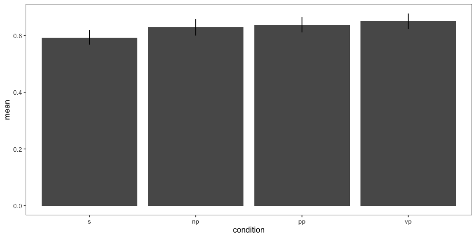<!-- -->

    ## Running /Library/Frameworks/R.framework/Resources/bin/R CMD SHLIB foo.c
    ## clang -I"/Library/Frameworks/R.framework/Resources/include" -DNDEBUG   -I"/Library/Frameworks/R.framework/Versions/3.6/Resources/library/Rcpp/include/"  -I"/Library/Frameworks/R.framework/Versions/3.6/Resources/library/RcppEigen/include/"  -I"/Library/Frameworks/R.framework/Versions/3.6/Resources/library/RcppEigen/include/unsupported"  -I"/Library/Frameworks/R.framework/Versions/3.6/Resources/library/BH/include" -I"/Library/Frameworks/R.framework/Versions/3.6/Resources/library/StanHeaders/include/src/"  -I"/Library/Frameworks/R.framework/Versions/3.6/Resources/library/StanHeaders/include/"  -I"/Library/Frameworks/R.framework/Versions/3.6/Resources/library/rstan/include" -DEIGEN_NO_DEBUG  -D_REENTRANT  -DBOOST_DISABLE_ASSERTS -DBOOST_PENDING_INTEGER_LOG2_HPP -include stan/math/prim/mat/fun/Eigen.hpp   -isysroot /Library/Developer/CommandLineTools/SDKs/MacOSX.sdk -I/usr/local/include  -fPIC  -isysroot /Library/Developer/CommandLineTools/SDKs/MacOSX.sdk -c foo.c -o foo.o
    ## In file included from <built-in>:1:
    ## In file included from /Library/Frameworks/R.framework/Versions/3.6/Resources/library/StanHeaders/include/stan/math/prim/mat/fun/Eigen.hpp:13:
    ## In file included from /Library/Frameworks/R.framework/Versions/3.6/Resources/library/RcppEigen/include/Eigen/Dense:1:
    ## In file included from /Library/Frameworks/R.framework/Versions/3.6/Resources/library/RcppEigen/include/Eigen/Core:88:
    ## /Library/Frameworks/R.framework/Versions/3.6/Resources/library/RcppEigen/include/Eigen/src/Core/util/Macros.h:613:1: error: unknown type name 'namespace'
    ## namespace Eigen {
    ## ^
    ## /Library/Frameworks/R.framework/Versions/3.6/Resources/library/RcppEigen/include/Eigen/src/Core/util/Macros.h:613:16: error: expected ';' after top level declarator
    ## namespace Eigen {
    ##                ^
    ##                ;
    ## In file included from <built-in>:1:
    ## In file included from /Library/Frameworks/R.framework/Versions/3.6/Resources/library/StanHeaders/include/stan/math/prim/mat/fun/Eigen.hpp:13:
    ## In file included from /Library/Frameworks/R.framework/Versions/3.6/Resources/library/RcppEigen/include/Eigen/Dense:1:
    ## /Library/Frameworks/R.framework/Versions/3.6/Resources/library/RcppEigen/include/Eigen/Core:96:10: fatal error: 'complex' file not found
    ## #include <complex>
    ##          ^~~~~~~~~
    ## 3 errors generated.
    ## make: *** [foo.o] Error 1
    ## 
    ## SAMPLING FOR MODEL 'bb951cd7c76bf306a492eebdbf82ce12' NOW (CHAIN 1).
    ## Chain 1: 
    ## Chain 1: Gradient evaluation took 0.000705 seconds
    ## Chain 1: 1000 transitions using 10 leapfrog steps per transition would take 7.05 seconds.
    ## Chain 1: Adjust your expectations accordingly!
    ## Chain 1: 
    ## Chain 1: 
    ## Chain 1: Iteration:    1 / 2000 [  0%]  (Warmup)
    ## Chain 1: Iteration:  200 / 2000 [ 10%]  (Warmup)
    ## Chain 1: Iteration:  400 / 2000 [ 20%]  (Warmup)
    ## Chain 1: Iteration:  600 / 2000 [ 30%]  (Warmup)
    ## Chain 1: Iteration:  800 / 2000 [ 40%]  (Warmup)
    ## Chain 1: Iteration: 1000 / 2000 [ 50%]  (Warmup)
    ## Chain 1: Iteration: 1001 / 2000 [ 50%]  (Sampling)
    ## Chain 1: Iteration: 1200 / 2000 [ 60%]  (Sampling)
    ## Chain 1: Iteration: 1400 / 2000 [ 70%]  (Sampling)
    ## Chain 1: Iteration: 1600 / 2000 [ 80%]  (Sampling)
    ## Chain 1: Iteration: 1800 / 2000 [ 90%]  (Sampling)
    ## Chain 1: Iteration: 2000 / 2000 [100%]  (Sampling)
    ## Chain 1: 
    ## Chain 1:  Elapsed Time: 21.2585 seconds (Warm-up)
    ## Chain 1:                7.05955 seconds (Sampling)
    ## Chain 1:                28.3181 seconds (Total)
    ## Chain 1: 
    ## 
    ## SAMPLING FOR MODEL 'bb951cd7c76bf306a492eebdbf82ce12' NOW (CHAIN 2).
    ## Chain 2: 
    ## Chain 2: Gradient evaluation took 0.000229 seconds
    ## Chain 2: 1000 transitions using 10 leapfrog steps per transition would take 2.29 seconds.
    ## Chain 2: Adjust your expectations accordingly!
    ## Chain 2: 
    ## Chain 2: 
    ## Chain 2: Iteration:    1 / 2000 [  0%]  (Warmup)
    ## Chain 2: Iteration:  200 / 2000 [ 10%]  (Warmup)
    ## Chain 2: Iteration:  400 / 2000 [ 20%]  (Warmup)
    ## Chain 2: Iteration:  600 / 2000 [ 30%]  (Warmup)
    ## Chain 2: Iteration:  800 / 2000 [ 40%]  (Warmup)
    ## Chain 2: Iteration: 1000 / 2000 [ 50%]  (Warmup)
    ## Chain 2: Iteration: 1001 / 2000 [ 50%]  (Sampling)
    ## Chain 2: Iteration: 1200 / 2000 [ 60%]  (Sampling)
    ## Chain 2: Iteration: 1400 / 2000 [ 70%]  (Sampling)
    ## Chain 2: Iteration: 1600 / 2000 [ 80%]  (Sampling)
    ## Chain 2: Iteration: 1800 / 2000 [ 90%]  (Sampling)
    ## Chain 2: Iteration: 2000 / 2000 [100%]  (Sampling)
    ## Chain 2: 
    ## Chain 2:  Elapsed Time: 20.6563 seconds (Warm-up)
    ## Chain 2:                7.33631 seconds (Sampling)
    ## Chain 2:                27.9926 seconds (Total)
    ## Chain 2: 
    ## 
    ## SAMPLING FOR MODEL 'bb951cd7c76bf306a492eebdbf82ce12' NOW (CHAIN 3).
    ## Chain 3: 
    ## Chain 3: Gradient evaluation took 0.00027 seconds
    ## Chain 3: 1000 transitions using 10 leapfrog steps per transition would take 2.7 seconds.
    ## Chain 3: Adjust your expectations accordingly!
    ## Chain 3: 
    ## Chain 3: 
    ## Chain 3: Iteration:    1 / 2000 [  0%]  (Warmup)
    ## Chain 3: Iteration:  200 / 2000 [ 10%]  (Warmup)
    ## Chain 3: Iteration:  400 / 2000 [ 20%]  (Warmup)
    ## Chain 3: Iteration:  600 / 2000 [ 30%]  (Warmup)
    ## Chain 3: Iteration:  800 / 2000 [ 40%]  (Warmup)
    ## Chain 3: Iteration: 1000 / 2000 [ 50%]  (Warmup)
    ## Chain 3: Iteration: 1001 / 2000 [ 50%]  (Sampling)
    ## Chain 3: Iteration: 1200 / 2000 [ 60%]  (Sampling)
    ## Chain 3: Iteration: 1400 / 2000 [ 70%]  (Sampling)
    ## Chain 3: Iteration: 1600 / 2000 [ 80%]  (Sampling)
    ## Chain 3: Iteration: 1800 / 2000 [ 90%]  (Sampling)
    ## Chain 3: Iteration: 2000 / 2000 [100%]  (Sampling)
    ## Chain 3: 
    ## Chain 3:  Elapsed Time: 20.3088 seconds (Warm-up)
    ## Chain 3:                6.79195 seconds (Sampling)
    ## Chain 3:                27.1007 seconds (Total)
    ## Chain 3: 
    ## 
    ## SAMPLING FOR MODEL 'bb951cd7c76bf306a492eebdbf82ce12' NOW (CHAIN 4).
    ## Chain 4: 
    ## Chain 4: Gradient evaluation took 0.000225 seconds
    ## Chain 4: 1000 transitions using 10 leapfrog steps per transition would take 2.25 seconds.
    ## Chain 4: Adjust your expectations accordingly!
    ## Chain 4: 
    ## Chain 4: 
    ## Chain 4: Iteration:    1 / 2000 [  0%]  (Warmup)
    ## Chain 4: Iteration:  200 / 2000 [ 10%]  (Warmup)
    ## Chain 4: Iteration:  400 / 2000 [ 20%]  (Warmup)
    ## Chain 4: Iteration:  600 / 2000 [ 30%]  (Warmup)
    ## Chain 4: Iteration:  800 / 2000 [ 40%]  (Warmup)
    ## Chain 4: Iteration: 1000 / 2000 [ 50%]  (Warmup)
    ## Chain 4: Iteration: 1001 / 2000 [ 50%]  (Sampling)
    ## Chain 4: Iteration: 1200 / 2000 [ 60%]  (Sampling)
    ## Chain 4: Iteration: 1400 / 2000 [ 70%]  (Sampling)
    ## Chain 4: Iteration: 1600 / 2000 [ 80%]  (Sampling)
    ## Chain 4: Iteration: 1800 / 2000 [ 90%]  (Sampling)
    ## Chain 4: Iteration: 2000 / 2000 [100%]  (Sampling)
    ## Chain 4: 
    ## Chain 4:  Elapsed Time: 20.1476 seconds (Warm-up)
    ## Chain 4:                6.93802 seconds (Sampling)
    ## Chain 4:                27.0856 seconds (Total)
    ## Chain 4:

    ##  Family: gaussian 
    ##   Links: mu = identity; sigma = identity 
    ## Formula: val ~ condition + (1 + condition | workerid) + (1 + condition | predicate_1) 
    ##    Data: model.data.collapsed (Number of observations: 814) 
    ## Samples: 4 chains, each with iter = 2000; warmup = 1000; thin = 1;
    ##          total post-warmup samples = 4000
    ## 
    ## Group-Level Effects: 
    ## ~predicate_1 (Number of levels: 11) 
    ##                              Estimate Est.Error l-95% CI u-95% CI Rhat
    ## sd(Intercept)                    0.06      0.02     0.03     0.10 1.00
    ## sd(conditionnp)                  0.03      0.02     0.00     0.07 1.00
    ## sd(conditionpp)                  0.03      0.02     0.00     0.09 1.00
    ## sd(conditionvp)                  0.03      0.02     0.00     0.08 1.00
    ## cor(Intercept,conditionnp)      -0.29      0.41    -0.90     0.62 1.00
    ## cor(Intercept,conditionpp)      -0.13      0.41    -0.82     0.70 1.00
    ## cor(conditionnp,conditionpp)     0.02      0.44    -0.79     0.81 1.00
    ## cor(Intercept,conditionvp)       0.00      0.42    -0.77     0.79 1.00
    ## cor(conditionnp,conditionvp)     0.16      0.45    -0.73     0.89 1.00
    ## cor(conditionpp,conditionvp)    -0.03      0.45    -0.82     0.79 1.00
    ##                              Bulk_ESS Tail_ESS
    ## sd(Intercept)                    1382     2085
    ## sd(conditionnp)                  1218     1168
    ## sd(conditionpp)                  1335     1638
    ## sd(conditionvp)                  1590     2335
    ## cor(Intercept,conditionnp)       3548     2535
    ## cor(Intercept,conditionpp)       3850     3080
    ## cor(conditionnp,conditionpp)     2734     3074
    ## cor(Intercept,conditionvp)       4895     2730
    ## cor(conditionnp,conditionvp)     2255     2697
    ## cor(conditionpp,conditionvp)     2959     3604
    ## 
    ## ~workerid (Number of levels: 51) 
    ##                              Estimate Est.Error l-95% CI u-95% CI Rhat
    ## sd(Intercept)                    0.11      0.02     0.08     0.14 1.00
    ## sd(conditionnp)                  0.03      0.02     0.00     0.08 1.00
    ## sd(conditionpp)                  0.05      0.02     0.01     0.10 1.00
    ## sd(conditionvp)                  0.08      0.03     0.02     0.13 1.01
    ## cor(Intercept,conditionnp)      -0.02      0.40    -0.76     0.76 1.00
    ## cor(Intercept,conditionpp)       0.37      0.30    -0.26     0.87 1.00
    ## cor(conditionnp,conditionpp)     0.11      0.43    -0.73     0.82 1.00
    ## cor(Intercept,conditionvp)      -0.10      0.26    -0.55     0.45 1.00
    ## cor(conditionnp,conditionvp)     0.08      0.44    -0.77     0.82 1.00
    ## cor(conditionpp,conditionvp)     0.03      0.38    -0.73     0.71 1.00
    ##                              Bulk_ESS Tail_ESS
    ## sd(Intercept)                    1381     1951
    ## sd(conditionnp)                   805     1779
    ## sd(conditionpp)                   859      981
    ## sd(conditionvp)                   609      585
    ## cor(Intercept,conditionnp)       4079     2554
    ## cor(Intercept,conditionpp)       2142     2108
    ## cor(conditionnp,conditionpp)      973     2218
    ## cor(Intercept,conditionvp)       1780     1854
    ## cor(conditionnp,conditionvp)      474     1192
    ## cor(conditionpp,conditionvp)      727     1442
    ## 
    ## Population-Level Effects: 
    ##             Estimate Est.Error l-95% CI u-95% CI Rhat Bulk_ESS Tail_ESS
    ## Intercept       0.60      0.03     0.55     0.65 1.00     1073     1836
    ## conditionnp     0.04      0.02     0.00     0.08 1.00     3167     3102
    ## conditionpp     0.05      0.02     0.00     0.09 1.00     3201     3083
    ## conditionvp     0.04      0.02    -0.00     0.09 1.00     3232     3135
    ## 
    ## Family Specific Parameters: 
    ##       Estimate Est.Error l-95% CI u-95% CI Rhat Bulk_ESS Tail_ESS
    ## sigma     0.16      0.00     0.15     0.17 1.00     3090     3064
    ## 
    ## Samples were drawn using sampling(NUTS). For each parameter, Eff.Sample 
    ## is a crude measure of effective sample size, and Rhat is the potential 
    ## scale reduction factor on split chains (at convergence, Rhat = 1).
