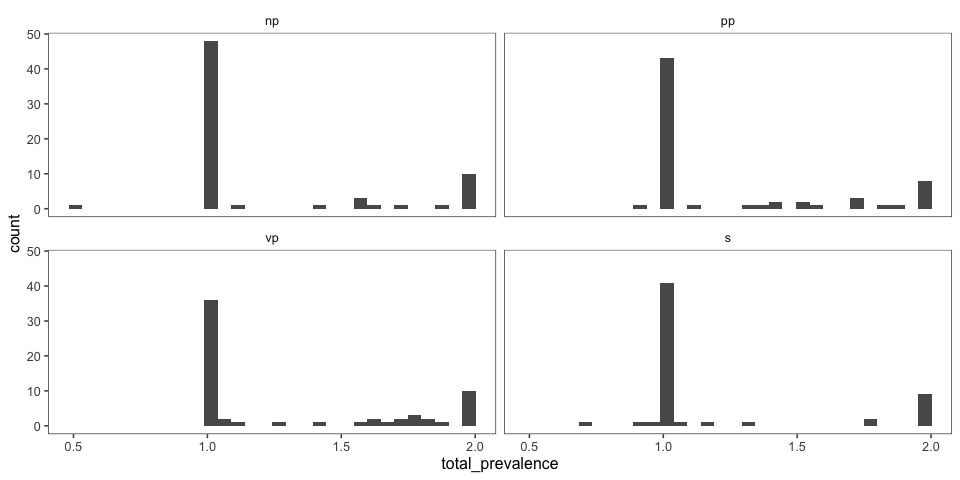

Variable Coordination
================
Karen Gu
9/6/2019

[Link to
experiment](http://www.mit.edu/~tessler/projects/elephants/experiments/elephants-3.html)

## Variable Coordination Level Experiment, with a single question (Africa only)

## 

## Subject Information

| workerid                         | language | enjoyment | age | gender | problems                                        | comments                                                                          |
| :------------------------------- | :------- | :-------- | :-- | :----- | :---------------------------------------------- | :-------------------------------------------------------------------------------- |
| 94e02b964710f084b0757f009b32007f | English  | 0         | 48  | Male   | no                                              |                                                                                   |
| bec83fc61d00a7d4ffa3b946951a2e70 | English  | 1         | 30  | Male   | no                                              | good                                                                              |
| 9f4d1fae505bbe3e4a176721c615da03 | English  | 1         | 22  | Male   |                                                 |                                                                                   |
| 0d7fbc5dba7f680e33a708fbc32a4509 | english  | 0         | 30  | Male   | nothing                                         | nice                                                                              |
| 121e3fe89c89319899b22bf74ac5dbe4 | english  | 0         | 29  | Female | no                                              |                                                                                   |
| 504a1d228c641dfdf1b1fdba00bf18b9 | english  | 0         | 34  | Male   | no                                              |                                                                                   |
| 3a7dd723f40fed7a0a383a069939343d | english  | 1         | 62  | Female | no                                              |                                                                                   |
| 6e018d15d88a81eb8f01ce0bfcd221a0 | English  | 0         | 47  | Female | no                                              |                                                                                   |
| 4bc289a226eaf2ebed9a6f266ed21cb1 | englishn | 0         | 35  | Female | no                                              | nice                                                                              |
| 02366c44bbdda170f60a5df9c41b0bcd | English  | 1         | 26  | Male   | No                                              | Thanks.                                                                           |
| 119b8973de0826f10b078c559732ccb5 | English  | 1         | 37  | Male   | NA                                              |                                                                                   |
| ef9c52a3fa42154591f632b272ccaffc | English  | 0         | 27  | Male   |                                                 |                                                                                   |
| e2ae41e9b9346ca4ea2e59c1a0501329 | English  | 0         | 51  | Female | no                                              | good                                                                              |
| 66cf644fb24f93f8dda74bf0c7d6289c | English  | 0         | 47  | Male   | no                                              | none                                                                              |
| 3e54d549e8f32aa6f207a618fc317211 | English  | 1         | 59  | Female | No                                              |                                                                                   |
| 2be9e3418de9907c15e8b011c77da948 | English  | 0         | 23  | Female |                                                 |                                                                                   |
| d8413cc35a0124e58fb9594da7aaf179 | English  | 1         | 40  | Male   | no                                              | good                                                                              |
| eac605a670b8d8beb74503980aea1f55 | English  | 0         | 25  | Male   | NA                                              |                                                                                   |
| 3a9e470cb2caf2c71de688ffe8ffe959 | English  | 1         | 71  | Female | No                                              | Thanks :-)                                                                        |
| 5bbce14c88a0178a2dd09cc1006492df | English  | 0         | 30  | Female | No                                              |                                                                                   |
| a35e6f82148886b36e7ae4a2ca8da853 | English  | 1         | 43  | Male   | No                                              | Interesting study. I enjoyed reading the strange names of creatures and hapitats. |
| 765cdd58c0e4dc60cb61beaedf2cf9c8 | english  | 0         | 25  | Female | no                                              | good                                                                              |
| 4e5181c68125e1284735f78d2403ada5 | English  | 1         | 28  | Male   | nope.                                           |                                                                                   |
| cbf5362060e69fd44eef754cf95a4431 | english  | 0         | 39  | Female | no                                              |                                                                                   |
| 956fd002ea95bbd4d212530f6e982185 | ENGLISH  | 1         | 50  |        | In very general terms, please describe what you | In very general terms, please describe what you                                   |
| 0cf23b5795a4be0cd3092a670f413cb2 | ENGLISH  | 1         | 56  | Female | NA                                              | good                                                                              |
| 65b7c457a1fca600cb3ab0d0129ccb21 | ENGLISH  | 1         | 34  | Female | NO                                              | GOOD                                                                              |
| 2607cdd53c86dfa858102b97eef02bab | English  | 0         | 61  | Female | I did not encounter any problem                 |                                                                                   |
| 89b1607270f1c539f8e372967b779c24 | ENGLISH  | 0         | 50  | Female | none                                            | nice                                                                              |
| 4b15038f4f37b3eb2794cdd1866d3eae | English  | 0         | 25  | Female | No                                              | The study went well. Thanks for making me a part of it.                           |
| 66aae99c932b12f0948167dcd3e36fce | ENGLISH  | 0         | 30  | Male   | no                                              |                                                                                   |
| f0e5c785b7741a01b77429489c185f80 | ENGLISH  | 1         | 29  | Male   | n/a                                             | great                                                                             |
| db5577cef114410f546b921cbd4ffefc | english  | 1         | 32  | Female | no                                              |                                                                                   |
| 855ae1f624237dc12490ae1d36594044 | English  | 0         | 34  | Male   | No                                              |                                                                                   |
| 37ce7e57a208f286e9d799f5bffe1203 | english  | 0         | 29  | Male   | no                                              | good                                                                              |
| 3ee583b126cffcabcf1bec64b21be9fb | English  | 0         | 40  | Male   | n                                               |                                                                                   |
| b5bef9db68cf17777e947eac8d9f306d | English  | 0         | 31  | Male   |                                                 |                                                                                   |
| 09e79e08b7533c4966bb94301c2a15da | English  | 0         | 31  | Male   |                                                 |                                                                                   |
| fd5048577f56504208c368c3bd702034 | English  | 1         | 59  | Female | no                                              |                                                                                   |
| 351b702d37553c2576276b02684bdff0 | english  | 1         | 58  | Male   | no                                              |                                                                                   |
| 52e27cf4e687651051ea256c2d0d81ac | english  | 0         | 41  | Female | no                                              |                                                                                   |
| b28ee0d4be8559414380bdd754c773ec | english  | 1         | 30  | Male   | none                                            | useful survey                                                                     |
| 4bc1124843141ab50a73e77675044196 | english  | 0         | 25  | Male   | no                                              |                                                                                   |
| 0048659161e3aec37849a721e4dd3293 | English  | 0         | 45  | Male   | No.                                             |                                                                                   |
| 7cbb04b9387ea74eb938b16baa1f4c77 | English  | 1         | 44  | Male   | No                                              | It was interesting but somewhat hard to guess some of them. By design, I suppose… |
| 7659f65701f909cb8e5b83c1372c2850 | english  | 1         | 35  | Male   | no                                              |                                                                                   |
| 2443f2a8df5cccb4003cdad142d57725 | English  | 0         | 39  | Male   | No                                              |                                                                                   |
| 42d22c4ca6b080feb7badaa1c3ded662 | English  | 1         | 40  | Male   |                                                 |                                                                                   |
| 2f09bb178d82d57ee9e98784da1bb16f | English  | 1         | 51  | Male   | NA                                              | good                                                                              |
| 623d7e45f942af8337eac5316c496387 | English  | 0         | 55  | Female | no problems                                     | none                                                                              |
| 1eb3ec9876cc6a17bbae44d4761137d3 | English  | 0         | 28  | Male   | none                                            |                                                                                   |
| 504aa8560363dc18f9b1095cf6407c35 | english  | 1         | 55  | Male   | no                                              | good task                                                                         |
| 51341274f8e540b4e117d74ec4d70784 | English  | 1         | 31  | Male   | no                                              |                                                                                   |
| e9fd624d2da155125da39c67a5e9293c | english  | 1         | 29  | Female | no                                              |                                                                                   |
| 02c9b466a8218e0431007a14d7054500 | english  | 1         | 26  | Male   | none                                            | none                                                                              |
| f2a592b14183a908ede748ad8b13952d | English  | 1         | 56  |        | none                                            | none                                                                              |
| 75b0624edb002bc35f9a8b8be60d6dd4 | English  | 0         | 32  | Male   | no                                              | nice                                                                              |
| da5013b7c30b3d20264f36989fbe4ac3 |          | 0         | 35  |        | no                                              | good                                                                              |
| b7ca4e22ce73506ccb019c3113166247 | English  | 0         | 28  | Male   | None                                            |                                                                                   |
| e6532b573753e96d9385d652aba8da12 | English  | 0         | 25  | Male   |                                                 |                                                                                   |
| a3623ffaecf1e89cbe218cd459dbc6e5 | English  | 0         | 28  | Male   |                                                 |                                                                                   |
| dcbb83c20d1772b3067ff1aab040a173 | English  | 0         | 32  | Male   | no                                              | no                                                                                |
| 9d7e9117678074c390bfb883475724ad | english  | 0         | 27  | Male   | no                                              |                                                                                   |

## Attention Checks

### Slider Practice

Before the experiment, participants practice using the sliders to rate 3
category-property pairs:

  - dogs bark (coded as correct if x \> 0.5)
  - birds are male (coded as correct if 0.25 \< x \< 0.75)
  - cats get cancer (coded as correct if x \< 0.75) \[being generous
    with this one\]
  - lions lay eggs (coded as correct if x \< 0.10)

| n\_correct |  n |
| ---------: | -: |
|          1 |  1 |
|          2 |  8 |
|          3 | 10 |
|          4 | 44 |

| property        | n\_correct |
| :-------------- | ---------: |
| birds are male  |         58 |
| cats get cancer |         59 |
| dogs bark       |         60 |
| lions lay eggs  |         46 |

### Memory Check

After the story, participants select statements they recall learning
from a list of 10 generic statements about novel animals (5 true, 5
distractor). They are also asked to explain what they did in the
experiment.
<!-- -->

### Slider Practice and Memory Check

<!-- -->

### Explanations of Task

After the story, participants are also asked to explain generally what
they did in the
experiment.

| workerid                         | n\_slider\_correct | n\_memory\_correct | explanation                                                                                                                                             |
| :------------------------------- | -----------------: | -----------------: | :------------------------------------------------------------------------------------------------------------------------------------------------------ |
| 94e02b964710f084b0757f009b32007f |                  4 |                  7 | I interpreted statements to determine what percentage of a certain alien had a certain trait                                                            |
| bec83fc61d00a7d4ffa3b946951a2e70 |                  3 |                  5 | well                                                                                                                                                    |
| 9f4d1fae505bbe3e4a176721c615da03 |                  4 |                 10 | I read about aliens and gave an estimation of what percentage of them aligns with a certain trait.                                                      |
| 0d7fbc5dba7f680e33a708fbc32a4509 |                  3 |                  6 | the experiment give some story and what percentage that is correct and i believe they asked this experiment.                                            |
| 121e3fe89c89319899b22bf74ac5dbe4 |                  3 |                  9 | I read short stories or sentences about alien life forms on their alien planets and had to figure out what percentage of these events seemed to happen. |
| 504a1d228c641dfdf1b1fdba00bf18b9 |                  4 |                  8 | I read a passage and chose the percentage of a statement.                                                                                               |
| 3a7dd723f40fed7a0a383a069939343d |                  4 |                  4 | nothing                                                                                                                                                 |
| 6e018d15d88a81eb8f01ce0bfcd221a0 |                  4 |                  4 | I worked on understanding some facts and the probability of each happening                                                                              |
| 4bc289a226eaf2ebed9a6f266ed21cb1 |                  1 |                  6 | nice                                                                                                                                                    |
| 02366c44bbdda170f60a5df9c41b0bcd |                  4 |                  9 | Read text about a fictional alien planet and retained information for this quiz and interpreting the stats given in the information.                    |
| 119b8973de0826f10b078c559732ccb5 |                  4 |                  8 | I read the section and then re-read to answer the question.                                                                                             |
| ef9c52a3fa42154591f632b272ccaffc |                  4 |                  9 | Determine if a species lived or after a certain way by percentage.                                                                                      |
| e2ae41e9b9346ca4ea2e59c1a0501329 |                  3 |                  4 | good                                                                                                                                                    |
| 66cf644fb24f93f8dda74bf0c7d6289c |                  4 |                  9 | Tried to guess percentages based on given information                                                                                                   |
| 3e54d549e8f32aa6f207a618fc317211 |                  4 |                  8 | I read a passage about an alien and then answered a question about the passage on a sliding scale.                                                      |
| 2be9e3418de9907c15e8b011c77da948 |                  4 |                  7 | I estimated what percentage of an alien population does something based on a short text.                                                                |
| d8413cc35a0124e58fb9594da7aaf179 |                  2 |                  5 | fully understand the experiment                                                                                                                         |
| eac605a670b8d8beb74503980aea1f55 |                  4 |                  9 | I estimated how likely aliens from another planet would be to do something, be something, or other things to that effect.                               |
| 3a9e470cb2caf2c71de688ffe8ffe959 |                  4 |                  9 | I read carefully, slowly, and sometimes twice for each entry.                                                                                           |
| 5bbce14c88a0178a2dd09cc1006492df |                  4 |                 10 | Chose a percentage based on what was said in the paragraph.                                                                                             |
| a35e6f82148886b36e7ae4a2ca8da853 |                  4 |                  7 | I looked for words that stated such things as ALL, and if there were two options for something, I just gave it a 50% chance.                            |
| 765cdd58c0e4dc60cb61beaedf2cf9c8 |                  4 |                  1 | paid close attention of the description then provide my answer.                                                                                         |
| 4e5181c68125e1284735f78d2403ada5 |                  4 |                 10 | Gave percentage-based answers according to given scenarios.                                                                                             |
| cbf5362060e69fd44eef754cf95a4431 |                  4 |                  9 | I made predictions about percentages of groups that have certain characteristics.                                                                       |
| 956fd002ea95bbd4d212530f6e982185 |                  2 |                  4 | In very general terms, please describe what you                                                                                                         |
| 0cf23b5795a4be0cd3092a670f413cb2 |                  2 |                  7 | about the animals and plant                                                                                                                             |
| 65b7c457a1fca600cb3ab0d0129ccb21 |                 NA |                  5 | GOOD                                                                                                                                                    |
| 2607cdd53c86dfa858102b97eef02bab |                  4 |                  6 | read a story about aliens and choose the percentage depending on the given question.                                                                    |
| 89b1607270f1c539f8e372967b779c24 |                  3 |                  8 | nice                                                                                                                                                    |
| 4b15038f4f37b3eb2794cdd1866d3eae |                  4 |                  9 | I rated in percentage deducing from short passage given how true or false a statement was.                                                              |
| 66aae99c932b12f0948167dcd3e36fce |                  4 |                  8 | I rated statements by the percentage I thought was correct                                                                                              |
| f0e5c785b7741a01b77429489c185f80 |                  4 |                  6 | i answered questions about animals and aliens on a far away planet.                                                                                     |
| db5577cef114410f546b921cbd4ffefc |                  4 |                  6 | I looked for most, all, none for a my percentage.                                                                                                       |
| 855ae1f624237dc12490ae1d36594044 |                  4 |                  5 | Answer a percentage question about a made up alien race.                                                                                                |
| 37ce7e57a208f286e9d799f5bffe1203 |                  3 |                  5 | Read about aliens and animals                                                                                                                           |
| 3ee583b126cffcabcf1bec64b21be9fb |                  4 |                  7 | gave percentage of how many of something there was                                                                                                      |
| b5bef9db68cf17777e947eac8d9f306d |                  3 |                  8 | I read a piece of information and answered questions about it.                                                                                          |
| 09e79e08b7533c4966bb94301c2a15da |                  4 |                 10 | Selected how likely the alien life was to have behaved in a certain way in the context of a passage.                                                    |
| fd5048577f56504208c368c3bd702034 |                  4 |                  9 | I gave a percent of what I thought was accurate                                                                                                         |
| 351b702d37553c2576276b02684bdff0 |                  4 |                 10 | i read a little passage about alien and plant and i answered some question                                                                              |
| 52e27cf4e687651051ea256c2d0d81ac |                  4 |                  8 | I read little stories and decided what percentage of aliens did things based on the story                                                               |
| b28ee0d4be8559414380bdd754c773ec |                  2 |                  3 | estimate the statmetns                                                                                                                                  |
| 4bc1124843141ab50a73e77675044196 |                  4 |                  9 | what percentage of aliens did something                                                                                                                 |
| 0048659161e3aec37849a721e4dd3293 |                  4 |                  5 | I read a short paragraph and then answered, in terms of percentage, how many of X did Y.                                                                |
| 7cbb04b9387ea74eb938b16baa1f4c77 |                  4 |                 10 | Read an excerpt about aliens and their planet (including plants, animals, etc) and answered a question about the excerpt in percentage form.            |
| 7659f65701f909cb8e5b83c1372c2850 |                  4 |                 10 | I read facts about aliens species and answered questions about them.                                                                                    |
| 2443f2a8df5cccb4003cdad142d57725 |                  4 |                  8 | read statements about aliens and then decided what percentage of them do a certain statement                                                            |
| 42d22c4ca6b080feb7badaa1c3ded662 |                  4 |                  9 | determined what percentage of various alien species did something based on the wording of a paragraphs.                                                 |
| 2f09bb178d82d57ee9e98784da1bb16f |                  3 |                  5 | I can remember                                                                                                                                          |
| 623d7e45f942af8337eac5316c496387 |                  4 |                 10 | I had to put percentages to words like most and all.                                                                                                    |
| 1eb3ec9876cc6a17bbae44d4761137d3 |                  3 |                  4 | i tried to make sense of some foreign languages                                                                                                         |
| 504aa8560363dc18f9b1095cf6407c35 |                  2 |                  5 | good task                                                                                                                                               |
| 51341274f8e540b4e117d74ec4d70784 |                  4 |                 10 | I answered questions about various alien species and habits on the planet DAX.                                                                          |
| e9fd624d2da155125da39c67a5e9293c |                  4 |                  8 | I read sentences about different creatures and then answered a question about how many of them did something.                                           |
| 02c9b466a8218e0431007a14d7054500 |                  3 |                  8 | very sure                                                                                                                                               |
| f2a592b14183a908ede748ad8b13952d |                  4 |                  8 | Guessed percentages on questions asked about DAX aliens and there planet.                                                                               |
| 75b0624edb002bc35f9a8b8be60d6dd4 |                  4 |                  6 | it is about alien                                                                                                                                       |
| da5013b7c30b3d20264f36989fbe4ac3 |                  4 |                  6 | lives about alliens                                                                                                                                     |
| b7ca4e22ce73506ccb019c3113166247 |                  4 |                  9 | The study is to check our level of concentration.                                                                                                       |
| e6532b573753e96d9385d652aba8da12 |                  2 |                  5 | To rate the possibility of a fact.                                                                                                                      |
| a3623ffaecf1e89cbe218cd459dbc6e5 |                  4 |                  9 | Answer questions related to the prompt                                                                                                                  |
| dcbb83c20d1772b3067ff1aab040a173 |                  4 |                  8 | Paid attention to what I read in each story.                                                                                                            |
| 9d7e9117678074c390bfb883475724ad |                 NA |                  6 | i have zero idea                                                                                                                                        |

### Exclusions

## Participants

### Included/Excluded Subject Numbers

Removing participants who got fewer than 7 correct on memory check and
didn’t get all 4 sliders. (Participants with bad explanations usually
fell into one of these other groups.)

| memory\_fail | slider\_fail |  n |
| :----------- | :----------- | -: |
| FALSE        | FALSE        | 34 |
| FALSE        | TRUE         |  5 |
| TRUE         | FALSE        | 12 |
| TRUE         | TRUE         | 12 |

### Prevalence Estimates by Participant

Histogram of all of a single participant’s prevalence estimates,
collapsed across trials and color coded for the number of correct
responses on the memory check. \* fill = number of correct responses on
the memory check (out of 10) \* facet = participants

<!-- -->

## Filler Trials

These used quantifiers (and thus we have strong idea about literal
meaning).

<!-- -->

## Critical Trials (collapsed across item)

## Histograms of Prevalence Estimates by Condition (collapsed across item)

<!-- -->

### Bootstrapped 95% Confidence Intervals (collapsed across item)

<!-- --><!-- -->

### Pirate Plots (collapsed across item)

<!-- -->

### Proportion of Participants that Responsed ~50%

| condition | percent\_half |
| :-------- | ------------: |
| NP        |     0.4555556 |
| PP        |     0.3913043 |
| VP        |     0.4387755 |
| S         |     0.5851064 |

### Ridge Plots

<!-- -->

### Stats

    ## Running /Library/Frameworks/R.framework/Resources/bin/R CMD SHLIB foo.c
    ## clang -I"/Library/Frameworks/R.framework/Resources/include" -DNDEBUG   -I"/Library/Frameworks/R.framework/Versions/3.6/Resources/library/Rcpp/include/"  -I"/Library/Frameworks/R.framework/Versions/3.6/Resources/library/RcppEigen/include/"  -I"/Library/Frameworks/R.framework/Versions/3.6/Resources/library/RcppEigen/include/unsupported"  -I"/Library/Frameworks/R.framework/Versions/3.6/Resources/library/BH/include" -I"/Library/Frameworks/R.framework/Versions/3.6/Resources/library/StanHeaders/include/src/"  -I"/Library/Frameworks/R.framework/Versions/3.6/Resources/library/StanHeaders/include/"  -I"/Library/Frameworks/R.framework/Versions/3.6/Resources/library/rstan/include" -DEIGEN_NO_DEBUG  -D_REENTRANT  -DBOOST_DISABLE_ASSERTS -DBOOST_PENDING_INTEGER_LOG2_HPP -include stan/math/prim/mat/fun/Eigen.hpp   -isysroot /Library/Developer/CommandLineTools/SDKs/MacOSX.sdk -I/usr/local/include  -fPIC  -isysroot /Library/Developer/CommandLineTools/SDKs/MacOSX.sdk -c foo.c -o foo.o
    ## In file included from <built-in>:1:
    ## In file included from /Library/Frameworks/R.framework/Versions/3.6/Resources/library/StanHeaders/include/stan/math/prim/mat/fun/Eigen.hpp:13:
    ## In file included from /Library/Frameworks/R.framework/Versions/3.6/Resources/library/RcppEigen/include/Eigen/Dense:1:
    ## In file included from /Library/Frameworks/R.framework/Versions/3.6/Resources/library/RcppEigen/include/Eigen/Core:88:
    ## /Library/Frameworks/R.framework/Versions/3.6/Resources/library/RcppEigen/include/Eigen/src/Core/util/Macros.h:613:1: error: unknown type name 'namespace'
    ## namespace Eigen {
    ## ^
    ## /Library/Frameworks/R.framework/Versions/3.6/Resources/library/RcppEigen/include/Eigen/src/Core/util/Macros.h:613:16: error: expected ';' after top level declarator
    ## namespace Eigen {
    ##                ^
    ##                ;
    ## In file included from <built-in>:1:
    ## In file included from /Library/Frameworks/R.framework/Versions/3.6/Resources/library/StanHeaders/include/stan/math/prim/mat/fun/Eigen.hpp:13:
    ## In file included from /Library/Frameworks/R.framework/Versions/3.6/Resources/library/RcppEigen/include/Eigen/Dense:1:
    ## /Library/Frameworks/R.framework/Versions/3.6/Resources/library/RcppEigen/include/Eigen/Core:96:10: fatal error: 'complex' file not found
    ## #include <complex>
    ##          ^~~~~~~~~
    ## 3 errors generated.
    ## make: *** [foo.o] Error 1
    ## 
    ## SAMPLING FOR MODEL '2937bde617402b26b7eff09e95b2b36a' NOW (CHAIN 1).
    ## Chain 1: 
    ## Chain 1: Gradient evaluation took 0.000364 seconds
    ## Chain 1: 1000 transitions using 10 leapfrog steps per transition would take 3.64 seconds.
    ## Chain 1: Adjust your expectations accordingly!
    ## Chain 1: 
    ## Chain 1: 
    ## Chain 1: Iteration:    1 / 2000 [  0%]  (Warmup)
    ## Chain 1: Iteration:  200 / 2000 [ 10%]  (Warmup)
    ## Chain 1: Iteration:  400 / 2000 [ 20%]  (Warmup)
    ## Chain 1: Iteration:  600 / 2000 [ 30%]  (Warmup)
    ## Chain 1: Iteration:  800 / 2000 [ 40%]  (Warmup)
    ## Chain 1: Iteration: 1000 / 2000 [ 50%]  (Warmup)
    ## Chain 1: Iteration: 1001 / 2000 [ 50%]  (Sampling)
    ## Chain 1: Iteration: 1200 / 2000 [ 60%]  (Sampling)
    ## Chain 1: Iteration: 1400 / 2000 [ 70%]  (Sampling)
    ## Chain 1: Iteration: 1600 / 2000 [ 80%]  (Sampling)
    ## Chain 1: Iteration: 1800 / 2000 [ 90%]  (Sampling)
    ## Chain 1: Iteration: 2000 / 2000 [100%]  (Sampling)
    ## Chain 1: 
    ## Chain 1:  Elapsed Time: 7.81623 seconds (Warm-up)
    ## Chain 1:                3.39906 seconds (Sampling)
    ## Chain 1:                11.2153 seconds (Total)
    ## Chain 1: 
    ## 
    ## SAMPLING FOR MODEL '2937bde617402b26b7eff09e95b2b36a' NOW (CHAIN 2).
    ## Chain 2: 
    ## Chain 2: Gradient evaluation took 0.000125 seconds
    ## Chain 2: 1000 transitions using 10 leapfrog steps per transition would take 1.25 seconds.
    ## Chain 2: Adjust your expectations accordingly!
    ## Chain 2: 
    ## Chain 2: 
    ## Chain 2: Iteration:    1 / 2000 [  0%]  (Warmup)
    ## Chain 2: Iteration:  200 / 2000 [ 10%]  (Warmup)
    ## Chain 2: Iteration:  400 / 2000 [ 20%]  (Warmup)
    ## Chain 2: Iteration:  600 / 2000 [ 30%]  (Warmup)
    ## Chain 2: Iteration:  800 / 2000 [ 40%]  (Warmup)
    ## Chain 2: Iteration: 1000 / 2000 [ 50%]  (Warmup)
    ## Chain 2: Iteration: 1001 / 2000 [ 50%]  (Sampling)
    ## Chain 2: Iteration: 1200 / 2000 [ 60%]  (Sampling)
    ## Chain 2: Iteration: 1400 / 2000 [ 70%]  (Sampling)
    ## Chain 2: Iteration: 1600 / 2000 [ 80%]  (Sampling)
    ## Chain 2: Iteration: 1800 / 2000 [ 90%]  (Sampling)
    ## Chain 2: Iteration: 2000 / 2000 [100%]  (Sampling)
    ## Chain 2: 
    ## Chain 2:  Elapsed Time: 7.71162 seconds (Warm-up)
    ## Chain 2:                3.44306 seconds (Sampling)
    ## Chain 2:                11.1547 seconds (Total)
    ## Chain 2: 
    ## 
    ## SAMPLING FOR MODEL '2937bde617402b26b7eff09e95b2b36a' NOW (CHAIN 3).
    ## Chain 3: 
    ## Chain 3: Gradient evaluation took 0.000164 seconds
    ## Chain 3: 1000 transitions using 10 leapfrog steps per transition would take 1.64 seconds.
    ## Chain 3: Adjust your expectations accordingly!
    ## Chain 3: 
    ## Chain 3: 
    ## Chain 3: Iteration:    1 / 2000 [  0%]  (Warmup)
    ## Chain 3: Iteration:  200 / 2000 [ 10%]  (Warmup)
    ## Chain 3: Iteration:  400 / 2000 [ 20%]  (Warmup)
    ## Chain 3: Iteration:  600 / 2000 [ 30%]  (Warmup)
    ## Chain 3: Iteration:  800 / 2000 [ 40%]  (Warmup)
    ## Chain 3: Iteration: 1000 / 2000 [ 50%]  (Warmup)
    ## Chain 3: Iteration: 1001 / 2000 [ 50%]  (Sampling)
    ## Chain 3: Iteration: 1200 / 2000 [ 60%]  (Sampling)
    ## Chain 3: Iteration: 1400 / 2000 [ 70%]  (Sampling)
    ## Chain 3: Iteration: 1600 / 2000 [ 80%]  (Sampling)
    ## Chain 3: Iteration: 1800 / 2000 [ 90%]  (Sampling)
    ## Chain 3: Iteration: 2000 / 2000 [100%]  (Sampling)
    ## Chain 3: 
    ## Chain 3:  Elapsed Time: 7.95963 seconds (Warm-up)
    ## Chain 3:                3.4984 seconds (Sampling)
    ## Chain 3:                11.458 seconds (Total)
    ## Chain 3: 
    ## 
    ## SAMPLING FOR MODEL '2937bde617402b26b7eff09e95b2b36a' NOW (CHAIN 4).
    ## Chain 4: 
    ## Chain 4: Gradient evaluation took 0.000123 seconds
    ## Chain 4: 1000 transitions using 10 leapfrog steps per transition would take 1.23 seconds.
    ## Chain 4: Adjust your expectations accordingly!
    ## Chain 4: 
    ## Chain 4: 
    ## Chain 4: Iteration:    1 / 2000 [  0%]  (Warmup)
    ## Chain 4: Iteration:  200 / 2000 [ 10%]  (Warmup)
    ## Chain 4: Iteration:  400 / 2000 [ 20%]  (Warmup)
    ## Chain 4: Iteration:  600 / 2000 [ 30%]  (Warmup)
    ## Chain 4: Iteration:  800 / 2000 [ 40%]  (Warmup)
    ## Chain 4: Iteration: 1000 / 2000 [ 50%]  (Warmup)
    ## Chain 4: Iteration: 1001 / 2000 [ 50%]  (Sampling)
    ## Chain 4: Iteration: 1200 / 2000 [ 60%]  (Sampling)
    ## Chain 4: Iteration: 1400 / 2000 [ 70%]  (Sampling)
    ## Chain 4: Iteration: 1600 / 2000 [ 80%]  (Sampling)
    ## Chain 4: Iteration: 1800 / 2000 [ 90%]  (Sampling)
    ## Chain 4: Iteration: 2000 / 2000 [100%]  (Sampling)
    ## Chain 4: 
    ## Chain 4:  Elapsed Time: 7.47191 seconds (Warm-up)
    ## Chain 4:                3.36755 seconds (Sampling)
    ## Chain 4:                10.8395 seconds (Total)
    ## Chain 4:

    ##  Family: gaussian 
    ##   Links: mu = identity; sigma = identity 
    ## Formula: val ~ condition + (1 + condition | workerid) + (1 + condition | predicate_1) 
    ##    Data: model.data (Number of observations: 374) 
    ## Samples: 4 chains, each with iter = 2000; warmup = 1000; thin = 1;
    ##          total post-warmup samples = 4000
    ## 
    ## Group-Level Effects: 
    ## ~predicate_1 (Number of levels: 11) 
    ##                              Estimate Est.Error l-95% CI u-95% CI Rhat
    ## sd(Intercept)                    0.05      0.02     0.01     0.10 1.00
    ## sd(conditionpp)                  0.06      0.04     0.00     0.15 1.00
    ## sd(conditionvp)                  0.04      0.03     0.00     0.11 1.00
    ## sd(conditions)                   0.05      0.03     0.00     0.13 1.00
    ## cor(Intercept,conditionpp)       0.11      0.41    -0.66     0.83 1.00
    ## cor(Intercept,conditionvp)      -0.30      0.43    -0.91     0.65 1.00
    ## cor(conditionpp,conditionvp)    -0.06      0.44    -0.82     0.76 1.00
    ## cor(Intercept,conditions)       -0.03      0.43    -0.79     0.79 1.00
    ## cor(conditionpp,conditions)      0.09      0.44    -0.77     0.84 1.00
    ## cor(conditionvp,conditions)     -0.04      0.44    -0.83     0.77 1.00
    ##                              Bulk_ESS Tail_ESS
    ## sd(Intercept)                     856      625
    ## sd(conditionpp)                  1341     1897
    ## sd(conditionvp)                  1381     1895
    ## sd(conditions)                   1576     1892
    ## cor(Intercept,conditionpp)       3002     2963
    ## cor(Intercept,conditionvp)       2836     3010
    ## cor(conditionpp,conditionvp)     3894     3497
    ## cor(Intercept,conditions)        4714     3338
    ## cor(conditionpp,conditions)      3597     3434
    ## cor(conditionvp,conditions)      3361     3277
    ## 
    ## ~workerid (Number of levels: 34) 
    ##                              Estimate Est.Error l-95% CI u-95% CI Rhat
    ## sd(Intercept)                    0.07      0.02     0.03     0.11 1.00
    ## sd(conditionpp)                  0.07      0.04     0.00     0.15 1.00
    ## sd(conditionvp)                  0.05      0.03     0.00     0.12 1.00
    ## sd(conditions)                   0.03      0.02     0.00     0.09 1.00
    ## cor(Intercept,conditionpp)      -0.03      0.38    -0.70     0.74 1.00
    ## cor(Intercept,conditionvp)       0.04      0.41    -0.72     0.78 1.00
    ## cor(conditionpp,conditionvp)    -0.06      0.42    -0.82     0.74 1.00
    ## cor(Intercept,conditions)        0.03      0.44    -0.79     0.82 1.00
    ## cor(conditionpp,conditions)      0.09      0.44    -0.76     0.83 1.00
    ## cor(conditionvp,conditions)      0.12      0.44    -0.75     0.86 1.00
    ##                              Bulk_ESS Tail_ESS
    ## sd(Intercept)                    1236     1134
    ## sd(conditionpp)                   943     1446
    ## sd(conditionvp)                   965     2103
    ## sd(conditions)                   1859     2120
    ## cor(Intercept,conditionpp)       3099     2353
    ## cor(Intercept,conditionvp)       4123     2989
    ## cor(conditionpp,conditionvp)     2873     2940
    ## cor(Intercept,conditions)        5617     2328
    ## cor(conditionpp,conditions)      3193     2782
    ## cor(conditionvp,conditions)      2722     3327
    ## 
    ## Population-Level Effects: 
    ##             Estimate Est.Error l-95% CI u-95% CI Rhat Bulk_ESS Tail_ESS
    ## Intercept       0.66      0.03     0.60     0.72 1.00     3263     3026
    ## conditionpp     0.02      0.04    -0.05     0.10 1.00     3617     3131
    ## conditionvp    -0.01      0.03    -0.07     0.05 1.00     4199     2914
    ## conditions     -0.04      0.03    -0.10     0.03 1.00     3893     3007
    ## 
    ## Family Specific Parameters: 
    ##       Estimate Est.Error l-95% CI u-95% CI Rhat Bulk_ESS Tail_ESS
    ## sigma     0.18      0.01     0.17     0.20 1.00     3746     2931
    ## 
    ## Samples were drawn using sampling(NUTS). For each parameter, Eff.Sample 
    ## is a crude measure of effective sample size, and Rhat is the potential 
    ## scale reduction factor on split chains (at convergence, Rhat = 1).
