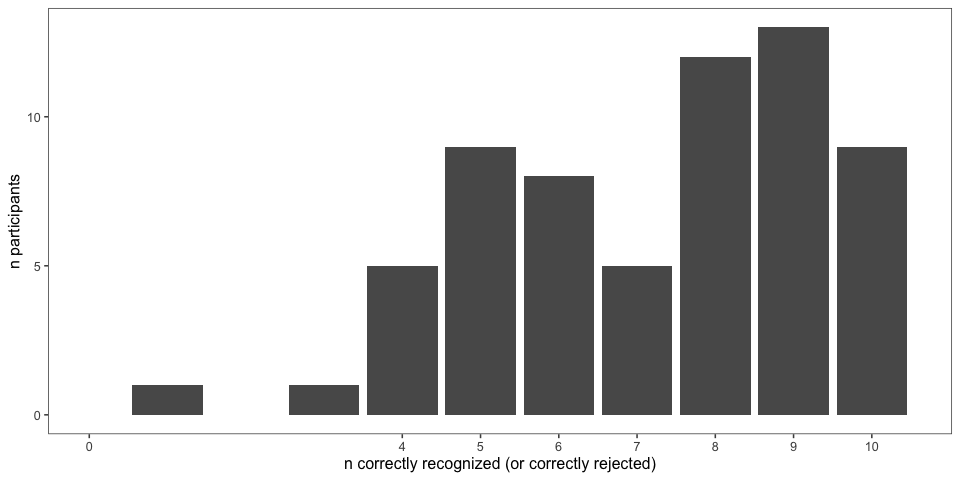
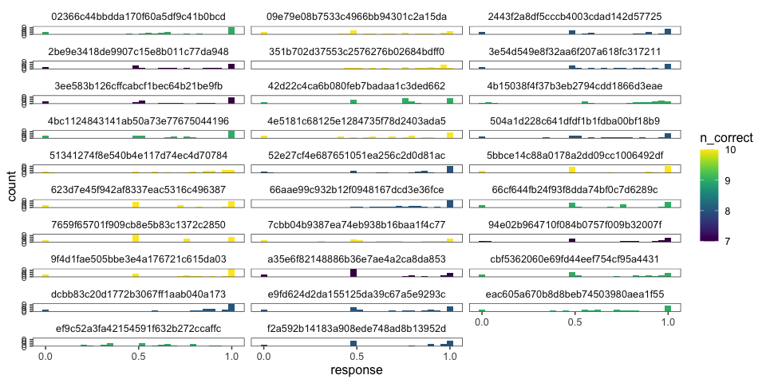

Variable Coordination Pilot 1
================
Karen Gu
4/14/2020

# Variable Coordination Level Experiment

  - This file contains pre-processing for the first pilot of the
    variable coordination level experiment.
  - Raw data is contained in `../../data/elephants-coord`, the first
    pilot. Analysis for this file is contained in
    `../elephants-coord.Rmd`.
  - n = 63 (04/14/2020)

## Loading Data

## Subject Information

| workerid                         | language | enjoyment | age | gender | problems                                        | comments                                                                          |
| :------------------------------- | :------- | :-------- | :-- | :----- | :---------------------------------------------- | :-------------------------------------------------------------------------------- |
| 94e02b964710f084b0757f009b32007f | English  | 0         | 48  | Male   | no                                              |                                                                                   |
| bec83fc61d00a7d4ffa3b946951a2e70 | English  | 1         | 30  | Male   | no                                              | good                                                                              |
| 9f4d1fae505bbe3e4a176721c615da03 | English  | 1         | 22  | Male   |                                                 |                                                                                   |
| 0d7fbc5dba7f680e33a708fbc32a4509 | english  | 0         | 30  | Male   | nothing                                         | nice                                                                              |
| 121e3fe89c89319899b22bf74ac5dbe4 | english  | 0         | 29  | Female | no                                              |                                                                                   |
| 504a1d228c641dfdf1b1fdba00bf18b9 | english  | 0         | 34  | Male   | no                                              |                                                                                   |
| 3a7dd723f40fed7a0a383a069939343d | english  | 1         | 62  | Female | no                                              |                                                                                   |
| 6e018d15d88a81eb8f01ce0bfcd221a0 | English  | 0         | 47  | Female | no                                              |                                                                                   |
| 4bc289a226eaf2ebed9a6f266ed21cb1 | englishn | 0         | 35  | Female | no                                              | nice                                                                              |
| 02366c44bbdda170f60a5df9c41b0bcd | English  | 1         | 26  | Male   | No                                              | Thanks.                                                                           |
| 119b8973de0826f10b078c559732ccb5 | English  | 1         | 37  | Male   | NA                                              |                                                                                   |
| ef9c52a3fa42154591f632b272ccaffc | English  | 0         | 27  | Male   |                                                 |                                                                                   |
| e2ae41e9b9346ca4ea2e59c1a0501329 | English  | 0         | 51  | Female | no                                              | good                                                                              |
| 66cf644fb24f93f8dda74bf0c7d6289c | English  | 0         | 47  | Male   | no                                              | none                                                                              |
| 3e54d549e8f32aa6f207a618fc317211 | English  | 1         | 59  | Female | No                                              |                                                                                   |
| 2be9e3418de9907c15e8b011c77da948 | English  | 0         | 23  | Female |                                                 |                                                                                   |
| d8413cc35a0124e58fb9594da7aaf179 | English  | 1         | 40  | Male   | no                                              | good                                                                              |
| eac605a670b8d8beb74503980aea1f55 | English  | 0         | 25  | Male   | NA                                              |                                                                                   |
| 3a9e470cb2caf2c71de688ffe8ffe959 | English  | 1         | 71  | Female | No                                              | Thanks :-)                                                                        |
| 5bbce14c88a0178a2dd09cc1006492df | English  | 0         | 30  | Female | No                                              |                                                                                   |
| a35e6f82148886b36e7ae4a2ca8da853 | English  | 1         | 43  | Male   | No                                              | Interesting study. I enjoyed reading the strange names of creatures and hapitats. |
| 765cdd58c0e4dc60cb61beaedf2cf9c8 | english  | 0         | 25  | Female | no                                              | good                                                                              |
| 4e5181c68125e1284735f78d2403ada5 | English  | 1         | 28  | Male   | nope.                                           |                                                                                   |
| cbf5362060e69fd44eef754cf95a4431 | english  | 0         | 39  | Female | no                                              |                                                                                   |
| 956fd002ea95bbd4d212530f6e982185 | ENGLISH  | 1         | 50  |        | In very general terms, please describe what you | In very general terms, please describe what you                                   |
| 0cf23b5795a4be0cd3092a670f413cb2 | ENGLISH  | 1         | 56  | Female | NA                                              | good                                                                              |
| 65b7c457a1fca600cb3ab0d0129ccb21 | ENGLISH  | 1         | 34  | Female | NO                                              | GOOD                                                                              |
| 2607cdd53c86dfa858102b97eef02bab | English  | 0         | 61  | Female | I did not encounter any problem                 |                                                                                   |
| 89b1607270f1c539f8e372967b779c24 | ENGLISH  | 0         | 50  | Female | none                                            | nice                                                                              |
| 4b15038f4f37b3eb2794cdd1866d3eae | English  | 0         | 25  | Female | No                                              | The study went well. Thanks for making me a part of it.                           |
| 66aae99c932b12f0948167dcd3e36fce | ENGLISH  | 0         | 30  | Male   | no                                              |                                                                                   |
| f0e5c785b7741a01b77429489c185f80 | ENGLISH  | 1         | 29  | Male   | n/a                                             | great                                                                             |
| db5577cef114410f546b921cbd4ffefc | english  | 1         | 32  | Female | no                                              |                                                                                   |
| 855ae1f624237dc12490ae1d36594044 | English  | 0         | 34  | Male   | No                                              |                                                                                   |
| 37ce7e57a208f286e9d799f5bffe1203 | english  | 0         | 29  | Male   | no                                              | good                                                                              |
| 3ee583b126cffcabcf1bec64b21be9fb | English  | 0         | 40  | Male   | n                                               |                                                                                   |
| b5bef9db68cf17777e947eac8d9f306d | English  | 0         | 31  | Male   |                                                 |                                                                                   |
| 09e79e08b7533c4966bb94301c2a15da | English  | 0         | 31  | Male   |                                                 |                                                                                   |
| fd5048577f56504208c368c3bd702034 | English  | 1         | 59  | Female | no                                              |                                                                                   |
| 351b702d37553c2576276b02684bdff0 | english  | 1         | 58  | Male   | no                                              |                                                                                   |
| 52e27cf4e687651051ea256c2d0d81ac | english  | 0         | 41  | Female | no                                              |                                                                                   |
| b28ee0d4be8559414380bdd754c773ec | english  | 1         | 30  | Male   | none                                            | useful survey                                                                     |
| 4bc1124843141ab50a73e77675044196 | english  | 0         | 25  | Male   | no                                              |                                                                                   |
| 0048659161e3aec37849a721e4dd3293 | English  | 0         | 45  | Male   | No.                                             |                                                                                   |
| 7cbb04b9387ea74eb938b16baa1f4c77 | English  | 1         | 44  | Male   | No                                              | It was interesting but somewhat hard to guess some of them. By design, I suppose… |
| 7659f65701f909cb8e5b83c1372c2850 | english  | 1         | 35  | Male   | no                                              |                                                                                   |
| 2443f2a8df5cccb4003cdad142d57725 | English  | 0         | 39  | Male   | No                                              |                                                                                   |
| 42d22c4ca6b080feb7badaa1c3ded662 | English  | 1         | 40  | Male   |                                                 |                                                                                   |
| 2f09bb178d82d57ee9e98784da1bb16f | English  | 1         | 51  | Male   | NA                                              | good                                                                              |
| 623d7e45f942af8337eac5316c496387 | English  | 0         | 55  | Female | no problems                                     | none                                                                              |
| 1eb3ec9876cc6a17bbae44d4761137d3 | English  | 0         | 28  | Male   | none                                            |                                                                                   |
| 504aa8560363dc18f9b1095cf6407c35 | english  | 1         | 55  | Male   | no                                              | good task                                                                         |
| 51341274f8e540b4e117d74ec4d70784 | English  | 1         | 31  | Male   | no                                              |                                                                                   |
| e9fd624d2da155125da39c67a5e9293c | english  | 1         | 29  | Female | no                                              |                                                                                   |
| 02c9b466a8218e0431007a14d7054500 | english  | 1         | 26  | Male   | none                                            | none                                                                              |
| f2a592b14183a908ede748ad8b13952d | English  | 1         | 56  |        | none                                            | none                                                                              |
| 75b0624edb002bc35f9a8b8be60d6dd4 | English  | 0         | 32  | Male   | no                                              | nice                                                                              |
| da5013b7c30b3d20264f36989fbe4ac3 |          | 0         | 35  |        | no                                              | good                                                                              |
| b7ca4e22ce73506ccb019c3113166247 | English  | 0         | 28  | Male   | None                                            |                                                                                   |
| e6532b573753e96d9385d652aba8da12 | English  | 0         | 25  | Male   |                                                 |                                                                                   |
| a3623ffaecf1e89cbe218cd459dbc6e5 | English  | 0         | 28  | Male   |                                                 |                                                                                   |
| dcbb83c20d1772b3067ff1aab040a173 | English  | 0         | 32  | Male   | no                                              | no                                                                                |
| 9d7e9117678074c390bfb883475724ad | english  | 0         | 27  | Male   | no                                              |                                                                                   |

## Attention Checks

### Slider Practice

Before the experiment, participants practice using the sliders to rate 3
category-property pairs:

  - dogs bark (coded as correct if x \> 0.5)
  - cats get cancer (coded as correct if x \< 0.75) \[being generous
    with this one\]
  - lions lay eggs (coded as correct if x \< 0.10)

| n\_correct |  n |
| ---------: | -: |
|          2 |  5 |
|          3 | 14 |
|          4 | 44 |

| property        | n\_correct |
| :-------------- | ---------: |
| birds are male  |         63 |
| cats get cancer |         59 |
| dogs bark       |         60 |
| lions lay eggs  |         46 |

### Memory Check

After the story, participants select statements they recall learning
from a list of 10 generic statements about novel animals (5 true, 5
distractor). They are also asked to explain what they did in the
experiment.

<!-- -->

### Explanations of Task

After the story, participants are also asked to explain generally what
they did in the experiment.

| workerid                         | n\_slider\_correct | n\_memory\_correct | explanation                                                                                                                                             |
| :------------------------------- | -----------------: | -----------------: | :------------------------------------------------------------------------------------------------------------------------------------------------------ |
| 94e02b964710f084b0757f009b32007f |                  4 |                  7 | I interpreted statements to determine what percentage of a certain alien had a certain trait                                                            |
| bec83fc61d00a7d4ffa3b946951a2e70 |                  3 |                  5 | well                                                                                                                                                    |
| 9f4d1fae505bbe3e4a176721c615da03 |                  4 |                 10 | I read about aliens and gave an estimation of what percentage of them aligns with a certain trait.                                                      |
| 0d7fbc5dba7f680e33a708fbc32a4509 |                  3 |                  6 | the experiment give some story and what percentage that is correct and i believe they asked this experiment.                                            |
| 121e3fe89c89319899b22bf74ac5dbe4 |                  3 |                  9 | I read short stories or sentences about alien life forms on their alien planets and had to figure out what percentage of these events seemed to happen. |
| 504a1d228c641dfdf1b1fdba00bf18b9 |                  4 |                  8 | I read a passage and chose the percentage of a statement.                                                                                               |
| 3a7dd723f40fed7a0a383a069939343d |                  4 |                  4 | nothing                                                                                                                                                 |
| 6e018d15d88a81eb8f01ce0bfcd221a0 |                  4 |                  4 | I worked on understanding some facts and the probability of each happening                                                                              |
| 4bc289a226eaf2ebed9a6f266ed21cb1 |                  2 |                  6 | nice                                                                                                                                                    |
| 02366c44bbdda170f60a5df9c41b0bcd |                  4 |                  9 | Read text about a fictional alien planet and retained information for this quiz and interpreting the stats given in the information.                    |
| 119b8973de0826f10b078c559732ccb5 |                  4 |                  8 | I read the section and then re-read to answer the question.                                                                                             |
| ef9c52a3fa42154591f632b272ccaffc |                  4 |                  9 | Determine if a species lived or after a certain way by percentage.                                                                                      |
| e2ae41e9b9346ca4ea2e59c1a0501329 |                  3 |                  4 | good                                                                                                                                                    |
| 66cf644fb24f93f8dda74bf0c7d6289c |                  4 |                  9 | Tried to guess percentages based on given information                                                                                                   |
| 3e54d549e8f32aa6f207a618fc317211 |                  4 |                  8 | I read a passage about an alien and then answered a question about the passage on a sliding scale.                                                      |
| 2be9e3418de9907c15e8b011c77da948 |                  4 |                  7 | I estimated what percentage of an alien population does something based on a short text.                                                                |
| d8413cc35a0124e58fb9594da7aaf179 |                  3 |                  5 | fully understand the experiment                                                                                                                         |
| eac605a670b8d8beb74503980aea1f55 |                  4 |                  9 | I estimated how likely aliens from another planet would be to do something, be something, or other things to that effect.                               |
| 3a9e470cb2caf2c71de688ffe8ffe959 |                  4 |                  9 | I read carefully, slowly, and sometimes twice for each entry.                                                                                           |
| 5bbce14c88a0178a2dd09cc1006492df |                  4 |                 10 | Chose a percentage based on what was said in the paragraph.                                                                                             |
| a35e6f82148886b36e7ae4a2ca8da853 |                  4 |                  7 | I looked for words that stated such things as ALL, and if there were two options for something, I just gave it a 50% chance.                            |
| 765cdd58c0e4dc60cb61beaedf2cf9c8 |                  4 |                  1 | paid close attention of the description then provide my answer.                                                                                         |
| 4e5181c68125e1284735f78d2403ada5 |                  4 |                 10 | Gave percentage-based answers according to given scenarios.                                                                                             |
| cbf5362060e69fd44eef754cf95a4431 |                  4 |                  9 | I made predictions about percentages of groups that have certain characteristics.                                                                       |
| 956fd002ea95bbd4d212530f6e982185 |                  2 |                  4 | In very general terms, please describe what you                                                                                                         |
| 0cf23b5795a4be0cd3092a670f413cb2 |                  3 |                  7 | about the animals and plant                                                                                                                             |
| 65b7c457a1fca600cb3ab0d0129ccb21 |                 NA |                  5 | GOOD                                                                                                                                                    |
| 2607cdd53c86dfa858102b97eef02bab |                  4 |                  6 | read a story about aliens and choose the percentage depending on the given question.                                                                    |
| 89b1607270f1c539f8e372967b779c24 |                  3 |                  8 | nice                                                                                                                                                    |
| 4b15038f4f37b3eb2794cdd1866d3eae |                  4 |                  9 | I rated in percentage deducing from short passage given how true or false a statement was.                                                              |
| 66aae99c932b12f0948167dcd3e36fce |                  4 |                  8 | I rated statements by the percentage I thought was correct                                                                                              |
| f0e5c785b7741a01b77429489c185f80 |                  4 |                  6 | i answered questions about animals and aliens on a far away planet.                                                                                     |
| db5577cef114410f546b921cbd4ffefc |                  4 |                  6 | I looked for most, all, none for a my percentage.                                                                                                       |
| 855ae1f624237dc12490ae1d36594044 |                  4 |                  5 | Answer a percentage question about a made up alien race.                                                                                                |
| 37ce7e57a208f286e9d799f5bffe1203 |                  3 |                  5 | Read about aliens and animals                                                                                                                           |
| 3ee583b126cffcabcf1bec64b21be9fb |                  4 |                  7 | gave percentage of how many of something there was                                                                                                      |
| b5bef9db68cf17777e947eac8d9f306d |                  3 |                  8 | I read a piece of information and answered questions about it.                                                                                          |
| 09e79e08b7533c4966bb94301c2a15da |                  4 |                 10 | Selected how likely the alien life was to have behaved in a certain way in the context of a passage.                                                    |
| fd5048577f56504208c368c3bd702034 |                  4 |                  9 | I gave a percent of what I thought was accurate                                                                                                         |
| 351b702d37553c2576276b02684bdff0 |                  4 |                 10 | i read a little passage about alien and plant and i answered some question                                                                              |
| 52e27cf4e687651051ea256c2d0d81ac |                  4 |                  8 | I read little stories and decided what percentage of aliens did things based on the story                                                               |
| b28ee0d4be8559414380bdd754c773ec |                  2 |                  3 | estimate the statmetns                                                                                                                                  |
| 4bc1124843141ab50a73e77675044196 |                  4 |                  9 | what percentage of aliens did something                                                                                                                 |
| 0048659161e3aec37849a721e4dd3293 |                  4 |                  5 | I read a short paragraph and then answered, in terms of percentage, how many of X did Y.                                                                |
| 7cbb04b9387ea74eb938b16baa1f4c77 |                  4 |                 10 | Read an excerpt about aliens and their planet (including plants, animals, etc) and answered a question about the excerpt in percentage form.            |
| 7659f65701f909cb8e5b83c1372c2850 |                  4 |                 10 | I read facts about aliens species and answered questions about them.                                                                                    |
| 2443f2a8df5cccb4003cdad142d57725 |                  4 |                  8 | read statements about aliens and then decided what percentage of them do a certain statement                                                            |
| 42d22c4ca6b080feb7badaa1c3ded662 |                  4 |                  9 | determined what percentage of various alien species did something based on the wording of a paragraphs.                                                 |
| 2f09bb178d82d57ee9e98784da1bb16f |                  3 |                  5 | I can remember                                                                                                                                          |
| 623d7e45f942af8337eac5316c496387 |                  4 |                 10 | I had to put percentages to words like most and all.                                                                                                    |
| 1eb3ec9876cc6a17bbae44d4761137d3 |                  3 |                  4 | i tried to make sense of some foreign languages                                                                                                         |
| 504aa8560363dc18f9b1095cf6407c35 |                  2 |                  5 | good task                                                                                                                                               |
| 51341274f8e540b4e117d74ec4d70784 |                  4 |                 10 | I answered questions about various alien species and habits on the planet DAX.                                                                          |
| e9fd624d2da155125da39c67a5e9293c |                  4 |                  8 | I read sentences about different creatures and then answered a question about how many of them did something.                                           |
| 02c9b466a8218e0431007a14d7054500 |                  3 |                  8 | very sure                                                                                                                                               |
| f2a592b14183a908ede748ad8b13952d |                  4 |                  8 | Guessed percentages on questions asked about DAX aliens and there planet.                                                                               |
| 75b0624edb002bc35f9a8b8be60d6dd4 |                  4 |                  6 | it is about alien                                                                                                                                       |
| da5013b7c30b3d20264f36989fbe4ac3 |                  4 |                  6 | lives about alliens                                                                                                                                     |
| b7ca4e22ce73506ccb019c3113166247 |                  4 |                  9 | The study is to check our level of concentration.                                                                                                       |
| e6532b573753e96d9385d652aba8da12 |                  3 |                  5 | To rate the possibility of a fact.                                                                                                                      |
| a3623ffaecf1e89cbe218cd459dbc6e5 |                  4 |                  9 | Answer questions related to the prompt                                                                                                                  |
| dcbb83c20d1772b3067ff1aab040a173 |                  4 |                  8 | Paid attention to what I read in each story.                                                                                                            |
| 9d7e9117678074c390bfb883475724ad |                 NA |                  6 | i have zero idea                                                                                                                                        |

## Participants

### Exclusions

These exclusions are manually coded by looking through participants
explanations and prevalence ratings. Participants who gave the same
prevalence rating across trials, without using the full range provided,
are noted.

    ## [1] 45

### Prevalence Estimates by Participant

Histogram of all of a single participant’s prevalence estimates,
collapsed across trials and color coded for the number of correct
responses on the memory check. \* fill = number of correct responses on
the memory check (out of 10) \* facet = participants

<!-- -->

Removing participants who got fewer than 7 correct on memory check and
didn’t get all 3 sliders, as well as participants that gave bad
explanations or gave the same prevalence ratings to all sentences.

| memory\_fail | slider\_fail | bad\_expln |  n |
| :----------- | :----------- | :--------- | -: |
| FALSE        | FALSE        | FALSE      | 29 |
| TRUE         | TRUE         | TRUE       | 10 |
| TRUE         | FALSE        | FALSE      |  6 |
| TRUE         | FALSE        | TRUE       |  6 |
| FALSE        | FALSE        | TRUE       |  5 |
| FALSE        | TRUE         | TRUE       |  3 |
| FALSE        | TRUE         | FALSE      |  2 |
| TRUE         | TRUE         | FALSE      |  2 |
