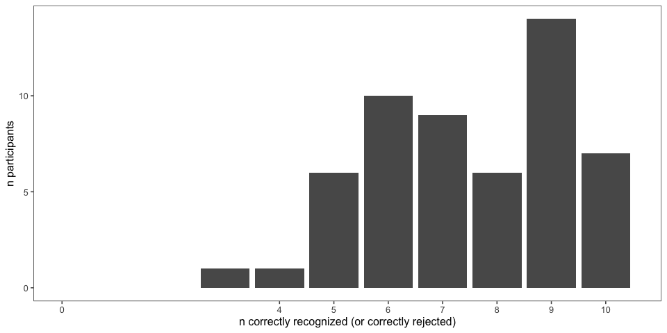
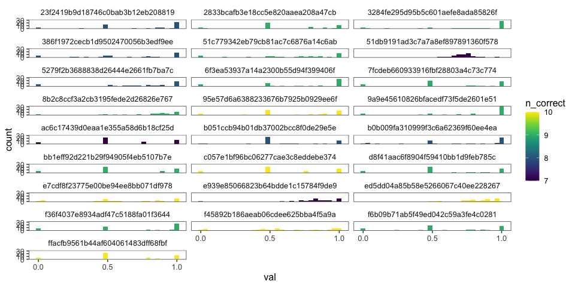

Variable Coordination Pilot 2
================
Karen Gu
4/27/2020

# Variable Coordination Level Experiment

  - This file contains pre-processing for the second pilot of the
    variable coordination level experiment.
  - The experiment files are named `elephants-coord`. Raw data is
    contained in `../data/elephants-coord-rep`, Analysis for this file
    is contained in `./elephants-coord.Rmd`.
  - n = 54 (04/27/2020)

## Loading Data

## Subject Information

| workerid                         | language | enjoyment | age | gender | problems                                              | comments                                                                                |
| :------------------------------- | :------- | :-------- | :-- | :----- | :---------------------------------------------------- | :-------------------------------------------------------------------------------------- |
| 645a6517e313390917505e79b3797f3b | English  | 1         | 35  | Male   | no                                                    | good                                                                                    |
| 9a9e45610826bfacedf73f5de2601e51 | English  | 1         | 24  | Male   | No                                                    | No                                                                                      |
| f45892b186aeab06cdee625bba4f5a9a | English  | 0         | 54  | Male   | no problems                                           | no comments                                                                             |
| 9c069c5790858cfb00c23bacc10f1e95 | english  | 1         | 55  | Male   | no                                                    |                                                                                         |
| 2b5794d92119d7e92d115695bf207170 | english  | 1         | 60  | Female |                                                       |                                                                                         |
| b0b009fa310999f3c6a62369f60ee4ea | English  | 1         | 38  | Female | No                                                    | No                                                                                      |
| 8b2c8ccf3a2cb3195fede2d26826e767 | English  | 1         | 37  | Female |                                                       |                                                                                         |
| 51c779342eb79cb81ac7c6876a14c6ab | english  | 0         | 33  | Male   | no                                                    |                                                                                         |
| e7cdf8f23775e00be94ee8bb071df978 | English  | 1         | 29  | Male   | Not really, no.                                       | Thank you for letting me take this\!                                                    |
| ed5dd04a85b58e5266067c40ee228267 | English  | 1         | 32  | Male   | No                                                    |                                                                                         |
| f415b7277e92d2fa8cfc4496f190885d | english  | 1         | 33  | Male   | none                                                  | none                                                                                    |
| 386f1972cecb1d9502470056b3edf9ee | english  | 0         | 25  | Female | no                                                    | good luck with ur research\!                                                            |
| d8f41aac6f8904f59410bb1d9feb785c | English  | 1         | 33  | Male   | There were no problems or bugs in the experiment.     | Thank you for a fun and informative survey.                                             |
| 6975903e61ee2fe45b0b1df3d7b8b80d | English  | 1         | 55  | Female | No                                                    | I love these surveys\!                                                                  |
| c057e1bf96bc06277cae3c8eddebe374 | English  | 1         | 33  | Female | no                                                    |                                                                                         |
| 862b46d5fa579d805cf1791f97744b68 | english  | 1         | 47  | Female | no                                                    | Great survey                                                                            |
| f36f4037e8934adf47c5188fa01f3644 | English  | 0         | 34  | Female |                                                       |                                                                                         |
| 95e57d6a6388233676b7925b0929ee6f | English  | 0         | 31  | Male   | No problems                                           |                                                                                         |
| 84cf0e42557990a784ef998dd8af955e | english  | 0         | 61  | Male   | nothing                                               | good                                                                                    |
| 01da851ac67defcef8b30d7b34765075 | eng      | \-1       | 44  | Male   |                                                       |                                                                                         |
| bb1eff92d221b29f94905f4eb5107b7e | english  | 1         | 40  | Female | no                                                    | Thank you                                                                               |
| 9b53fbf4be0e9dc0ecb5db3222388b55 | english  | 1         | 28  | Female | none                                                  | nice experiment                                                                         |
| e939e85066823b64bdde1c15784f9de9 | eng      | 0         | 20  | Male   |                                                       |                                                                                         |
| 7fcdeb660933916fbf28803a4c73c774 | English  | 1         | 66  | Male   | It flowed logically but let a lot to the imagination. | None, thank you.                                                                        |
| 4eb837e530256569dbebf90476f938f6 | english  | 0         | 21  | Female | no                                                    |                                                                                         |
| ac6c17439d0eaa1e355a58d6b18cf25d | English  | 0         | 30  | Male   | No                                                    | No                                                                                      |
| f64e240c246dda2026c269b105a7fa18 | english  | 1         | 44  | Male   | good                                                  |                                                                                         |
| 920e94362bfd486741373e3f22a37fae | English  | 0         | 39  | Female | no..                                                  | none                                                                                    |
| d40cc09b913fc992a03f89ff58ce036b | english  | 1         | 48  | Male   | nothing                                               | good                                                                                    |
| 5279f2b3688838d26444e2661fb7ba7c | English  | 1         | 29  | Female | no                                                    |                                                                                         |
| f6b09b71ab5f49ed042c59a3fe4c0281 | English  | 0         | 30  | Male   | Worked great                                          |                                                                                         |
| e7ff54db5a0fa6912b2820ec670eec43 | English  | 1         | 27  | Female | no                                                    |                                                                                         |
| ffacfb9561b44af604061483dff68fbf | English  | 1         | 27  | Female | no                                                    |                                                                                         |
| c7cd887f367d429fc95be745baea3039 | English  | 0         | 28  |        | No                                                    | I liked this study                                                                      |
| 1ff677d9263a4dc0b9bd82481bf45c47 | English  | 1         | 25  | Male   | Nothing                                               | Interesting survey                                                                      |
| 130868e2258ca5112789154b314994c3 | English  | 1         | 41  | Male   | no                                                    | nice study                                                                              |
| b051ccb94b01db37002bcc8f0de29e5e | English  | \-1       | 33  | Male   | No.                                                   | I think the the delays in each of the pages made it longer than it should have. Thanks. |
| 51db9191ad3c7a7a8ef897891360f578 | eng      | 0         | 22  | Male   | no                                                    | pay more                                                                                |
| 3284fe295d95b5c601aefe8ada85826f | English  | 0         | 31  | Male   | No                                                    |                                                                                         |
| 44a97c6d2adae4bd4003da78c286ff5c | english  | 1         | 66  | Female | no                                                    | thanks                                                                                  |
| f8ba19c69876bb549c822669018b17a0 | english  | 1         | 22  | Male   | no                                                    |                                                                                         |
| a78e14ab9b0e21c53221c8c616e27c61 | English  | 1         | 24  | Male   | No.                                                   |                                                                                         |
| b12752e3dcbff696bf4ab9efb28bf5c4 | English  | 0         | 25  | Female | its going good                                        | very good experience                                                                    |
| 7fb721a8748660a36b0bf33d07b465f2 | english  | 1         | 57  | Male   | no                                                    |                                                                                         |
| 8caf8d405cf4552c1fec1397341699ca | English  | 1         | 42  | Male   | no                                                    | no comments                                                                             |
| 60efd6cd3f3b1ef22e249845f3bbdcfe | English  | 1         | 33  | Male   | No Issues                                             | Nice Experiment                                                                         |
| 8a35442a3777f2c456f729e8b9559022 | English  | 1         | 30  | Male   | no                                                    | good                                                                                    |
| 2833bcafb3e18cc5e820aaea208a47cb | English  | 0         | 44  | Female | No                                                    |                                                                                         |
| 45456924d6df6c4535e39857e87f7190 | English  | 1         | 26  | Female | no                                                    | interesting                                                                             |
| 23f2419b9d18746c0bab3b12eb208819 | English  | 0         | 35  | Female | no                                                    |                                                                                         |
| 730cc415993d5d65ab0e3b16c71eeb14 | English  | 0         | 30  | Male   | No                                                    | Good and Nice.                                                                          |
| db1f13ca0e5b754f5ec37e333fe514fb | English  | 0         | 50  | Female | No                                                    | Good                                                                                    |
| eea3a419fad867bc8c5ca38bffa3dd3d | English  | 1         | 33  | Male   | very nice                                             | very nice survey                                                                        |
| 6f3ea53937a14a2300b55d94f399406f | English  | 0         | 31  | Female | no                                                    |                                                                                         |

## Attention Checks

### Slider Practice

Before the experiment, participants practice using the sliders to rate 3
category-property pairs:

  - dogs bark (coded as correct if x \> 0.5)
  - cats get cancer (coded as correct if x \< 0.75) \[being generous
    with this one\]
  - lions lay eggs (coded as correct if x \< 0.10)

| n\_correct |  n |
| ---------: | -: |
|          2 |  7 |
|          3 | 11 |
|          4 | 36 |

| property        | n\_correct |
| :-------------- | ---------: |
| birds are male  |         54 |
| cats get cancer |         49 |
| dogs bark       |         49 |
| lions lay eggs  |         39 |

### Memory Check

After the story, participants select statements they recall learning
from a list of 10 generic statements about novel animals (5 true, 5
distractor). They are also asked to explain what they did in the
experiment.

<!-- -->

### Explanations of Task

After the story, participants are also asked to explain generally what
they did in the experiment.

| workerid                         | n\_slider\_correct | n\_memory\_correct | explanation                                                                                                                                                                                                              |
| :------------------------------- | -----------------: | -----------------: | :----------------------------------------------------------------------------------------------------------------------------------------------------------------------------------------------------------------------- |
| 645a6517e313390917505e79b3797f3b |                  3 |                  7 | i give a accurate answer for this question                                                                                                                                                                               |
| 9a9e45610826bfacedf73f5de2601e51 |                  4 |                  9 | I was given certain information about alien-animals and given a slider to rate the population that perform or have certain characteristics.                                                                              |
| f45892b186aeab06cdee625bba4f5a9a |                  4 |                 10 | I read paragraphs about aliens and their environment I then answered questions about what I read in percentage terms.                                                                                                    |
| 9c069c5790858cfb00c23bacc10f1e95 |                  3 |                 10 | imagine about dax                                                                                                                                                                                                        |
| 2b5794d92119d7e92d115695bf207170 |                 NA |                  4 | king of all beings                                                                                                                                                                                                       |
| b0b009fa310999f3c6a62369f60ee4ea |                  4 |                  8 | I read about aliens and answered questions.                                                                                                                                                                              |
| 8b2c8ccf3a2cb3195fede2d26826e767 |                  4 |                  9 | i rated aliens from 1 to 100% on some basic attributes                                                                                                                                                                   |
| 51c779342eb79cb81ac7c6876a14c6ab |                  4 |                  9 | I answered questions about alien kingdom.                                                                                                                                                                                |
| e7cdf8f23775e00be94ee8bb071df978 |                  4 |                 10 | I read about alien plants and animals and moved sliders in relation to questions about them.                                                                                                                             |
| ed5dd04a85b58e5266067c40ee228267 |                  4 |                 10 | Picked what percent you think agree with the statements made above about various fictional creatures habits                                                                                                              |
| f415b7277e92d2fa8cfc4496f190885d |                  3 |                  5 | i am very interesting to doing this experiment.                                                                                                                                                                          |
| 386f1972cecb1d9502470056b3edf9ee |                  4 |                  8 | determining percentages for behavior of alien creatures                                                                                                                                                                  |
| d8f41aac6f8904f59410bb1d9feb785c |                  4 |                  9 | I read stories about aliens and animals on a planet and then used sliders to relay the information I learned.                                                                                                            |
| 6975903e61ee2fe45b0b1df3d7b8b80d |                  3 |                  7 | Determined the population, habitat, and life style of aliens.                                                                                                                                                            |
| c057e1bf96bc06277cae3c8eddebe374 |                  4 |                 10 | Mostly I read to find keywords like “all”, “most”, “some”, “none” to determine related percentages of what creatures, plants, or beings do or don’t do.                                                                  |
| 862b46d5fa579d805cf1791f97744b68 |                  4 |                  6 | I just did some calculations regarding to what the short paragraph says                                                                                                                                                  |
| f36f4037e8934adf47c5188fa01f3644 |                  4 |                  9 | I gave estimated percentages based on the information provided.                                                                                                                                                          |
| 95e57d6a6388233676b7925b0929ee6f |                  4 |                 10 | In this experiment, I had to read short texts and respond to questions about them. The texts were about aliens and details about life on their planet. I had to use scales to answer questions based on the text I read. |
| 84cf0e42557990a784ef998dd8af955e |                 NA |                  5 | good                                                                                                                                                                                                                     |
| 01da851ac67defcef8b30d7b34765075 |                  4 |                  8 | Picked sentences                                                                                                                                                                                                         |
| bb1eff92d221b29f94905f4eb5107b7e |                  4 |                  9 | I read little stories about aliens and creatures and answered simple questions about percentages.                                                                                                                        |
| 9b53fbf4be0e9dc0ecb5db3222388b55 |                  3 |                  7 | language judgement                                                                                                                                                                                                       |
| e939e85066823b64bdde1c15784f9de9 |                  4 |                  7 | I stated the probability I thought some things were true                                                                                                                                                                 |
| 7fcdeb660933916fbf28803a4c73c774 |                  4 |                  9 | I either followed the statements in the texts or made assumptions when there were multiple options.                                                                                                                      |
| 4eb837e530256569dbebf90476f938f6 |                  3 |                  6 | I basically summarized the info I got from reading the facts.                                                                                                                                                            |
| ac6c17439d0eaa1e355a58d6b18cf25d |                  4 |                  7 | I read details about alien creatures and then I used sliders to state how many aliens do one thing or another.                                                                                                           |
| f64e240c246dda2026c269b105a7fa18 |                 NA |                  3 | good                                                                                                                                                                                                                     |
| 920e94362bfd486741373e3f22a37fae |                  4 |                  6 | not sure.                                                                                                                                                                                                                |
| d40cc09b913fc992a03f89ff58ce036b |                 NA |                  6 | very intersting                                                                                                                                                                                                          |
| 5279f2b3688838d26444e2661fb7ba7c |                  4 |                  8 | I read about aliens and answered questions about different species                                                                                                                                                       |
| f6b09b71ab5f49ed042c59a3fe4c0281 |                  4 |                  9 | Rated how many of a subject fall in certain categories using percentages.                                                                                                                                                |
| e7ff54db5a0fa6912b2820ec670eec43 |                  3 |                  5 | I tried to understand activities of an alien race and commented how probable an action was.                                                                                                                              |
| ffacfb9561b44af604061483dff68fbf |                  4 |                 10 | I had to answer questions about the planet Dax, and its creatures based on the information I was given.                                                                                                                  |
| c7cd887f367d429fc95be745baea3039 |                  4 |                  7 | To know about public opinion                                                                                                                                                                                             |
| 1ff677d9263a4dc0b9bd82481bf45c47 |                  2 |                  6 | Language study                                                                                                                                                                                                           |
| 130868e2258ca5112789154b314994c3 |                  4 |                  9 | it is very useful and interesting                                                                                                                                                                                        |
| b051ccb94b01db37002bcc8f0de29e5e |                  4 |                  8 | I was asked to estimate the probability, using a percentage slider, of a statement being true.                                                                                                                           |
| 51db9191ad3c7a7a8ef897891360f578 |                  4 |                  7 | i selected and guessed percentages.                                                                                                                                                                                      |
| 3284fe295d95b5c601aefe8ada85826f |                  4 |                  9 | Just answered some percentage questions about different alien species – who lives where, eats what, etc.                                                                                                                 |
| 44a97c6d2adae4bd4003da78c286ff5c |                  4 |                  9 | i only agree or disagree                                                                                                                                                                                                 |
| f8ba19c69876bb549c822669018b17a0 |                  4 |                  5 | Answer a percentage after reading about facts.                                                                                                                                                                           |
| a78e14ab9b0e21c53221c8c616e27c61 |                  3 |                  6 | I gave my estimation about beliefs put forth by an exercpt that I read.                                                                                                                                                  |
| b12752e3dcbff696bf4ab9efb28bf5c4 |                  4 |                  6 | its about language study                                                                                                                                                                                                 |
| 7fb721a8748660a36b0bf33d07b465f2 |                  4 |                  9 | I learned an alien language                                                                                                                                                                                              |
| 8caf8d405cf4552c1fec1397341699ca |                  4 |                  6 | percentage marking                                                                                                                                                                                                       |
| 60efd6cd3f3b1ef22e249845f3bbdcfe |                  4 |                  7 | Ratings in paragraph question answer                                                                                                                                                                                     |
| 8a35442a3777f2c456f729e8b9559022 |                  2 |                  5 | I paid to my full attention into this study.                                                                                                                                                                             |
| 2833bcafb3e18cc5e820aaea208a47cb |                  4 |                  9 | Determined percentage based on content presented.                                                                                                                                                                        |
| 45456924d6df6c4535e39857e87f7190 |                  3 |                  7 | very interesting                                                                                                                                                                                                         |
| 23f2419b9d18746c0bab3b12eb208819 |                  4 |                  8 | I gave percentages based on the representations given in the texts.                                                                                                                                                      |
| 730cc415993d5d65ab0e3b16c71eeb14 |                 NA |                  6 | Decision making study.                                                                                                                                                                                                   |
| db1f13ca0e5b754f5ec37e333fe514fb |                  3 |                  5 | We are read about animals and aliens on a far-away planet called Dax.                                                                                                                                                    |
| eea3a419fad867bc8c5ca38bffa3dd3d |                 NA |                  6 | The very nice of the choosing in indian                                                                                                                                                                                  |
| 6f3ea53937a14a2300b55d94f399406f |                  4 |                  9 | read a passage about aliens and use the slider to answer the question about the passage                                                                                                                                  |

### Exclusions

These exclusions are manually coded by looking through participants
explanations and prevalence ratings. Participants who gave the same
prevalence rating across trials, without using the full range provided,
are noted.

## Participants

### Prevalence Estimates by Participant

Histogram of all of a single participant’s prevalence estimates,
collapsed across trials and color coded for the number of correct
responses on the memory check. \* fill = number of correct responses on
the memory check (out of 10) \* facet = participants

<!-- -->

### Included/Excluded Subject Numbers

Removing participants who got fewer than 7 correct on memory check and
didn’t get all 3 sliders, as well as participants that gave bad
explanations or gave the same prevalence ratings to all sentences.

| memory\_fail | slider\_fail | bad\_expln |  n |
| :----------- | :----------- | :--------- | -: |
| FALSE        | FALSE        | FALSE      | 25 |
| TRUE         | FALSE        | TRUE       |  9 |
| FALSE        | FALSE        | TRUE       |  6 |
| TRUE         | TRUE         | FALSE      |  5 |
| FALSE        | TRUE         | TRUE       |  4 |
| TRUE         | FALSE        | FALSE      |  2 |
| TRUE         | TRUE         | TRUE       |  2 |
| FALSE        | TRUE         | FALSE      |  1 |
