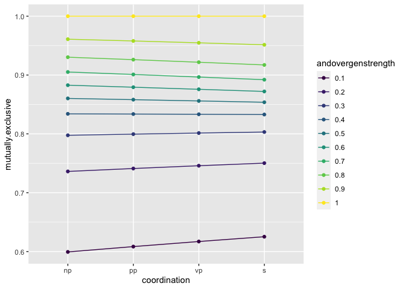

Lifted Scope Model Simulations
================
Karen Gu

This file explores predictions made by a lifted version of the scope
model explored in `elephants-coord-simulations.Rmd`. The key difference
between these models is that in the lifted model, the pragmatic listener
can reason about the structure of the utterance, that is, whether or not
GEN outscopes AND. This enables the model to make new classes of
predictions as described below. We also add a null utterance for
completeness, and assume that movement can also occur in the case of
S-coordination to produce an inverse scope. In the other model, we
assume that S-coordination always yields a AND \> GEN scope, identical
to the surface scope. This assumption is added back to the model in the
third case that we address.

Throughout, we assume that group predication does not exist. We consider
the effects of three variables: the cost multiplier, which affects the
magnitude of the *cost of each utterance*, although their relative
difference in cost remains the same, alpha, or the *speaker optimality*,
and the prior on utterance structure in the form of `andOverGenStrength`
(affected by the cost of movement).

## Case 1: no cost of movement

We assume that there is no cost of movement (`andOverGenStrength` is a
fixed value for all coordination levels).

Varying the cost multiplier:

<!-- -->

We see a monotonically decreasing trend (NP -\> S) for all values of
cost. As the cost of the utterance increases, the difference in
interpretation across coordination levels increases.

Varying `alpha`:

<!-- -->

We see the monotonically decreasing trend for all values of `alpha`, and
as `alpha` increases, the difference in interpretation across
coordination levels increases.

Varying the baseline belief in the AND \> GEN scope:

<!-- -->

The trend is monotonically decreasing for high values of
`andOverGenStrength` (high likelihood of inverse scope for coordination
levels below S), and monotonically increasing for low values of
`andOverGenStrength` (low likelihood of inverse scope for coordination
levels below S).

## Case 2: movement is costly

Next we’ll assume that movement is costly, meaning that the prior on
utterance structure will depend on the level of coordination.

Varying the cost of the utterance:

<!-- -->

The trend is monotonically increasing and concave in shape. Both the
utterance cost (longer utterances are more costly) and the cost of
movement (NP-coordination is least likely to convey AND \> GEN) are at
play here, with the former tending to increase the predicted mutual
exclusivity of NP-coordination and the latter tending to decrease it.
Since NP-coordination ends up having a low predicted mutual exclusivity,
the movement effect is stronger.

Varying the cost of movement:

<!-- -->

Again, the trend is monotonically increasing and concave in shape. We
see that increasing the cost of movement cannot affect the overall shape
of the trend.

Varying `alpha`:

<!-- -->

The overall shape of the trend is the same. As alpha increases, the
overall mutual exclusivity predictions decrease.

## Case 3: S = AND \> GEN, movement is costly

In this case, we assume that movement cannot occur in the case of
S-coordination such that GEN outscopes AND, that is, the surface scope
is the only scope allowed (with some very high probability = `.999`).
Movement in other cases is still allowed, and is costly. This is more
consistent with the assumptions made in
`elephants-coord-simulations.Rmd`.

Varying the cost multiplier:

<!-- -->

S-coordination always implies mutual exclusivity with very high
likelihood. Otherwise the trend is monotonically increasing.

Varying the cost of movement:

<!-- -->

The trend is monotonically increasing and convex for high costs of
movement, while concave for low costs of movement.

Varying `alpha`:

<!-- -->

The trend is monotonically increasing and concave.

## Summary

Using the lifted model, we can model an additional trend of a
monotonically decreasing function from NP -\> S.

With an assumption of no cost of movement, the trend is always
monotonically decreasing, since more costly utterances (higher levels of
coordination) tend to convey less likely world states (non-mutually
exclusive).

In the case where movement is costly, we see a monotonically increasing,
concave trend.

In the case where movement is costly and S-coordination is forced to
have surface scope, we can see either a monotonically increasing,
concave trend, or a monotonically increasing, convex trend.

Note that there are different ways to parameterize the prior on
utterance structure (`andOverGenStrength`) which could lead to different
qualitative predictions. I tested a few different ways and found the
same qualitative predictions, but I possibly missed some important
cases.
