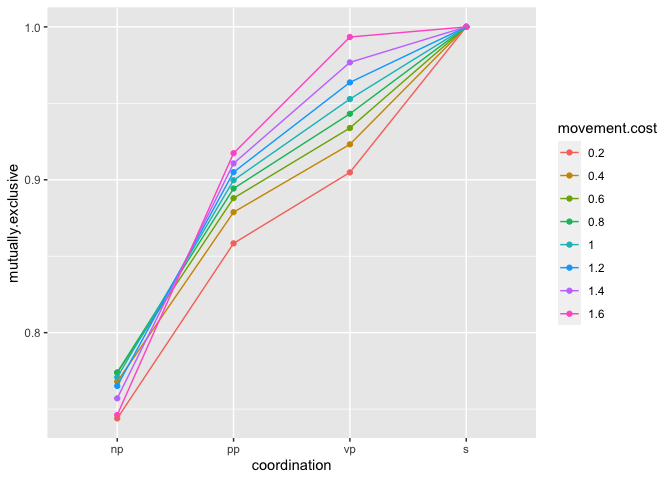

Scope Model Simulations
================
Karen Gu

Here we explore predictions made by a simple RSA model that reasons
about whether or not two conjuncts in a given conjunctive generic
sentence are mutually exclusive or not.

The model assumes that mutual exclusivity is affected by the relative
scope of the generic operator (GEN) and conjunction (AND). When GEN \>
AND, it is more likely that the two conjuncts are not mutually
exclusive, since it is the case that generically many of the kind
possess both properties, *simultaneously*. When GEN \< AND, it is more
likely that the two conjuncts are mutually exclusive, since it is the
case that generically many of the kind possess the first property, and
it is also the case that generically many of the kind possess the second
property, but the flexibility of GEN’s threshold semantics enables a
fewer number of the kind to possess each property (see
`model-simulations-v2` for quantitative predictions).

Obviously, the mutual exclusivity of any two random predicates will vary
quite widely. Here we assume that the prior on mutual exclusivity for
the two predicates is quite high, such as “living in Africa” and “living
in Asia”, in order to test the range of model predictions.

The model also assumes if group predication exists, it is only available
at the NP level of coordination. Group predication has the effect of
making mutual exclusivity less likely, since it operates as a union for
many predicate types (notably including “living in Africa and Asia”).
The *strength of group predication* is the first variable we consider.
Notably, it can be zero, meaning that group predication does not operate
in the model.

We also consider a structural effect on interpretation. The AND \> GEN
scope is the inverse scope for sentences with NP-, PP-, or VP-
coordination. Moreover, it may be more computationally intensive to
achieve the inverse scope depending on where AND begins in the syntactic
tree. Thus, the *cost of movement* (for some theory-neutral notion of
movement) is the second variable we consider.

Furthermore, longer utterances have greater cost, such that
S-coordinated sentences are the most costly and NP-coordinated sentences
are the least costly. The multiplier for the *cost of utterance* is the
third variable we consider. Throughout, we assume that the cost spacing
(relative difference in cost between different coordination levels) is
constant, but the size of the spacing (multiplier) varies.

We last consider the *speaker optimality* or alpha, which is a common
parameter in RSA models.

We will work through a series of possible cases and look at the model
predictions for each. Ideally, the model makes unique qualitative
predictions in each case so that we can disambiguate between them.
Within each case, we will explore the range of quantitative predictions
made.

## Case 1: group predication exists, no cost of movement

Here we assume that group predication exists (`groupPredicationStrength`
is nonzero), and there is no cost of movement (`andOverGenStrength` is a
fixed value for all coordination levels).

First we’ll set `andOverGenStrength = 0.5` for all coordination levels,
with `alpha = 1` and `costMultiplier = 1`, and vary the strength of
group predication.

<!-- -->

We see that the general shape of the model predictions is PP = VP \< NP
\< S. NP-coordination may produce estimates of mutual exclusivity as
high as that of S-coordination when the strength of group predication is
high, which indicates that NP-coordination is more likely to indicate
mutual exclusivity.

Next, let’s consider setting group predication strength to 0.5 and
varying the speaker optimality `alpha`.

<!-- -->

We see that the general shape of the trend remains the same (PP = VP \<
NP \< S), except when `alpha` is very high, in which case the model
predictions for NP-coordination and S-coordination become more similar.
As `alpha` increases, the differences between coordination levels
increases.

Next, let’s consider setting `alpha=1` and varying the cost multiplier.

<!-- -->

We see that the general shape of the trend is again constant. As the
difference in cost between coordination levels increases, the difference
between coordination levels becomes greater.

## Case 2: group predication exists, movement is costly

Here we assume that group predication exists (`groupPredicationStrength`
is nonzero), and there is a cost associated with movement
(`andOverGenStrength`differs across coordination levels).

First we’ll set `groupPredicationStrength=0.5`, `alpha=1`,
`costMultiplier=1`, and `andOverGenStrength` to some evenly spaced
values (.2 for NP, .4 for PP, and .6 for VP). We will then vary the cost
of movement by applying a `movementCostMultiplier`.

<!-- -->

The general shape of the trend is that PP \< NP \< VP \< S. However, the
cost of movement changes the shape slightly. When the movement cost is
at most 1, the shape is convex. When the movement cost is greater than
1, the shape becomes more sigmoidal.

Next, let’s set the multiplier for movement cost to 1, and vary the
group predication strength.

<!-- -->
We see that depending on the relative strengths of group predication and
the cost of movement, the shape of the trend differs. When group
predication is relatively weak, we see a monotonically increasing
judgement of mutual exclusivity as coordination moves from NP- to S-.
When group predication is relatively strong, we see a V-pattern where NP
\> PP \< VP \< S.

Next, let’s vary `alpha`.

<!-- -->

When `alpha` deviates from 1, the shape of the trend deviates from the
V-shape, although the general trend is still NP \> PP \< VP \< S.

Next, let’s vary the cost multiplier.

<!-- -->

We see that the cost multiplier does not affect the overall shape of the
trend, but modulates the average estimate of mutual exclusivity. When
the cost is higher, the model predicts more mutual exclusivity.

## Case 3: no group predication, no cost of movement

Here we assume that group predication does not exist
(`groupPredicationStrength=0`), and there is no cost of movement
(`andOverGenStrength` is a fixed value for all coordination levels).

First we assume that `andOverGenStrength = 0.5` for all coordination
levels, and `costMultiplier=1`. What is the effect of changing `alpha`?

<!-- -->

In this case, only S-coordination is different than the other
coordination levels. As alpha increases, the difference between the
conditions increases.

Next, we will vary the cost multiplier.

<!-- -->

The general shape is the same: only S-coordination differs. As the
difference in utterance cost increases, the difference in predictions
between conditions decreases.

## Case 4: no group predication, movement is costly

Here we assume that group predication does not exist
(`groupPredicationStrength=0`), and there is a cost associated with
movement (`andOverGenStrength`differs across coordination levels).

First we’ll set `groupPredicationStrength=0.5`, `alpha=1`,
`costMultiplier=1`, and `andOverGenStrength` to some evenly spaced
values (.2 for NP, .4 for PP, and .6 for VP). We will then vary the cost
of movement by applying a `movementCostMultiplier`.

<!-- -->

In this case, we see a monotonically increasing trend NP \< PP \< VP \<
S. As the cost of movement increases, the trend becomes more concave,
quickly reaching the ceiling of 100% confidence in mutual exclusivity.

Next, let’s vary `alpha`.

<!-- -->

Again, we see the monotonically increasing trend. As `alpha` increases,
the trend becomes more concave, until at `alpha=10`, only
NP-coordination differs from the other coordination levels.

Next, let’s vary the cost multiplier.

<!-- -->

We again see the monotonically increasing trend. As cost increases, the
model predictions tend to cluster more closely together and all
coordination levels appear more similar.

## Summary

The model displays four qualitatively different trends depending on the
existence of group predication and the existence of a cost of movement
(the strong structural hypothesis). Note that in the absence of the
structural hypothesis, even if group predication is present, all
coordination levels will imply the same mutual exclusivity.

The pattern PP = VP \< NP \<= S is consistent with a model in which
group predication exists but only the weak structural hypothesis holds.

The pattern NP \> PP \< VP \< S is consistent with a model in which
group predication exists and the strong structural hypothesis holds.

The pattern NP = PP = VP \< S is consistent with a model in which group
predication does not exist and only the weak structural hypothesis
holds.

The pattern NP \< PP \< VP \< S (monotonically increasing) is consistent
with a model in which group predication does not exist and the strong
structural hypothesis holds.
