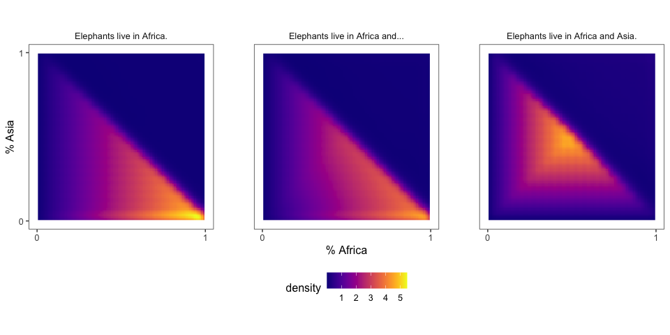
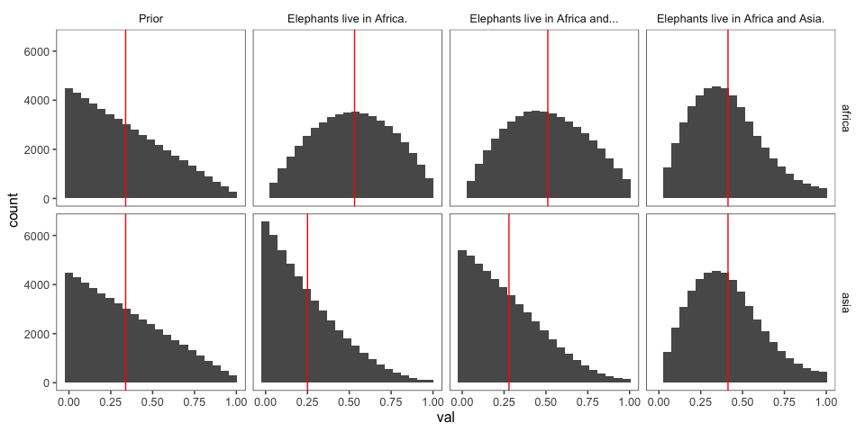
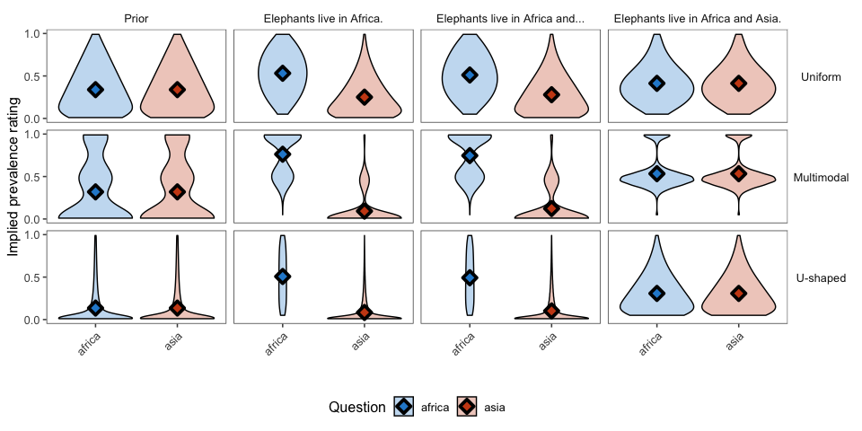
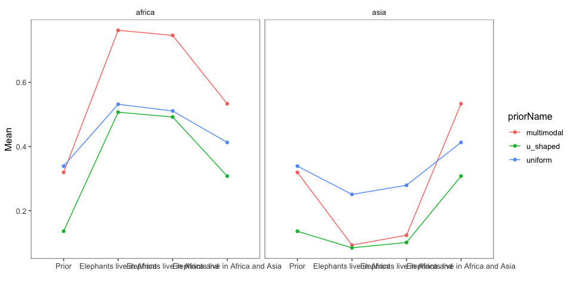
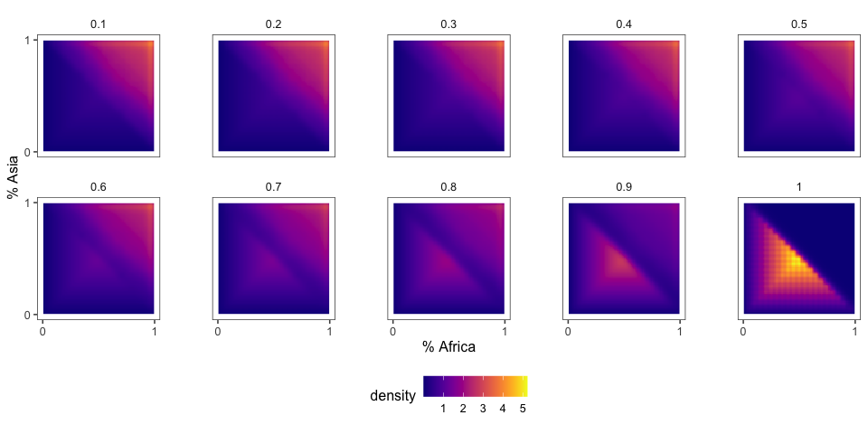
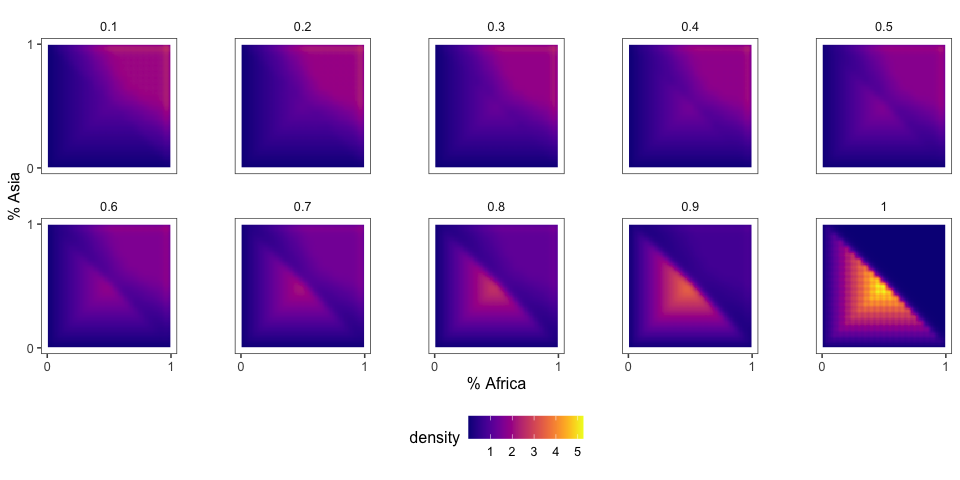
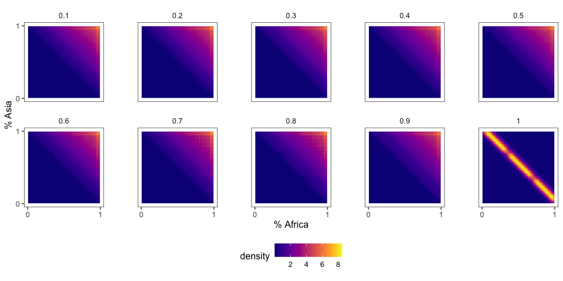
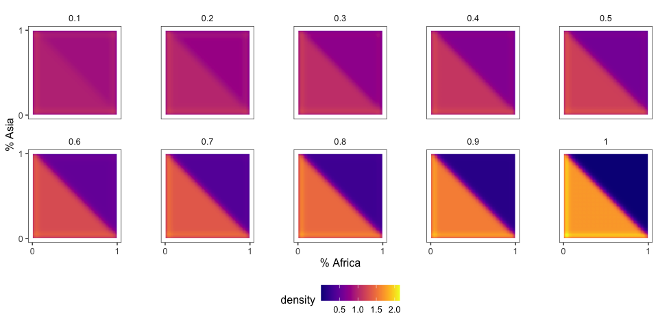
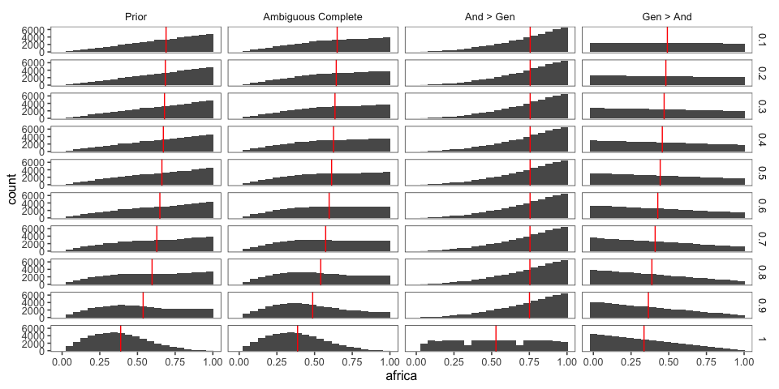
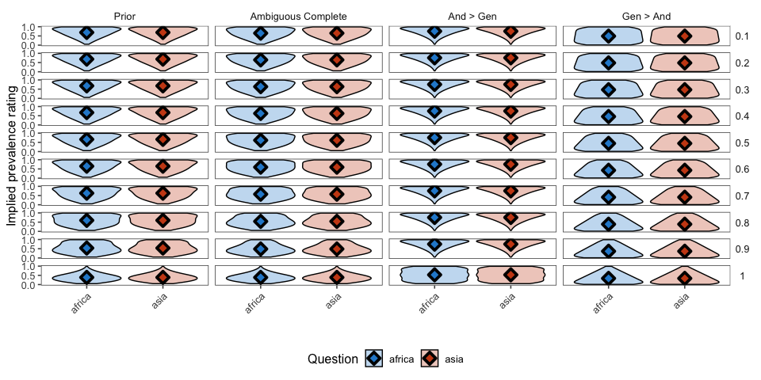

model v2
================
Karen Gu

Here we explore the behavior of variants of an RSA model that can
interpret conjunctive generic sentences such as “Elephants live in
Africa and Asia”. The model returns a joint distribution over four
variables: the prevalence of elephants living in Africa (or both), the
prevalence of elephants living in Asia (or both), the prevalence of
elephants living in both, and the mutual exclusivity of the predicate
“living in some continent”, which is a binary variable.

## Prior specifications

We assume the marginal distributions on Africa and Asia are symmetric,
and either:

1.  Uniform(0, 1)
2.  Multimodal with peaks at 0%, 50%, 100%
3.  U-shaped

We also explore the effect of the belief in mutual exclusivity:

## Literal Listener - Effect of Prior Shape

We first explore the effect of the prior shape (uniform, multimodal, or
u-shaped) on the literal listener. For all the analyses in this section,
the prior probability of mutual exclusivity is .99.

### Elephants live in Africa and Asia.

We report model predictions for the full conjunctive generic sentence.
According to our grammar, this can be either:

1.  scoped such that gen \> and
2.  scoped such that gen \< and
3.  ambiguous such that the scope of gen vs. and is not known

#### Joint distributions

Here we show joint distributions over two variables: 1. living in Africa
(or both) 2. living in Asia (or both) for the three different choices of
prior shape described above.

##### Uniform prior

<!-- -->

##### U-shaped prior

<!-- -->

##### Multimodal prior

<!-- -->

#### Marginal distributions

We show marginal distributions for two different variables: 1. living in
Africa (or both) 2. living in Asia (or both) for each of the different
prior shapes (vertical facet).

<!-- -->

### Elephants live in Africa and…

We report model predictions for incomplete sentences, with full
sentences to provide context. In particular, we report predictions for
the following sentences: 1. Elephants live in Africa. (complete) 2.
Elephants live in Africa and… (incomplete) 3. Elephants live in Africa
and Asia (complete, same as Ambiguous Complete condition
above)

#### Joint distributions

##### Uniform prior

<!-- -->

#### Marginal distributions

##### Histograms

The vertical red line shows the mean of the
distribution.

###### Uniform prior

<!-- -->

##### Violin plots

<!-- -->

#### Change in Prevalence Estimates

Here we show the change in prevalence estimates in the course of
observing a full conjunctive generic “Elephants live in Africa and
Asia”, probing the model at four different points: 1. before the
sentence (prior) 2. after the first predicate (“Elephants live in
Africa”) 3. after the “and” (“Elephants live in Africa and”) 4. after
the sentence (“Elephants live in Africa and
Asia”)

<!-- -->

## Literal Listener - Effect of Strength of Mutual Exclusivity

The prior has a variable that specifies the strength of mutual
exclusivity (the probability that the prior is correlated
vs. uncorrelated). Here we investigate the effect of this variable.

### Elephants live in Africa and Asia.

Again, we first consider the case of a complete
utterance.

#### Joint distributions

##### Prior

<!-- -->

##### Ambiguous

<!-- -->

##### And \> Gen

<!-- -->

##### Gen \> And

<!-- -->

#### Marginal Distributions

Red vertical lines show means of the
distributions.

##### Histograms

###### Uniform prior

<!-- -->

##### Violin plots

###### Uniform prior

<!-- -->
