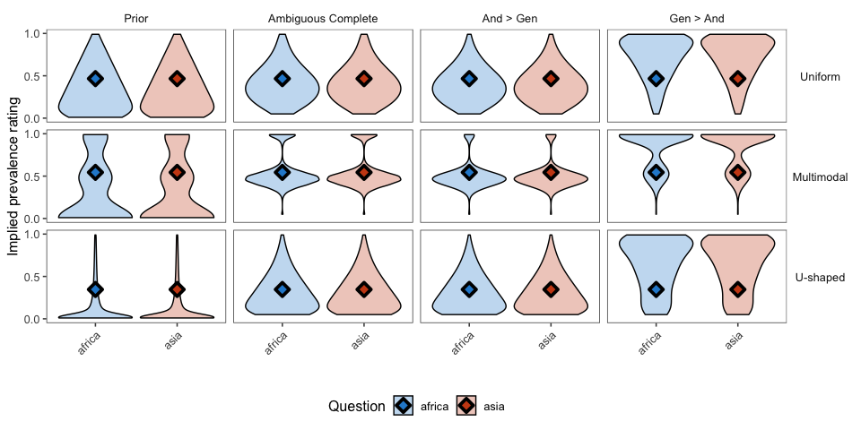

model v2
================
Karen Gu

Here we explore the behavior of variants of an RSA model that can
interpret conjunctive generic sentences such as “Elephants live in
Africa and Asia”. The model returns a joint distribution over four
variables: the prevalence of elephants living in Africa (or both), the
prevalence of elephants living in Asia (or both), the prevalence of
elephants living in both, and the mutual exclusivity of the predicate
“living in some continent”, which is a binary variable.

## Prior specifications

We assume the marginal distributions on Africa and Asia are symmetric,
and either:

1.  Uniform(0, 1)
2.  Multimodal with peaks at 0%, 25%, 50%, 75%, 100%
3.  U-shaped

## Literal Listener

### Elephants live in Africa and Asia.

We report model predictions for the full conjunctive generic sentence,
which is either:

1.  scoped such that gen \> and
2.  scoped such that gen \< and
3.  ambiguous such that the scope of gen vs. and is not known

#### Joint distributions

##### Uniform prior

<!-- -->

##### U-shaped prior

<!-- -->

#### Marginal distributions

<!-- -->

### Elephants live in Africa and…

#### Joint distributions

##### Uniform prior

<!-- -->

#### Marginal distributions

<!-- -->
